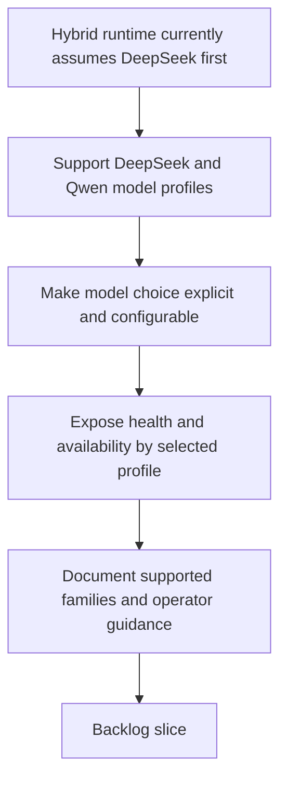

## req_097_expand_hybrid_local_model_support_beyond_deepseek_with_configurable_qwen_and_deepseek_profiles - Expand hybrid local-model support beyond DeepSeek with configurable Qwen and DeepSeek profiles
> From version: 1.12.1
> Schema version: 1.0
> Status: Draft
> Understanding: 97%
> Confidence: 94%
> Complexity: Medium
> Theme: Kit-side local model flexibility for hybrid assist flows
> Reminder: Update status/understanding/confidence and references when you edit this doc.

# Needs
- Broaden the kit-side local-model story so hybrid assist flows are not effectively hard-coded around `deepseek-coder-v2` alone.
- Support at least one documented and configurable Qwen-family coding profile alongside the existing DeepSeek profile for Ollama-backed hybrid assist work.
- Keep model choice explicit, configurable, and validated rather than silently assuming one family is always the right local backend.

# Context
- The hybrid-assist runtime already supports backend selection between `ollama`, `codex`, and `auto`, but its default local-model path currently assumes `deepseek-coder-v2:16b`.
- That default was a reasonable first delivery target, yet it is too narrow if operators want to use a Qwen-family coding model instead of DeepSeek for bounded local assist tasks.
- The gap is kit-side and runtime-side, not plugin-side:
  - model-family defaults live in the shared runtime configuration and Ollama-facing conventions;
  - local-model health checks, docs, and selection rules should recognize more than one supported family;
  - the plugin should consume the resulting runtime state, not invent its own model policy.
- This request should stay careful about model naming:
  - the design should support a Qwen-family coding profile through explicit configuration and documented compatibility guidance;
  - it should not overfit the implementation to one possibly unstable tag string before the target Ollama tags are confirmed in the intended environment;
  - the runtime should therefore talk in terms of supported model profiles or families first, with concrete example tags documented and overrideable.
- The outcome should make three things true:
  - operators can keep a DeepSeek default if they want;
  - operators can switch to a Qwen-family coding profile without patching runtime code;
  - health probes, docs, and assist runtime surfaces report clearly which local model profile is expected and whether that profile is available.

# Acceptance criteria
- AC1: The hybrid assist kit/runtime supports configurable local-model selection for at least two documented Ollama-oriented coding profiles: one DeepSeek-family profile and one Qwen-family profile.
- AC2: The active local-model profile can be chosen through supported configuration rather than by editing runtime source code, with a stable default and clear override path.
- AC3: Hybrid runtime health checks, status surfaces, and degraded-mode reporting reflect the configured expected model profile instead of assuming DeepSeek-only availability.
- AC4: The repository guidance for local-model setup, hybrid runtime usage, and Ollama specialist behavior is updated so operators understand which DeepSeek and Qwen families are supported, how to switch between them, and how to validate availability.
- AC5: The request keeps model support bounded to documented, supported local coding profiles; it does not turn the runtime into a generic uncurated model registry or promise that every Ollama tag is interchangeable.
- AC6: The implementation remains kit-side and runtime-side: plugin surfaces may display the selected profile, but model-family policy, config defaults, and validation logic stay owned by the Logics kit.

# Scope
- In:
  - configurable DeepSeek and Qwen local-model profiles for hybrid assist flows
  - config and runtime defaults for selecting the active profile
  - health/status checks aligned with the configured profile
  - documentation and Ollama-specialist guidance for both supported families
  - bounded examples of supported model tags or profiles with override guidance
- Out:
  - plugin-only UX changes unrelated to model policy
  - supporting every possible local model family at once
  - unbounded benchmarking or model bake-offs
  - replacing Codex fallback behavior or the existing hybrid safety taxonomy

# Dependencies and risks
- Dependency: `req_089` through `req_094` remain the shared hybrid runtime, contract, portability, and degraded-mode foundation.
- Dependency: `req_091` remains relevant because the selected model profile and health checks should stay visible across Codex, Claude-oriented, and Windows-safe entrypoints.
- Dependency: `req_086` and `req_087` remain the baseline Ollama specialist work currently biased toward DeepSeek and should be extended rather than bypassed.
- Dependency: `logics_flow_hybrid.py`, repo-native config defaults, and the Ollama specialist docs/scripts remain the likely implementation surfaces.
- Risk: if the request hard-codes a Qwen tag that is not stable or not broadly available in target environments, the guidance will age badly.
- Risk: if model-family support becomes too open-ended, operators will infer that any random Ollama tag is officially supported.
- Risk: if health probes keep assuming DeepSeek semantics after configuration broadens, runtime diagnostics will become misleading.
- Risk: if documentation changes but config defaults do not, operators will still experience DeepSeek-only behavior in practice.

# AC Traceability
- AC1 -> runtime config and documented model-profile support. Proof: the request requires at least one supported DeepSeek profile and one supported Qwen profile, not just informal mention of alternative tags.
- AC2 -> repo-native config and runtime override path. Proof: the request requires choosing the active profile through supported configuration rather than code edits.
- AC3 -> hybrid runtime status, health probes, and degraded reporting. Proof: the request requires those surfaces to reflect the configured expected profile rather than DeepSeek-only assumptions.
- AC4 -> Ollama specialist and runtime documentation. Proof: the request requires operator-facing guidance for switching, validating, and using both supported families.
- AC5 -> bounded support policy. Proof: the request explicitly limits support to curated documented profiles instead of an open-ended model registry.
- AC6 -> kit/runtime ownership boundary. Proof: the request explicitly keeps model-policy logic out of plugin-owned behavior.

# Definition of Ready (DoR)
- [x] Problem statement is explicit and user impact is clear.
- [x] Scope boundaries (in/out) are explicit.
- [x] Acceptance criteria are testable.
- [x] Dependencies and known risks are listed.

# Companion docs
- Product brief(s): (none yet)
- Architecture decision(s): `adr_011_keep_hybrid_assist_runtime_contracts_shared_backend_agnostic_and_safely_bounded`

# AI Context
- Summary: Broaden the hybrid assist runtime so it supports configurable DeepSeek and Qwen local-model profiles instead of assuming a DeepSeek-only local path.
- Keywords: hybrid assist, ollama, qwen, deepseek, model profile, config, health checks, local model
- Use when: Use when planning kit-side local-model flexibility for the hybrid assist runtime and the Ollama specialist.
- Skip when: Skip when the work is only about plugin wording, toolbar UX, or responsive layout details.

# References
- `logics/request/req_086_upgrade_the_logics_ollama_specialist_for_deepseek_coder_v2_installation_setup_and_access.md`
- `logics/request/req_087_extend_the_logics_ollama_specialist_for_roo_code_and_dedicated_local_autocomplete_workflows.md`
- `logics/request/req_089_add_a_hybrid_ollama_or_codex_local_orchestration_backend_for_repetitive_logics_delivery_tasks.md`
- `logics/request/req_091_ensure_hybrid_logics_delivery_automation_stays_compatible_with_claude_environments_and_windows_runtimes.md`
- `logics/request/req_093_add_shared_hybrid_assist_contracts_fallback_policy_activation_rules_and_audit_governance_for_logics_delivery_automation.md`
- `logics/request/req_094_add_hybrid_assist_measurement_shared_context_strategy_and_degraded_mode_governance_for_logics_delivery_automation.md`
- `logics/skills/logics-flow-manager/scripts/logics_flow_hybrid.py`
- `logics/skills/logics-flow-manager/scripts/logics_flow_config.py`
- `logics/skills/logics-ollama-specialist/SKILL.md`
- `logics/skills/logics-ollama-specialist/scripts/ollama_check.sh`

# Backlog
- `item_162_add_configurable_deepseek_and_qwen_local_model_profiles_to_the_hybrid_runtime`
- `item_163_extend_ollama_specialist_docs_and_validation_surfaces_for_supported_deepseek_and_qwen_profiles`
- Task: `task_101_orchestration_delivery_for_req_096_and_req_097_plugin_polish_and_hybrid_local_model_profile_flexibility`
