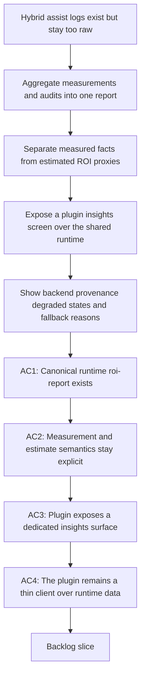

## req_098_add_a_hybrid_assist_roi_dispatch_report_with_runtime_aggregation_and_plugin_insights - Add a hybrid assist ROI dispatch report with runtime aggregation and plugin insights
> From version: 1.13.0
> Schema version: 1.0
> Status: Ready
> Understanding: 97%
> Confidence: 95%
> Complexity: High
> Theme: Hybrid assist observability, ROI reporting, and plugin insight surfaces
> Reminder: Update status/understanding/confidence and references when you edit this doc.

# Needs
- Make the hybrid assist measurement and audit stream practically consumable by operators instead of leaving value analysis to ad hoc `jq` commands over raw JSONL logs.
- Add a first-class runtime report surface that aggregates hybrid dispatch measurements into a stable, machine-readable summary suitable for plugin consumption.
- Expose those results in the VS Code plugin through a dedicated observability screen that highlights usage, backend dispatch behavior, degraded states, and ROI-oriented proxy metrics without inventing false precision.

# Context
- The shared hybrid assist runtime already writes automatic logs for the flows that pass through it:
  - detailed audit records in `logics/hybrid_assist_audit.jsonl`;
  - lighter measurement records in `logics/hybrid_assist_measurements.jsonl`;
  - dispatcher-specific audit records in `logics/dispatcher_audit.jsonl`.
- Those logs already capture useful signals such as:
  - requested backend versus backend actually used;
  - degraded or fallback reasons;
  - result status and confidence;
  - review recommendation signals;
  - flow-level provenance that can be used for operational review.
- That is a strong foundation, but it is still too raw for normal operators:
  - there is no canonical `roi-report` runtime surface that aggregates the logs into summary metrics;
  - there is no plugin screen that makes the dispatch story visible without terminal inspection;
  - there is no disciplined presentation of “token savings” versus “estimated local-offload benefit” versus plain operational quality metrics.
- The design needs to stay consistent with the hybrid runtime direction established by `req_089` through `req_095`:
  - the kit owns log collection, report aggregation, and the semantics of measurement fields;
  - the plugin remains a thin client that invokes the shared runtime and renders its structured output;
  - fallback and degraded-mode explanations must stay grounded in the runtime’s shared governance rather than being reinterpreted in UI-only logic.
- The most useful report is not a fake financial dashboard.
  It should combine three kinds of information with explicit labeling:
  - measured facts, such as runs by flow, backend used, fallback rate, degraded rate, and review-required rate;
  - derived operational summaries, such as distribution of healthy versus degraded outcomes and top fallback reasons;
  - estimated ROI proxies, such as local-offload rate or estimated token avoidance, clearly marked as estimates with their assumptions visible.
- The plugin screen should therefore emphasize observability and trust:
  - show what is actually measured;
  - show what is estimated;
  - show which backend handled the run and why;
  - make degraded or fallback behavior visible instead of hiding it behind a single green success indicator.

# Acceptance criteria
- AC1: The kit exposes a canonical hybrid assist reporting surface, such as `flow assist roi-report --format json`, that aggregates the existing hybrid audit and measurement logs into a stable structured report suitable for automation and plugin rendering.
- AC2: The runtime report includes measured operational metrics for at least:
  - run counts by assist flow;
  - requested backend versus backend used;
  - fallback frequency;
  - degraded-result frequency;
  - review-recommended frequency;
  - recent-result distribution over a bounded time window.
- AC3: The runtime report explicitly distinguishes:
  - measured facts;
  - derived summaries;
  - estimated ROI proxies such as local-offload benefit or estimated token avoidance;
  and it documents the assumptions behind any estimate instead of presenting them as exact truth.
- AC4: The plugin exposes a dedicated observability screen or panel for hybrid assist insights that can render the shared runtime report and highlight at minimum:
  - usage volume by flow;
  - backend dispatch split between local and fallback paths;
  - top degraded or fallback reasons;
  - operator-review flags;
  - estimated ROI proxy metrics with clear labeling.
- AC5: The plugin surface makes it easy to inspect recent backend provenance and degraded-mode context without forcing users to open raw JSONL logs, while still allowing drill-down into relevant audit snippets when needed.
- AC6: The plugin remains a thin client over the shared runtime:
  - report aggregation, estimate semantics, and fallback interpretation stay owned by the kit;
  - the extension only requests structured report data and renders it.
- AC7: The request preserves automatic collection of the underlying hybrid measurement and audit records for supported runtime flows, and extends those records only where necessary to support trustworthy aggregation rather than adding a second telemetry path.
- AC8: Documentation and tests cover both the runtime report surface and the plugin insights screen, including clear operator guidance on what is measured, what is estimated, and how to interpret degraded or fallback-heavy results.

# Scope
- In:
  - runtime aggregation of existing hybrid measurement and audit logs into a canonical report surface
  - explicit semantics for measured versus estimated ROI-related fields
  - plugin observability screen for hybrid assist insights and dispatch ROI review
  - drill-down access to recent backend provenance and degraded reasons
  - documentation and tests for runtime report output and plugin rendering
- Out:
  - treating estimated token avoidance as exact billing truth
  - introducing unrelated telemetry systems outside the shared hybrid runtime
  - moving aggregation logic into the plugin
  - building a generic enterprise analytics platform beyond hybrid assist observability

# Dependencies and risks
- Dependency: `req_089` remains the backend-selection foundation for hybrid dispatch behavior.
- Dependency: `req_093` remains the shared contract and audit-governance layer for hybrid assist payloads and backend semantics.
- Dependency: `req_094` remains the measurement, context, and degraded-mode governance layer that defines what should be captured and how degraded behavior should be explained.
- Dependency: `req_095` remains the plugin-side thin-client foundation for rendering shared hybrid runtime state and actions.
- Risk: if the report mixes estimates with measured facts without clear labeling, operators will over-trust noisy ROI numbers.
- Risk: if the plugin calculates its own aggregations instead of consuming the runtime report, semantics will drift between CLI and UI.
- Risk: if the report focuses only on “token saved” and ignores degraded results or review rates, the team may optimize for the wrong outcome.
- Risk: if the runtime tries to infer exact token economics for local models without reliable source data, the report will appear precise while being misleading.
- Risk: if drill-down is absent, a summary-heavy screen may hide why fallback or degraded rates are high.

# AC Traceability
- AC1 -> runtime `roi-report` aggregation command. Proof: the request requires a canonical structured report surface rather than manual log parsing.
- AC2 -> shared aggregation fields over hybrid measurement and audit logs. Proof: the request explicitly requires stable operational metrics across flows and backends.
- AC3 -> report schema and operator documentation for measured versus estimated fields. Proof: the request requires assumptions to be visible wherever ROI proxies appear.
- AC4 -> plugin insights or observability screen over the shared report. Proof: the request explicitly requires a dedicated plugin surface for dispatch usage, degraded paths, and ROI-oriented metrics.
- AC5 -> runtime-supported drill-down and plugin report details. Proof: the request requires recent provenance and degraded reasons to stay inspectable instead of remaining opaque.
- AC6 -> thin-client boundary between plugin and kit. Proof: the request keeps aggregation semantics in the runtime and rendering in the extension.
- AC7 -> reuse and extension of existing automatic measurement and audit collection. Proof: the request explicitly avoids inventing a second telemetry path and builds on existing JSONL logs.
- AC8 -> documentation and tests for both runtime and plugin surfaces. Proof: the request requires users and maintainers to understand how the report should be interpreted and validated.

# Definition of Ready (DoR)
- [x] Problem statement is explicit and user impact is clear.
- [x] Scope boundaries (in/out) are explicit.
- [x] Acceptance criteria are testable.
- [x] Dependencies and known risks are listed.

# Companion docs
- Product brief(s): `prod_001_hybrid_assist_operator_experience_for_repetitive_logics_delivery_flows`, `prod_002_plugin_hybrid_assist_runtime_visibility_and_action_ux`
- Architecture decision(s): `adr_011_keep_hybrid_assist_runtime_contracts_shared_backend_agnostic_and_safely_bounded`, `adr_012_keep_the_vs_code_plugin_as_a_thin_client_over_shared_hybrid_runtime_commands`

# AI Context
- Summary: Add a shared hybrid assist ROI dispatch report that aggregates existing audit and measurement logs in the kit and exposes the result through a plugin insights screen with explicit measured-versus-estimated semantics.
- Keywords: hybrid assist, roi report, dispatch, observability, audit, measurements, plugin insights, fallback, degraded mode
- Use when: Use when planning a consumable runtime-plus-plugin reporting surface for hybrid assist backend usage, degraded behavior, and ROI proxy metrics.
- Skip when: Skip when the work is only about adding one more assist flow, only about raw JSONL collection already covered by the runtime, or only about generic plugin polish unrelated to hybrid insights.

# References
- `logics/request/req_089_add_a_hybrid_ollama_or_codex_local_orchestration_backend_for_repetitive_logics_delivery_tasks.md`
- `logics/request/req_093_add_shared_hybrid_assist_contracts_fallback_policy_activation_rules_and_audit_governance_for_logics_delivery_automation.md`
- `logics/request/req_094_add_hybrid_assist_measurement_shared_context_strategy_and_degraded_mode_governance_for_logics_delivery_automation.md`
- `logics/request/req_095_adapt_the_vs_code_logics_plugin_to_expose_hybrid_assist_runtime_status_actions_audit_and_cross_agent_messaging.md`
- `logics/skills/README.md`
- `logics/skills/logics-flow-manager/SKILL.md`
- `logics/skills/logics-flow-manager/scripts/logics_flow.py`
- `logics/skills/logics-flow-manager/scripts/logics_flow_hybrid.py`
- `logics/skills/logics-flow-manager/scripts/logics_flow_config.py`
- `src/logicsEnvironment.ts`
- `src/logicsViewProvider.ts`
- `src/logicsWebviewHtml.ts`
- `README.md`

# Backlog
- `item_164_add_a_canonical_hybrid_assist_roi_report_runtime_surface_over_existing_measurement_and_audit_logs`
- `item_165_define_explicit_measured_derived_and_estimated_roi_semantics_for_hybrid_assist_reports`
- `item_166_add_a_plugin_hybrid_assist_roi_dispatch_insights_surface_with_recent_audit_drill_down`
- Task: `task_102_orchestration_delivery_for_req_098_hybrid_assist_roi_dispatch_reporting_and_plugin_insights`
