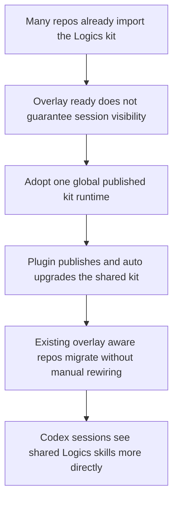

## req_099_replace_repo_local_codex_overlays_with_a_global_published_logics_kit_and_managed_migration - Replace repo-local Codex overlays with a global published Logics kit and managed migration
> From version: 1.14.0
> Schema version: 1.0
> Status: Ready
> Understanding: 98%
> Confidence: 95%
> Complexity: High
> Theme: Global Codex kit publication, plugin-managed upgrades, and migration off overlays
> Reminder: Update status/understanding/confidence and references when you edit this doc.

# Needs
- Replace the current repo-local Codex overlay model with a simpler global publication model so Codex sessions can reliably see Logics skills without requiring an overlay-specific launch path.
- Let the VS Code plugin publish and auto-upgrade the shared Logics kit into the user's global Codex home when repositories already contain the canonical `logics/skills` submodule.
- Define a safe migration path for all existing projects that already depend on the kit and on overlay-aware plugin behavior, without requiring teams to migrate repositories manually one by one.
- Make the migration path zero-touch for the normal case so opening an existing compatible repository is enough to converge the machine toward the new global runtime without requiring explicit user migration steps.

# Context
- The current architecture intentionally chose per-repository workspace overlays so different repositories could keep isolated Logics skill revisions and avoid collisions in `~/.codex/skills`.
- That isolation solved a real design problem, but it leaves an operator problem that is now more important in practice:
  - the overlay can be healthy while the current Codex session still does not see the repo-local skills;
  - users must understand the difference between a repo being ready, an overlay being ready, and a Codex process actually having been launched against that overlay;
  - the plugin ends up exposing diagnostics and launch guidance that are technically correct but operationally too indirect.
- The desired direction is now different:
  - `logics/skills` remains the canonical source inside repositories;
  - but the runtime surface consumed by Codex should be a shared global published kit under the main Codex home rather than per-repository overlay homes;
  - the plugin should opportunistically keep that global kit up to date from repositories that already include the canonical submodule;
  - operators should no longer need to think about overlay sync, overlay run commands, or process-specific `CODEX_HOME` just to make shared Logics skills available.
- This is intentionally a tradeoff:
  - global publication gives up strict per-repo isolation;
  - but it dramatically improves discoverability, session continuity, and plugin ergonomics for users who want one shared Logics runtime on a personal machine.
- The migration problem must be treated as first-class scope, not as cleanup:
  - many existing repositories already include `logics/skills` as a submodule;
  - the plugin and docs already contain overlay-aware wording, diagnostics, and commands;
  - earlier requests and ADRs explicitly preferred overlays over global publication, so this request must deliberately replace that direction instead of quietly drifting away from it.
- The migration should be designed as an automatic convergence path, not as an operator project:
  - when a compatible repository is opened, the plugin should be able to detect the repo-local kit, compare it to the globally published kit, and repair or upgrade the global install on its own in the normal path;
  - users should not need to run an overlay sync, copy a run command, click a one-time migration wizard, or manually publish the kit just to keep working;
  - explicit prompts should be reserved for exceptional cases such as unrecoverable write failures, missing permissions, or ambiguous incompatible local state.
- The resulting model should be explicit:
  - repo-local workflow documents stay in the repository;
  - the shared kit, skills, agent manifests, and runtime scripts are published globally;
  - plugin startup can auto-upgrade the global published kit when a newer canonical repo-local kit is detected;
  - the installed global state must still remain inspectable through a manifest that records source, version, commit, and publish time.

# Acceptance criteria
- AC1: The request defines a new target runtime model in which the shared Logics kit and Codex-facing skills are published into the main global Codex home, or an equivalent single user-scoped global publication surface, instead of relying on per-repository workspace overlays as the primary runtime contract.
- AC2: The request explicitly preserves `logics/skills` inside repositories as the canonical source of truth for kit content, while redefining those repo-local assets as publication sources rather than as per-process runtime surfaces.
- AC3: The request defines a global publication manifest contract that records at minimum:
  - installed kit version;
  - source repository path or identity;
  - source submodule commit or equivalent source revision;
  - published time;
  - published skill set;
  - publication health or repair metadata when installation is partial or stale.
- AC4: The request defines plugin behavior for repositories that already use the canonical kit submodule:
  - detect the repo-local kit version or revision;
  - compare it against the installed global published kit;
  - auto-publish or auto-upgrade the global kit when the repo-local kit is newer according to the chosen version policy;
  - avoid prompting for confirmation on every normal upgrade path.
- AC4b: The request defines the migration contract as no-user-action in the normal path:
  - opening a compatible repository is sufficient to trigger detection and convergence;
  - no explicit “migrate”, “publish”, or “sync overlay” action is required for the first successful transition;
  - prompts or manual actions are limited to exceptional failure or permission cases.
- AC5: The request makes the chosen multi-project version policy explicit for this new global model, including the fact that a newer compatible kit may replace the currently installed global kit even if another repository is still on an older revision, and it requires clear provenance surfaces so operators can see which repository most recently published the active global runtime.
- AC6: The request defines a migration and compatibility path for repositories, plugin UX, and operator docs that already assume overlays, covering at minimum:
  - how existing overlay status or sync surfaces are deprecated, hidden, or replaced;
  - how old repositories continue to act as valid publication sources;
  - how stale overlay state is ignored, cleaned up, or retired without becoming a long-term source of confusion.
- AC6b: The request makes clear that migration of existing projects is opportunistic and automatic:
  - any already-compatible project can serve as the source that brings the machine onto the new global runtime;
  - users are not expected to perform per-repository migration chores before the new model becomes useful.
- AC7: The request defines the boundary between repo-local and global state clearly enough that future implementation does not accidentally globalize workflow documents, request/backlog/task content, or other project-owned material that should remain inside the repository.
- AC8: The request defines repair and failure behavior for the new global model, including:
  - missing global manifest;
  - partial publication;
  - broken symlink or copy state;
  - newer repo-local kit discovered after a failed publication attempt;
  - startup on a project that does not use the canonical kit submodule.
- AC9: The request defines the plugin surfaces that must change once the global publication model becomes primary, covering at minimum:
  - `Check Environment`;
  - bootstrap and kit-update flows;
  - Codex launch or handoff wording;
  - visibility of the currently installed global kit version and source.
- AC10: The request is concrete enough that follow-up backlog items can implement the publication manager, plugin migration, and overlay deprecation work without reopening the core architecture choice.

# Scope
- In:
  - redefine the primary Codex runtime contract for Logics from overlay-based to globally published
  - define plugin-managed publication and auto-upgrade behavior from repo-local kit sources
  - define the global publication manifest and provenance model
  - define migration behavior for repositories and plugin UX that already depend on overlay concepts
  - define repair and diagnostics expectations for the new global runtime
- Out:
  - globalizing repo-owned workflow documents under `logics/request`, `logics/backlog`, `logics/tasks`, or companion docs
  - supporting simultaneous active global installs for several different kit revisions on the same machine
  - preserving workspace overlays as a first-class long-term runtime alongside the new global publication model
  - inventing a separate package registry outside the existing repo-local kit and plugin flows

# Dependencies and risks
- Dependency: repositories that act as publication sources continue to expose the canonical kit under `logics/skills`.
- Dependency: the plugin remains able to inspect the repo-local kit revision and current global installed revision in a deterministic way.
- Dependency: a stable kit version signal or source-revision signal is available so auto-upgrade decisions are not based on vague filesystem timestamps alone.
- Risk: the new model intentionally gives up strict per-repo isolation, so support and diagnostics must acknowledge that the active global kit may have been published by another repository.
- Risk: if provenance is weak, operators will not be able to explain why one machine is running a different shared kit than another.
- Risk: if auto-upgrade happens without repair semantics, one broken publish can leave the global runtime in a worse state than before.
- Risk: if the normal migration path still asks the user to choose among several operational steps, the system will preserve the current confusion under a different name instead of actually simplifying runtime usage.
- Risk: if overlay wording remains half-present in the plugin or docs, users will be forced to reason about two different runtime stories at once.
- Risk: if older repositories cannot participate as publication sources during migration, adoption will stall and teams will have to migrate repos manually.

# AC Traceability
- AC1 -> runtime architecture shift from overlay-backed sessions to one global published kit. Proof: the request explicitly replaces overlays as the primary Codex runtime contract.
- AC2 -> repo-local `logics/skills` remains canonical but becomes a publication source. Proof: the request keeps source ownership in repositories while changing where Codex actually consumes the kit.
- AC3 -> global publication manifest and provenance contract. Proof: the request requires inspectable version, source, and publication metadata instead of opaque global mutation.
- AC4 -> plugin auto-publication and auto-upgrade behavior. Proof: the request explicitly requires repo-open flows to keep the global kit current without repetitive confirmation prompts.
- AC4b -> zero-touch migration behavior. Proof: the request explicitly requires repository open to be enough for normal-path convergence onto the global runtime.
- AC5 -> explicit multi-project version policy. Proof: the request requires the system to state who wins when several repositories expose different kit revisions.
- AC6 -> migration and overlay retirement path. Proof: the request explicitly covers existing overlay-aware repos and UX rather than treating migration as out-of-band cleanup.
- AC6b -> automatic adoption by existing projects. Proof: the request explicitly forbids a per-project manual migration burden in the normal path.
- AC7 -> boundary between shared kit runtime and repo-owned workflow content. Proof: the request explicitly prevents accidental globalization of project documents.
- AC8 -> repair and degraded-state semantics for the global model. Proof: the request requires deterministic handling for missing manifests, partial installs, and failed upgrades.
- AC9 -> plugin diagnostics and UX updates. Proof: the request requires user-facing surfaces to describe the active global runtime rather than obsolete overlay concepts.
- AC10 -> implementation-ready follow-up scope. Proof: the request requires enough architectural clarity for backlog and task slicing without reopening the main decision.

# Definition of Ready (DoR)
- [x] Problem statement is explicit and user impact is clear.
- [x] Scope boundaries (in/out) are explicit.
- [x] Acceptance criteria are testable.
- [x] Dependencies and known risks are listed.

# Companion docs
- Product brief(s): (none yet)
- Architecture decision(s): `adr_008_keep_codex_workspace_overlays_repo_local_isolated_and_composable` (expected to be revisited or superseded), `adr_012_keep_the_vs_code_plugin_as_a_thin_client_over_shared_hybrid_runtime_commands`

# AI Context
- Summary: Replace repo-local Codex overlays with a globally published Logics kit that the plugin auto-updates from canonical repo-local kit sources, while defining migration and deprecation behavior for all existing overlay-aware projects.
- Keywords: codex, global kit, global skills, publication, auto upgrade, plugin, zero touch migration, overlay deprecation, manifest, provenance
- Use when: Use when planning or implementing the transition from overlay-backed repo-local skill visibility to one shared globally published Logics runtime managed by the plugin with no-user-action migration in the normal path.
- Skip when: Skip when the work is only about prompt wording, context-pack copy actions, or isolated plugin polish that does not change the underlying kit publication model.

# References
- `logics/request/req_067_add_multi_project_codex_workspace_overlays_for_logics_skills.md`
- `logics/request/req_070_define_workspace_overlay_precedence_and_coexistence_with_global_codex_skills.md`
- `logics/request/req_076_adapt_the_vs_code_logics_plugin_to_codex_workspace_overlays.md`
- `logics/request/req_078_add_plugin_actions_to_update_the_logics_kit_and_sync_codex_overlays.md`
- `logics/architecture/adr_008_keep_codex_workspace_overlays_repo_local_isolated_and_composable.md`
- `logics/skills/README.md`
- `logics/skills/logics-flow-manager/SKILL.md`
- `logics/skills/logics-flow-manager/scripts/logics_codex_workspace.py`
- `src/logicsCodexWorkspace.ts`
- `src/logicsEnvironment.ts`
- `src/logicsViewProvider.ts`
- `README.md`

# Backlog
- `item_167_define_a_global_logics_kit_publication_manifest_and_version_resolution_policy`
- `item_168_publish_and_auto_upgrade_the_global_codex_logics_kit_from_canonical_repo_sources_in_the_plugin`
- `item_169_migrate_plugin_docs_and_existing_overlay_ux_to_the_global_published_kit_model`
- Task: `task_103_orchestration_delivery_for_req_099_global_logics_kit_publication_and_overlay_migration`
