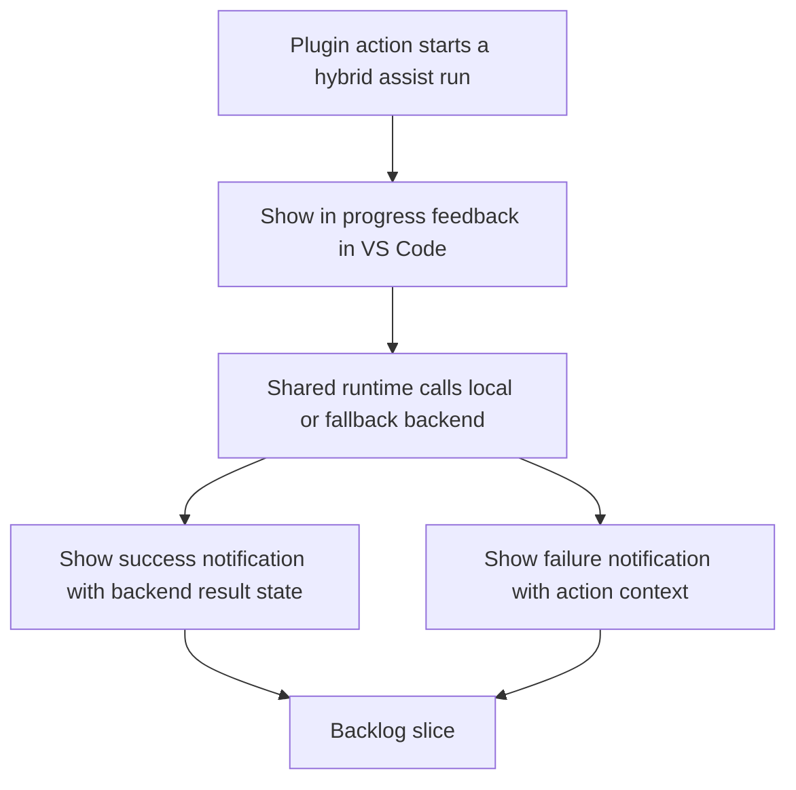

## req_100_add_user_feedback_and_vs_code_notifications_for_ollama_backend_calls - Add user feedback and VS Code notifications for Ollama backend calls
> From version: 1.14.0
> Schema version: 1.0
> Status: Ready
> Understanding: 96%
> Confidence: 94%
> Complexity: Medium
> Theme: VS Code plugin UX for Ollama backed assist execution feedback
> Reminder: Update status/understanding/confidence and references when you edit this doc.

# Needs
- Give the operator immediate visible feedback in VS Code when the extension triggers an Ollama-backed backend call, so the UI never feels frozen while the local model is working.
- Show a clear completion notification when the run succeeds, including enough context to understand which action completed and whether the result came from Ollama, fallback, or a degraded path.
- Show a clear failure notification when the run fails or returns invalid output, so the operator can distinguish backend latency from an actual error.
- Keep the plugin as a thin UX wrapper over the shared hybrid-assist runtime rather than moving Ollama orchestration logic into the extension.

# Context
- The plugin already exposes several tool actions that run the shared hybrid-assist runtime from the extension, including runtime checks, next-step suggestions, validation summaries, commit planning, and ROI insights.
- Those actions currently call the shared runtime through `runHybridAssistCommand` in [src/logicsViewProvider.ts](/Users/alexandreagostini/Documents/cdx-logics-vscode/src/logicsViewProvider.ts#L531) and mostly surface only a final `showInformationMessage` or `showErrorMessage` after the Python command finishes.
- That is operationally weak for Ollama-backed runs:
  - local model latency can be several seconds or more;
  - the operator gets little or no indication that work is in progress;
  - the absence of feedback can be misread as a broken button or stalled extension;
  - error cases only become visible late, after silent waiting.
- Earlier hybrid-assist work already made backend provenance and degraded-mode visibility important in the plugin, especially in `req_095` and the follow-up audit visibility backlog work, but the in-flight phase remains under-specified.
- This request focuses on plugin feedback during execution, not on changing the shared runtime contract:
  - the extension should be allowed to show coarse progress such as `Calling Ollama...` or `Waiting for hybrid assist result...`;
  - the shared runtime remains the source of truth for backend selection, degraded-state semantics, and result payloads;
  - if a run starts as `auto` and ends on a fallback backend, the completion notification should reflect the actual backend used instead of falsely claiming Ollama produced the result.
- The desired UX is simple and bounded:
  - immediate notification or progress affordance at launch;
  - explicit success notification at completion;
  - explicit failure notification on error;
  - no noisy multi-toast storm for a single action.

# Acceptance criteria
- AC1: When a plugin tool action triggers a shared hybrid-assist command whose requested or selected backend path involves Ollama, the operator sees immediate in-progress feedback in VS Code instead of waiting silently for the final result.
- AC2: The in-progress feedback is action-aware and bounded:
  - it names or implies the action being executed;
  - it indicates that the extension is waiting on the backend;
  - it does not create several redundant notifications for one run.
- AC3: When the run completes successfully, the operator sees a completion notification that includes at minimum:
  - which plugin action completed;
  - whether the actual backend used was Ollama or a fallback backend when relevant;
  - whether the result is degraded or requires attention when that information is available from the runtime.
- AC4: When the run fails, times out, or returns invalid output, the operator sees an error notification that makes the failing action explicit and distinguishes execution failure from silent waiting.
- AC5: The implementation remains plugin-thin:
  - the extension adds execution feedback around shared runtime invocation;
  - backend routing, degraded-state semantics, and assist payload ownership remain in the shared Logics runtime.
- AC6: The plugin coverage is extended with focused tests for the execution-feedback UX around hybrid-assist actions, including at least one successful path and one failing path.

# Scope
- In:
  - VS Code progress or notification feedback while plugin-launched hybrid-assist actions wait on Ollama-backed execution
  - completion notifications that summarize backend outcome after the run
  - error notifications for failed or invalid hybrid-assist responses
  - bounded notification behavior that avoids duplicate or noisy toasts per action
  - test coverage for the plugin-side execution-feedback behavior
- Out:
  - redesigning the shared hybrid-assist runtime payload schema
  - streaming token-by-token Ollama output into the plugin
  - changing terminal-only Logics workflows outside the VS Code extension
  - turning every backend call in the repository into a fully instrumented progress UI if it is unrelated to hybrid-assist or Ollama-backed actions

# Dependencies and risks
- Dependency: the current hybrid-assist plugin actions remain routed through [src/logicsViewProvider.ts](/Users/alexandreagostini/Documents/cdx-logics-vscode/src/logicsViewProvider.ts#L531) and keep using the shared `logics.py flow assist ...` contract.
- Dependency: `req_095` remains the baseline for plugin visibility of hybrid runtime state, actions, backend provenance, and degraded-mode wording.
- Dependency: result payloads from the shared runtime keep exposing enough backend metadata for the completion notification to report the actual backend used when available.
- Risk: if the plugin says `Ollama` too early for an `auto` run that later falls back, the notification story will become misleading instead of clearer.
- Risk: if every assist step emits a separate toast, the UX will become noisy and users will ignore the feedback.
- Risk: if progress is implemented only for the happy path and not for error paths, users will still experience silent failures after waiting.
- Risk: if the extension starts inferring backend logic instead of reporting runtime facts, plugin behavior will drift away from the shared runtime contract.

# AC Traceability
- AC1 -> `item_170_add_plugin_in_progress_feedback_for_ollama_backed_hybrid_assist_actions`. Proof: the first implementation slice is the plugin-side in-flight status shown as soon as an Ollama-backed run starts.
- AC2 -> `item_170_add_plugin_in_progress_feedback_for_ollama_backed_hybrid_assist_actions`. Proof: the same slice owns the bounded one-run-one-progress-signal UX so execution feedback stays coherent instead of noisy.
- AC3 -> `item_171_add_backend_aware_success_and_failure_notifications_for_plugin_hybrid_assist_runs`. Proof: the result-notification slice must report the completed action, actual backend used, and degraded state when available.
- AC4 -> `item_171_add_backend_aware_success_and_failure_notifications_for_plugin_hybrid_assist_runs`. Proof: the same result-notification slice must turn failed or invalid runs into explicit operator-visible errors.
- AC5 -> `item_170_add_plugin_in_progress_feedback_for_ollama_backed_hybrid_assist_actions` and `item_171_add_backend_aware_success_and_failure_notifications_for_plugin_hybrid_assist_runs`. Proof: both slices are explicitly plugin UX wrappers around the existing shared runtime call path rather than runtime ownership changes.
- AC6 -> `item_172_add_regression_coverage_for_plugin_hybrid_assist_execution_feedback`. Proof: the request requires dedicated coverage for successful and failing execution-feedback paths instead of leaving the UX untested.

# Definition of Ready (DoR)
- [x] Problem statement is explicit and user impact is clear.
- [x] Scope boundaries (in/out) are explicit.
- [x] Acceptance criteria are testable.
- [x] Dependencies and known risks are listed.

# Companion docs
- Product brief(s): (none yet)
- Architecture decision(s): `adr_012_keep_the_vs_code_plugin_as_a_thin_client_over_shared_hybrid_runtime_commands`
# AI Context
- Summary: Add explicit VS Code in-progress, success, and failure feedback for plugin-launched Ollama-backed hybrid-assist calls so operators are not left waiting without UI confirmation.
- Keywords: plugin, vscode, ollama, hybrid assist, notification, progress, feedback, backend, degraded, fallback
- Use when: Use when planning plugin UX that should acknowledge long-running or failure-prone Ollama-backed hybrid-assist actions started from the extension.
- Skip when: Skip when the work is only about terminal-side Ollama usage, model selection policy, or backend runtime logic with no plugin UX change.

# References
- `logics/request/req_095_adapt_the_vs_code_logics_plugin_to_expose_hybrid_assist_runtime_status_actions_audit_and_cross_agent_messaging.md`
- `logics/request/req_097_expand_hybrid_local_model_support_beyond_deepseek_with_configurable_qwen_and_deepseek_profiles.md`
- `logics/backlog/item_157_add_plugin_audit_visibility_result_panels_and_cross_agent_runtime_messaging_cleanup.md`
- `src/logicsViewProvider.ts`
- `src/logicsEnvironment.ts`

# Backlog
- `item_170_add_plugin_in_progress_feedback_for_ollama_backed_hybrid_assist_actions`
- `item_171_add_backend_aware_success_and_failure_notifications_for_plugin_hybrid_assist_runs`
- `item_172_add_regression_coverage_for_plugin_hybrid_assist_execution_feedback`
