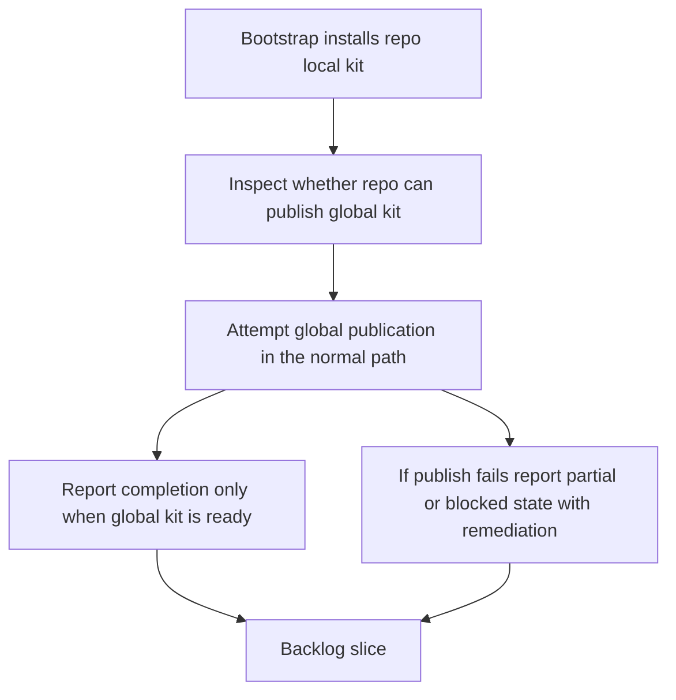

## req_101_make_logics_bootstrap_converge_to_a_ready_global_kit_before_reporting_completion - Make Logics bootstrap converge to a ready global kit before reporting completion
> From version: 1.14.0
> Schema version: 1.0
> Status: Ready
> Understanding: 97%
> Confidence: 95%
> Complexity: Medium
> Theme: Bootstrap completion semantics and global kit publication
> Reminder: Update status/understanding/confidence and references when you edit this doc.

# Needs
- Ensure the Logics bootstrap flow is treated as globally complete only when the repo-local kit is installed and the shared global Codex kit is actually published and usable.
- Remove the operator ambiguity where bootstrap appears complete even though only the repository-local `logics/skills` source exists and the global runtime still requires a second manual step.
- Keep the bootstrap flow aligned with the repository direction introduced by global kit publication: normal bootstrap should converge toward a usable global install, not stop at partial local readiness.
- Preserve explicit recovery messaging when the repository cannot act as a healthy publication source or when publication fails, instead of masking those cases behind a misleading success message.

# Context
- The repository already shifted from overlay-oriented runtime setup to a globally published Logics kit model in `req_099`, with the plugin expected to auto-publish or auto-upgrade the global kit from compatible repositories in the normal path.
- The current bootstrap flow in [src/logicsViewProvider.ts](/Users/alexandreagostini/Documents/cdx-logics-vscode/src/logicsViewProvider.ts#L1113) still behaves in two phases:
  - it adds the canonical `logics/skills` submodule and runs the repo-local bootstrap script;
  - then it calls `notifyBootstrapCompletion`, which may only inform the user that the global kit is not ready yet and offer `Publish Global Codex Kit` or `Update Logics Kit`.
- That means bootstrap can end in a partially converged state:
  - the repository now contains the local kit;
  - but the shared global Codex home may still have no published kit, a stale manifest, or an unhealthy publication source;
  - the plugin can still emit bootstrap-complete messaging and leave the operator to finish the global step manually.
- This creates a mismatch with the current architecture:
  - the canonical source remains repo-local under `logics/skills`;
  - but the runtime consumed by Codex is the globally published kit under the user Codex home;
  - so for normal-path usability, bootstrap should converge on both layers, not only the local source.
- The existing global publication machinery already exists in the plugin:
  - global state inspection lives in [src/logicsCodexWorkspace.ts](/Users/alexandreagostini/Documents/cdx-logics-vscode/src/logicsCodexWorkspace.ts);
  - explicit publication and repair are handled through `syncCodexOverlay` in [src/logicsViewProvider.ts](/Users/alexandreagostini/Documents/cdx-logics-vscode/src/logicsViewProvider.ts#L1455).
- The missing part is bootstrap contract clarity:
  - when the repo-local kit is a healthy publication source, bootstrap should attempt global publication as part of the same overall flow;
  - when that publication cannot succeed, the user-facing result should be explicitly partial or blocked rather than presented as fully complete.

# Acceptance criteria
- AC1: When bootstrap runs on a repository that exposes the canonical publishable `logics/skills` kit, the plugin attempts to converge the shared global Codex kit as part of the bootstrap flow instead of treating repo-local installation alone as the end state.
- AC2: A normal successful bootstrap completion message is shown only when both conditions are true:
  - the repo-local Logics kit is present and bootstrapped;
  - the global Codex kit is healthy or warning-healthy according to the global publication inspection contract.
- AC3: If bootstrap completes the repo-local phase but the repository cannot yet act as a healthy global publication source, the plugin reports that state explicitly and does not imply that the overall bootstrap is fully complete.
- AC4: If the repo is a valid publication source but global publication fails or remains stale after the attempt, the plugin reports an explicit partial or repair-required outcome, with remediation that is specific to the detected failure instead of a generic success toast.
- AC5: The implementation preserves the current architecture boundaries:
  - bootstrap still installs or repairs repo-local Logics assets in the repository;
  - global publication continues to use the shared global publication contract and manifest inspection rather than introducing a second ad hoc bootstrap-only write path.
- AC6: The plugin coverage is extended with focused tests for the bootstrap-plus-publication UX, including at least:
  - a bootstrap path that ends with global kit readiness;
  - a bootstrap path where the repo-local phase succeeds but global publication is unavailable or unhealthy.

# Scope
- In:
  - bootstrap completion semantics relative to global kit readiness
  - automatic normal-path publication of the global kit after successful repo-local bootstrap when the source is healthy
  - explicit partial or blocked messaging when global convergence does not succeed
  - reuse of existing global manifest and publication inspection logic during bootstrap
  - regression coverage for bootstrap-plus-global-publication outcomes
- Out:
  - redefining the global publication manifest contract itself
  - changing the chosen multi-repository version policy from `req_099`
  - moving runtime ownership out of the shared global publication code into bootstrap-specific logic
  - requiring bootstrap to install external system dependencies such as Git or Python automatically

# Dependencies and risks
- Dependency: `req_099` remains the architectural baseline for globally published kit behavior and zero-touch normal-path convergence.
- Dependency: [src/logicsViewProvider.ts](/Users/alexandreagostini/Documents/cdx-logics-vscode/src/logicsViewProvider.ts#L1113) and [src/logicsCodexWorkspace.ts](/Users/alexandreagostini/Documents/cdx-logics-vscode/src/logicsCodexWorkspace.ts) remain the main integration surfaces for bootstrap and global publication state.
- Dependency: the canonical repo-local `logics/skills` submodule remains the only supported healthy source for global publication.
- Risk: if bootstrap still shows `completed` before the global runtime is actually usable, users will keep assuming Codex can immediately see the kit when it cannot.
- Risk: if bootstrap tries to hide global publication failures behind optimistic wording, support and diagnostics will become harder rather than simpler.
- Risk: if bootstrap introduces a second publication mechanism separate from the shared global publication path, manifest and repair behavior will drift.
- Risk: if every bootstrap run forces noisy extra prompts even when auto-publication can succeed silently, the zero-touch direction from `req_099` will regress.

# AC Traceability
- AC1 -> bootstrap-triggered global convergence. Proof: the request requires bootstrap to attempt the existing global publication flow when the repository is a healthy source.
- AC2 -> completion semantics tied to actual global readiness. Proof: the request explicitly defines overall bootstrap success as repo-local readiness plus healthy global publication state.
- AC3 -> explicit non-complete messaging for non-publishable sources. Proof: the request requires the plugin to distinguish local bootstrap success from full runtime readiness when the source cannot publish globally.
- AC4 -> explicit repair-required messaging for failed publication. Proof: the request requires bootstrap to surface failure-specific remediation instead of silently downgrading to a generic success outcome.
- AC5 -> thin shared publication boundary. Proof: the request explicitly reuses the existing global publication and manifest contract rather than inventing a separate bootstrap-only path.
- AC6 -> `item_175_add_regression_coverage_for_bootstrap_global_publication_outcomes`. Proof: the request requires tests for both ready and partial bootstrap outcomes.

# Definition of Ready (DoR)
- [x] Problem statement is explicit and user impact is clear.
- [x] Scope boundaries (in/out) are explicit.
- [x] Acceptance criteria are testable.
- [x] Dependencies and known risks are listed.

# Companion docs
- Product brief(s): (none yet)
- Architecture decision(s): `adr_013_replace_repo_local_codex_workspace_overlays_with_a_global_published_logics_kit`
# AI Context
- Summary: Make bootstrap of the Logics kit converge to an actually usable global published kit in the normal path, and avoid reporting full completion when only the repo-local phase succeeded.
- Keywords: bootstrap, global kit, publish, completion, plugin, repo local, manifest, repair, zero touch
- Use when: Use when planning or implementing bootstrap behavior that must end in a ready global Codex Logics kit rather than only a local repository setup.
- Skip when: Skip when the work is only about global publication policy, generic kit updates, or unrelated plugin messaging outside bootstrap completion behavior.

# References
- `logics/request/req_099_replace_repo_local_codex_overlays_with_a_global_published_logics_kit_and_managed_migration.md`
- `logics/backlog/item_168_publish_and_auto_upgrade_the_global_codex_logics_kit_from_canonical_repo_sources_in_the_plugin.md`
- `logics/backlog/item_169_migrate_plugin_docs_and_existing_overlay_ux_to_the_global_published_kit_model.md`
- `src/logicsViewProvider.ts`
- `src/logicsCodexWorkspace.ts`
- `README.md`

# Backlog
- `item_173_attempt_global_kit_publication_automatically_when_bootstrap_finishes_with_a_healthy_repo_local_source`
- `item_174_tighten_bootstrap_completion_and_partial_failure_messaging_around_global_kit_readiness`
- `item_175_add_regression_coverage_for_bootstrap_global_publication_outcomes`
