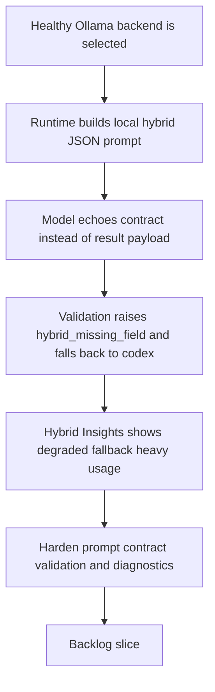

## req_102_harden_ollama_hybrid_assist_prompts_and_response_validation_so_local_runs_stop_echoing_the_contract - Harden Ollama hybrid assist prompts and response validation so local runs stop echoing the contract
> From version: 1.14.0
> Schema version: 1.0
> Status: Done
> Understanding: 98%
> Confidence: 96%
> Complexity: Medium
> Theme: Hybrid assist local-runtime contract reliability and Ollama result validation
> Reminder: Update status/understanding/confidence and references when you edit this doc.

# Needs
- Make Ollama-backed hybrid assist flows return valid business payloads instead of silently degrading to Codex because the local model echoed the contract schema rather than producing a result.
- Restore trust in the local hybrid path so `auto` can actually use Ollama for supported flows like `commit-message` and `commit-plan` when the local backend is healthy.
- Improve diagnostics for invalid local responses so operators and maintainers can distinguish a prompt-contract failure from network or model-availability problems.
- Add targeted tests that prove the local Ollama path returns semantically valid payloads for supported flows instead of only testing reachability or synthetic log aggregation.

# Context
- The current hybrid runtime builds a JSON-only prompt in [logics_flow_hybrid.py](/Users/alexandreagostini/Documents/cdx-logics-vscode/logics/skills/logics-flow-manager/scripts/logics_flow_hybrid.py#L433) and sends it to `/api/chat` through `run_ollama_hybrid`.
- The runtime then validates the decoded JSON against per-flow contracts in [logics_flow_hybrid.py](/Users/alexandreagostini/Documents/cdx-logics-vscode/logics/skills/logics-flow-manager/scripts/logics_flow_hybrid.py#L528). If validation fails and the requested backend is `auto`, the runtime degrades to Codex in [logics_flow.py](/Users/alexandreagostini/Documents/cdx-logics-vscode/logics/skills/logics-flow-manager/scripts/logics_flow.py#L703).
- Recent Hybrid Insights data in this repository showed:
  - `4` recorded runs;
  - `100%` fallback to `codex`;
  - `100%` degraded outcomes;
  - top degraded reason `hybrid_missing_field`.
- The audit logs confirm that these degraded runs were not caused by Ollama being unreachable:
  - `ollama_reachable` was `true`;
  - the configured model was present;
  - the degraded reason was `hybrid_missing_field`, not connectivity.
- Direct reproduction against the local Ollama backend shows the real failure mode:
  - for `commit-message`, the model returned the contract object itself, with keys like `flow`, `required_keys`, and `summary`, instead of the required payload keys `subject`, `body`, `scope`, `confidence`, and `rationale`;
  - for `commit-plan`, the model again returned the contract object itself, not `strategy`, `steps`, `confidence`, and `rationale`.
- That means the current prompt shape is too ambiguous for the chosen local model:
  - the user message says `Return a JSON object matching this contract exactly`;
  - but it also embeds the contract object in full;
  - the local model can interpret that as “repeat the contract” rather than “produce an instance that satisfies the contract”.
- The current observability is also incomplete for this class of failure:
  - once validation fails, the runtime records `hybrid_missing_field` and falls back;
  - but the invalid Ollama payload is discarded from the normal audit surface because `raw_payload` is reset to `None` on fallback in [logics_flow.py](/Users/alexandreagostini/Documents/cdx-logics-vscode/logics/skills/logics-flow-manager/scripts/logics_flow.py#L719).
- The test suite currently covers runtime-status health and ROI aggregation, but not the semantic success of local Ollama hybrid outputs for flows like `commit-message` or `commit-plan`.

# Acceptance criteria
- AC1: For supported local hybrid flows such as `commit-message` and `commit-plan`, a healthy Ollama-backed run produces a valid flow payload that satisfies the existing contract keys, instead of echoing the contract schema or degrading immediately to `hybrid_missing_field`.
- AC2: The Ollama prompt contract is hardened so the model is clearly instructed to return an instance of the contract, not the contract description itself, while keeping the runtime backend-agnostic and bounded.
- AC3: If the local model still returns invalid JSON or a structurally wrong payload, the runtime records enough failure detail for diagnosis, including a safe representation of the invalid local response or the specific missing fields, without masking the issue behind a generic degraded outcome.
- AC4: The fallback path remains safe:
  - `auto` may still degrade to Codex when the local response is invalid;
  - but the recorded degraded reason and audit detail make the root cause inspectable as a prompt-contract failure rather than a generic local-backend failure.
- AC5: Hybrid Insights and underlying ROI logs become meaningfully interpretable for this failure class:
  - degraded runs caused by invalid local payloads remain visible;
  - once the prompt is fixed, successful local runs can be observed as true `ollama` usage instead of permanent fallback-heavy telemetry.
- AC6: Automated tests cover at minimum:
  - a successful Ollama-backed `commit-message` or `commit-plan` path with a valid local payload;
  - an invalid Ollama response that triggers `hybrid_missing_field` or equivalent validation failure with preserved diagnostic detail;
  - the runtime behavior that distinguishes semantic local-response failure from transport unavailability.

# Scope
- In:
  - prompt and message-shaping changes for Ollama-backed hybrid assist flows
  - runtime validation and audit-detail handling for invalid local payloads
  - targeted tests for semantic local-response success and failure cases
  - preserving meaningful degraded reasons in ROI and audit outputs
- Out:
  - changing the shared flow contracts themselves for business scope expansion
  - removing Codex fallback as a safety mechanism
  - redesigning the Hybrid Insights UI beyond what is needed to expose existing runtime facts
  - broad model-family support changes unrelated to the contract-echo failure mode

# Dependencies and risks
- Dependency: the current hybrid assist contract model in `logics_flow_hybrid.py` remains the source of truth for required per-flow keys.
- Dependency: `req_097` remains the baseline for supported Ollama model profiles, but this request focuses on runtime correctness rather than adding more model families.
- Dependency: `req_098` and the existing ROI report remain the observability surface that should benefit from more accurate local-run behavior and clearer degraded reasons.
- Risk: if the prompt is made stricter without preserving bounded output requirements, local models may start emitting verbose explanations around the JSON and cause a different parse failure.
- Risk: if invalid Ollama payloads are not preserved safely in audits, maintainers will keep seeing `hybrid_missing_field` without enough evidence to debug prompt regressions.
- Risk: if the runtime special-cases one model output too narrowly, it may fix DeepSeek today but become brittle for the supported Qwen profile.
- Risk: if the tests only mock reachability and not semantic payload validity, the local path can regress again while runtime-status still looks healthy.

# AC Traceability
- AC1 -> local-flow success hardening. Proof: the request requires real valid payload instances for supported Ollama hybrid flows rather than contract echoes.
- AC2 -> prompt-contract clarification. Proof: the request requires the runtime prompt to distinguish between schema description and expected answer instance.
- AC3 -> diagnostic preservation for invalid local responses. Proof: the request explicitly requires inspectable failure detail instead of losing the invalid payload during fallback.
- AC4 -> safe but observable fallback. Proof: the request preserves `auto -> codex` fallback while making the semantic cause visible in runtime telemetry.
- AC5 -> ROI and insights interpretability. Proof: the request explicitly ties the fix to reducing misleading permanently-fallback-heavy observability when the local path should be viable.
- AC6 -> regression coverage for semantic local success and failure. Proof: the request requires tests for both valid and invalid Ollama payload paths, not only transport health.

# Definition of Ready (DoR)
- [x] Problem statement is explicit and user impact is clear.
- [x] Scope boundaries (in/out) are explicit.
- [x] Acceptance criteria are testable.
- [x] Dependencies and known risks are listed.

# Companion docs
- Product brief(s): (none yet)
- Architecture decision(s): `adr_011_keep_hybrid_assist_runtime_contracts_shared_backend_agnostic_and_safely_bounded`, `adr_012_keep_the_vs_code_plugin_as_a_thin_client_over_shared_hybrid_runtime_commands`
# AI Context
- Summary: Harden the local Ollama hybrid assist path so supported flows return valid business payloads instead of echoing the contract schema and falling back to Codex with `hybrid_missing_field`.
- Keywords: ollama, hybrid assist, prompt contract, local runtime, fallback, degraded, validation, audit, deepseek, qwen
- Use when: Use when planning or implementing a fix for local hybrid runs that reach Ollama successfully but fail semantic validation and degrade to Codex.
- Skip when: Skip when the work is only about plugin notification UX, global kit publication, or generic Ollama installation guidance.

# References
- `logics/request/req_097_expand_hybrid_local_model_support_beyond_deepseek_with_configurable_qwen_and_deepseek_profiles.md`
- `logics/request/req_098_add_a_hybrid_assist_roi_dispatch_report_with_runtime_aggregation_and_plugin_insights.md`
- `logics/skills/logics-flow-manager/scripts/logics_flow.py`
- `logics/skills/logics-flow-manager/scripts/logics_flow_hybrid.py`
- `logics/skills/logics-flow-manager/scripts/logics_flow_dispatcher.py`
- `logics/skills/tests/test_logics_flow.py`
- `logics/hybrid_assist_audit.jsonl`
- `logics/hybrid_assist_measurements.jsonl`

# Backlog
- `item_176_harden_ollama_hybrid_prompt_messages_for_supported_local_flows`
- `item_177_preserve_invalid_local_payload_diagnostics_when_hybrid_validation_fails`
- `item_178_add_semantic_ollama_hybrid_runtime_tests_for_valid_and_invalid_payloads`
