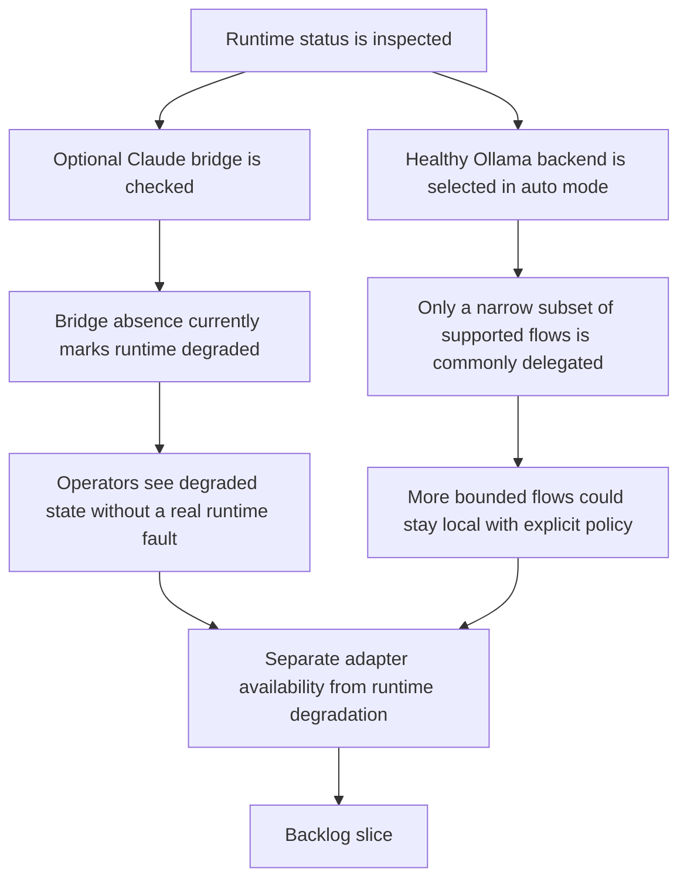

## req_103_separate_optional_claude_bridge_status_from_hybrid_runtime_degradation_and_expand_ollama_first_dispatch_across_supported_flows - Separate optional Claude bridge status from hybrid runtime degradation and expand Ollama-first dispatch across supported flows
> From version: 1.15.0
> Schema version: 1.0
> Status: Ready
> Understanding: 97%
> Confidence: 95%
> Complexity: High
> Theme: Hybrid assist runtime health semantics, adapter-neutral status, and broader Ollama-first delegation
> Reminder: Update status/understanding/confidence and references when you edit this doc.

# Needs
- Stop treating the absence of Claude-specific bridge files as an operational degradation of the shared hybrid assist runtime.
- Make runtime status reflect actual execution health and backend viability, not the presence or absence of one optional consumer adapter.
- Increase the amount of bounded work that can stay local on Ollama when the local backend is healthy, instead of limiting local offload mostly to the currently exposed commit-related paths.
- Make the local-first dispatch policy explicit and per-flow, so broader Ollama delegation improves ROI without hiding unsafe fallback behavior or over-trusting weak local outputs.
- Add a Windows compatibility pass focused on the post-migration architecture where Codex skills are deployed globally, so hybrid dispatch and runtime-status behavior remain reliable on Windows after the move away from repo-local overlays.

# Context
- The current runtime-status payload is built in [logics_flow_hybrid.py](/Users/alexandreagostini/Documents/cdx-logics-vscode/logics/skills/logics-flow-manager/scripts/logics_flow_hybrid.py#L1305).
- That implementation currently appends `claude-bridge-missing` to `degraded_reasons` whenever Claude bridge files are absent, even if Ollama is healthy and the runtime itself is otherwise ready:
  - [logics_flow_hybrid.py](/Users/alexandreagostini/Documents/cdx-logics-vscode/logics/skills/logics-flow-manager/scripts/logics_flow_hybrid.py#L1325)
  - [logics_flow_hybrid.py](/Users/alexandreagostini/Documents/cdx-logics-vscode/logics/skills/logics-flow-manager/scripts/logics_flow_hybrid.py#L1327)
- The VS Code extension then treats any non-empty degraded reason list as a degraded runtime state in [logicsEnvironment.ts](/Users/alexandreagostini/Documents/cdx-logics-vscode/src/logicsEnvironment.ts#L357), so a repository without Claude integration can be shown as degraded even when the shared runtime and Ollama backend are healthy.
- There is also an inconsistency in bridge detection:
  - the runtime checks for `.claude/commands/logics-flow.md` and `.claude/agents/logics-flow-manager.md` in [logics_flow.py](/Users/alexandreagostini/Documents/cdx-logics-vscode/logics/skills/logics-flow-manager/scripts/logics_flow.py#L360);
  - the extension checks for `.claude/commands/logics-assist.md` and `.claude/agents/logics-hybrid-delivery-assistant.md` in [logicsEnvironment.ts](/Users/alexandreagostini/Documents/cdx-logics-vscode/src/logicsEnvironment.ts#L310).
- This means the same repository can report different Claude-adapter availability depending on which layer is asked, which undermines operator trust in the status panel.
- On the delegation side, the shared hybrid runtime already supports more bounded flows than the extension currently exposes, including:
  - `triage`
  - `suggest-split`
  - `diff-risk`
  - `doc-consistency`
  - `validation-checklist`
  - `closure-summary`
  - plus summary-oriented flows such as `pr-summary` and `changelog-summary`
  - these flow contracts are declared in [logics_flow_hybrid.py](/Users/alexandreagostini/Documents/cdx-logics-vscode/logics/skills/logics-flow-manager/scripts/logics_flow_hybrid.py#L64).
- In practice, the plugin currently routes only a narrower set of actions through the hybrid runtime:
  - runtime-status
  - commit-all
  - next-step
  - summarize-validation
  - roi-report
  - this surface is wired in [logicsViewProvider.ts](/Users/alexandreagostini/Documents/cdx-logics-vscode/src/logicsViewProvider.ts#L648).
- The current backend selection is intentionally simple:
  - in `auto`, if Ollama is reachable and the configured model is present, the runtime selects `ollama`; otherwise it selects `codex`
  - that selection happens in [logics_flow_hybrid.py](/Users/alexandreagostini/Documents/cdx-logics-vscode/logics/skills/logics-flow-manager/scripts/logics_flow_hybrid.py#L403).
- That simplicity helped ship the first local-first path, but it now leaves two gaps:
  - some optional adapter details are incorrectly treated as degraded runtime health;
  - broader local delegation is not yet governed by an explicit per-flow policy, so expanding usage would currently be too implicit and hard to reason about.
- The next iteration should therefore clarify operational semantics first, then expand local-first delegation in a controlled and observable way.
- This request also needs to preserve the Windows-safe guarantees introduced during the migration to globally published Codex kit skills:
  - the runtime now depends on shared globally published skills rather than the previous repo-local Codex overlay path;
  - Windows-specific shell, PATH, launcher, and filesystem differences have already been called out as release-critical risk areas in the repository guidance;
  - the dispatcher, runtime-status probe, and any broadened Ollama-first flow exposure should therefore be checked against the post-global-kit Windows path rather than assumed safe because the macOS/Linux path works.

# Acceptance criteria
- AC1: Runtime status treats Claude bridge availability as optional adapter metadata, not as a degraded runtime condition by itself.
- AC2: A repository with a healthy Ollama backend and no Claude bridge reports the hybrid runtime as `ready`, while still exposing the Claude bridge as unavailable in a separate informational field or note.
- AC3: Claude bridge detection is unified across the shared runtime and the VS Code extension so both layers report the same adapter availability semantics and paths.
- AC4: The hybrid runtime defines an explicit local-delegation policy for supported flows, so it is clear which flows are eligible for Ollama-first execution, which remain Codex-only, and which may require stricter fallback or repair handling.
- AC5: The plugin or shared operator surfaces expose more bounded high-value flows through the hybrid runtime, prioritizing flows such as `triage`, `diff-risk`, `validation-checklist`, `doc-consistency`, `closure-summary`, or `suggest-split`, instead of keeping local-first delegation mostly limited to the current narrow set.
- AC6: When local-first delegation is expanded, observability remains trustworthy:
  - runtime status keeps separating backend health from optional adapter presence;
  - audit and measurement logs continue to show actual backend used, fallback reasons, and degraded reasons;
  - new delegation paths do not silently bypass the shared runtime contract.
- AC7: Automated tests cover at minimum:
  - a healthy runtime-status payload without Claude bridge that is not marked degraded;
  - unified Claude bridge detection semantics across runtime and extension-facing status inspection;
  - at least one newly expanded Ollama-eligible flow or delegation-policy path.
- AC8: The change set includes a targeted Windows compatibility review for the hybrid runtime and dispatcher path after the move to globally deployed Codex skills, with validation or explicit evidence that runtime-status, backend dispatch, and entrypoint assumptions still hold on Windows.

# Scope
- In:
  - changing runtime-status semantics so optional Claude bridge absence does not imply degraded health
  - unifying Claude bridge detection and reporting across Python runtime and VS Code extension
  - defining an explicit per-flow Ollama-first delegation policy
  - exposing more bounded supported flows through the shared hybrid runtime surface
  - adding regression coverage for the new status semantics and expanded delegation behavior
  - reviewing Windows compatibility for the post-global-kit hybrid runtime and dispatcher path
- Out:
  - removing Codex fallback as a safety mechanism
  - making Claude integration mandatory for hybrid assist usage
  - turning every shared runtime command into an Ollama-first flow without policy or tests
  - broad UI redesign of Hybrid Insights beyond what is needed for correct operator semantics

# Dependencies and risks
- Dependency: the shared hybrid runtime remains the source of truth for backend routing, degraded reasons, and audit/measurement logging.
- Dependency: `req_095` remains the baseline for plugin exposure of hybrid runtime state and actions.
- Dependency: `req_097` and `req_102` remain the baseline for supported local model profiles and contract-valid local responses.
- Dependency: `req_098` remains the observability surface that should continue to reflect truthful degraded and fallback semantics after this change.
- Dependency: `req_099` remains the baseline for the move from repo-local Codex overlays to a globally published Logics kit, so this request must evaluate behavior in that post-migration architecture rather than in the deprecated overlay model.
- Risk: if Claude bridge availability is simply removed from status output instead of being reclassified, operators may lose useful integration visibility.
- Risk: if runtime and extension unify around the wrong bridge contract, the mismatch will persist under a different name.
- Risk: if Ollama-first delegation is expanded without an explicit per-flow policy, local usage may grow in ways that are hard to validate or reason about.
- Risk: if new flows are exposed in the plugin without preserving the shared runtime contract, the extension may drift into owning policy that belongs in the kit.
- Risk: if observability is not updated carefully, a broader local-first rollout could inflate `ollama` usage while hiding degraded semantic quality behind fallback-heavy or review-heavy paths.
- Risk: if the rollout is only validated on Unix-like environments, Windows may regress on launcher resolution, shared-kit entrypoints, or path assumptions introduced by the global Codex skills deployment model.

# AC Traceability
- AC1 -> runtime health semantic correction. Proof: the request explicitly requires Claude bridge absence to stop creating degraded runtime state on its own.
- AC2 -> operator-visible status correctness. Proof: the request requires healthy Ollama plus missing Claude bridge to resolve to `ready`, not `degraded`.
- AC3 -> adapter detection unification. Proof: the request explicitly requires the Python runtime and extension to agree on Claude bridge availability semantics and paths.
- AC4 -> explicit local delegation policy. Proof: the request requires a documented or encoded per-flow decision model instead of implicit broadening of `auto`.
- AC5 -> broader bounded Ollama delegation. Proof: the request explicitly requires additional supported flows to become reachable through the shared hybrid runtime surfaces.
- AC6 -> trustworthy observability during rollout. Proof: the request requires backend provenance, degraded reasons, and fallback reasons to stay visible as delegation expands.
- AC7 -> regression coverage for semantics and expanded routing. Proof: the request requires tests for both the new status semantics and at least one new delegation path.
- AC8 -> Windows-safe post-global-kit verification. Proof: the request explicitly requires a compatibility pass on the Windows path after the migration to globally deployed Codex skills.

# Definition of Ready (DoR)
- [x] Problem statement is explicit and user impact is clear.
- [x] Scope boundaries (in/out) are explicit.
- [x] Acceptance criteria are testable.
- [x] Dependencies and known risks are listed.

# Companion docs
- Product brief(s): `prod_001_hybrid_assist_operator_experience_for_repetitive_logics_delivery_flows`, `prod_002_plugin_hybrid_assist_runtime_visibility_and_action_ux`
- Architecture decision(s): `adr_011_keep_hybrid_assist_runtime_contracts_shared_backend_agnostic_and_safely_bounded`, `adr_012_keep_the_vs_code_plugin_as_a_thin_client_over_shared_hybrid_runtime_commands`

# AI Context
- Summary: Reclassify Claude bridge availability as optional adapter metadata rather than degraded runtime health, unify bridge detection across runtime and extension, and expand Ollama-first delegation across more bounded supported flows with explicit policy.
- Keywords: hybrid assist, ollama, claude bridge, degraded state, runtime status, adapter availability, local-first, delegation policy, plugin, runtime, windows, global codex kit
- Use when: Use when planning or implementing runtime-status semantic fixes, Claude bridge detection unification, broader Ollama-first delegation across supported bounded hybrid flows, or a Windows-safe verification pass after the move to globally deployed Codex skills.
- Skip when: Skip when the work is only about Ollama installation, raw prompt-shape fixes already covered by `req_102`, plugin toast UX already covered by `req_100`, or unrelated Windows issues outside the hybrid runtime and global-kit path.

# References
- `logics/request/req_091_ensure_hybrid_logics_delivery_automation_stays_compatible_with_claude_environments_and_windows_runtimes.md`
- `logics/request/req_092_add_a_second_wave_of_hybrid_ollama_or_codex_assist_flows_for_risk_triage_commit_planning_closure_summaries_doc_consistency_checks_and_validation_checklists.md`
- `logics/request/req_095_adapt_the_vs_code_logics_plugin_to_expose_hybrid_assist_runtime_status_actions_audit_and_cross_agent_messaging.md`
- `logics/request/req_097_expand_hybrid_local_model_support_beyond_deepseek_with_configurable_qwen_and_deepseek_profiles.md`
- `logics/request/req_098_add_a_hybrid_assist_roi_dispatch_report_with_runtime_aggregation_and_plugin_insights.md`
- `logics/request/req_099_replace_repo_local_codex_overlays_with_a_global_published_logics_kit_and_managed_migration.md`
- `logics/request/req_102_harden_ollama_hybrid_assist_prompts_and_response_validation_so_local_runs_stop_echoing_the_contract.md`
- `src/logicsEnvironment.ts`
- `src/logicsViewProvider.ts`
- `logics/skills/logics-flow-manager/scripts/logics_flow.py`
- `logics/skills/logics-flow-manager/scripts/logics_flow_hybrid.py`
- `logics/skills/tests/test_logics_flow.py`
- `tests/logicsEnvironment.test.ts`
- `tests/logicsViewProvider.test.ts`

# Backlog
- `item_179_reclassify_optional_claude_bridge_availability_as_non_degraded_hybrid_runtime_metadata`
- `item_180_unify_claude_bridge_detection_contracts_across_runtime_and_extension_status_surfaces`
- `item_181_define_per_flow_ollama_first_dispatch_policy_for_supported_hybrid_assist_flows`
- `item_182_expose_additional_high_value_hybrid_assist_flows_through_plugin_and_shared_operator_surfaces`
- `item_183_add_regression_and_windows_post_global_kit_validation_for_hybrid_runtime_status_and_dispatch_expansion`
