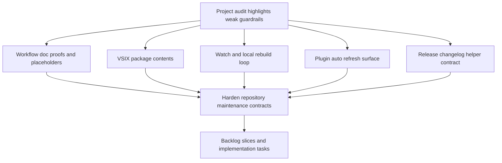

## req_104_harden_repository_maintenance_guardrails_revealed_by_project_audit - Harden repository maintenance guardrails revealed by project audit
> From version: 1.16.1
> Schema version: 1.0
> Status: Done
> Understanding: 98%
> Confidence: 96%
> Complexity: Medium
> Theme: Repository governance, packaging hygiene, and maintenance guardrails
> Reminder: Update status/understanding/confidence and references when you edit this doc.

# Needs
- Close the gap between green CI and actual repository quality by making workflow-doc proofs and placeholder checks stricter.
- Prevent internal-only repository assets from leaking into the published VSIX when they are not part of the supported extension contract.
- Align the local development watch loop with the actual bundled artifact used by the extension so contributors do not iterate on stale output.
- Reduce stale environment status in the plugin by widening or clarifying the refresh surface for non-`logics/` inputs that affect operator-visible runtime health.
- Make the release changelog helper contract explicit so `resolve` and `validate` do not suggest stronger guarantees than they actually enforce.

# Context
- The audit found that request/backlog/task AC traceability can still pass with placeholder evidence because `_has_ac_with_proof` only checks for the AC identifier and the presence of `proof:` somewhere in the text:
  - [workflow_audit.py](/Users/alexandreagostini/Documents/cdx-logics-vscode/logics/skills/logics-flow-manager/scripts/workflow_audit.py#L345)
  - example task still marked `Done` with an unresolved proof placeholder: [task_038_improve_ui_state_persistence_in_the_plugin.md](/Users/alexandreagostini/Documents/cdx-logics-vscode/logics/tasks/task_038_improve_ui_state_persistence_in_the_plugin.md#L24)
  - example backlog item still marked `Done` with generic scaffold text: [item_028_replace_hide_used_requests_with_hide_processed_requests_semantics.md](/Users/alexandreagostini/Documents/cdx-logics-vscode/logics/backlog/item_028_replace_hide_used_requests_with_hide_processed_requests_semantics.md#L11)
- The current linter only treats a narrow set of placeholder snippets as warnings, so several low-quality but structurally valid docs remain audit-green:
  - [logics_lint.py](/Users/alexandreagostini/Documents/cdx-logics-vscode/logics/skills/logics-doc-linter/scripts/logics_lint.py#L74)
  - [logics_lint.py](/Users/alexandreagostini/Documents/cdx-logics-vscode/logics/skills/logics-doc-linter/scripts/logics_lint.py#L417)
- The published VSIX currently includes `.claude/` assets because `.vscodeignore` excludes many internal paths but not that directory, and the smoke test does not assert its absence:
  - [`.vscodeignore`](/Users/alexandreagostini/Documents/cdx-logics-vscode/.vscodeignore#L1)
  - [run_extension_smoke_checks.mjs](/Users/alexandreagostini/Documents/cdx-logics-vscode/tests/run_extension_smoke_checks.mjs#L27)
- The extension runs from `dist/extension.js`, but `npm run watch` only runs `tsc -watch` into `out/`, which can mislead contributors into thinking the live extension bundle is being rebuilt:
  - [package.json](/Users/alexandreagostini/Documents/cdx-logics-vscode/package.json#L18)
  - [package.json](/Users/alexandreagostini/Documents/cdx-logics-vscode/package.json#L97)
  - [package.json](/Users/alexandreagostini/Documents/cdx-logics-vscode/package.json#L98)
- The plugin file watcher only listens to `logics/**/*.{md,markdown,yaml,yml}`, while environment state also depends on `.claude` bridge files and global kit runtime inspection:
  - [extension.ts](/Users/alexandreagostini/Documents/cdx-logics-vscode/src/extension.ts#L28)
  - [logicsEnvironment.ts](/Users/alexandreagostini/Documents/cdx-logics-vscode/src/logicsEnvironment.ts#L34)
  - [logicsEnvironment.ts](/Users/alexandreagostini/Documents/cdx-logics-vscode/src/logicsEnvironment.ts#L117)
- The release changelog helper currently exposes `resolve` and `validate` as separate npm scripts even though both call the same permissive implementation, and the implementation warns instead of failing when the curated changelog is missing:
  - [package.json](/Users/alexandreagostini/Documents/cdx-logics-vscode/package.json#L113)
  - [package.json](/Users/alexandreagostini/Documents/cdx-logics-vscode/package.json#L114)
  - [resolve-release-changelog.mjs](/Users/alexandreagostini/Documents/cdx-logics-vscode/scripts/release/resolve-release-changelog.mjs#L117)
  - [changelogs/README.md](/Users/alexandreagostini/Documents/cdx-logics-vscode/changelogs/README.md#L10)
- The goal of this request is not to redesign the product surface. It is to harden repository-maintenance contracts so future work runs on more trustworthy documentation, packaging, local iteration, and release signals.

# Acceptance criteria
- AC1: Workflow-doc guardrails become strict enough that changed or active workflow docs cannot pass with unresolved proof placeholders, generic AC mapping stubs, or equivalent unresolved traceability markers when the docs claim implementation readiness or completion.
- AC2: Placeholder detection for workflow docs is expanded or reclassified so obviously generic scaffold content in important sections such as `Problem`, `Scope`, `Acceptance criteria`, or `AC Traceability` is surfaced as a blocking failure where the repository contract requires it, not just as a soft warning.
- AC3: The VSIX content contract is explicit and enforced: internal-only repository assets such as `.claude/` are excluded from packaging unless they are intentionally part of the supported extension distribution surface, and smoke coverage asserts the chosen policy.
- AC4: The local development command surface is aligned with the actual extension runtime artifact, so a command named `watch` either rebuilds the bundled `dist/extension.js` path or the repository clearly separates typecheck-only watch behavior from bundle-watch behavior in scripts and docs.
- AC5: The plugin refresh model covers the repo-local inputs that materially affect environment or runtime status surfaces, including Claude-bridge detection or equivalent non-`logics/` status inputs, or the UI and docs explicitly state where manual refresh remains required because file watching is not the supported contract.
- AC6: The release changelog helper contract is made truthful and testable: either `resolve` and `validate` become behaviorally distinct with `validate` failing when the curated changelog requirement is unmet, or the naming and documentation are adjusted so the helper no longer implies a stricter guarantee than it provides.
- AC7: Regression coverage exists for the hardened guardrails, including at minimum:
  - a workflow-doc validation path that rejects placeholder traceability or proof markers under the intended strictness contract;
  - a package-validation path that enforces the selected VSIX exclusion policy for internal-only assets;
  - a command-surface or documentation check that keeps the watch/build contract and release-helper contract from drifting silently again.

# Scope
- In:
  - hardening Logics doc audit and linter behavior around placeholder proofs and generic scaffold content
  - tightening the VSIX packaging contract for internal-only repository files
  - aligning watch/build scripts and contributor guidance with the actual extension runtime artifact
  - improving or clarifying plugin refresh behavior for non-`logics/` status inputs
  - making the release changelog helper naming and behavior truthful
  - adding regression tests or equivalent automated checks for the chosen contracts
- Out:
  - redesigning the extension UI or Hybrid Insights feature set
  - broad refactors of unrelated extension modules only because they are large
  - changing the product-level workflow model for requests, backlog items, and tasks
  - introducing a fully new release pipeline unrelated to the curated changelog contract

# Dependencies and risks
- Dependency: the Logics kit remains the source of truth for workflow-doc governance, so any stricter request-level guarantees may require corresponding linter and workflow-audit changes inside `logics/skills`.
- Dependency: the extension packaging contract must remain compatible with the current release workflow and smoke tests.
- Dependency: the extension runtime still depends on a bundled `dist/extension.js`, so watch-loop fixes should preserve the current packaging path unless a broader build-contract decision is made separately.
- Risk: making placeholder detection too broad could start blocking legitimate in-progress docs unless the strictness is scoped carefully to changed docs, done docs, or explicit governance modes.
- Risk: excluding `.claude/` blindly could remove intentionally distributed assets if those files are later treated as part of the supported extension contract; the package policy needs to be explicit rather than assumed.
- Risk: broadening the watched file surface can increase refresh noise or event churn if it is done without scoping or debouncing.
- Risk: turning `validate` into a hard failure without aligning release expectations could break a currently tolerated fallback workflow; the repository must choose between stricter enforcement and clearer naming.

# AC Traceability
- AC1 -> stricter proof validation for workflow docs. Proof: the request explicitly targets placeholder traceability and unresolved proof markers in ready/done paths.
- AC2 -> stronger placeholder blocking behavior. Proof: the request explicitly requires generic scaffold content in key workflow sections to stop passing as effectively valid.
- AC3 -> enforceable VSIX exclusion policy. Proof: the request requires an explicit packaging contract and smoke coverage for internal-only assets.
- AC4 -> truthful watch/build contract. Proof: the request explicitly requires `watch` behavior or its naming/documentation to match the actual runtime artifact.
- AC5 -> fresher environment status surfaces. Proof: the request explicitly requires non-`logics/` runtime inputs such as Claude-bridge state to be watched or clearly documented as manual-refresh inputs.
- AC6 -> truthful release-helper semantics. Proof: the request explicitly requires `resolve` and `validate` to become behaviorally distinct or to be renamed/documented accordingly.
- AC7 -> regression coverage for hardened contracts. Proof: the request explicitly requires automated checks for workflow-doc guardrails, VSIX content policy, and command-surface drift.

# Definition of Ready (DoR)
- [x] Problem statement is explicit and user impact is clear.
- [x] Scope boundaries (in/out) are explicit.
- [x] Acceptance criteria are testable.
- [x] Dependencies and known risks are listed.

# Companion docs
- Product brief(s): (none yet)
- Architecture decision(s): (none yet)

# AI Context
- Summary: Harden repository-maintenance guardrails exposed by the audit by making workflow-doc proof checks stricter, tightening VSIX packaging policy, aligning watch/build behavior with the real bundle, clarifying plugin refresh coverage, and making release-changelog helper semantics truthful.
- Keywords: audit, governance, workflow docs, placeholder proof, VSIX, packaging, watch, bundle, refresh, claude bridge, changelog, release helper
- Use when: Use when planning or implementing follow-up work on repository maintenance contracts, workflow-doc validation, package hygiene, contributor build scripts, environment refresh behavior, or release-helper semantics.
- Skip when: Skip when the work is only about feature delivery inside the plugin UI, hybrid runtime behavior unrelated to maintenance guardrails, or large structural refactors not driven by the audit findings.

# References
- [workflow_audit.py](/Users/alexandreagostini/Documents/cdx-logics-vscode/logics/skills/logics-flow-manager/scripts/workflow_audit.py)
- [logics_lint.py](/Users/alexandreagostini/Documents/cdx-logics-vscode/logics/skills/logics-doc-linter/scripts/logics_lint.py)
- [item_028_replace_hide_used_requests_with_hide_processed_requests_semantics.md](/Users/alexandreagostini/Documents/cdx-logics-vscode/logics/backlog/item_028_replace_hide_used_requests_with_hide_processed_requests_semantics.md)
- [task_038_improve_ui_state_persistence_in_the_plugin.md](/Users/alexandreagostini/Documents/cdx-logics-vscode/logics/tasks/task_038_improve_ui_state_persistence_in_the_plugin.md)
- [`.vscodeignore`](/Users/alexandreagostini/Documents/cdx-logics-vscode/.vscodeignore)
- [run_extension_smoke_checks.mjs](/Users/alexandreagostini/Documents/cdx-logics-vscode/tests/run_extension_smoke_checks.mjs)
- [package.json](/Users/alexandreagostini/Documents/cdx-logics-vscode/package.json)
- [extension.ts](/Users/alexandreagostini/Documents/cdx-logics-vscode/src/extension.ts)
- [logicsEnvironment.ts](/Users/alexandreagostini/Documents/cdx-logics-vscode/src/logicsEnvironment.ts)
- [resolve-release-changelog.mjs](/Users/alexandreagostini/Documents/cdx-logics-vscode/scripts/release/resolve-release-changelog.mjs)
- [changelogs/README.md](/Users/alexandreagostini/Documents/cdx-logics-vscode/changelogs/README.md)
- [README.md](/Users/alexandreagostini/Documents/cdx-logics-vscode/README.md)

# Backlog
- `item_184_harden_workflow_doc_proof_and_placeholder_enforcement`
- `item_185_enforce_internal_asset_exclusion_and_package_validation_coverage`
- `item_186_align_watch_and_release_helper_contracts_with_actual_runtime_behavior`
- `item_187_clarify_or_expand_plugin_refresh_coverage_for_non_logics_runtime_inputs`
