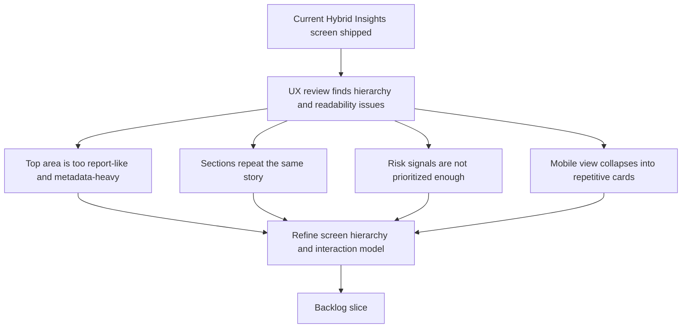

## req_105_refine_hybrid_insights_ux_ui_information_hierarchy - Refine Hybrid Insights UX/UI and information hierarchy
> From version: 1.16.0
> Schema version: 1.0
> Status: Done
> Understanding: 97%
> Confidence: 95%
> Complexity: Medium
> Theme: Hybrid insights usability, information hierarchy, and mobile readability
> Reminder: Update status/understanding/confidence and references when you edit this doc.

# Needs
- Make the `Hybrid Insights` screen feel like an operational VS Code tool surface instead of an editorial report page.
- Re-prioritize the screen around operator decisions, so the highest-signal health and risk indicators appear first and secondary metadata stops consuming the first screenful.
- Reduce redundancy between measured, derived, estimated, and per-flow sections so the page tells one coherent story instead of repeating the same metrics in several visual blocks.
- Make recent audit drill-downs easier to scan and act on without forcing operators to decode dense rows or raw JSON excerpts too early.
- Improve the mobile and narrow-width experience so the screen remains readable and navigable instead of collapsing into a long stack of visually similar cards.

# Context
- `req_098` and its delivery items successfully shipped the first `Hybrid Insights` surface:
  - the runtime now exposes a canonical `roi-report`;
  - the plugin renders measured, derived, estimated, and recent-run sections over that shared output;
  - the current implementation lives in [src/logicsHybridInsightsHtml.ts](/Users/alexandreagostini/Documents/cdx-logics-vscode/src/logicsHybridInsightsHtml.ts).
- A focused UX/UI review of the current screen, using browser rendering and narrow-width inspection, found that the first implementation is functionally rich but not yet optimized for operator use:
  - the top of the page uses a large hero treatment, serif typography, pill buttons, strong radius, and decorative surface styling that read more like a report or landing page than a practical plugin panel;
  - source metadata such as generation time, audit-log path, measurement-log path, and window bounds consume too much of the initial viewport compared with the actual decision signals;
  - `Measured Facts`, `Derived Summaries`, `Estimated ROI Proxies`, and `Flow Drill-Down` each add value, but the current grouping repeats similar stories and makes the scan path longer than necessary;
  - negative or review-heavy signals such as fallback, degraded, and review-recommended rates are not visually prioritized enough relative to neutral counters like total runs;
  - the per-flow cards are readable but still too list-heavy, so they feel like repeated mini-panels instead of compact diagnostics;
  - `Recent Audit Drill-Down` is one of the most useful sections, but it appears too late in the page and its summary rows are still dense;
  - on mobile and narrow widths, the page becomes a long stack of near-identical cards, which weakens hierarchy and increases fatigue.
- The redesign should stay aligned with the existing product boundaries:
  - the plugin remains a thin client over the shared runtime report;
  - this request is about presentation, hierarchy, readability, and operator guidance, not about moving analytics logic into the extension;
  - estimates must remain explicitly secondary to measured facts.
- The intended direction is a calmer, more grounded internal-tool screen:
  - simpler top area;
  - stronger emphasis on high-signal metrics and anomalies;
  - clearer split between overview, explanation, drill-down, and estimates;
  - better narrow-width behavior without turning every section into the same floating card pattern.

# Acceptance criteria
- AC1: The screen's top area is simplified and re-prioritized so the first viewport emphasizes the main operational health and risk signals, while secondary metadata such as log paths or report-window details moves to a less dominant presentation.
- AC2: The visual language of the page is made more grounded and tool-native:
  - typography, spacing, surface treatment, radii, and action styling align with a practical internal plugin surface;
  - decorative hero or report-page cues are reduced where they do not improve operator understanding.
- AC3: The information architecture is clarified so the page reads as a coherent sequence such as overview, breakdown, recent runs, and secondary estimates, instead of presenting several equally weighted sections with overlapping meaning.
- AC4: Negative or action-driving signals such as fallback, degraded, and review-recommended outcomes become more visually legible and easier to compare than they are in the current neutral-card treatment.
- AC5: The per-flow drill-down is redesigned into more compact diagnostic summaries, reducing repeated list chrome while preserving the ability to understand run volume, health pressure, and backend split by flow.
- AC6: The recent-run section is made more useful for operators:
  - it is easier to find from the main scan path;
  - each entry exposes the key provenance and health context more clearly;
  - raw JSON or low-level detail remains available without dominating the default reading state.
- AC7: Estimated ROI proxies remain explicitly secondary to measured facts in wording and visual weight, so the screen does not overstate estimates as primary truth.
- AC8: The narrow-width and mobile behavior is intentionally redesigned:
  - hierarchy remains visible;
  - the page does not degrade into a long stack of near-identical floating cards;
  - important actions and sections stay discoverable.
- AC9: Updated regression coverage or UI verification covers the redesigned screen structure and key states, including at least one narrow-width rendering path and one recent-run drill-down path.

# Scope
- In:
  - revising Hybrid Insights layout, hierarchy, copy density, section ordering, and visual treatment
  - improving the prominence of high-signal metrics and diagnostics
  - redesigning flow and recent-run drill-down presentation
  - narrowing the visual dominance of estimates and metadata
  - improving responsive and narrow-width behavior
  - adding UI-oriented regression coverage or validation evidence for the new structure
- Out:
  - changing the shared runtime `roi-report` semantics or aggregation contract
  - adding unrelated hybrid assist flows
  - redesigning the broader plugin shell outside what the Hybrid Insights surface needs
  - replacing measured observability with speculative charts or synthetic analytics

# Dependencies and risks
- Dependency: `req_098` remains the functional foundation; this request refines the existing screen rather than replacing the runtime reporting model.
- Dependency: `prod_002` remains the closest product framing for plugin-side hybrid runtime visibility and action UX.
- Dependency: the screen should continue to render the shared runtime output without introducing UI-owned semantic drift.
- Risk: if the redesign over-corrects toward minimalism, operators may lose useful provenance and explanatory context.
- Risk: if the redesign emphasizes estimates too aggressively, the page may look cleaner while becoming less trustworthy.
- Risk: if mobile simplification is handled only by collapsing sections into one column without rethinking hierarchy, the page will remain tiring on narrow widths.
- Risk: if recent-run drill-down becomes too dense or too hidden, the page will still push operators back to raw logs.

# AC Traceability
- AC1 -> first-viewport priority shift. Proof: the request explicitly requires operational signals to outrank log metadata and report-window details.
- AC2 -> grounded internal-tool visual language. Proof: the request explicitly targets typography, spacing, surfaces, radii, and action styling that currently feel too report-like.
- AC3 -> clearer section architecture. Proof: the request explicitly requires a more coherent overview-to-drill-down sequence instead of several equally weighted blocks.
- AC4 -> stronger salience for negative signals. Proof: the request explicitly requires fallback, degraded, and review-heavy outcomes to become easier to see and compare.
- AC5 -> more compact flow diagnostics. Proof: the request explicitly requires reducing repetitive list chrome while preserving per-flow understanding.
- AC6 -> stronger recent-run usability. Proof: the request explicitly requires easier discovery, clearer provenance, and lower default JSON density.
- AC7 -> estimates stay secondary. Proof: the request explicitly requires measured facts to remain visually and semantically primary.
- AC8 -> intentional narrow-width redesign. Proof: the request explicitly requires better responsive behavior than the current repeated-card collapse.
- AC9 -> verification of the redesigned surface. Proof: the request explicitly requires UI-oriented coverage or validation evidence for desktop and narrow-width behavior.

# Definition of Ready (DoR)
- [x] Problem statement is explicit and user impact is clear.
- [x] Scope boundaries (in/out) are explicit.
- [x] Acceptance criteria are testable.
- [x] Dependencies and known risks are listed.

# Companion docs
- Product brief(s): `prod_002_plugin_hybrid_assist_runtime_visibility_and_action_ux`
- Architecture decision(s): `adr_012_keep_the_vs_code_plugin_as_a_thin_client_over_shared_hybrid_runtime_commands`

# AI Context
- Summary: Refine the shipped Hybrid Insights screen so it becomes a clearer, more grounded operator surface with better information hierarchy, stronger signal prioritization, cleaner drill-downs, and a deliberate narrow-width layout.
- Keywords: hybrid insights, UX, UI, information hierarchy, observability, plugin, recent runs, flow drill-down, mobile, responsive
- Use when: Use when redesigning the Hybrid Insights screen layout, section order, visual hierarchy, responsive behavior, copy density, or drill-down usability without changing the shared runtime report semantics.
- Skip when: Skip when the work is only about changing `roi-report` data contracts, adding new hybrid assist flows, or generic plugin cleanup unrelated to the Hybrid Insights screen.

# References
- [req_098_add_a_hybrid_assist_roi_dispatch_report_with_runtime_aggregation_and_plugin_insights.md](/Users/alexandreagostini/Documents/cdx-logics-vscode/logics/request/req_098_add_a_hybrid_assist_roi_dispatch_report_with_runtime_aggregation_and_plugin_insights.md)
- [item_166_add_a_plugin_hybrid_assist_roi_dispatch_insights_surface_with_recent_audit_drill_down.md](/Users/alexandreagostini/Documents/cdx-logics-vscode/logics/backlog/item_166_add_a_plugin_hybrid_assist_roi_dispatch_insights_surface_with_recent_audit_drill_down.md)
- [task_102_orchestration_delivery_for_req_098_hybrid_assist_roi_dispatch_reporting_and_plugin_insights.md](/Users/alexandreagostini/Documents/cdx-logics-vscode/logics/tasks/task_102_orchestration_delivery_for_req_098_hybrid_assist_roi_dispatch_reporting_and_plugin_insights.md)
- [prod_002_plugin_hybrid_assist_runtime_visibility_and_action_ux.md](/Users/alexandreagostini/Documents/cdx-logics-vscode/logics/product/prod_002_plugin_hybrid_assist_runtime_visibility_and_action_ux.md)
- [src/logicsHybridInsightsHtml.ts](/Users/alexandreagostini/Documents/cdx-logics-vscode/src/logicsHybridInsightsHtml.ts)
- [src/logicsViewProvider.ts](/Users/alexandreagostini/Documents/cdx-logics-vscode/src/logicsViewProvider.ts)
- [README.md](/Users/alexandreagostini/Documents/cdx-logics-vscode/README.md)

# Backlog
- `item_188_reframe_hybrid_insights_overview_and_tool_native_visual_language`
- `item_189_prioritize_operational_signals_and_compact_hybrid_insights_flow_diagnostics`
- `item_190_improve_hybrid_insights_recent_run_drill_down_and_narrow_width_usability`
