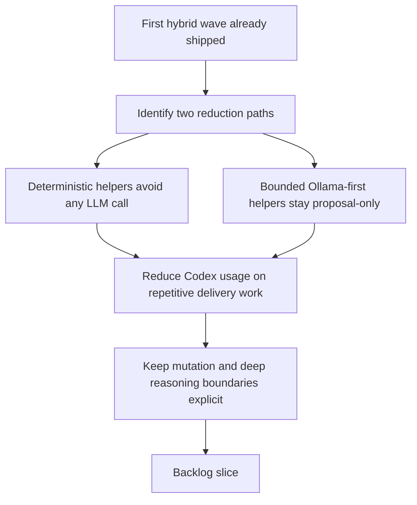

## req_106_expand_deterministic_and_ollama_first_delivery_assist_to_reduce_codex_usage - Expand deterministic and Ollama-first delivery assist to reduce Codex usage
> From version: 1.16.0
> Schema version: 1.0
> Status: Done
> Understanding: 97%
> Confidence: 95%
> Complexity: High
> Theme: Local-first delivery automation, deterministic tooling, and token reduction
> Reminder: Update status/understanding/confidence and references when you edit this doc.

# Needs
- Reduce unnecessary Codex consumption further by moving more repetitive delivery operations either to deterministic tooling or to bounded Ollama-first assist flows.
- Distinguish clearly between work that should be solved without any LLM at all and work that is still useful as a strict local-model proposal flow.
- Add a second practical wave of operator-visible helpers that save Codex tokens on frequent repo-maintenance and delivery tasks without broadening unsafe autonomy.
- Keep risky execution, repository mutation, and deep reasoning boundaries explicit so local offload improves ROI without eroding quality or safety.

# Context
- The repository already invested in Codex-token reduction through compact context packs and budgeted handoffs in [req_080_reduce_codex_token_consumption_with_budgeted_context_packs_and_agent_aware_prompt_shaping.md](/Users/alexandreagostini/Documents/cdx-logics-vscode/logics/request/req_080_reduce_codex_token_consumption_with_budgeted_context_packs_and_agent_aware_prompt_shaping.md).
- It also already shipped a first wave of hybrid assist flows in [req_090_add_high_roi_hybrid_ollama_or_codex_assist_flows_for_repetitive_logics_delivery_operations.md](/Users/alexandreagostini/Documents/cdx-logics-vscode/logics/request/req_090_add_high_roi_hybrid_ollama_or_codex_assist_flows_for_repetitive_logics_delivery_operations.md) and expanded the local-first policy surface in [req_103_separate_optional_claude_bridge_status_from_hybrid_runtime_degradation_and_expand_ollama_first_dispatch_across_supported_flows.md](/Users/alexandreagostini/Documents/cdx-logics-vscode/logics/request/req_103_separate_optional_claude_bridge_status_from_hybrid_runtime_degradation_and_expand_ollama_first_dispatch_across_supported_flows.md).
- Current runtime policy already keeps several bounded flows local-first, including `pr-summary`, `changelog-summary`, `validation-summary`, `triage`, `handoff-packet`, `suggest-split`, `diff-risk`, `commit-plan`, `closure-summary`, `validation-checklist`, and `doc-consistency`:
  - [logics_flow_hybrid.py](/Users/alexandreagostini/Documents/cdx-logics-vscode/logics/skills/logics-flow-manager/scripts/logics_flow_hybrid.py#L180)
- The remaining opportunity is now more nuanced than “send more things to Ollama”.
  There are two distinct categories:
  - deterministic opportunities, where a rule-based or data-assembly path can avoid both Codex and Ollama;
  - bounded local-model opportunities, where Ollama can still add value through compact proposal outputs under a strict contract.
- The strongest deterministic opportunities are repetitive data-shaping tasks that should not consume any LLM budget if the repository already has enough structured state:
  - release and changelog resolution from `package.json`, tags, and curated changelog files;
  - workflow-index, relationship, stale-doc, and audit summaries over `logics/*`;
  - simple diff classification, changed-surface extraction, and metrics over `git diff`;
  - compact context-pack assembly, file-of-interest extraction, and similar runtime preprocessing.
- The strongest next-wave Ollama opportunities are bounded outputs that remain advisory, reviewable, and structurally validated, for example:
  - `commit-message` generation;
  - `test-impact-summary` or equivalent validation-target selection from the current diff;
  - `ai-context-refresh-suggestion` for compact `# AI Context` maintenance;
  - `windows-compat-risk` review for supported command surfaces and release paths;
  - `backlog-groom-suggestion` from a selected request;
  - `task-breakdown-suggestion` from a selected backlog item;
  - `doc-link-suggestion` for missing request/backlog/task references or companion docs;
  - `review-checklist` generation for the current change surface;
  - `hybrid-insights-explainer` from the existing ROI report output.
- Some boundaries should remain explicit:
  - `next-step` is still intentionally Codex-routed under `auto` today because it feeds the deterministic dispatcher policy:
    - [logics_flow_hybrid.py](/Users/alexandreagostini/Documents/cdx-logics-vscode/logics/skills/logics-flow-manager/scripts/logics_flow_hybrid.py#L194)
  - direct file mutation, broad code review, unbounded architecture reasoning, and complex code generation should remain outside this request.
- The next useful step is therefore not “make everything local”.
  It is:
  - move more repetitive work to deterministic helpers first;
  - add only the next bounded, high-frequency Ollama-first suggestions after strict contract design;
  - expose them through operator-visible runtime commands and plugin surfaces so they are actually used.

# Acceptance criteria
- AC1: The platform adds a second explicit portfolio of Codex-reduction helpers that distinguishes deterministic no-LLM operations from bounded Ollama-first assist flows instead of treating both as one generic “local automation” bucket.
- AC2: Deterministic helper coverage is expanded for repetitive repository and workflow operations that can be derived safely from existing structured state, such as release or changelog resolution, workflow audit or relationship summaries, changed-surface extraction, or equivalent compact preprocessing paths that currently still encourage assistant usage.
- AC3: The hybrid runtime adds or exposes a second-wave set of bounded Ollama-first suggestion flows focused on high-frequency operator tasks, prioritizing candidates such as:
  - `commit-message`;
  - `test-impact-summary` or equivalent validation-target suggestion;
  - `ai-context-refresh-suggestion`;
  - `windows-compat-risk`;
  - `backlog-groom-suggestion`;
  - `task-breakdown-suggestion`;
  - `doc-link-suggestion`;
  - `review-checklist`;
  - `hybrid-insights-explainer`;
  while allowing the final implementation to split or rename those flows if the contracts stay equivalent and bounded.
- AC4: Each newly added Ollama-first flow uses a compact structured input and a strict bounded output contract, with validation and bounded Codex fallback where necessary, so the flow remains reviewable and safe under degraded local execution.
- AC5: The request keeps explicit exclusions for work that should remain deterministic or Codex-first, including direct repository mutation, complex code generation, broad architecture reasoning, and deep freeform review that is not safely reducible to a bounded contract.
- AC6: Operator surfaces expose the selected deterministic helpers and Ollama-first flows through canonical runtime commands, documentation, and, where useful, plugin actions, so the offload opportunity is discoverable and not trapped in internal scripts.
- AC7: Observability remains trustworthy:
  - audit and measurement output continues to record actual backend use and fallback behavior for new Ollama-first flows;
  - deterministic helpers remain distinguishable from model-backed flows in reporting;
  - Hybrid Insights or equivalent observability surfaces can reflect the expanded local-first portfolio without hiding degraded quality.
- AC8: Validation covers the new portfolio at the right layer:
  - deterministic helper outputs are tested through direct command or fixture assertions;
  - Ollama-first flows are tested for contract validity, fallback behavior, and bounded outputs;
  - Windows-safe command assumptions are checked for the flows that touch CLI, packaging, validation, or release operations.

# Scope
- In:
  - defining a second-wave Codex-reduction portfolio across deterministic and Ollama-first delivery helpers
  - adding deterministic helpers for repetitive structured repo and workflow operations
  - adding bounded local-first suggestion flows for high-frequency operator tasks
  - exposing those helpers through stable commands and relevant operator surfaces
  - keeping audit, fallback, and observability semantics aligned with the existing hybrid runtime
  - adding validation coverage for deterministic and local-first paths
- Out:
  - making every delivery decision Ollama-first by default
  - moving repository mutation or risky execution directly into local-model outputs
  - replacing Codex for deep code review, architecture, or complex code generation
  - redesigning Hybrid Insights beyond what is needed to reflect new flow categories and observability semantics

# Dependencies and risks
- Dependency: `req_080` remains the token-efficiency foundation for compact context and smaller handoffs.
- Dependency: `req_088` remains the reference pattern for strict machine-readable local-model contracts and deterministic execution boundaries.
- Dependency: `req_090` remains the first-wave portfolio baseline for hybrid assist flows.
- Dependency: `req_093` remains the fallback, safety-class, and audit-governance contract for hybrid assist behavior.
- Dependency: `req_103` remains the baseline for explicit per-flow backend policy and expanded local-first routing.
- Risk: if deterministic opportunities are implemented as LLM prompts anyway, the repository will pay local-model complexity without removing real Codex demand.
- Risk: if new Ollama-first flows are not tightly bounded, Codex will still be needed to reinterpret or repair the output, producing little net ROI.
- Risk: if the portfolio tries to cover too many medium-fit tasks at once, observability and fallback semantics will become harder to trust.
- Risk: if deterministic and model-backed helpers are mixed indistinguishably in reporting, operators will not know whether improvements come from better automation or just from more local-model calls.
- Risk: if plugin and CLI surfaces do not expose the new helpers clearly, the theoretical Codex savings will not translate into real operator behavior.

# AC Traceability
- AC1 -> explicit two-bucket portfolio design. Proof: the request explicitly distinguishes no-LLM deterministic helpers from bounded Ollama-first assist flows.
- AC2 -> deterministic repo and workflow helper expansion. Proof: the request explicitly prioritizes structured operations such as release resolution, workflow summaries, diff preprocessing, and compact preprocessing that should avoid any model call.
- AC3 -> second-wave bounded local-first flow portfolio. Proof: the request explicitly lists the next candidate flows and allows bounded renaming or splitting as long as the contracts stay equivalent.
- AC4 -> strict contracts and validated fallback. Proof: the request explicitly requires compact inputs, strict outputs, validation, and bounded Codex fallback for each new Ollama-first flow.
- AC5 -> retained deterministic and Codex-first boundaries. Proof: the request explicitly excludes direct mutation, complex code generation, broad architecture reasoning, and deep freeform review from the local-first portfolio.
- AC6 -> operator-visible command surfaces. Proof: the request explicitly requires canonical runtime commands, docs, and optional plugin entrypoints instead of hidden internal helpers.
- AC7 -> trustworthy observability after portfolio expansion. Proof: the request explicitly requires audit, measurement, and Hybrid Insights distinction between deterministic and model-backed execution paths.
- AC8 -> layer-appropriate validation coverage. Proof: the request explicitly requires deterministic tests, hybrid contract tests, fallback tests, and Windows-safe command checks.

# Definition of Ready (DoR)
- [x] Problem statement is explicit and user impact is clear.
- [x] Scope boundaries (in/out) are explicit.
- [x] Acceptance criteria are testable.
- [x] Dependencies and known risks are listed.

# Companion docs
- Product brief(s): `prod_001_hybrid_assist_operator_experience_for_repetitive_logics_delivery_flows`
- Architecture decision(s): `adr_011_keep_hybrid_assist_runtime_contracts_shared_backend_agnostic_and_safely_bounded`

# AI Context
- Summary: Define a second-wave portfolio of deterministic and bounded Ollama-first delivery helpers so repetitive repo and workflow operations consume less Codex while preserving strict contracts, fallback safety, and trustworthy observability.
- Keywords: codex reduction, ollama, deterministic helper, local-first, delivery automation, commit message, test impact, ai context, windows risk, backlog grooming, task breakdown
- Use when: Use when planning follow-up work that should reduce Codex usage by adding deterministic helpers or bounded Ollama-first flows for repetitive delivery operations.
- Skip when: Skip when the work is only about broad local-model adoption without clear contracts, or about deep code generation, architecture reasoning, or risky mutation paths that should stay Codex-first.

# References
- [req_080_reduce_codex_token_consumption_with_budgeted_context_packs_and_agent_aware_prompt_shaping.md](/Users/alexandreagostini/Documents/cdx-logics-vscode/logics/request/req_080_reduce_codex_token_consumption_with_budgeted_context_packs_and_agent_aware_prompt_shaping.md)
- [req_088_add_a_local_llm_dispatcher_for_deterministic_logics_flow_orchestration.md](/Users/alexandreagostini/Documents/cdx-logics-vscode/logics/request/req_088_add_a_local_llm_dispatcher_for_deterministic_logics_flow_orchestration.md)
- [req_090_add_high_roi_hybrid_ollama_or_codex_assist_flows_for_repetitive_logics_delivery_operations.md](/Users/alexandreagostini/Documents/cdx-logics-vscode/logics/request/req_090_add_high_roi_hybrid_ollama_or_codex_assist_flows_for_repetitive_logics_delivery_operations.md)
- [req_093_add_shared_hybrid_assist_contracts_fallback_policy_activation_rules_and_audit_governance_for_logics_delivery_automation.md](/Users/alexandreagostini/Documents/cdx-logics-vscode/logics/request/req_093_add_shared_hybrid_assist_contracts_fallback_policy_activation_rules_and_audit_governance_for_logics_delivery_automation.md)
- [req_103_separate_optional_claude_bridge_status_from_hybrid_runtime_degradation_and_expand_ollama_first_dispatch_across_supported_flows.md](/Users/alexandreagostini/Documents/cdx-logics-vscode/logics/request/req_103_separate_optional_claude_bridge_status_from_hybrid_runtime_degradation_and_expand_ollama_first_dispatch_across_supported_flows.md)
- [logics_flow.py](/Users/alexandreagostini/Documents/cdx-logics-vscode/logics/skills/logics-flow-manager/scripts/logics_flow.py)
- [logics_flow_hybrid.py](/Users/alexandreagostini/Documents/cdx-logics-vscode/logics/skills/logics-flow-manager/scripts/logics_flow_hybrid.py)
- [README.md](/Users/alexandreagostini/Documents/cdx-logics-vscode/README.md)

# Backlog
- `item_191_add_deterministic_delivery_helpers_for_structured_repo_and_workflow_operations`
- `item_192_add_bounded_ollama_first_suggestion_flows_for_high_frequency_delivery_tasks`
- `item_193_expose_and_validate_the_expanded_local_first_delivery_portfolio_across_runtime_plugin_and_insights`
