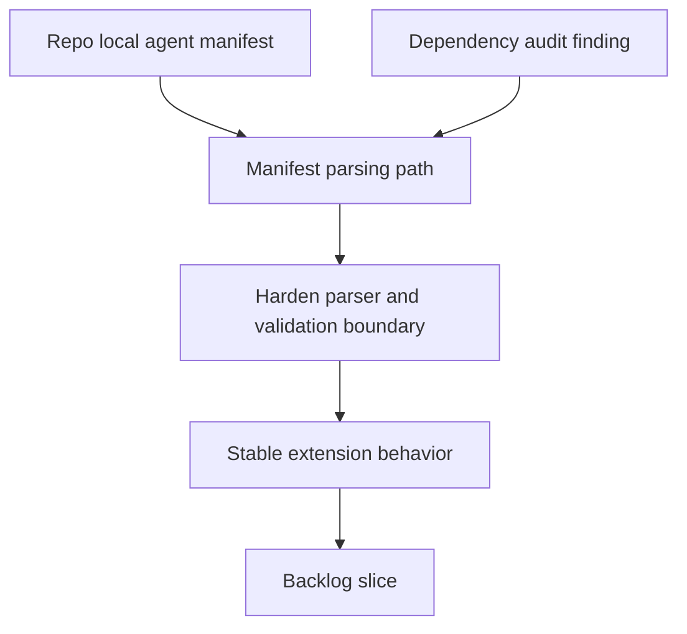

## req_107_harden_agent_registry_yaml_parsing_against_malicious_skill_manifests - Harden agent registry YAML parsing against malicious skill manifests
> From version: 1.16.0
> Schema version: 1.0
> Status: Done
> Understanding: 90%
> Confidence: 90%
> Complexity: Medium
> Theme: Security
> Reminder: Update status/understanding/confidence and references when you edit this doc.

# Needs
- Prevent repo-local `agents/openai.yaml` files from becoming a denial-of-service input for the extension.
- Reduce the gap between the extension trust model and the current dependency posture around YAML parsing.
- Make malformed or hostile agent manifests fail fast with a deterministic validation error instead of stressing the extension host.

# Context
- The audit found that the extension parses repo-local YAML agent manifests directly through the `yaml` package:
  - [agentRegistry.ts](/Users/alexandreagostini/Documents/cdx-logics-vscode/src/agentRegistry.ts#L3)
  - [agentRegistry.ts](/Users/alexandreagostini/Documents/cdx-logics-vscode/src/agentRegistry.ts#L167)
- `npm audit --audit-level=moderate` currently reports a moderate vulnerability on `yaml` for stack overflow via deeply nested collections. That matters here because the parsed files come from the opened repository, not from a trusted packaged asset.
- The current registry loader already surfaces validation issues for bad YAML shape, duplicate IDs, and missing fields, so there is an existing user-facing path for safe rejection:
  - [agentRegistry.ts](/Users/alexandreagostini/Documents/cdx-logics-vscode/src/agentRegistry.ts#L99)
  - [agentRegistry.ts](/Users/alexandreagostini/Documents/cdx-logics-vscode/src/agentRegistry.ts#L143)
- The missing piece is hardening against pathological parser input before it can degrade extension stability.
- This request is about repository safety and extension-host robustness. It is not about changing the agent-manifest feature set or redesigning the registry contract.

# Acceptance criteria
- AC1: Agent-manifest loading rejects malformed or hostile YAML inputs, including deeply nested structures or equivalent pathological payloads, without crashing or hanging the extension-host validation path.
- AC2: The dependency and parser strategy is hardened in a concrete way, such as upgrading the vulnerable package, constraining parser behavior, or introducing a safer parse boundary, and the chosen approach is documented in-code or in tests.
- AC3: Invalid manifest input continues to surface as deterministic registry validation issues through the existing agent-registry reporting flow rather than becoming an unhandled failure.
- AC4: Regression coverage exists for both valid manifests and malicious or pathological manifest fixtures so future dependency or parser changes do not silently reopen the risk.
- AC5: The resulting security posture is reflected in repository validation, either by removing the reported audit issue or by documenting and enforcing the chosen mitigation if a direct dependency upgrade is not immediately feasible.

# Scope
- In:
  - hardening repo-local YAML manifest parsing in the agent registry
  - updating or constraining the `yaml` dependency path used by the extension
  - preserving current manifest validation behavior for normal authoring errors
  - adding regression coverage for hostile and normal manifest inputs
  - aligning repository validation with the chosen mitigation
- Out:
  - redesigning the `openai.yaml` schema
  - adding new agent capabilities unrelated to parse hardening
  - broad dependency upgrades unrelated to the manifest parse path

# Dependencies and risks
- Dependency: the request depends on how far the current `yaml` consumer API can be upgraded without breaking manifest parsing behavior.
- Dependency: tests should stay runnable in the current Node and CI environment.
- Risk: a dependency-only fix may still leave the extension exposed if pathological input can consume excessive work before validation finishes.
- Risk: a strict parser change could reject currently accepted manifests if compatibility is not tested against real shipped skill files.

# AC Traceability
- AC1 -> malicious manifest rejection. Proof: the request explicitly targets malformed and deeply nested YAML without extension-host failure.
- AC2 -> hardened parser strategy. Proof: the request explicitly requires a concrete mitigation path, not just awareness.
- AC3 -> deterministic validation output. Proof: the request explicitly requires bad input to stay inside the agent-registry issue-reporting contract.
- AC4 -> regression coverage. Proof: the request explicitly requires fixtures for both valid and hostile manifests.
- AC5 -> repository validation alignment. Proof: the request explicitly requires the mitigation to be visible in validation or audit posture.

# Definition of Ready (DoR)
- [x] Problem statement is explicit and user impact is clear.
- [x] Scope boundaries (in/out) are explicit.
- [x] Acceptance criteria are testable.
- [x] Dependencies and known risks are listed.

# Companion docs
- Product brief(s): (none yet)
- Architecture decision(s): (none yet)

# AI Context
- Summary: Harden the repo-local agent manifest parsing path so malformed or hostile YAML can be rejected safely and the extension no longer relies on a vulnerable parse posture for workspace content.
- Keywords: yaml, security, agent registry, manifest, parser, dependency, hostile input, validation, extension stability
- Use when: Use when planning or implementing manifest-parse hardening, dependency remediation, or regression coverage around agent registry loading.
- Skip when: Skip when the work is about agent UX, new agent features, or unrelated repository automation.

# References
- [agentRegistry.ts](/Users/alexandreagostini/Documents/cdx-logics-vscode/src/agentRegistry.ts)
- [package.json](/Users/alexandreagostini/Documents/cdx-logics-vscode/package.json)
- [tests/agentRegistry.test.ts](/Users/alexandreagostini/Documents/cdx-logics-vscode/tests/agentRegistry.test.ts)
- `logics/request/req_104_harden_repository_maintenance_guardrails_revealed_by_project_audit.md`
- `logics/request/req_115_sanitize_webview_error_rendering_instead_of_injecting_raw_error_html.md`

# Backlog
- `item_194_harden_agent_registry_yaml_parsing_against_malicious_skill_manifests`
