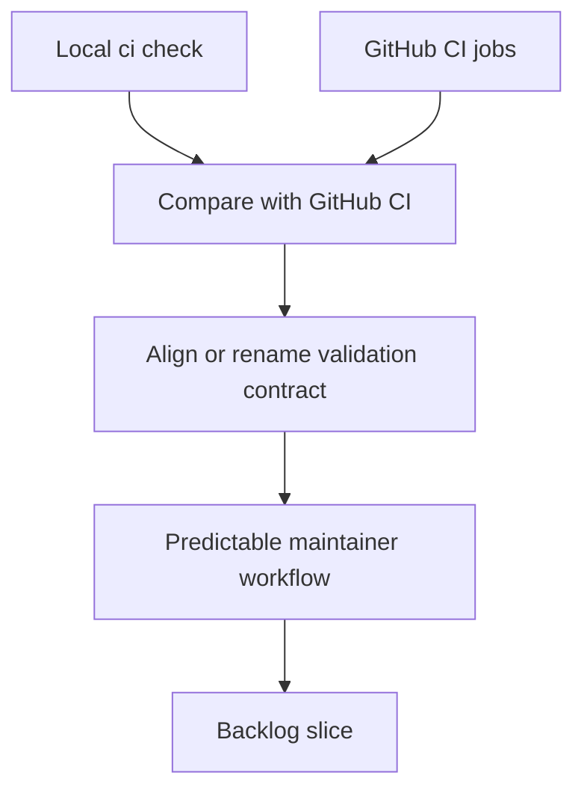

## req_108_align_the_local_ci_check_with_the_full_repository_ci_contract - Align the local ci check with the full repository CI contract
> From version: 1.16.0
> Schema version: 1.0
> Status: Ready
> Understanding: 92%
> Confidence: 90%
> Complexity: Medium
> Theme: Workflow
> Reminder: Update status/understanding/confidence and references when you edit this doc.

# Needs
- Remove the false sense of safety created by a local `ci:check` command that does not cover the same contract as GitHub CI.
- Give maintainers one reliable pre-push command that exercises the repository gates that actually matter.
- Reduce CI-only surprises by making local and remote validation semantics converge or by naming them honestly when they intentionally differ.

# Context
- The audit found that the local script exposed as the main repository check omits several gates that are part of actual CI:
  - local command: [package.json](/Users/alexandreagostini/Documents/cdx-logics-vscode/package.json#L109)
  - CI workflow: [ci.yml](/Users/alexandreagostini/Documents/cdx-logics-vscode/.github/workflows/ci.yml#L24)
- GitHub CI runs Python-side workflow audit, Python unit tests, and CLI smoke checks before the Node checks, while `ci:check` currently covers only compile, lint, Node tests, extension smoke, docs lint, and package validation.
- That mismatch means a maintainer can get a local green result and still fail immediately in CI for a class of repository regressions that the advertised local gate never exercised.
- The repository already has the individual commands needed for the missing checks; the issue is orchestration and contract clarity.
- This request is about validation contract truthfulness, not about adding brand-new test families beyond the repository's current supported checks.

# Acceptance criteria
- AC1: The repository exposes a single local validation entrypoint that either matches the blocking CI contract closely enough to be trusted as a pre-push gate, or the existing command surface is renamed so its narrower scope is explicit.
- AC2: The local validation path covers the Python-side checks currently enforced in CI, including workflow audit, Python unit tests, and CLI smoke checks, unless the repository deliberately documents and justifies a scoped exception.
- AC3: The command naming and contributor guidance make the difference between fast local checks and full CI-equivalent checks unambiguous.
- AC4: Regression coverage or command-level tests exist for the chosen command contract so future workflow changes do not silently widen the gap again.
- AC5: The release and CI workflows remain consistent with the chosen local command contract after the change.

# Scope
- In:
  - aligning or renaming `ci:check`
  - incorporating the missing Python and workflow-governance checks into the trusted local gate, or documenting a split command model
  - updating contributor guidance and command semantics
  - adding lightweight protection against future drift
- Out:
  - replacing GitHub Actions with a different CI platform
  - redesigning the test suite itself beyond contract alignment
  - adding long-running validation stages unrelated to current CI policy

# Dependencies and risks
- Dependency: Python-based repository tooling must stay runnable from the local command surface on supported contributor environments.
- Dependency: CI workflow files remain the source of truth for the blocking remote contract.
- Risk: making the local gate fully CI-equivalent may slow the common inner loop if there is no separate fast-path command.
- Risk: renaming without clear docs could still leave contributors using the wrong command by habit.

# AC Traceability
- AC1 -> trustworthy local gate. Proof: the request explicitly targets local versus remote validation drift.
- AC2 -> missing Python checks included or explicitly exempted. Proof: the request explicitly names workflow audit, Python unit tests, and CLI smoke checks.
- AC3 -> truthful command naming. Proof: the request explicitly requires contributor-facing clarity.
- AC4 -> anti-drift protection. Proof: the request explicitly requires regression coverage or command-level guardrails.
- AC5 -> CI consistency preserved. Proof: the request explicitly requires the resulting local contract to remain aligned with release and CI workflows.

# Definition of Ready (DoR)
- [x] Problem statement is explicit and user impact is clear.
- [x] Scope boundaries (in/out) are explicit.
- [x] Acceptance criteria are testable.
- [x] Dependencies and known risks are listed.

# Companion docs
- Product brief(s): (none yet)
- Architecture decision(s): (none yet)

# AI Context
- Summary: Align the maintainer-facing local CI command with the real GitHub CI contract, or rename and document the command surface so local and remote guarantees are explicit.
- Keywords: ci, local check, github actions, validation, workflow audit, python tests, smoke checks, command contract
- Use when: Use when planning or implementing CI contract alignment, contributor command cleanup, or drift-prevention checks.
- Skip when: Skip when the work is about individual test failures rather than the validation entrypoint contract.

# References
- [package.json](/Users/alexandreagostini/Documents/cdx-logics-vscode/package.json)
- [ci.yml](/Users/alexandreagostini/Documents/cdx-logics-vscode/.github/workflows/ci.yml)
- [release.yml](/Users/alexandreagostini/Documents/cdx-logics-vscode/.github/workflows/release.yml)
- `logics/request/req_104_harden_repository_maintenance_guardrails_revealed_by_project_audit.md`
- `logics/request/req_109_replace_coarse_bootstrap_detection_with_canonical_kit_inspection.md`

# Backlog
- `item_195_align_the_local_ci_check_with_the_full_repository_ci_contract`
