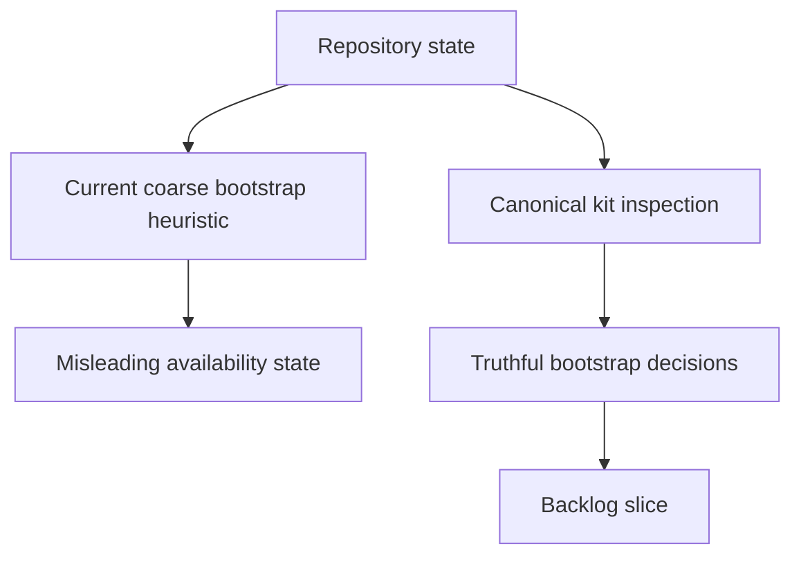

## req_109_replace_coarse_bootstrap_detection_with_canonical_kit_inspection - Replace coarse bootstrap detection with canonical kit inspection
> From version: 1.16.0
> Schema version: 1.0
> Status: Done
> Understanding: 90%
> Confidence: 90%
> Complexity: Medium
> Theme: Workflow
> Reminder: Update status/understanding/confidence and references when you edit this doc.

# Needs
- Stop treating any `logics/skills` presence as equivalent to a healthy canonical bootstrap state.
- Make bootstrap and repair affordances reflect the real repository state instead of a coarse filesystem heuristic.
- Reduce operator confusion when the repository has a non-canonical, incomplete, or misdeclared Logics kit setup.

# Context
- The audit found that bootstrap gating currently relies on a coarse helper:
  - [logicsProviderUtils.ts](/Users/alexandreagostini/Documents/cdx-logics-vscode/src/logicsProviderUtils.ts#L46)
- That helper returns `true` as soon as `logics/skills` exists or `.gitmodules` mentions `logics/skills`, which is then used to suppress bootstrap prompts and tool actions:
  - [logicsViewProvider.ts](/Users/alexandreagostini/Documents/cdx-logics-vscode/src/logicsViewProvider.ts#L402)
  - [logicsViewProvider.ts](/Users/alexandreagostini/Documents/cdx-logics-vscode/src/logicsViewProvider.ts#L1224)
- The codebase already has a richer inspection path that can distinguish canonical, non-canonical, and malformed submodule states with a reason string:
  - [logicsProviderUtils.ts](/Users/alexandreagostini/Documents/cdx-logics-vscode/src/logicsProviderUtils.ts#L70)
- The current UX therefore throws away information that already exists and can lead users into thinking bootstrap is complete when the repository still needs repair guidance or a different next action.
- This request is about choosing the right repository-state contract for bootstrap decisions, not about changing the global-kit publication model or the Logics feature set.

# Acceptance criteria
- AC1: Bootstrap and repair actions are gated by canonical kit inspection or an equivalent richer state model rather than by simple `logics/skills` existence checks alone.
- AC2: The extension distinguishes at least these states in a user-meaningful way: canonical kit present, non-canonical kit present, malformed or incomplete submodule declaration, and kit missing.
- AC3: When bootstrap is blocked or redirected because the repository is non-canonical or partially configured, the UI surfaces the reason and the next operator action clearly.
- AC4: Existing supported paths for canonical submodule update and repair continue to work after the gating change.
- AC5: Regression coverage exists for the decision matrix so bootstrap prompts, tool availability, and update guidance do not silently regress to the coarse heuristic.

# Scope
- In:
  - replacing coarse bootstrap detection in the extension command and prompt paths
  - reusing the richer kit inspection model consistently
  - clarifying user messaging for canonical versus non-canonical states
  - adding regression tests around bootstrap availability and guidance
- Out:
  - changing the canonical kit source repository policy
  - redesigning global Codex kit publication
  - removing support for legitimate non-canonical setups unless a separate product decision is made

# Dependencies and risks
- Dependency: the richer inspection helper must stay stable enough to become the shared source of truth across provider actions.
- Dependency: contributor workflows that intentionally use non-canonical setups still need a clear supported path, even if some automatic actions are disabled.
- Risk: aggressively blocking bootstrap on any non-canonical state could strand users without an actionable recovery message.
- Risk: state proliferation can make the UI noisier if the messaging is technically accurate but operationally unclear.

# AC Traceability
- AC1 -> richer bootstrap gating. Proof: the request explicitly replaces the coarse `hasLogicsSubmodule` style decision path.
- AC2 -> explicit state distinctions. Proof: the request explicitly requires canonical, non-canonical, malformed, and missing states to be differentiated.
- AC3 -> clearer operator guidance. Proof: the request explicitly requires reason and next-action messaging.
- AC4 -> canonical flows preserved. Proof: the request explicitly requires existing update and repair paths to keep working.
- AC5 -> regression protection. Proof: the request explicitly requires tests around prompts, tool availability, and guidance.

# Definition of Ready (DoR)
- [x] Problem statement is explicit and user impact is clear.
- [x] Scope boundaries (in/out) are explicit.
- [x] Acceptance criteria are testable.
- [x] Dependencies and known risks are listed.

# Companion docs
- Product brief(s): (none yet)
- Architecture decision(s): (none yet)

# AI Context
- Summary: Replace coarse bootstrap heuristics with the richer canonical-kit inspection path so prompts and tool availability reflect the actual repository state.
- Keywords: bootstrap, canonical kit, submodule, inspection, repair, workflow, extension UX, repository state
- Use when: Use when planning or implementing bootstrap-state handling, prompt gating, or update guidance for Logics kit setup.
- Skip when: Skip when the work is about Codex global publication or unrelated extension features.

# References
- [logicsProviderUtils.ts](/Users/alexandreagostini/Documents/cdx-logics-vscode/src/logicsProviderUtils.ts)
- [logicsViewProvider.ts](/Users/alexandreagostini/Documents/cdx-logics-vscode/src/logicsViewProvider.ts)
- [logicsEnvironment.ts](/Users/alexandreagostini/Documents/cdx-logics-vscode/src/logicsEnvironment.ts)
- `logics/request/req_104_harden_repository_maintenance_guardrails_revealed_by_project_audit.md`
- `logics/request/req_108_align_the_local_ci_check_with_the_full_repository_ci_contract.md`

# Backlog
- `item_196_replace_coarse_bootstrap_detection_with_canonical_kit_inspection`
