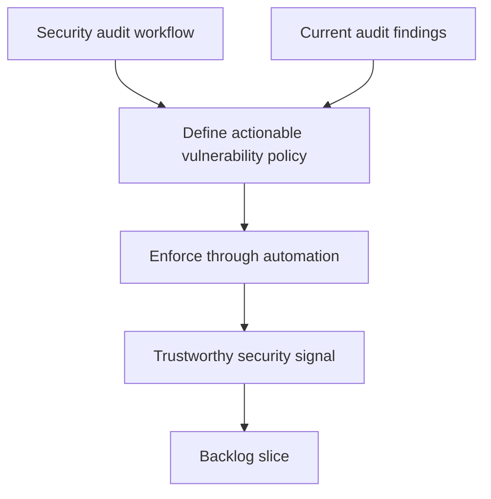

## req_110_make_the_security_audit_workflow_block_on_actionable_vulnerabilities - Make the security audit workflow block on actionable vulnerabilities
> From version: 1.16.0
> Schema version: 1.0
> Status: Done
> Understanding: 92%
> Confidence: 90%
> Complexity: Medium
> Theme: Security
> Reminder: Update status/understanding/confidence and references when you edit this doc.

# Needs
- Turn the repository security-audit workflow into a decision point that can actually stop releasable vulnerabilities from drifting forward.
- Make the security signal truthful for maintainers instead of permanently green by construction.
- Define what counts as an actionable vulnerability for this repository and enforce that choice in automation.

# Context
- The audit found that the dedicated security workflow currently executes `npm audit --audit-level=moderate || true`, which reports issues but never fails the workflow:
  - [audit.yml](/Users/alexandreagostini/Documents/cdx-logics-vscode/.github/workflows/audit.yml#L26)
- Local `npm audit --audit-level=moderate` currently reports moderate vulnerabilities, including `yaml` and transitive `esbuild` via the Vite and Vitest toolchain.
- Because the scheduled audit job is non-blocking by design, the repository has no automated enforcement point for the vulnerability policy it nominally checks.
- This request is not asking for a zero-vulnerability policy at any cost. It is asking for an explicit contract: what severity and scope should fail the repo, what exceptions are allowed, and where are they recorded.
- The result should work with the repository's existing CI and release model rather than living as a disconnected report-only job.

# Acceptance criteria
- AC1: The security-audit workflow enforces an explicit vulnerability policy instead of always succeeding, and that policy is visible in repository automation or docs.
- AC2: The chosen policy defines what severities and dependency scopes are blocking, and how temporary exceptions are handled when a fix cannot land immediately.
- AC3: The repository no longer relies on a pure report-only audit step as its only security signal for known actionable issues.
- AC4: The workflow and contributor guidance make it clear how maintainers can reproduce the enforced policy locally.
- AC5: Regression coverage or workflow-level validation exists for the chosen gating behavior so future edits do not silently revert the job to non-blocking report mode.

# Scope
- In:
  - defining the repository audit-failure policy
  - enforcing that policy in GitHub Actions or an equivalent blocking path
  - documenting local reproduction and exception handling
  - aligning audit behavior with current dependency maintenance practices
- Out:
  - immediately eliminating every transitive advisory regardless of impact
  - replacing `npm audit` with a wholly different security platform unless needed for the chosen policy
  - redesigning the full release process beyond audit enforcement

# Dependencies and risks
- Dependency: dependency updates required by the policy may need coordination with the test stack and release cadence.
- Dependency: maintainers need a documented path for temporary exceptions if upstream fixes are unavailable.
- Risk: a blunt blocking policy can create noisy failures from tooling-only advisories if scope and exception handling are not defined carefully.
- Risk: a policy that is too permissive can preserve the current problem under a more complicated process.

# AC Traceability
- AC1 -> enforceable policy. Proof: the request explicitly requires the workflow to stop being permanently green.
- AC2 -> severity and scope rules. Proof: the request explicitly requires defined blocking levels and exception handling.
- AC3 -> no report-only fallback as sole signal. Proof: the request explicitly requires a stronger security signal than the current report-only job.
- AC4 -> local reproducibility. Proof: the request explicitly requires contributor guidance for reproducing the enforced policy.
- AC5 -> regression protection. Proof: the request explicitly requires the gating behavior to stay protected against silent reversion.

# Definition of Ready (DoR)
- [x] Problem statement is explicit and user impact is clear.
- [x] Scope boundaries (in/out) are explicit.
- [x] Acceptance criteria are testable.
- [x] Dependencies and known risks are listed.

# Companion docs
- Product brief(s): (none yet)
- Architecture decision(s): (none yet)

# AI Context
- Summary: Turn the repository security audit into an enforceable vulnerability gate with explicit severity, scope, and exception rules instead of a report-only workflow.
- Keywords: security audit, npm audit, github actions, vulnerability policy, enforcement, exceptions, dependency hygiene
- Use when: Use when planning or implementing repository vulnerability-policy enforcement and local reproduction guidance.
- Skip when: Skip when the work is about fixing one specific advisory without changing the workflow contract.

# References
- [audit.yml](/Users/alexandreagostini/Documents/cdx-logics-vscode/.github/workflows/audit.yml)
- [package.json](/Users/alexandreagostini/Documents/cdx-logics-vscode/package.json)
- [ci.yml](/Users/alexandreagostini/Documents/cdx-logics-vscode/.github/workflows/ci.yml)
- `logics/request/req_104_harden_repository_maintenance_guardrails_revealed_by_project_audit.md`
- `logics/request/req_116_address_the_remaining_esbuild_and_vite_audit_advisory_in_the_toolchain.md`

# Backlog
- `item_197_make_the_security_audit_workflow_block_on_actionable_vulnerabilities`
