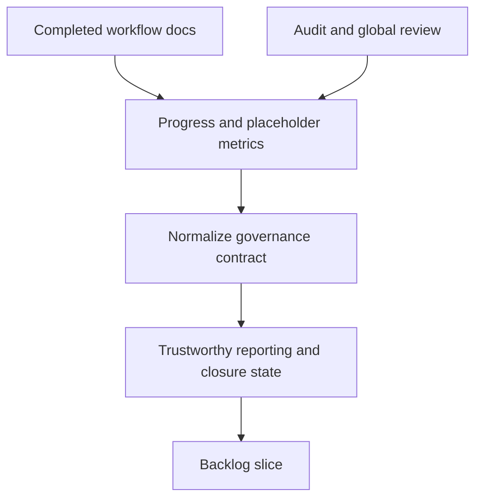

## req_111_normalize_workflow_progress_indicators_and_close_placeholder_debt_in_completed_docs - Normalize workflow progress indicators and close placeholder debt in completed docs
> From version: 1.16.0
> Schema version: 1.0
> Status: Ready
> Understanding: 92%
> Confidence: 90%
> Complexity: Medium
> Theme: Governance
> Reminder: Update status/understanding/confidence and references when you edit this doc.

# Needs
- Make workflow progress metrics trustworthy across requests, backlog items, tasks, and reporting scripts.
- Remove obviously unfinished placeholder content from documents already marked as completed or audit-aligned.
- Stop the repository from showing green governance while still carrying invalid progress formats and unresolved template debt.

# Context
- The audit found completed backlog items that still contain generic scaffold text and placeholder AC traceability:
  - [item_028_replace_hide_used_requests_with_hide_processed_requests_semantics.md](/Users/alexandreagostini/Documents/cdx-logics-vscode/logics/backlog/item_028_replace_hide_used_requests_with_hide_processed_requests_semantics.md#L11)
  - [item_029_refine_plugin_detail_panel_identity_and_action_hierarchy.md](/Users/alexandreagostini/Documents/cdx-logics-vscode/logics/backlog/item_029_refine_plugin_detail_panel_identity_and_action_hierarchy.md#L11)
- The global reviewer also reports invalid progress buckets because several docs store decorated values such as `100% (governed)` or `100% complete`:
  - [logics_global_review.py](/Users/alexandreagostini/Documents/cdx-logics-vscode/logics/skills/logics-global-reviewer/scripts/logics_global_review.py#L117)
  - [task_003_build_flow_board_ui_and_details_panel.md](/Users/alexandreagostini/Documents/cdx-logics-vscode/logics/tasks/task_003_build_flow_board_ui_and_details_panel.md#L6)
  - [item_019_render_mermaid_diagrams_in_read_markdown_view.md](/Users/alexandreagostini/Documents/cdx-logics-vscode/logics/backlog/item_019_render_mermaid_diagrams_in_read_markdown_view.md#L6)
- The strict linter does not currently block these decorated progress values because it only reserves `??%` as a critical placeholder for `Progress`:
  - [logics_lint.py](/Users/alexandreagostini/Documents/cdx-logics-vscode/logics/skills/logics-doc-linter/scripts/logics_lint.py#L69)
- That leaves the repo in an inconsistent state: lint can be green while the higher-level review reports invalid governance metrics.
- This request is about contract coherence and cleanup of completed docs, not about rewriting the whole workflow model.

# Acceptance criteria
- AC1: Progress indicators follow a single normalized format accepted by both the linter and the reporting scripts, so completed or in-progress docs are not classified as invalid solely because of decorated progress text.
- AC2: Existing completed docs that still carry placeholder problem statements, scaffold acceptance criteria, or unresolved AC traceability are cleaned up or reclassified so repository governance state becomes truthful again.
- AC3: The linter, workflow-audit, and global-review tooling agree on the allowed progress format and on which placeholder patterns are blocking versus advisory for completed or active docs.
- AC4: Regression coverage exists for the normalized progress format and for the placeholder-cleanup contract so future generated or edited docs do not drift back into the same mismatch.
- AC5: Any remaining intentionally tolerated placeholders or decorations are explicitly documented rather than left as accidental inconsistencies.

# Scope
- In:
  - normalizing allowed `Progress` formatting across tooling
  - cleaning or reclassifying completed docs with unresolved placeholders
  - aligning linter, audit, and review semantics
  - adding regression coverage for the chosen governance contract
- Out:
  - rewriting historical docs that are archived and intentionally exempt
  - changing unrelated request, backlog, or task generation behavior unless needed to preserve the normalized contract
  - broad product or UI work unrelated to workflow governance

# Dependencies and risks
- Dependency: the repo needs a clear decision on whether decorated progress text is allowed anywhere or fully banned.
- Dependency: cleanup work may touch many historical docs, so the chosen enforcement scope must be explicit.
- Risk: making the contract too strict without migration support could create noisy failures across legacy but harmless docs.
- Risk: leaving legacy exceptions undocumented would keep reporting ambiguous even after code changes.

# AC Traceability
- AC1 -> normalized progress format. Proof: the request explicitly requires one format accepted consistently by lint and reporting.
- AC2 -> completed-doc cleanup. Proof: the request explicitly targets done docs that still contain placeholders.
- AC3 -> toolchain coherence. Proof: the request explicitly requires linter, audit, and review semantics to agree.
- AC4 -> regression protection. Proof: the request explicitly requires tests for progress normalization and placeholder cleanup.
- AC5 -> explicit exceptions only. Proof: the request explicitly requires tolerated deviations to be documented rather than accidental.

# Definition of Ready (DoR)
- [x] Problem statement is explicit and user impact is clear.
- [x] Scope boundaries (in/out) are explicit.
- [x] Acceptance criteria are testable.
- [x] Dependencies and known risks are listed.

# Companion docs
- Product brief(s): (none yet)
- Architecture decision(s): (none yet)

# AI Context
- Summary: Normalize workflow progress formatting and clean completed-doc placeholders so governance tools report a truthful repository state.
- Keywords: progress, governance, placeholder, workflow docs, lint, audit, review, cleanup, normalization
- Use when: Use when planning or implementing workflow-governance cleanup, progress-format normalization, or completed-doc remediation.
- Skip when: Skip when the work is about feature delivery without governance contract changes.

# References
- [item_028_replace_hide_used_requests_with_hide_processed_requests_semantics.md](/Users/alexandreagostini/Documents/cdx-logics-vscode/logics/backlog/item_028_replace_hide_used_requests_with_hide_processed_requests_semantics.md)
- [item_029_refine_plugin_detail_panel_identity_and_action_hierarchy.md](/Users/alexandreagostini/Documents/cdx-logics-vscode/logics/backlog/item_029_refine_plugin_detail_panel_identity_and_action_hierarchy.md)
- [task_003_build_flow_board_ui_and_details_panel.md](/Users/alexandreagostini/Documents/cdx-logics-vscode/logics/tasks/task_003_build_flow_board_ui_and_details_panel.md)
- [item_019_render_mermaid_diagrams_in_read_markdown_view.md](/Users/alexandreagostini/Documents/cdx-logics-vscode/logics/backlog/item_019_render_mermaid_diagrams_in_read_markdown_view.md)
- [logics_lint.py](/Users/alexandreagostini/Documents/cdx-logics-vscode/logics/skills/logics-doc-linter/scripts/logics_lint.py)
- [logics_global_review.py](/Users/alexandreagostini/Documents/cdx-logics-vscode/logics/skills/logics-global-reviewer/scripts/logics_global_review.py)
- `logics/request/req_104_harden_repository_maintenance_guardrails_revealed_by_project_audit.md`
- `logics/request/req_114_fix_false_positive_mermaid_signature_warnings_after_signature_refresh.md`

# Backlog
- `item_198_normalize_workflow_progress_indicators_and_close_placeholder_debt_in_completed_docs`
