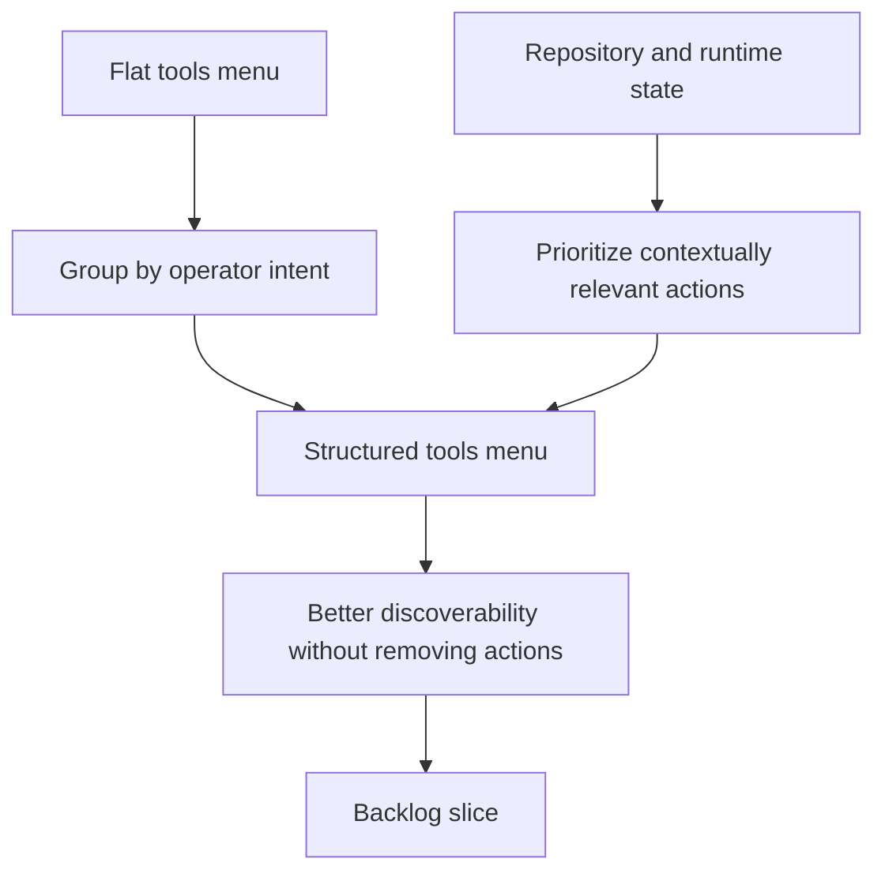

## req_112_restructure_the_tools_menu_information_architecture_without_moving_actions_out_of_the_menu - Restructure the tools menu information architecture without moving actions out of the menu
> From version: 1.16.0
> Schema version: 1.0
> Status: Ready
> Understanding: 92%
> Confidence: 90%
> Complexity: Medium
> Theme: UI
> Reminder: Update status/understanding/confidence and references when you edit this doc.

# Needs
- Reduce the scan cost of the tools menu so operators can find the right action without reading a long flat list.
- Keep every existing action inside the tools menu while giving the menu a clearer information architecture.
- Make the menu reflect user intent and repository state instead of presenting all commands as equally primary.

# Context
- The current tools menu is rendered as a single uninterrupted column of actions:
  - [logicsWebviewHtml.ts](/Users/alexandreagostini/Documents/cdx-logics-vscode/src/logicsWebviewHtml.ts#L110)
- The current styling treats the panel as a simple list with uniform items and no section labels, separators, or hierarchy:
  - [toolbar.css](/Users/alexandreagostini/Documents/cdx-logics-vscode/media/css/toolbar.css#L188)
- The current open and close behavior already supports a dedicated menu surface, so the issue is primarily information architecture and menu rendering rather than interaction plumbing:
  - [webviewChrome.js](/Users/alexandreagostini/Documents/cdx-logics-vscode/media/webviewChrome.js#L301)
- The menu currently mixes several kinds of actions in one flat sequence:
  - day-to-day workflow actions such as `New Request` and `Select Agent`
  - hybrid assist actions such as `Suggest Next Step`, `Assess Diff Risk`, and `Validation Checklist`
  - environment and runtime diagnostics such as `Check Environment`, `Check Hybrid Runtime`, and `Hybrid Insights`
  - setup and maintenance actions such as `Bootstrap Logics`, `Update Logics Kit`, `Publish Global Codex Kit`, `Fix Logics`, and project-root changes
- The desired direction is to improve structure without moving common actions out of the menu. This request does not ask for a toolbar redesign or for promoting frequent actions into separate persistent buttons.
- A better menu should still preserve discoverability for advanced and maintenance actions, but it should no longer force the user to parse the whole command inventory line by line.

# Acceptance criteria
- AC1: The tools menu is reorganized into clear sections or groups based on operator intent, such as workflow actions, assist actions, runtime or diagnostics, workspace controls, and setup or maintenance.
- AC2: All existing tools-menu actions remain available inside the menu; the redesign must not depend on moving frequent actions out into the toolbar or another persistent surface.
- AC3: The menu introduces visible hierarchy, such as section headers, separators, or equivalent grouping cues, so users can scan categories before scanning individual commands.
- AC4: The menu supports a contextual priority model inside the menu itself, such as a `Recommended` or state-aware top section, so the most relevant actions for the current repository state can surface first without hiding the rest.
- AC5: Labels and ordering are refined so long or overlapping command names become easier to parse, while preserving the meaning of destructive, diagnostic, and maintenance actions.
- AC6: Disabled or unavailable actions remain understandable inside the new structure, including clear visual treatment and preserved discoverability for why an action is unavailable.
- AC7: The resulting menu remains accessible and usable in narrow plugin widths, with keyboard navigation and visual hierarchy that still work in constrained layouts.
- AC8: Regression coverage exists for the menu structure or rendering contract so the grouped information architecture does not silently collapse back into a flat unordered list.

# Scope
- In:
  - redesigning the tools menu information architecture
  - grouping, ordering, and relabeling actions where needed
  - adding section headers, separators, or equivalent hierarchy cues
  - supporting a contextual `Recommended` or equivalent top section within the menu
  - preserving disabled-state clarity and narrow-width usability
  - adding regression coverage for the rendering contract
- Out:
  - moving actions out of the menu into the toolbar
  - redesigning the main board or details-panel action areas
  - changing the underlying host commands unless menu organization requires small compatibility adjustments
  - introducing a full command palette replacement inside the webview

# Proposed IA direction
- Keep every existing action in the tools menu.
- Introduce menu sections with a stable order such as:
  - `Recommended`
  - `Workflow`
  - `Assist`
  - `Runtime`
  - `Workspace`
  - `Kit`
  - `Maintenance`
- Let `Recommended` be state-aware:
  - missing or incomplete setup: show `Bootstrap Logics`, `Check Environment`, `Change Project Root`
  - degraded runtime: show `Check Hybrid Runtime`, `Hybrid Insights`
  - normal healthy state: show `New Request`, `Suggest Next Step`, `Triage Item`
- Shorten labels where useful without losing meaning, for example:
  - `Create Companion Doc` -> `Companion Doc`
  - `Check Environment` -> `Environment`
  - `Check Hybrid Runtime` -> `Hybrid Runtime`
  - `Summarize Validation` -> `Validation Summary`
  - `Use Workspace Root` -> `Reset Project Root`

# Dependencies and risks
- Dependency: the final grouping should align with the extension's actual command model so the menu wording stays truthful.
- Dependency: the narrow plugin width remains a hard constraint, so section labels and row spacing must not make the menu harder to use on small layouts.
- Risk: too many sections can become as noisy as a flat list if the grouping is overdesigned or too granular.
- Risk: a state-aware `Recommended` section can feel unstable if the ordering changes too aggressively between refreshes.
- Risk: relabeling commands too aggressively can hide the technical intent of maintenance actions that advanced users already know by name.

# AC Traceability
- AC1 -> grouped menu by intent. Proof: the request explicitly requires section-based organization such as workflow, assist, runtime, workspace, and maintenance.
- AC2 -> all actions stay in the menu. Proof: the request explicitly forbids solving the problem by moving frequent actions out of the menu.
- AC3 -> visible hierarchy. Proof: the request explicitly requires section headers, separators, or equivalent cues.
- AC4 -> contextual priority inside the menu. Proof: the request explicitly requires a `Recommended` or state-aware top section.
- AC5 -> clearer labels and ordering. Proof: the request explicitly requires menu labels and sequence to become easier to scan.
- AC6 -> disabled-state clarity. Proof: the request explicitly requires unavailable actions to remain understandable inside the new structure.
- AC7 -> constrained-width usability and accessibility. Proof: the request explicitly requires narrow-layout and keyboard-usage quality.
- AC8 -> regression protection. Proof: the request explicitly requires coverage for the structured rendering contract.

# Definition of Ready (DoR)
- [x] Problem statement is explicit and user impact is clear.
- [x] Scope boundaries (in/out) are explicit.
- [x] Acceptance criteria are testable.
- [x] Dependencies and known risks are listed.

# Companion docs
- Product brief(s): (none yet)
- Architecture decision(s): (none yet)

# AI Context
- Summary: Redesign the tools menu as a grouped, state-aware menu that keeps every action inside the menu but improves scanability, hierarchy, and contextual prioritization.
- Keywords: tools menu, information architecture, grouping, recommended actions, hierarchy, narrow layout, menu UX, discoverability
- Use when: Use when planning or implementing the tools-menu redesign, grouping strategy, menu labels, or contextual prioritization logic.
- Skip when: Skip when the work is about moving actions into the toolbar or redesigning unrelated screens.

# References
- [logicsWebviewHtml.ts](/Users/alexandreagostini/Documents/cdx-logics-vscode/src/logicsWebviewHtml.ts)
- [toolbar.css](/Users/alexandreagostini/Documents/cdx-logics-vscode/media/css/toolbar.css)
- [webviewChrome.js](/Users/alexandreagostini/Documents/cdx-logics-vscode/media/webviewChrome.js)
- `logics/request/req_113_show_updated_timestamps_in_activity_cells.md`

# Backlog
- `item_199_restructure_the_tools_menu_information_architecture_without_moving_actions_out_of_the_menu`
