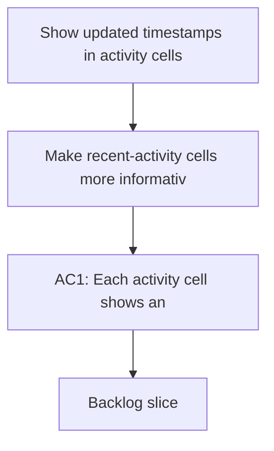

## req_113_show_updated_timestamps_in_activity_cells - Show updated timestamps in activity cells
> From version: 1.16.0
> Schema version: 1.0
> Status: Done
> Understanding: 95%
> Confidence: 93%
> Complexity: Low
> Theme: UI
> Reminder: Update status/understanding/confidence and references when you edit this doc.

# Needs
- Make recent-activity cells more informative by showing when the item was last updated.
- Align the activity panel with the rest of the UI, where `Updated` is already exposed in board previews and in the details panel.
- Improve quick triage from the activity panel without forcing the user to open details first.

# Context
- The activity panel currently renders each entry with a title and one condensed metadata line, but it does not expose the item's `Updated` information:
  - [webviewChrome.js](/Users/alexandreagostini/Documents/cdx-logics-vscode/media/webviewChrome.js#L142)
- The board preview already shows `Updated`, which makes the activity panel feel less informative than adjacent surfaces:
  - [renderBoard.js](/Users/alexandreagostini/Documents/cdx-logics-vscode/media/renderBoard.js#L477)
- The details panel also shows `Updated`, so the data already exists and is part of the current item model:
  - [renderDetails.js](/Users/alexandreagostini/Documents/cdx-logics-vscode/media/renderDetails.js#L354)
- The request is specifically about the activity cells. It does not ask for a broader redesign of the activity panel or of timestamp formatting across the whole extension unless a small consistency adjustment is needed.

# Acceptance criteria
- AC1: Each activity cell shows an `Updated` value in addition to the existing title and metadata, using the item data already available in the activity panel.
- AC2: The displayed `Updated` information is formatted consistently with the intended activity-panel density, so it is readable in narrow layouts without making each cell visually heavy.
- AC3: The new `Updated` information does not regress click, double-click, keyboard navigation, or existing activity-panel selection behavior.
- AC4: Empty or invalid timestamps degrade gracefully, without rendering broken text or collapsing the activity cell layout.
- AC5: Regression coverage exists for the activity-panel rendering so future changes do not remove or break the `Updated` information.

# Scope
- In:
  - showing `Updated` inside activity cells
  - choosing a compact but readable presentation for that field in the activity panel
  - preserving current activity interactions and layout behavior
  - adding targeted regression coverage
- Out:
  - redesigning the full activity panel information architecture
  - changing unrelated board-card or details-panel layouts
  - introducing new item metadata beyond `Updated`

# Dependencies and risks
- Dependency: the activity entries must continue to derive from the existing indexed `updatedAt` data path.
- Dependency: the chosen display format should stay compatible with the current constrained panel width.
- Risk: adding too much metadata to each activity row could reduce scanability if the layout is not kept compact.
- Risk: inconsistent date formatting between activity, board preview, and details could create a new UI mismatch if the formatting rule is not chosen intentionally.

# AC Traceability
- AC1 -> visible updated field in activity cells. Proof: the request explicitly requires `Updated` to appear in each activity cell.
- AC2 -> compact readable presentation. Proof: the request explicitly requires narrow-layout readability.
- AC3 -> no interaction regressions. Proof: the request explicitly preserves click, double-click, keyboard, and selection behavior.
- AC4 -> graceful fallback. Proof: the request explicitly requires safe behavior for empty or invalid timestamps.
- AC5 -> regression protection. Proof: the request explicitly requires targeted rendering coverage.

# Definition of Ready (DoR)
- [x] Problem statement is explicit and user impact is clear.
- [x] Scope boundaries (in/out) are explicit.
- [x] Acceptance criteria are testable.
- [x] Dependencies and known risks are listed.

# Companion docs
- Product brief(s): (none yet)
- Architecture decision(s): (none yet)

# AI Context
- Summary: Add the `Updated` information to activity-panel cells so recent activity becomes more informative and consistent with board preview and details surfaces.
- Keywords: activity panel, updated, timestamp, recent activity, UI consistency, metadata, narrow layout
- Use when: Use when planning or implementing the activity-cell update display and its related tests.
- Skip when: Skip when the work is about broader activity-panel redesign or unrelated menu and toolbar changes.

# References
- [webviewChrome.js](/Users/alexandreagostini/Documents/cdx-logics-vscode/media/webviewChrome.js)
- [renderBoard.js](/Users/alexandreagostini/Documents/cdx-logics-vscode/media/renderBoard.js)
- [renderDetails.js](/Users/alexandreagostini/Documents/cdx-logics-vscode/media/renderDetails.js)
- [tests/webview.harness-core.test.ts](/Users/alexandreagostini/Documents/cdx-logics-vscode/tests/webview.harness-core.test.ts)
- [toolbar.css](/Users/alexandreagostini/Documents/cdx-logics-vscode/media/css/toolbar.css)
- `logics/request/req_112_restructure_the_tools_menu_information_architecture_without_moving_actions_out_of_the_menu.md`

# Backlog
- `item_200_show_updated_timestamps_in_activity_cells`
- `logics/backlog/item_200_show_updated_timestamps_in_activity_cells.md`
