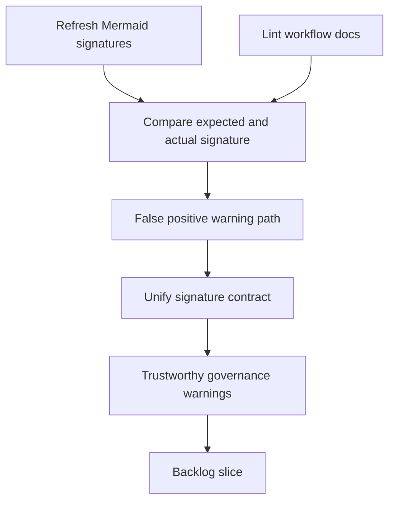

## req_114_fix_false_positive_mermaid_signature_warnings_after_signature_refresh - Fix false positive Mermaid signature warnings after signature refresh
> From version: 1.16.0
> Schema version: 1.0
> Status: Ready
> Understanding: 92%
> Confidence: 90%
> Complexity: Medium
> Theme: Governance
> Reminder: Update status/understanding/confidence and references when you edit this doc.

# Needs
- Stop the Logics doc linter from reporting Mermaid signature warnings immediately after the repository refresh command has supposedly repaired them.
- Restore trust in workflow governance warnings so maintainers can distinguish real drift from tool false positives.
- Make the `refresh-mermaid-signatures` command and the linter use a consistent contract for what counts as a current signature.

# Context
- The current linter warns when the Mermaid signature comment differs from the expected derived signature:
  - [logics_lint.py](/Users/alexandreagostini/Documents/cdx-logics-vscode/logics/skills/logics-doc-linter/scripts/logics_lint.py#L255)
- The repository also exposes a command that rewrites Mermaid signatures across workflow docs:
  - [logics_flow.py](/Users/alexandreagostini/Documents/cdx-logics-vscode/logics/skills/logics-flow-manager/scripts/logics_flow.py#L1328)
- During today's work, several newly created requests still produced `Mermaid context signature is stale` warnings after a successful refresh command had rewritten the signature line to the same expected value.
- That means either:
  - the linter and refresh code derive signatures from slightly different input,
  - the linter compares against different normalized content than the refresher writes,
  - or the warning path is stale for another reason that the current UX does not expose.
- This issue is small in isolation, but it degrades the whole documentation workflow because it trains maintainers to ignore warnings that look like governance drift.

# Acceptance criteria
- AC1: Refreshing Mermaid signatures and linting the same unchanged workflow doc no longer produces a stale-signature warning when the doc content already matches the refreshed signature contract.
- AC2: The linter and the signature-refresh command derive their expected signature from the same normalized source inputs, or the difference is made explicit and intentional in code.
- AC3: Regression coverage exists for at least one workflow doc fixture that used to reproduce the false positive.
- AC4: The resulting warning behavior remains precise enough to still catch genuinely stale Mermaid signatures.
- AC5: The repo exposes a reproducible developer path for validating the fix, such as a targeted command or test flow that demonstrates refresh plus lint consistency.

# Scope
- In:
  - diagnosing the linter versus refresher mismatch
  - aligning signature derivation or normalization
  - preserving legitimate stale-signature detection
  - adding targeted regression coverage
- Out:
  - redesigning the broader Mermaid generation model
  - changing unrelated workflow lint warnings
  - refactoring workflow docs that are not needed to reproduce the mismatch

# Dependencies and risks
- Dependency: the signature generation logic and lint validation logic may currently live in separate modules with subtly different normalization rules.
- Dependency: regression coverage should stay lightweight and deterministic.
- Risk: relaxing the comparison too much could hide genuinely stale diagrams.
- Risk: fixing only one code path without proving round-trip behavior could leave the false positive intact under slightly different doc shapes.

# AC Traceability
- AC1 -> refresh plus lint consistency. Proof: the request explicitly requires the false positive to disappear on unchanged docs after refresh.
- AC2 -> unified signature contract. Proof: the request explicitly requires both code paths to derive from the same normalized inputs.
- AC3 -> regression coverage. Proof: the request explicitly requires a reproducing fixture or equivalent test.
- AC4 -> real stale signatures still caught. Proof: the request explicitly preserves genuine warning behavior.
- AC5 -> reproducible developer validation. Proof: the request explicitly requires a clear validation path.

# Definition of Ready (DoR)
- [x] Problem statement is explicit and user impact is clear.
- [x] Scope boundaries (in/out) are explicit.
- [x] Acceptance criteria are testable.
- [x] Dependencies and known risks are listed.

# Companion docs
- Product brief(s): (none yet)
- Architecture decision(s): (none yet)

# AI Context
- Summary: Fix the mismatch between Mermaid signature refresh and lint validation so the repo stops producing false positive stale-signature warnings.
- Keywords: mermaid, signature, linter, refresh, false positive, governance, workflow docs
- Use when: Use when diagnosing or fixing Mermaid signature drift detection and its regression coverage.
- Skip when: Skip when the work is about Mermaid visual rendering rather than signature validation.

# References
- [logics_lint.py](/Users/alexandreagostini/Documents/cdx-logics-vscode/logics/skills/logics-doc-linter/scripts/logics_lint.py)
- [logics_flow.py](/Users/alexandreagostini/Documents/cdx-logics-vscode/logics/skills/logics-flow-manager/scripts/logics_flow.py)
- `logics/request/req_104_harden_repository_maintenance_guardrails_revealed_by_project_audit.md`
- `logics/request/req_111_normalize_workflow_progress_indicators_and_close_placeholder_debt_in_completed_docs.md`

# Backlog
- `item_201_fix_false_positive_mermaid_signature_warnings_after_signature_refresh`
