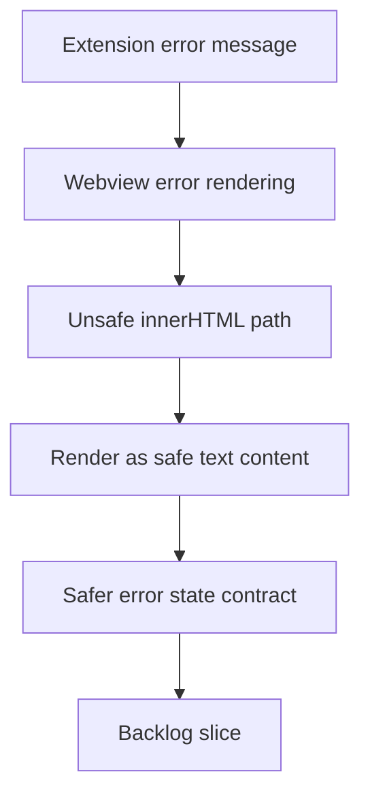

## req_115_sanitize_webview_error_rendering_instead_of_injecting_raw_error_html - Sanitize webview error rendering instead of injecting raw error HTML
> From version: 1.16.0
> Schema version: 1.0
> Status: Done
> Understanding: 92%
> Confidence: 90%
> Complexity: Medium
> Theme: Security
> Reminder: Update status/understanding/confidence and references when you edit this doc.

# Needs
- Remove direct HTML injection from the webview error state.
- Ensure repository paths, configuration values, and other error text can be displayed safely without being interpreted as markup.
- Keep the existing error UX simple while making the rendering path defensible from a security perspective.

# Context
- The current webview error path writes `payload.error` directly into `innerHTML`:
  - [main.js](/Users/alexandreagostini/Documents/cdx-logics-vscode/media/main.js#L857)
- Those error strings are currently populated from extension-side messages that may contain workspace paths or user-controlled configuration values:
  - [logicsViewProvider.ts](/Users/alexandreagostini/Documents/cdx-logics-vscode/src/logicsViewProvider.ts#L206)
- Even if the current callers are mostly benign, this is still the wrong rendering primitive for plain text errors. It creates unnecessary XSS-style exposure inside the webview and makes future error sources riskier by default.
- The current UI only needs to show a text message and clear the details area. There is no clear product requirement for rich HTML in this error state.
- This request is about the rendering contract, not about redesigning the whole empty or error state presentation.

# Acceptance criteria
- AC1: Webview error states render message text without injecting raw HTML from `payload.error`.
- AC2: Error messages containing paths, angle brackets, or other markup-like characters display correctly as text.
- AC3: The error-state UX remains readable and preserves current behavior for clearing or resetting dependent UI sections.
- AC4: Regression coverage exists for the error rendering path, including a payload that would have been unsafe or misleading under `innerHTML`.
- AC5: The resulting implementation does not introduce a parallel unsafe error-rendering helper elsewhere in the same webview flow.

# Scope
- In:
  - replacing raw HTML error injection with safe text rendering
  - preserving existing error-state behavior and layout
  - adding regression coverage for unsafe-looking payloads
  - checking nearby error helpers for the same anti-pattern
- Out:
  - redesigning the broader webview visual language
  - converting all HTML generation in the webview to a new framework
  - reworking extension-side error semantics unless needed for safe rendering

# Dependencies and risks
- Dependency: the current error state may still need minimal structure such as a wrapper element, but the message itself should remain plain text.
- Dependency: tests should run in the existing harness without requiring a browser stack change.
- Risk: a naive fix could remove useful styling if the wrapper structure is not preserved.
- Risk: only fixing one call site without checking nearby error helpers could leave the same issue elsewhere.

# AC Traceability
- AC1 -> safe message rendering. Proof: the request explicitly replaces raw HTML injection.
- AC2 -> special-character safety. Proof: the request explicitly requires correct display for path and markup-like text.
- AC3 -> no UX regression. Proof: the request explicitly preserves current readable error-state behavior.
- AC4 -> regression protection. Proof: the request explicitly requires a harness case for unsafe-looking payloads.
- AC5 -> no duplicate unsafe helper. Proof: the request explicitly requires nearby paths to be checked for the same pattern.

# Definition of Ready (DoR)
- [x] Problem statement is explicit and user impact is clear.
- [x] Scope boundaries (in/out) are explicit.
- [x] Acceptance criteria are testable.
- [x] Dependencies and known risks are listed.

# Companion docs
- Product brief(s): (none yet)
- Architecture decision(s): (none yet)

# AI Context
- Summary: Replace the raw-HTML webview error rendering path with safe text rendering so workspace- and config-derived error messages cannot be interpreted as markup.
- Keywords: webview, security, innerHTML, error state, sanitization, safe text rendering
- Use when: Use when hardening the webview error path or writing tests around unsafe-looking error payloads.
- Skip when: Skip when the work is about generic UI polish unrelated to rendering safety.

# References
- [main.js](/Users/alexandreagostini/Documents/cdx-logics-vscode/media/main.js)
- [logicsViewProvider.ts](/Users/alexandreagostini/Documents/cdx-logics-vscode/src/logicsViewProvider.ts)
- `logics/request/req_104_harden_repository_maintenance_guardrails_revealed_by_project_audit.md`
- `logics/request/req_107_harden_agent_registry_yaml_parsing_against_malicious_skill_manifests.md`

# Backlog
- `item_202_sanitize_webview_error_rendering_instead_of_injecting_raw_error_html`
