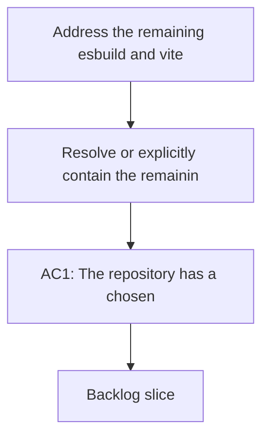

## req_116_address_the_remaining_esbuild_and_vite_audit_advisory_in_the_toolchain - Address the remaining esbuild and vite audit advisory in the toolchain
> From version: 1.16.0
> Schema version: 1.0
> Status: Done
> Understanding: 95%
> Confidence: 93%
> Complexity: Medium
> Theme: Security
> Reminder: Update status/understanding/confidence and references when you edit this doc.

# Needs
- Resolve or explicitly contain the remaining `esbuild` and `vite` audit advisory still reported by the repository toolchain.
- Prevent the repo from fixing only the `yaml` advisory while leaving the build and test stack in a still-known vulnerable state.
- Choose a maintainable path forward even if the cleanest fix requires a controlled Vitest or Vite upgrade.

# Context
- `npm audit --audit-level=moderate` still reports a moderate advisory through the `vite` and `vitest` dependency chain:
  - transitive path through `vite`, `vite-node`, and `@vitest/mocker`
  - vulnerable package family rooted in `esbuild`
- The current fix suggestion from npm indicates that a full auto-fix would likely move the repo to a breaking `vitest` version, so this is not a trivial patch-only dependency bump.
- The repository now has a separate request for audit-policy enforcement, but policy alone does not resolve the underlying toolchain state. This request is specifically about the remaining technical remediation or explicitly governed exception path for the `esbuild` and `vite` family.
- The right answer may be one of:
  - a safe direct upgrade path within the current test stack,
  - a coordinated Vite and Vitest upgrade with compatibility fixes,
  - or a time-bounded documented exception if a safe upgrade cannot land immediately.
- This request is about the build and test toolchain contract, not about unrelated application dependencies.

# Acceptance criteria
- AC1: The repository has a chosen and testable strategy for the remaining `esbuild` and `vite` advisory, either through dependency remediation or through an explicit temporary exception path with documented rationale.
- AC2: If remediation is chosen, the required Vite, Vitest, or related dependency updates land with passing compile, test, smoke, and packaging validation.
- AC3: If an exception path is chosen temporarily, the repo records the scope, rationale, and expiry or follow-up condition instead of leaving the advisory as an undocumented known issue.
- AC4: Contributor guidance and audit expectations reflect the chosen strategy so maintainers know whether the advisory is supposed to be fixed now or tracked as an explicit exception.
- AC5: Regression coverage or validation evidence exists to keep the upgraded or exception-governed toolchain from drifting silently.

# Scope
- In:
  - investigating the remaining `esbuild` and `vite` advisory path
  - updating Vite, Vitest, or adjacent packages if needed
  - documenting and validating a governed exception if immediate remediation is unsafe
  - aligning audit expectations with the chosen outcome
- Out:
  - unrelated dependency refreshes with no connection to the advisory
  - broad refactors of app code not required by the toolchain change
  - replacing the entire test framework without a specific need

# Dependencies and risks
- Dependency: the clean fix may require a non-trivial Vitest or Vite upgrade with minor breaking changes.
- Dependency: CI, smoke checks, and packaging must stay green after the chosen change.
- Risk: a partial upgrade can leave the advisory unresolved while also destabilizing the test stack.
- Risk: an undocumented exception would undermine the new audit-policy work by leaving a known issue without an explicit contract.

# AC Traceability
- AC1 -> chosen strategy exists. Proof: the request explicitly requires remediation or an explicit temporary exception.
- AC2 -> validated upgrade path. Proof: the request explicitly requires compile, test, smoke, and packaging validation if dependencies move.
- AC3 -> documented exception. Proof: the request explicitly requires rationale and follow-up if remediation is deferred.
- AC4 -> contributor clarity. Proof: the request explicitly requires guidance and audit expectations to match the chosen strategy.
- AC5 -> anti-drift evidence. Proof: the request explicitly requires validation evidence or regression protection.

# Definition of Ready (DoR)
- [x] Problem statement is explicit and user impact is clear.
- [x] Scope boundaries (in/out) are explicit.
- [x] Acceptance criteria are testable.
- [x] Dependencies and known risks are listed.

# Companion docs
- Product brief(s): (none yet)
- Architecture decision(s): (none yet)

# AI Context
- Summary: Resolve or explicitly govern the remaining `esbuild` and `vite` advisory in the repo toolchain, including any required Vite or Vitest upgrade path and validation work.
- Keywords: esbuild, vite, vitest, audit, dependency advisory, toolchain, upgrade, exception
- Use when: Use when planning or implementing the remaining build and test toolchain remediation after audit-policy work.
- Skip when: Skip when the work is about unrelated package upgrades.

# References
- [package.json](/Users/alexandreagostini/Documents/cdx-logics-vscode/package.json)
- [ci.yml](/Users/alexandreagostini/Documents/cdx-logics-vscode/.github/workflows/ci.yml)
- [audit.yml](/Users/alexandreagostini/Documents/cdx-logics-vscode/.github/workflows/audit.yml)
- `logics/request/req_110_make_the_security_audit_workflow_block_on_actionable_vulnerabilities.md`
- `logics/request/req_117_resume_modularization_of_oversized_core_extension_and_workflow_modules.md`

# Backlog
- `item_203_address_the_remaining_esbuild_and_vite_audit_advisory_in_the_toolchain`
- `logics/backlog/item_203_address_the_remaining_esbuild_and_vite_audit_advisory_in_the_toolchain.md`
