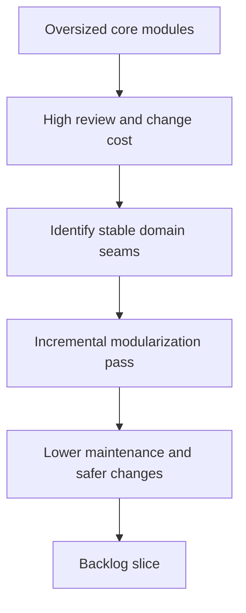

## req_117_resume_modularization_of_oversized_core_extension_and_workflow_modules - Resume modularization of oversized core extension and workflow modules
> From version: 1.16.0
> Schema version: 1.0
> Status: Done
> Understanding: 92%
> Confidence: 90%
> Complexity: Medium
> Theme: Architecture
> Reminder: Update status/understanding/confidence and references when you edit this doc.

# Needs
- Reduce the maintenance cost of the largest remaining extension and workflow modules.
- Make future UI, governance, and runtime changes cheaper by splitting oversized files along clearer domain boundaries.
- Continue the modularization effort in a deliberate way instead of waiting for more features to accumulate on already large files.

# Context
- The repository still contains several large central modules, including:
  - [src/logicsViewProvider.ts](/Users/alexandreagostini/Documents/cdx-logics-vscode/src/logicsViewProvider.ts)
  - [media/main.js](/Users/alexandreagostini/Documents/cdx-logics-vscode/media/main.js)
  - [logics_flow.py](/Users/alexandreagostini/Documents/cdx-logics-vscode/logics/skills/logics-flow-manager/scripts/logics_flow.py)
  - [logics_flow_hybrid.py](/Users/alexandreagostini/Documents/cdx-logics-vscode/logics/skills/logics-flow-manager/scripts/logics_flow_hybrid.py)
- These files are not currently broken, but they concentrate too much behavior in single edit surfaces and increase the cost of review, testing, and low-risk change isolation.
- The project has already done earlier modularization passes in some areas, so the remaining work should build on existing seams rather than restart from scratch.
- The request is intentionally architectural and incremental. It does not ask for a big-bang rewrite, a framework migration, or a purely aesthetic file split with no ownership rationale.

# Acceptance criteria
- AC1: The next modularization pass identifies explicit target files and the domain seams that justify splitting them, rather than treating file size alone as the reason to extract code.
- AC2: The chosen split plan is incremental and bounded, so each resulting backlog slice can land without a risky big-bang rewrite.
- AC3: The work preserves current behavior with validation appropriate to each extracted surface, especially for the extension provider flow, webview runtime flow, and workflow-manager CLI flow.
- AC4: The resulting module boundaries improve ownership clarity, such as separating orchestration, rendering, state selection, command dispatch, or shared utility concerns.
- AC5: The repo gains regression confidence or test coverage where modularization would otherwise make behavior drift easy to miss.

# Scope
- In:
  - identifying and prioritizing oversized modules for the next pass
  - defining bounded seams for extension, webview, and workflow-manager code
  - planning incremental extraction order
  - preserving behavior and validation during splits
- Out:
  - rewriting the product around a new frontend framework
  - splitting files solely to satisfy arbitrary line-count goals
  - broad architecture churn unrelated to the identified oversized surfaces

# Dependencies and risks
- Dependency: existing tests and smoke checks must keep covering the affected behavior as seams move.
- Dependency: some modules may need small preparatory refactors before safe extraction is possible.
- Risk: superficial splits can move complexity around without improving ownership or readability.
- Risk: trying to modularize too many surfaces in one pass can create broad regressions with weak attribution.

# AC Traceability
- AC1 -> seam-driven plan. Proof: the request explicitly requires domain seams, not just file size, to drive extraction.
- AC2 -> incremental delivery. Proof: the request explicitly forbids a risky big-bang rewrite.
- AC3 -> preserved behavior. Proof: the request explicitly requires validation for provider, webview, and workflow-manager flows.
- AC4 -> clearer module ownership. Proof: the request explicitly names orchestration, rendering, state, dispatch, and utility separation as the target outcome.
- AC5 -> regression confidence. Proof: the request explicitly requires tests or validation support for the split surfaces.

# Definition of Ready (DoR)
- [x] Problem statement is explicit and user impact is clear.
- [x] Scope boundaries (in/out) are explicit.
- [x] Acceptance criteria are testable.
- [x] Dependencies and known risks are listed.

# Companion docs
- Product brief(s): (none yet)
- Architecture decision(s): (none yet)

# AI Context
- Summary: Resume the repo's modularization effort for oversized core modules with bounded seam-driven splits across the extension, webview, and workflow-manager surfaces.
- Keywords: modularization, architecture, large files, seams, extension, webview, workflow manager, refactor
- Use when: Use when planning or implementing the next bounded modularization pass for core repo surfaces.
- Skip when: Skip when the work is about feature delivery with no structural ownership change.

# References
- [src/logicsViewProvider.ts](/Users/alexandreagostini/Documents/cdx-logics-vscode/src/logicsViewProvider.ts)
- [media/main.js](/Users/alexandreagostini/Documents/cdx-logics-vscode/media/main.js)
- [logics_flow.py](/Users/alexandreagostini/Documents/cdx-logics-vscode/logics/skills/logics-flow-manager/scripts/logics_flow.py)
- [logics_flow_hybrid.py](/Users/alexandreagostini/Documents/cdx-logics-vscode/logics/skills/logics-flow-manager/scripts/logics_flow_hybrid.py)
- `logics/request/req_104_harden_repository_maintenance_guardrails_revealed_by_project_audit.md`
- `logics/request/req_116_address_the_remaining_esbuild_and_vite_audit_advisory_in_the_toolchain.md`

# Backlog
- `item_204_resume_modularization_of_oversized_core_extension_and_workflow_modules`
