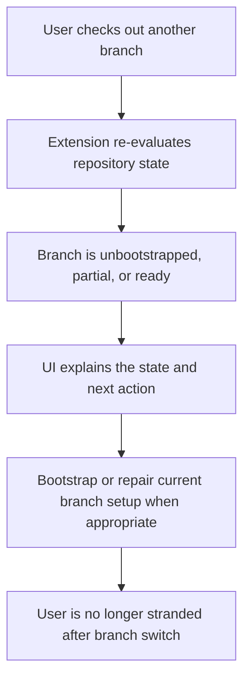

## req_118_handle_branch_switches_to_branches_without_logics_bootstrap_and_offer_setup_repair - Handle branch switches to branches without Logics bootstrap and offer setup repair
> From version: 1.17.0
> Schema version: 1.0
> Status: Draft
> Understanding: 93%
> Confidence: 91%
> Complexity: Medium
> Theme: Bootstrap resilience and branch-aware recovery
> Reminder: Update status/understanding/confidence and references when you edit this doc.

# Needs
- Prevent the plugin from feeling broken when a user switches to a git branch that does not yet contain the Logics bootstrap.
- Make branch-local absence of `logics/` or `logics/skills` an explicit supported state with clear remediation instead of a stuck or misleading UI state.
- Allow the operator to repair or bootstrap the current branch setup directly from the plugin when the branch should carry Logics.
- Keep the setup-repair path distinct from broader broken-kit or non-canonical-kit situations so recovery guidance stays operationally correct.

# Context
- A repository can be healthy on one branch and uninitialized on another because the Logics bootstrap is committed in branch history, not stored outside git.
- In that scenario the current operator experience is easy to misread:
  - the extension may have just been working on the previous branch;
  - after checkout, the selected root can suddenly lose `logics/`, `logics/skills`, or workflow directories;
  - the user lands in a state that feels blocked even though the plugin should be able to explain and often repair it.
- The current repository-state model already knows how to represent missing or partial bootstrap states:
  - [logicsEnvironment.ts](/Users/alexandreagostini/Documents/cdx-logics-vscode/src/logicsEnvironment.ts#L96)
  - [logicsEnvironment.ts](/Users/alexandreagostini/Documents/cdx-logics-vscode/src/logicsEnvironment.ts#L206)
- The current provider prompting model is root-scoped rather than branch-scoped:
  - `bootstrapPromptedRoots` suppresses repeated bootstrap prompts per root, which is reasonable for one branch but too coarse once branch contents diverge:
  - [logicsViewProvider.ts](/Users/alexandreagostini/Documents/cdx-logics-vscode/src/logicsViewProvider.ts#L41)
  - [logicsViewProvider.ts](/Users/alexandreagostini/Documents/cdx-logics-vscode/src/logicsViewProvider.ts#L1235)
- The current file watching strategy refreshes on `logics/**/*`, `.claude/**/*`, and `logics.yaml`, but the request should leave room for a branch-aware detection mechanism such as `.git/HEAD` or an equivalent git-state probe:
  - [extension.ts](/Users/alexandreagostini/Documents/cdx-logics-vscode/src/extension.ts#L28)
- The desired product behavior is not "pretend every branch should already have Logics". It is:
  - detect that the branch state changed;
  - classify the current branch setup honestly;
  - offer the right next action, including repair/bootstrap when appropriate.
- This request also explicitly covers the setup-fix path requested by operators: when the branch should carry Logics but currently does not, the plugin should help restore a supported setup instead of only reporting an error.

# Acceptance criteria
- AC1: The extension detects or re-evaluates repository state after a branch switch or equivalent git-state change so stale "ready" assumptions do not persist when the current branch no longer contains Logics.
- AC2: When the current branch lacks `logics/` or otherwise falls back to `missing-logics`, `missing-kit`, or `partial-bootstrap`, the UI surfaces that as a branch/setup state with actionable guidance rather than as an unexplained broken state.
- AC3: The operator can trigger a supported repair path for the current branch from that degraded state, including bootstrap when `logics/` is absent and repair when the branch has an incomplete supported setup.
- AC4: Bootstrap or repair guidance remains branch-aware enough that a prompt dismissed on one branch does not suppress the needed remediation prompt forever for the same repository root after checkout to a different branch state.
- AC5: The experience distinguishes branch-local uninitialized state from non-canonical or malformed kit state so the plugin does not offer the wrong automation path.
- AC6: The request leaves room for the repair flow to recreate the current branch setup safely by re-adding the canonical kit and rerunning the supported bootstrap steps when that branch should contain Logics.
- AC7: Regression coverage exists for the branch-switch scenario, including at minimum:
  - previously ready branch -> checkout to branch without `logics/`;
  - previously ready branch -> checkout to branch with partial bootstrap;
  - branch-switch remediation prompt and repair availability.

# Scope
- In:
  - branch-aware repository-state refresh for bootstrap-related states
  - UX and messaging for branch-local uninitialized or partially initialized setup
  - setup repair/bootstrap affordances for the current branch
  - prompt-suppression semantics that no longer strand the user after checkout
  - regression tests around branch-switch state transitions and recovery
- Out:
  - forcing every branch in every repository to carry Logics
  - automatic cherry-picking or merging of bootstrap commits across branches
  - redesigning unrelated global Codex kit publication behavior
  - broad support for arbitrary non-canonical `logics/skills` layouts beyond existing policy

# Dependencies and risks
- Dependency: the repository-state model in the extension remains the source of truth for `missing-logics`, `missing-kit`, `partial-bootstrap`, and `ready` handling.
- Dependency: bootstrap and repair flows must keep honoring the canonical `logics/skills` setup policy already enforced elsewhere in the extension.
- Risk: if branch-change detection is too implicit or too delayed, users may still see stale UI and misclassify the plugin as broken.
- Risk: if prompt suppression remains keyed only by repository root, the product can keep hiding the one remediation prompt the operator actually needs after checkout.
- Risk: over-automating branch repair could create unwanted changes on branches where Logics is intentionally absent; the UX must keep operator intent explicit.
- Risk: collapsing branch-local absence into "broken setup" could route users toward the wrong recovery path and make diagnostics noisier.

# Clarifications
- This request is about branch-aware state and recovery semantics, not about changing the core bootstrap format.
- The request intentionally includes the ability to fix the setup of the current branch when that branch should be Logics-enabled.
- A first implementation can satisfy the request without building deep git-branch UX as long as the extension reliably re-evaluates branch-related state changes and exposes the right repair action.
- "Fix setup" in this request means restoring a supported branch-local Logics state, not repairing every possible custom repository arrangement.

# References
- [extension.ts](/Users/alexandreagostini/Documents/cdx-logics-vscode/src/extension.ts)
- [logicsViewProvider.ts](/Users/alexandreagostini/Documents/cdx-logics-vscode/src/logicsViewProvider.ts)
- [logicsEnvironment.ts](/Users/alexandreagostini/Documents/cdx-logics-vscode/src/logicsEnvironment.ts)
- [logicsProviderUtils.ts](/Users/alexandreagostini/Documents/cdx-logics-vscode/src/logicsProviderUtils.ts)
- `logics/request/req_065_harden_partial_logics_bootstrap_recovery_when_workflow_directories_are_missing.md`
- `logics/request/req_077_adapt_logics_bootstrap_and_environment_checks_to_codex_workspace_overlays.md`
- `logics/request/req_109_replace_coarse_bootstrap_detection_with_canonical_kit_inspection.md`

# AC Traceability
- AC1 -> branch-aware state refresh. Proof: the request explicitly requires re-evaluation after branch or git-state change.
- AC2 -> clear degraded-state UX. Proof: the request explicitly requires branch/setup guidance for missing or partial bootstrap states.
- AC3 -> setup repair path. Proof: the request explicitly requires a supported repair/bootstrap action from the degraded branch state.
- AC4 -> prompt behavior corrected. Proof: the request explicitly requires prompt suppression not to strand users across branch changes.
- AC5 -> correct routing between uninitialized and malformed states. Proof: the request explicitly requires those states to stay distinct.
- AC6 -> safe current-branch restoration. Proof: the request explicitly leaves room for canonical re-bootstrap or repair on the active branch.
- AC7 -> regression protection. Proof: the request explicitly requires coverage for branch-switch transitions and remediation.

# Definition of Ready (DoR)
- [x] Problem statement is explicit and user impact is clear.
- [x] Scope boundaries (in/out) are explicit.
- [x] Acceptance criteria are testable.
- [x] Dependencies and known risks are listed.

# Companion docs
- Product brief(s): (none yet)
- Architecture decision(s): (none yet)

# AI Context
- Summary: Make the extension branch-aware for Logics bootstrap state so checkout to an unbootstrapped branch surfaces clear setup guidance and a supported repair path.
- Keywords: branch switch, bootstrap, repair, setup fix, missing logics, partial bootstrap, git state, recovery, extension UX
- Use when: Use when planning or implementing branch-aware bootstrap detection, degraded-state messaging, or current-branch setup repair in the VS Code extension.
- Skip when: Skip when the work is only about global Codex kit publication or unrelated workflow features.

# Backlog
- `item_205_detect_and_refresh_logics_bootstrap_state_after_git_branch_switches`
- `item_206_make_branch_local_bootstrap_recovery_and_setup_repair_explicit_in_the_plugin_ux`
- `item_207_add_regression_coverage_for_branch_switch_bootstrap_degradation_and_repair`
