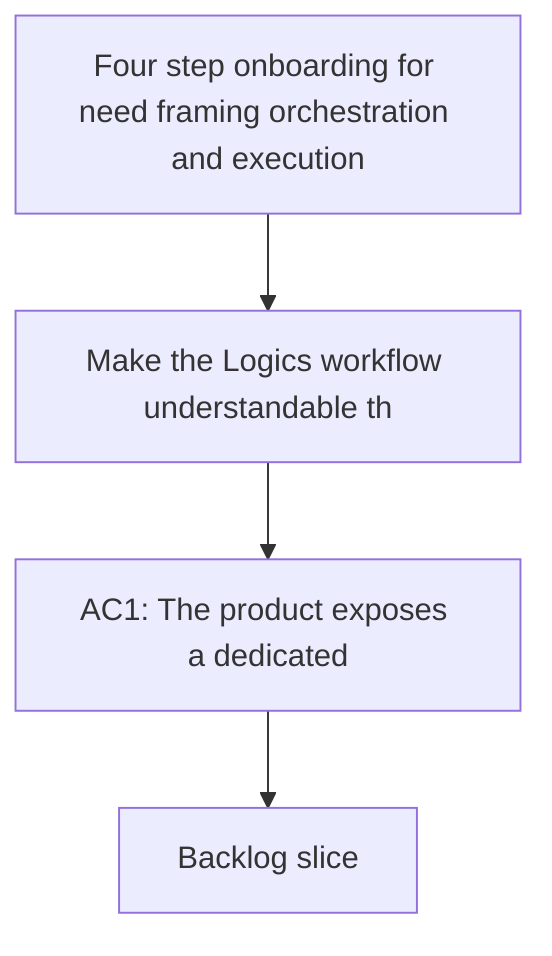

## req_119_three_step_onboarding_for_need_framing_and_execution - Three step onboarding for need framing and execution
> From version: 1.18.1 (refreshed)
> Schema version: 1.0
> Status: Done
> Understanding: 100% (refreshed)
> Confidence: 100% (refreshed)
> Complexity: Medium
> Theme: Workflow
> Reminder: Update status/understanding/confidence and references when you edit this doc.

# Needs
- Make the Logics workflow understandable through a one-shot onboarding screen that presents four visible steps: Need, Framing, Orchestration Tasks, and Execution.
- Reduce the need for users to know the internal request to backlog to task protocol before they can start using the system correctly.
- Keep the first slice focused on first-run or post-update onboarding, wording, and workflow visibility rather than on full auto orchestration.

# Context
- The current repository already exposes guided request and workflow actions in the plugin, but the entry model is still action-first rather than mental-model-first:
  - `media/toolsPanelLayout.js`
  - `src/logicsViewProvider.ts`
  - `src/logicsViewDocumentController.ts`
- The plugin already uses dedicated webview panels for secondary product surfaces such as Hybrid Insights, so a one-shot onboarding screen can follow an established interaction pattern instead of being forced into the main board:
  - `src/logicsViewProvider.ts`
- The canonical Logics workflow remains request, backlog, task, plus companion docs and assist flows:
  - `logics/instructions.md`
  - `logics/skills/logics-flow-manager/SKILL.md`
- The product gap is not missing power. The gap is that a user must still infer how the workflow hangs together before understanding when to create a request, when to refine, and when to execute.
- Because this is onboarding rather than an everyday work surface, it should be something the operator reads once at first use or after a meaningful update, then dismisses and optionally reopens later.
- This request intentionally does not introduce full end-to-end auto orchestration yet. That wider direction is captured separately in a product brief so the first delivery slice can stay bounded and testable.

# Acceptance criteria
- AC1: The product exposes a dedicated onboarding screen that presents four clearly labeled stages: Need, Framing, Orchestration Tasks, and Execution.
- AC2: Each stage includes short operator-facing copy that explains its purpose without requiring prior knowledge of request, backlog, task, or companion-doc terminology.
- AC3: The onboarding screen exposes the main actions that let an operator start or continue the workflow, such as creating a request or asking for the next step.
- AC4: The onboarding model maps cleanly to the existing Logics workflow primitives without renaming or replacing the canonical internal document structure.
- AC5: The onboarding screen can be shown on first plugin use or after a relevant product update without becoming a permanent everyday surface.
- AC6: The implementation scope stays limited to onboarding and workflow comprehension; full auto orchestration remains explicitly out of scope for this request.

# Scope
- In:
  - onboarding wording and information architecture around Need, Framing, Orchestration Tasks, and Execution
  - a dedicated one-shot onboarding webview surface
  - first-run or update-triggered exposure of the onboarding surface
  - presentation of the key workflow actions inside that onboarding surface
  - mapping between the visible four-step model and the internal Logics workflow
  - documentation or UI copy that reduces protocol exposure for first-use understanding
- Out:
  - full auto orchestration of request to backlog to task to execution
  - autonomy modes such as fast lane, safe, or full auto
  - Git checkpoint strategy redesign
  - changing the canonical Logics request, backlog, task structure
  - turning onboarding into a permanent board-level surface

# Dependencies and risks
- Dependency: the onboarding surface must fit the existing plugin webview patterns and not conflict with current workflow actions and naming.
- Dependency: the visible model must stay aligned with the canonical Logics flow so onboarding does not teach a misleading abstraction.
- Dependency: first-run and update-trigger rules must be predictable enough that the screen feels helpful rather than random.
- Risk: oversimplifying the workflow could hide important distinctions and create confusion once a user leaves the onboarding layer.
- Risk: exposing the four steps in too many places at once could add UI noise without actually improving first-use comprehension.
- Risk: if the onboarding screen reappears too often after updates, it will feel like interruption rather than guidance.
- Risk: if the onboarding copy sounds more autonomous than the current product behavior, users may expect automation that does not yet exist.

# AC Traceability
- AC1 -> dedicated onboarding surface. Proof: the request explicitly requires a one-shot onboarding screen with Need, Framing, Orchestration Tasks, and Execution.
- AC2 -> operator-facing clarity. Proof: the request explicitly requires short copy that does not assume protocol knowledge.
- AC3 -> visible action model. Proof: the request explicitly requires key workflow actions to be exposed inside onboarding.
- AC4 -> internal workflow consistency. Proof: the request explicitly keeps request, backlog, and task as the canonical internal structure.
- AC5 -> first-run or update lifecycle. Proof: the request explicitly frames the screen as first-use or post-update onboarding rather than a permanent surface.
- AC6 -> bounded scope. Proof: the request explicitly excludes full auto orchestration from this initial slice.

# Definition of Ready (DoR)
- [x] Problem statement is explicit and user impact is clear.
- [x] Scope boundaries (in/out) are explicit.
- [x] Acceptance criteria are testable.
- [x] Dependencies and known risks are listed.

# Companion docs
- Product brief(s): `prod_004_logics_auto_orchestration_vision`
- Architecture decision(s): (none yet)
# AI Context
- Summary: Add a simple four-step onboarding model so users understand Logics as Need, Framing, Orchestration Tasks, and Execution before they have to learn the internal workflow protocol.
- Keywords: onboarding, workflow, need, framing, execution, first run, update screen, webview, workflow comprehension
- Use when: Use when designing or implementing first-use or post-update onboarding messaging, onboarding copy, or a dedicated onboarding webview.
- Skip when: Skip when the work is specifically about deeper orchestration automation, Git policy, or internal workflow mutation behavior.

# References
- `logics/instructions.md`
- `logics/skills/logics-flow-manager/SKILL.md`
- `logics/product/prod_004_logics_auto_orchestration_vision.md`
- `src/logicsViewProvider.ts`
- `src/logicsViewDocumentController.ts`
- `media/toolsPanelLayout.js`
- `.claude/agents/logics-flow-manager.md`
- `.claude/agents/logics-hybrid-delivery-assistant.md`

# Backlog
- `item_208_define_the_three_step_onboarding_model_and_operator_copy`
- `item_209_add_the_three_step_onboarding_model_to_guided_request_entry_surfaces_and_validate_workflow_alignment`
