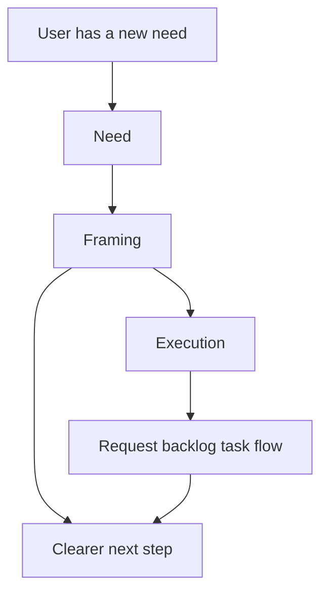

## req_119_three_step_onboarding_for_need_framing_and_execution - Three step onboarding for need framing and execution
> From version: 1.18.0
> Schema version: 1.0
> Status: Draft
> Understanding: 95%
> Confidence: 92%
> Complexity: Medium
> Theme: Workflow
> Reminder: Update status/understanding/confidence and references when you edit this doc.

# Needs
- Make the Logics workflow understandable at entry through three visible steps: Need, Framing, and Execution.
- Reduce the need for users to know the internal request to backlog to task protocol before they can start using the system correctly.
- Keep the first slice focused on onboarding, wording, and workflow visibility rather than on full auto orchestration.

# Context
- The current repository already exposes guided request and workflow actions in the plugin, but the entry model is still action-first rather than mental-model-first:
  - `media/toolsPanelLayout.js`
  - `src/logicsViewProvider.ts`
  - `src/logicsViewDocumentController.ts`
- The canonical Logics workflow remains request, backlog, task, plus companion docs and assist flows:
  - `logics/instructions.md`
  - `logics/skills/logics-flow-manager/SKILL.md`
- The product gap is not missing power. The gap is that a user must still infer how the workflow hangs together before understanding when to create a request, when to refine, and when to execute.
- This request intentionally does not introduce full end-to-end auto orchestration yet. That wider direction is captured separately in a product brief so the first delivery slice can stay bounded and testable.

# Acceptance criteria
- AC1: The product exposes three clearly labeled onboarding stages: Need, Framing, and Execution.
- AC2: Each stage includes short operator-facing copy that explains its purpose without requiring prior knowledge of request, backlog, task, or companion-doc terminology.
- AC3: The onboarding model maps cleanly to the existing Logics workflow primitives without renaming or replacing the canonical internal document structure.
- AC4: At least one current entry surface used by operators makes the three-step model visible where new workflow actions are initiated.
- AC5: The implementation scope stays limited to onboarding and workflow comprehension; full auto orchestration remains explicitly out of scope for this request.

# Scope
- In:
  - onboarding wording and information architecture around Need, Framing, and Execution
  - placement of the model in existing user entry surfaces
  - mapping between the visible three-step model and the internal Logics workflow
  - documentation or UI copy that reduces protocol exposure for first-use understanding
- Out:
  - full auto orchestration of request to backlog to task to execution
  - autonomy modes such as fast lane, safe, or full auto
  - Git checkpoint strategy redesign
  - changing the canonical Logics request, backlog, task structure

# Dependencies and risks
- Dependency: the three-step onboarding must fit the existing plugin surfaces and not conflict with current workflow actions and naming.
- Dependency: the visible model must stay aligned with the canonical Logics flow so onboarding does not teach a misleading abstraction.
- Risk: oversimplifying the workflow could hide important distinctions and create confusion once a user leaves the onboarding layer.
- Risk: exposing the three steps in too many places at once could add UI noise without actually improving first-use comprehension.
- Risk: if the onboarding copy sounds more autonomous than the current product behavior, users may expect automation that does not yet exist.

# AC Traceability
- AC1 -> visible model. Proof: the request explicitly requires Need, Framing, and Execution to appear as clearly labeled stages.
- AC2 -> operator-facing clarity. Proof: the request explicitly requires short copy that does not assume protocol knowledge.
- AC3 -> internal workflow consistency. Proof: the request explicitly keeps request, backlog, and task as the canonical internal structure.
- AC4 -> real entry integration. Proof: the request explicitly requires the model to appear in at least one current operator entry surface.
- AC5 -> bounded scope. Proof: the request explicitly excludes full auto orchestration from this initial slice.

# Definition of Ready (DoR)
- [x] Problem statement is explicit and user impact is clear.
- [x] Scope boundaries (in/out) are explicit.
- [x] Acceptance criteria are testable.
- [x] Dependencies and known risks are listed.

# Companion docs
- Product brief(s): `prod_004_logics_auto_orchestration_vision`
- Architecture decision(s): (none yet)
# AI Context
- Summary: Add a simple three-step onboarding model so users understand Logics as Need, Framing, and Execution before they have to learn the internal workflow protocol.
- Keywords: onboarding, workflow, need, framing, execution, guided request, product entry, workflow comprehension
- Use when: Use when designing or implementing first-use workflow messaging, onboarding copy, or information architecture around Logics entry surfaces.
- Skip when: Skip when the work is specifically about deeper orchestration automation, Git policy, or internal workflow mutation behavior.

# References
- `logics/instructions.md`
- `logics/skills/logics-flow-manager/SKILL.md`
- `logics/product/prod_004_logics_auto_orchestration_vision.md`
- `src/logicsViewProvider.ts`
- `src/logicsViewDocumentController.ts`
- `media/toolsPanelLayout.js`
- `.claude/agents/logics-flow-manager.md`
- `.claude/agents/logics-hybrid-delivery-assistant.md`

# Backlog
- `item_208_define_the_three_step_onboarding_model_and_operator_copy`
- `item_209_add_the_three_step_onboarding_model_to_guided_request_entry_surfaces_and_validate_workflow_alignment`
