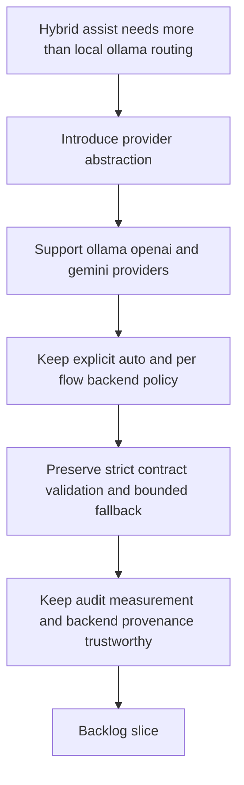

## req_120_add_openai_and_gemini_provider_dispatch_to_the_hybrid_assist_runtime - Add OpenAI and Gemini provider dispatch to the hybrid assist runtime
> From version: 1.18.0
> Schema version: 1.0
> Status: In progress
> Understanding: 98%
> Confidence: 97%
> Complexity: High
> Theme: Hybrid assist provider abstraction, remote API dispatch, and backend policy expansion
> Reminder: Update status/understanding/confidence and references when you edit this doc.

# Needs
- Let the shared hybrid assist runtime dispatch bounded assist flows through `OpenAI API` and `Gemini API`, not only through the current `Ollama` local path or `Codex` fallback path.
- Keep provider choice explicit and reviewable so operators can route flows to local, remote, or fallback backends without ambiguous behavior.
- Ensure provider usage is capability-gated:
  - if `Ollama`, `OpenAI API`, or `Gemini API` is not configured or not healthy, the runtime must not keep retrying or probing them on every operator action as if they were viable;
  - when no optional provider is ready, the workflow should stay on the existing safe path such as `Codex`, or on `Claude`-driven consumer flows where Claude is the active operator surface.
- Keep the secret and config model clean:
  - API keys should come from environment variables, with a local non-committed `.env` as a practical developer source when needed;
  - non-secret behavior such as enabled providers, default models, fallback order, and readiness cooldown belongs in `logics.yaml`, not in secret files.
- Keep the plugin action surface compact:
  - the `Tools` menu should not gain one action per provider;
  - provider state and selection should stay grouped under a small runtime-management surface rather than leaking transport choices into every workflow action.
- Preserve the current safety model:
  - strict flow contracts;
  - validated structured outputs;
  - bounded fallback behavior;
  - visible backend provenance in audit and measurement logs.
- Make the observability surfaces evolve with the provider model, especially `Hybrid Insights`, so local, remote, deterministic, and fallback execution are still easy to understand after provider expansion.
- Avoid coupling provider support to one transport-specific implementation, so future providers can be added without another round of `if backend == ...` branching through the runtime.

# Context
- The shared hybrid assist runtime already has a useful contract model for bounded flows such as `commit-message`, `triage`, `validation-summary`, `suggest-split`, `review-checklist`, and related commands.
- Today, backend selection is still transport-specific:
  - `logics/skills/logics-flow-manager/scripts/logics_flow_hybrid.py` exposes backend choices centered on `auto`, `ollama`, `codex`, and `deterministic`;
  - probing and execution are routed through `probe_ollama_backend(...)` and `run_ollama_hybrid(...)`;
  - `logics/skills/logics-flow-manager/scripts/logics_flow.py` then branches directly on those concrete backend names.
- That shape worked for the first local-first rollout, but it is now too narrow for the desired operator model:
  - `Ollama` should remain the local runtime option;
  - `OpenAI API` should be available as a direct remote provider;
  - `Gemini API` should be available as a direct remote provider;
  - `Codex` should remain a bounded fallback or policy-routed execution path where appropriate.
- The main design risk is not adding HTTP calls. The main risk is expanding providers without preserving the current contract and observability discipline.
- The runtime therefore needs a provider abstraction rather than a second or third special-case transport path.
- The provider abstraction also needs an explicit readiness model:
  - configured versus missing credentials;
  - reachable versus unreachable endpoint;
  - healthy versus degraded model availability;
  - cooldown or cached unavailability state so repeated operator actions do not re-trigger obviously unavailable providers every time.
- The configuration contract should also stay explicit and low-risk:
  - `OPENAI_API_KEY` and `GEMINI_API_KEY` come from environment variables;
  - a local `.env` may be supported as a convenience source for those variables, but must remain uncommitted and outside the canonical repo config;
  - `logics.yaml` should hold only non-secret provider behavior such as enablement flags, model selection, fallback order, and readiness or cooldown tuning;
  - plugin-specific secure storage such as VS Code `SecretStorage` may be added later as an alternate secret source, but should still hydrate the same runtime-facing environment contract rather than inventing a second provider-config model.
- The reporting layer also needs to stop assuming that “local versus codex” is the whole story:
  - `Hybrid Insights` should be able to show provider distribution across `ollama`, `openai`, `gemini`, `codex`, and `deterministic`;
  - degraded and fallback reporting should remain provider-aware;
  - the runtime status and plugin-facing insights should explain when a provider is absent, skipped, or actually used.
- The plugin navigation should reflect that same abstraction:
  - workflow actions such as `triage`, `commit-all`, `validation-summary`, or `suggest-split` should remain provider-agnostic and default to policy-driven `auto`;
  - runtime/provider management should live in one compact `System`-side surface such as `AI Runtime`, `AI Providers`, and `Hybrid Insights`, instead of adding separate `Use OpenAI`, `Use Gemini`, or `Use Ollama` tool actions.
- The desired end state is a shared runtime where operators and downstream clients can express provider intent explicitly, for example:
  - forcing a flow to `openai`;
  - forcing a flow to `gemini`;
  - keeping `auto` policy-based;
  - preserving deterministic and Codex-only paths where those are still the right safety choice;
  - falling back immediately to `codex` or staying on `Claude` consumer paths when no optional provider is configured and healthy.

# Acceptance criteria
- AC1: The shared hybrid assist runtime supports provider dispatch to `OpenAI API` and `Gemini API` in addition to the existing local `Ollama` path, without requiring either remote provider to be tunneled through Ollama.
- AC2: Backend selection is refactored around a provider abstraction instead of direct Ollama-specific branching, so probing, execution, and degraded-mode reporting can work across multiple providers through one shared contract.
- AC3: Operator-facing commands support explicit provider selection for bounded hybrid-assist flows, including at minimum:
  - `auto`;
  - `ollama`;
  - `openai`;
  - `gemini`;
  - `codex` where the flow or policy still permits it.
- AC4: The runtime can authenticate and configure `OpenAI API` and `Gemini API` through repository-safe or environment-based configuration surfaces, including clear handling for missing credentials, invalid models, or unreachable endpoints.
- AC4a: The secret and config contract is separated cleanly:
  - API keys are read from environment variables;
  - a local `.env` can be used as a convenience source for those variables without being committed;
  - `logics.yaml` stores only non-secret provider behavior such as enablement, model defaults, fallback order, and readiness tuning.
- AC4b: The runtime maintains a provider-readiness gate so unavailable optional providers are not treated as candidates on every invocation:
  - missing credentials or disabled providers do not trigger live calls;
  - known-unhealthy providers can be skipped for a bounded cooldown or equivalent cached-unavailable period;
  - when no optional provider is viable, the runtime routes directly to the safe fallback path instead of repeatedly attempting dead providers first.
- AC5: Existing hybrid flow contracts remain the source of truth:
  - provider-specific transports must still return structured payloads validated by the shared flow contract;
  - degraded or invalid remote responses must still fall back safely according to the existing bounded policy model.
- AC6: Backend policy remains explicit per flow, so the runtime can define which flows are:
  - deterministic only;
  - provider-routable under `auto`;
  - Codex-only;
  - or eligible for ordered fallback such as `ollama -> openai -> codex` or equivalent policy-driven variants.
- AC7: Observability remains trustworthy after provider expansion:
  - audit records show requested backend, actual backend used, degraded reasons, and transport/provider details;
  - measurement records distinguish local, remote, deterministic, and fallback execution paths;
  - runtime-status can report provider availability separately instead of collapsing all provider failures into one generic degraded bucket;
  - status output makes clear when providers are skipped because they are unconfigured, disabled, in cooldown, or currently unhealthy.
- AC7b: `Hybrid Insights` and adjacent reporting surfaces are updated for the multi-provider model:
  - provider usage charts or summaries distinguish `ollama`, `openai`, `gemini`, `codex`, and `deterministic`;
  - fallback and degraded summaries remain intelligible after provider expansion;
  - the operator can tell whether cost or latency shifts come from remote providers versus local-model offload.
- AC7c: The plugin `Tools` surface remains compact and operator-readable after provider expansion:
  - provider management is grouped under a runtime-oriented surface rather than split into one tool action per provider;
  - workflow actions remain provider-agnostic by default and continue to route through policy-driven `auto`;
  - when provider setup is missing or unhealthy, the menu can surface a compact runtime-management affordance without turning provider choice into toolbar clutter.
- AC8: Validation covers at minimum:
  - provider selection and policy routing for `openai` and `gemini`;
  - missing-credential and unreachable-provider behavior;
  - contract validation and bounded fallback after invalid remote payloads;
  - regression coverage proving existing `ollama`, `deterministic`, and `codex` paths still behave correctly.

# Scope
- In:
  - adding provider abstractions to the shared hybrid assist runtime
  - adding direct `OpenAI API` and direct `Gemini API` transports
  - expanding backend selection, probing, and policy routing to include those providers
  - adding config and credential handling for remote providers
  - separating secret handling from non-secret provider behavior, with env-var based keys and `logics.yaml` policy/config
  - adding provider readiness and skip semantics so unavailable providers do not get retried on every action
  - preserving contract validation, bounded fallback, audit, and measurement semantics
  - keeping the plugin `Tools` menu compact with grouped runtime/provider management instead of one action per provider
  - updating `Hybrid Insights` and related reporting surfaces to represent multi-provider execution clearly
  - adding regression tests for new provider paths and old provider compatibility
- Out:
  - redesigning every hybrid-assist flow contract
  - making remote providers mandatory for runtime usage
  - removing `Ollama`, `Codex`, or deterministic paths
  - adding broad UI redesign of plugin surfaces beyond what is needed to expose new provider choices and statuses
  - committing to one specific OpenAI or Gemini model family in this request beyond the need for configurable provider-backed model selection

# Design decisions

- **Fallback order:** Local-first by default (`ollama -> openai -> gemini -> codex`). Flows that benefit from higher quality responses (triage, review-checklist) may override per-flow to `openai -> ollama -> codex` via policy metadata, but this remains opt-in.
- **API surface:** Start with chat/completions (OpenAI) and generateContent (Gemini) only. No function calling or structured output mode — the runtime already validates structured payloads post-response. Native structured output can be added later as an optimization.
- **Rate limiting:** Not needed initially. The readiness gate (AC4b) and cooldown on unhealthy providers are sufficient. A `max_requests_per_minute` option in `logics.yaml` can be added later if cost pressure materializes, without designing for it now.
- **Streaming:** Not in scope. The runtime is synchronous request/response with post-response validation. Streaming adds complexity (partial validation, buffering, timeouts) for flows that typically return 200-500 tokens. Noted as a future extension.
- **`.env` loading:** A minimal inline parser (10-15 lines, `KEY=VALUE` without interpolation) directly in the provider module. No `python-dotenv` dependency — the kit stays stdlib-only. Sufficient for `OPENAI_API_KEY=sk-...` and `GEMINI_API_KEY=...`.
- **Cooldown persistence:** Provider readiness state persisted in `logics/.cache/provider_health.json` with expiration timestamps. The runtime reads it at startup, skips providers in cooldown, and updates after each probe. Default cooldown: 5 minutes, configurable in `logics.yaml`. Integrates with the `logics/.cache/` relocation from req_121 AC16.
- **Sequencing with req_121:** The hybrid module split (req_121 AC13) should land first — it is a natural prerequisite. Adding a provider abstraction into the current monolithic `logics_flow_hybrid.py` would make both changes riskier.

# Dependencies and risks
- Dependency: `req_093` remains the baseline for shared hybrid assist contracts, fallback policy, and audit governance.
- Dependency: `req_097`, `req_102`, `req_103`, and `req_106` remain the current foundation for local-model support, validation hardening, explicit backend policy, and broader hybrid delivery usage.
- Dependency: `logics/skills/logics-flow-manager/scripts/logics_flow_hybrid.py` remains the source of truth for flow contracts, backend policy metadata, validation, fallback shaping, and runtime observability.
- Dependency: `req_121` AC13 (split `logics_flow_hybrid.py` into focused modules) should land before provider abstraction work begins — adding providers into a 2 375-line monolith increases refactor risk.
- Risk: if `OpenAI API` and `Gemini API` are added as special cases rather than through a provider abstraction, backend logic will become harder to extend and reason about.
- Risk: if remote-provider failures are folded into the current Ollama-centric degradation semantics, runtime-status will become noisy or misleading.
- Risk: if provider-specific payload normalization drifts from the shared contract validator, different providers will silently return different result qualities for the same flow.
- Risk: if configuration is under-specified, operators will not know whether a failure comes from missing credentials, unsupported models, policy routing, or transport failure.
- Risk: if secrets and provider behavior are mixed in the same config surface, operators may commit credentials accidentally or end up with contradictory runtime configuration.
- Risk: if `auto` fallback order is expanded without explicit per-flow policy, remote providers may quietly consume cost on flows that should remain deterministic or Codex-routed.
- Risk: if unavailable providers are probed naively on every invocation, operator latency and noise will increase while the runtime repeatedly rediscovers the same missing-setup condition.
- Risk: if readiness caching is too sticky or opaque, a provider that becomes healthy later may remain incorrectly skipped without a clear refresh path.
- Risk: if `Hybrid Insights` stays framed around only local-versus-codex semantics, operators will misread remote-provider adoption, fallback rates, and ROI after OpenAI and Gemini are added.
- Risk: if provider controls are exposed as several first-class `Tools` actions, the menu will become noisier and workflow actions will start leaking implementation detail instead of staying task-oriented.

# AC Traceability
- AC1 -> multi-provider hybrid dispatch. Proof: the request explicitly requires direct OpenAI and Gemini provider support alongside Ollama.
- AC2 -> provider abstraction refactor. Proof: the request explicitly requires refactoring away from direct Ollama-specific branching.
- AC3 -> operator-visible provider selection. Proof: the request explicitly requires command-level support for `auto`, `ollama`, `openai`, `gemini`, and policy-allowed `codex`.
- AC4 -> remote provider configuration and failure semantics. Proof: the request explicitly requires credential, model, and connectivity handling for OpenAI and Gemini.
- AC4a -> secret and config separation. Proof: the request explicitly requires env-var based API keys, optional local `.env` convenience, and `logics.yaml` for non-secret provider behavior only.
- AC4b -> readiness gating and skip behavior. Proof: the request explicitly requires missing or unhealthy providers to be skipped instead of retried on every operator action.
- AC5 -> preserved contract validation and bounded fallback. Proof: the request explicitly requires all provider transports to pass through the shared validation and fallback model.
- AC6 -> explicit per-flow backend policy after expansion. Proof: the request explicitly requires ordered provider fallback or explicit routing to remain policy-driven rather than implicit.
- AC7 -> trustworthy observability with provider detail. Proof: the request explicitly requires audit, measurement, and runtime-status semantics to stay provider-aware and operator-readable.
- AC7b -> multi-provider Hybrid Insights. Proof: the request explicitly requires Insights and adjacent reporting to distinguish the new providers and preserve meaningful fallback and ROI interpretation.
- AC7c -> compact plugin tools-menu integration. Proof: the request explicitly requires grouped runtime/provider management rather than one tool action per provider, while keeping workflow actions provider-agnostic.
- AC8 -> regression and failure-path coverage. Proof: the request explicitly requires tests for provider selection, credential failure, invalid remote payloads, fallback behavior, and legacy-path compatibility.

# Definition of Ready (DoR)
- [x] Problem statement is explicit and user impact is clear.
- [x] Scope boundaries (in/out) are explicit.
- [x] Acceptance criteria are testable.
- [x] Dependencies and known risks are listed.

# Companion docs
- Product brief(s): `prod_001_hybrid_assist_operator_experience_for_repetitive_logics_delivery_flows`
- Architecture decision(s): `adr_011_keep_hybrid_assist_runtime_contracts_shared_backend_agnostic_and_safely_bounded`

# Delivery report
- 2026-04-04: `item_213` completed. The hybrid runtime now routes backend selection and execution through shared provider-abstraction helpers instead of direct Ollama-specific branching inside `_run_hybrid_assist(...)`.
- Per-flow backend policy now exposes ordered provider routing metadata (`provider_order`, `allowed_backends`), which keeps `codex-only`, `deterministic`, and `ollama-first` behavior explicit while preparing `req_120` for direct `openai` and `gemini` transports in the next items.
- Validation remains green after the refactor: `python3 -m unittest tests.test_bootstrapper tests.test_logics_flow -v`.
- 2026-04-04: `item_214` completed. The shared runtime now supports direct `openai` and `gemini` transports, explicit `--backend openai|gemini` selection, minimal `.env` credential loading, and non-secret provider configuration through `logics.yaml`.
- `runtime-status` now surfaces configured provider availability for `ollama`, `openai`, `gemini`, `codex`, and `deterministic`, while the shared assist CLI keeps the same bounded contract validation and fallback behavior across local and remote providers.
- Validation remains green after the transport/config expansion: `python3 -m unittest logics.skills.tests.test_bootstrapper logics.skills.tests.test_logics_flow -v`.
- 2026-04-04: `item_215` completed. The runtime now persists remote-provider health under `logics/.cache/provider_health.json`, skips known-unhealthy providers during a bounded cooldown window, and keeps disabled or unconfigured providers off the live-probe path.
- Cooldown behavior is configurable in `logics.yaml`, and the persisted health entry is ignored automatically when the provider endpoint or model changes, preventing stale skip state after reconfiguration.
- Validation remains green after the readiness-gate addition: `python3 -m unittest logics.skills.tests.test_bootstrapper logics.skills.tests.test_logics_flow -v`.

# AI Context
- Summary: Add direct OpenAI and Gemini provider dispatch to the shared hybrid assist runtime through a provider abstraction that preserves strict flow contracts, explicit backend policy, and trustworthy observability.
- Keywords: hybrid assist, provider abstraction, openai api, gemini api, ollama, codex, claude, backend policy, fallback, contract validation, runtime status, audit, measurement, hybrid insights, provider readiness, cooldown, env, dot env, logics yaml, tools menu, ai providers
- Use when: Use when planning or implementing OpenAI and Gemini support in the shared hybrid runtime, provider-aware backend selection, remote credential handling, env-var and `.env` based secret loading, `logics.yaml` provider policy, multi-provider fallback policy, readiness gating that skips unconfigured and unhealthy providers, Hybrid Insights updates for new provider visibility, or grouped provider management inside the plugin tools menu.
- Skip when: Skip when the work is only about changing one model name, only about plugin UI wording, or only about Ollama installation without adding remote-provider dispatch.

# References
- `logics/request/req_093_add_shared_hybrid_assist_contracts_fallback_policy_activation_rules_and_audit_governance_for_logics_delivery_automation.md`
- `logics/request/req_097_expand_hybrid_local_model_support_beyond_deepseek_with_configurable_qwen_and_deepseek_profiles.md`
- `logics/request/req_102_harden_ollama_hybrid_assist_prompts_and_response_validation_so_local_runs_stop_echoing_the_contract.md`
- `logics/request/req_103_separate_optional_claude_bridge_status_from_hybrid_runtime_degradation_and_expand_ollama_first_dispatch_across_supported_flows.md`
- `logics/request/req_106_expand_deterministic_and_ollama_first_delivery_assist_to_reduce_codex_usage.md`
- `logics/request/req_121_audit_cleanup_fix_code_quality_issues_across_plugin_and_logics_kit.md`
- `logics/skills/logics-flow-manager/scripts/logics_flow.py`
- `logics/skills/logics-flow-manager/scripts/logics_flow_hybrid.py`
- `logics/skills/tests/test_logics_flow.py`
- `src/logicsEnvironment.ts`
- `src/logicsViewProvider.ts`
- `src/logicsWebviewHtml.ts`
- `media/toolsPanelLayout.js`

# Backlog
- `item_213_refactor_hybrid_backend_selection_around_a_provider_abstraction`
- `item_214_add_openai_and_gemini_provider_transports_with_config_and_credential_handling`
- `item_215_add_provider_readiness_gating_and_skip_semantics_for_unconfigured_or_unhealthy_backends`
- `item_216_update_observability_hybrid_insights_and_plugin_tools_surface_for_multi_provider_dispatch`
- `item_217_add_regression_coverage_for_multi_provider_hybrid_dispatch_and_bounded_fallback`
