## req_121_audit_cleanup_fix_code_quality_issues_across_plugin_and_logics_kit - Audit cleanup — fix code quality issues across plugin and Logics kit
> From version: 1.18.0
> Schema version: 1.0
> Status: Ready
> Understanding: 98%
> Confidence: 92%
> Complexity: High
> Theme: Quality
> Reminder: Update status/understanding/confidence and references when you edit this doc.

# Needs
- Resolve all code quality, consistency, and hygiene issues identified during a full audit of both the VS Code plugin (cdx-logics-vscode v1.18.0) and the Logics skills kit (v1.6.2).
- Eliminate duplicated logic, dead code, unsafe casts, and untested surface area in the plugin.
- Harmonize launcher references, entrypoint paths, and conventions across the Logics kit documentation and skills.

# Context

A comprehensive audit was performed on 2026-04-04 covering both projects. The findings fall into two categories:

**Plugin (TypeScript, ~8 500 lines across 17 source files):**
1. Duplicated code — `maybeShowCodexOverlayHandoff` and `launchCodexOverlayTerminal` exist in both `src/logicsViewProvider.ts` and `src/logicsViewDocumentController.ts` with near-identical implementations. Maintenance hazard.
2. Unsafe JSON casts — 8 inline `as { ... }` casts on unvalidated Python backend responses in `src/logicsViewProvider.ts` (lines 698-852). A malformed response silently yields undefined fields instead of a structured error.
3. Dead export — `runPython()` in `src/logicsProviderUtils.ts:463` is exported but never imported anywhere. All callers use `runPythonWithOutput` instead.
4. Fragile dynamic require — `src/gitRuntime.ts:164` uses `require("vscode")` dynamically to support test contexts. Should be refactored to inject the config reader.
5. No test coverage for HTML generators — `src/logicsHybridInsightsHtml.ts` (864 lines), `src/logicsWebviewHtml.ts` (338 lines), `src/logicsReadPreviewHtml.ts` (~180 lines) have zero dedicated tests.
6. Provider file size — `src/logicsViewProvider.ts` at 1 998 lines. Several cohesive groups (bootstrap flow, overlay sync, kit update) could be extracted to reduce cognitive load.
7. Stale VSIX artifacts — 9 old `.vsix` packages (v1.10.3 through v1.16.0, ~12 MB total) remain in the project root directory.

**Logics kit (Python, 47 skills, stdlib-only):**
8. Launcher inconsistency — 34 of 47 SKILL.md files use `python3` instead of the canonical `python` launcher documented in the README and `logics/instructions.md`.
9. Stale entrypoint in instructions — `logics/instructions.md` still references `logics_flow.py` directly instead of the preferred unified entrypoint `logics.py`.
10. Direct `logics_flow.py` references — 3 SKILL.md files (logics-backlog-groomer, logics-task-breakdown, logics-triage-assistant) bypass `logics.py`.
11. Claude bridge inconsistency — `.claude/commands/` and `.claude/agents/` files use `python3` and/or `logics_flow.py` instead of `logics.py`.
12. Wildcard import — `logics_flow.py:64` uses `from logics_flow_support import *`, which hinders static analysis and symbol tracing.
13. Large hybrid module — `logics_flow_hybrid.py` at 2 375 lines could benefit from decomposition as it grows.
14. Empty specs folder — `logics/specs/` contains only `.gitkeep`. The spec workflow is advertised but unused.
15. Missing config file — No `logics.yaml` at repo root; defaults from `logics_flow_config.py` apply silently.
16. Confusing runtime directory — `logics/skills/logics/` (runtime state) inside the submodule shares naming with skill packages, creating confusion.
17. No exhaustive type check on message dispatch — the `onDidReceiveMessage` switch in `src/logicsViewProvider.ts` has 30+ cases with `default: break`. Adding a webview message type without a host handler silently does nothing.

```mermaid
%% logics-kind: request
%% logics-signature: request|audit-cleanup-fix-code-quality-issues-ac|resolve-all-code-quality-consistency-and|ac1-no-duplicated-maybeshowcodexoverlayh
flowchart TD
    Audit[Full audit 2026-04-04] --> PluginFindings[Plugin: 8 findings]
    Audit --> KitFindings[Kit: 9 findings]
    PluginFindings --> P1[Duplicated code extraction]
    PluginFindings --> P2[Runtime JSON validation]
    PluginFindings --> P3[Dead code removal]
    PluginFindings --> P4[Dependency injection for gitRuntime]
    PluginFindings --> P5[HTML generator test coverage]
    PluginFindings --> P6[Provider decomposition]
    PluginFindings --> P7[Stale VSIX cleanup]
    PluginFindings --> P8[Message dispatch exhaustive check]
    KitFindings --> K1[Launcher harmonization x34 skills]
    KitFindings --> K2[Entrypoint refs update]
    KitFindings --> K3[Claude bridge alignment]
    KitFindings --> K4[Wildcard import cleanup]
    KitFindings --> K5[Hybrid module split x3 modules]
    KitFindings --> K6[Specs and config housekeeping]
    P1 --> Done[All 17 findings resolved]
    P2 --> Done
    P3 --> Done
    P4 --> Done
    P5 --> Done
    P6 --> Done
    P7 --> Done
    P8 --> Done
    K1 --> Done
    K2 --> Done
    K3 --> Done
    K4 --> Done
    K5 --> Done
    K6 --> Done
```

# Acceptance criteria
- AC1: No duplicated `maybeShowCodexOverlayHandoff` or `launchCodexOverlayTerminal` — shared logic extracted to a utility module, both callers delegate to it.
- AC2: All hybrid assist JSON responses from the Python backend are validated at runtime via a type guard or validator before use. No bare `as { ... }` casts on external data.
- AC3: The dead `runPython()` export in `src/logicsProviderUtils.ts` is removed.
- AC4: `src/gitRuntime.ts` no longer uses dynamic `require("vscode")`; config reading is injected.
- AC5: At least snapshot-level tests exist for `logicsHybridInsightsHtml.ts`, `logicsWebviewHtml.ts`, and `logicsReadPreviewHtml.ts`.
- AC6: `src/logicsViewProvider.ts` is decomposed into smaller modules where each module has a single identifiable responsibility (target: no module exceeds ~1 000 lines; the real criterion is one module = one cohesive responsibility, not an arbitrary line count).
- AC7: All stale `.vsix` files removed from project root. The existing `.gitignore` rule (`*.vsix`) is verified as present.
- AC8: All 47 SKILL.md files use `python` as the canonical launcher, consistent with README and `logics/instructions.md`. Each SKILL.md that currently hardcodes `python3` is updated to `python`, and the README/instructions include an explicit note: "substitute `python3` or `py -3` according to your environment."
- AC9: `logics/instructions.md` references `logics.py` (not `logics_flow.py`) as the preferred entrypoint.
- AC10: The 3 SKILL.md files (backlog-groomer, task-breakdown, triage-assistant) reference `logics.py` instead of `logics_flow.py`.
- AC11: All `.claude/commands/` and `.claude/agents/` files use `python` and `logics.py` as the canonical launcher and entrypoint.
- AC12: The wildcard `from logics_flow_support import *` in `logics_flow.py` is replaced with explicit imports of the ~15-20 symbols actually used. Remaining symbols stay accessible via `logics_flow_support.xxx` if needed. A grep identifies the effective usage before the change.
- AC13: `logics_flow_hybrid.py` is split into 3 focused modules by responsibility:
  - `logics_flow_hybrid_core.py` — contracts, policy, model resolution, validation (`build_flow_contract`, `validate_hybrid_result`, `build_flow_backend_policy`, etc.)
  - `logics_flow_hybrid_transport.py` — probe, Ollama execution, JSON request, transport failure (`probe_ollama_backend`, `run_ollama_hybrid`, `_json_request`, etc.) — this is where future providers (OpenAI, Gemini) will plug in
  - `logics_flow_hybrid_observability.py` — audit, measurements, ROI, runtime status, insights (`build_hybrid_roi_report`, `build_runtime_status`, `append_jsonl_record`, etc.)
  - `logics_flow_hybrid.py` remains as the public entry point re-exporting public interfaces to avoid breaking existing imports.
- AC14: `logics/specs/` is kept and a `README.md` is added explaining its purpose: "Lightweight functional specs derived from backlog/tasks. Created on demand via logics-spec-writer."
- AC15: A `logics.yaml` file is seeded at repo root with explicit defaults so the effective configuration is visible.
- AC17: The webview message dispatch in `logicsViewProvider.ts` uses a discriminated union type for message types so that missing handlers are caught at compile time instead of silently falling through the `default: break`.
- AC16: The `logics/skills/logics/` runtime directory is relocated to `logics/.cache/` (which already exists with `runtime_index.json`). JSONL audit and measurement files are moved there too. Write paths in `logics_flow_hybrid.py` are updated accordingly. The dot-prefix signals "generated/ignorable" and avoids confusion with skill packages.

# Definition of Ready (DoR)
- [x] Problem statement is explicit and user impact is clear.
- [x] Scope boundaries (in/out) are explicit.
- [x] Acceptance criteria are testable.
- [x] Dependencies and known risks are listed.

# Design decisions

- **AC6 threshold:** ~1 000 lines is an order of magnitude, not a strict gate. The real criterion is one module = one cohesive responsibility. A 900-line bootstrap module that is self-contained is better than an artificial split at 800.
- **AC8 launcher convention:** `python` stays canonical. The README and `instructions.md` already say "substitute `python3` or `py -3` according to your environment" — this note is sufficient. Switching everything to `python3` would break Windows/venv environments where `python` is standard.
- **AC14 specs folder:** Keep it with a short README rather than removing it. The folder is already bootstrapped and the workflow describes it — deleting it to recreate later is churn.
- **AC16 runtime relocation:** Target is `logics/.cache/` which already holds `runtime_index.json`. The dot-prefix signals generated content, and grouping runtime JSONL there avoids the skill-package naming confusion.
- **AC1 extraction target:** New file `src/logicsOverlaySupport.ts` for shared overlay logic (`maybeShowCodexOverlayHandoff`, `launchCodexOverlayTerminal`). Follows existing naming convention (`logicsProviderUtils`, `logicsDocMaintenance`).
- **AC2 validation approach:** Manual type guards, one per flow. No Zod — the project has zero runtime dependencies. Pattern: `function isCommitPlanResult(v: unknown): v is CommitPlanResult { ... }` in a new `src/logicsHybridAssistTypes.ts`. Lightweight and testable.
- **AC7 gitignore:** The rule `*.vsix` already exists at line 5 of `.gitignore`. No addition needed — just delete the stale files.
- **AC12 wildcard scope:** Only the ~15-20 symbols actually used in `logics_flow.py` need explicit imports. Not all 88 exports from `logics_flow_support`. A grep identifies effective usage before the change.
- **AC13 split axis:** Three modules by responsibility — core (contracts/policy/validation), transport (probe/execute/failure), observability (audit/ROI/status). `logics_flow_hybrid.py` stays as re-export facade.
- **AC17 rationale:** The message dispatch has 30+ cases with `default: break`. A discriminated union catches drift at compile time. Low effort, high prevention value.
- **Pass-through wrappers (`runPythonWithOutput`/`runGitWithOutput`):** Not worth an AC. The indirection cost is negligible and they may serve as extension points later. If AC6 restructures imports, the question resolves naturally.
- **Sequencing with req_120:** AC13 (hybrid module split) is a prerequisite for req_120's provider abstraction. It must land before provider work begins.

# Delivery split strategy

Three backlog items by criticality:
- **Item A — Quick wins** (AC3, AC7, AC9, AC10, AC11, AC14, AC15): mechanical changes, low risk, achievable in one session. Goal: reduce noise immediately.
- **Item B — Kit harmonization** (AC8, AC12, AC16): modifications in the submodule requiring an upstream PR. Grouped because they touch the same repo.
- **Item C — Plugin and kit refactors** (AC1, AC2, AC4, AC5, AC6, AC13, AC17): structural refactors with regression risk, requiring test-by-test verification. AC13 (hybrid split) is prioritized as a prerequisite for req_120.

# Risks and dependencies
- AC8/AC10/AC12/AC13/AC16 modify the Logics kit submodule — changes must be contributed upstream to `cdx-logics-kit` and the submodule pointer updated.
- AC6 (provider decomposition) is the highest-risk item: large refactor touching the central file, requires careful test verification.
- AC5 (HTML generator tests) may require JSDOM or snapshot tooling additions.
- AC13 (hybrid module split) is a prerequisite for req_120 (provider abstraction) — sequencing matters.
- Dependency: `logics/request/req_120_add_openai_and_gemini_provider_dispatch_to_the_hybrid_assist_runtime.md` — req_120 depends on AC13 landing first.

# Companion docs
- Product brief(s): (none needed — this is a technical hygiene request)
- Architecture decision(s): (none needed — no new architectural choices)

# AI Context
- Summary: Fix 17 code quality issues found during a full audit of the VS Code plugin and Logics kit: duplicated code, dead exports, unsafe casts, missing tests, message dispatch type safety, launcher inconsistencies, stale artifacts, module decomposition, and runtime directory relocation. Delivery split into 3 items: quick wins, kit harmonization (upstream), and structural refactors. AC13 hybrid split (3 modules: core, transport, observability) is a prerequisite for req_120 provider abstraction.
- Keywords: audit, code quality, dead code, duplication, unsafe casts, test coverage, discriminated union, type guard, launcher, entrypoint, cleanup, refactor, hybrid split, runtime relocation, submodule upstream
- Use when: Planning or executing cleanup work on the plugin or kit code quality, or sequencing req_121 before req_120.
- Skip when: Working on new features, external integrations, or unrelated workflow stages.

# References
- `logics/request/req_120_add_openai_and_gemini_provider_dispatch_to_the_hybrid_assist_runtime.md`
- `src/logicsViewProvider.ts`
- `src/logicsViewDocumentController.ts`
- `src/logicsProviderUtils.ts`
- `src/gitRuntime.ts`
- `src/logicsHybridInsightsHtml.ts`
- `src/logicsWebviewHtml.ts`
- `src/logicsReadPreviewHtml.ts`
- `logics/instructions.md`
- `logics/skills/logics-flow-manager/scripts/logics_flow.py`
- `logics/skills/logics-flow-manager/scripts/logics_flow_hybrid.py`

# Backlog
- `item_210_quick_wins_remove_dead_code_stale_artifacts_and_update_doc_references`
- `item_211_kit_harmonization_launcher_convention_wildcard_import_and_runtime_directory_relocation`
- `item_212_plugin_and_kit_structural_refactors_extract_duplications_add_type_safety_decompose_modules_and_add_html_test_coverage`
