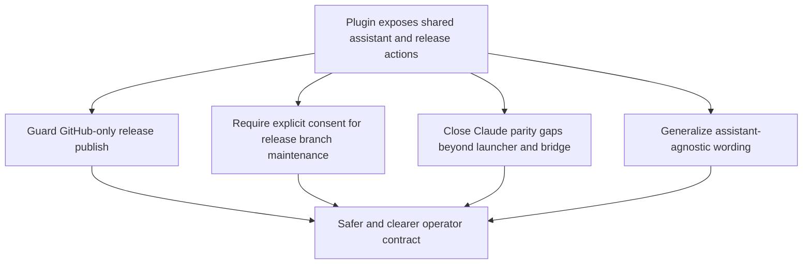

## req_122_harden_release_publish_guards_and_generalize_codex_specific_plugin_surfaces_for_claude_parity - Harden release publish guards and generalize Codex specific plugin surfaces for Claude parity
> From version: 1.21.0
> Schema version: 1.0
> Status: Draft
> Understanding: 96%
> Confidence: 92%
> Complexity: High
> Theme: AI Runtime
> Reminder: Update status/understanding/confidence and references when you edit this doc.

# Needs
- Prevent the plugin from exposing `Publish Release` as a generally available action when the current repository is not actually compatible with the GitHub-based release flow used by the Logics kit.
- Make any future plugin-assisted update of the local `release` branch an explicitly consented operator action instead of an implicit or surprise side effect.
- Close the remaining product and operator gaps between Claude and Codex for shared Logics usage, beyond the already shipped launcher, overlay, and bridge surfaces.
- Replace Codex-specific wording on shared plugin surfaces when the underlying flow also works for Claude or for a generic assistant session.

# Context
The current plugin and shared runtime already support a mixed assistant model:

- the system can launch Codex through the globally published Logics kit;
- the system can launch Claude when the thin bridge files exist;
- the hybrid assist runtime is shared and intentionally backend-agnostic for bounded delivery flows;
- several operator surfaces still expose wording or assumptions that are narrower than the actual supported behavior.

That creates four practical issues:

1. `Publish Release` is presented as a normal Assist action in the plugin even though the current implementation is explicitly GitHub-oriented:
   - the UI says it will publish a GitHub release;
   - the flow ultimately delegates to `gh release create`;
   - no explicit repository-compatibility gate exists before exposing the action.
2. The runtime already computes whether a local `release` branch is stale and can suggest a fast-forward update command, but there is no explicit persisted consent model if the plugin later grows a one-click helper for that branch maintenance.
3. Claude support is still operationally narrower than Codex on several shared plugin surfaces:
   - guided request handoff still copies prompts "for Codex";
   - context-pack previews and session hints are still named `Codex Context Pack`;
   - several UX messages imply Codex is the canonical consumer even when the artifact is assistant-agnostic.
4. Product wording and action naming drift from capability reality:
   - some flows are truly Codex-specific and should stay clearly labeled;
   - other flows are assistant-agnostic and should stop sounding Codex-only.

The request should therefore define a consistent operator contract across:

- GitHub-specific release publication;
- explicit consent for branch-maintenance automation around `release`;
- Claude parity for shared prompt, handoff, and context-pack flows;
- wording that distinguishes assistant-agnostic flows from Codex-specific runtime surfaces.

Out of scope for this request:

- broad Tools-menu IA cleanup beyond the specific surfaces needed for these four points;
- adding new Assist flows that do not already exist in the shared runtime;
- replacing the Codex overlay model itself;
- changing the underlying GitHub release implementation away from `gh`.

# Acceptance criteria
- AC1: The plugin exposes `Publish Release` only when the current repository satisfies an explicit GitHub-release compatibility check. At minimum, that check requires:
  - a valid Git repository context;
  - a GitHub-oriented remote such as `origin` or `upstream` targeting `github.com`;
  - a locally available `gh` CLI for the GitHub release publication path.
- AC2: When the repository is not compatible with GitHub release publication, `Publish Release` remains visible but disabled, with a precise reason, instead of silently disappearing.
- AC3: The release-publish contract distinguishes clearly between:
  - repositories where GitHub release publication is supported;
  - repositories where release preparation may still be useful;
  - repositories where neither flow should be promoted through the plugin UI.
- AC4: If the plugin adds any direct helper that updates or fast-forwards the local `release` branch, that helper is guarded by explicit operator consent that must be granted at least once before automation can run.
- AC5: The consent model for `release` branch maintenance is repository-local, stored in repo configuration such as `logics.yaml`, reviewable by operators, and revocable without editing extension-global settings.
- AC6: The consent covers only the explicit, non-destructive fast-forward maintenance flow for the local `release` branch. It does not imply consent for arbitrary branch mutation, rebases, force operations, or broader release automation.
- AC7: When consent is absent, the plugin does not mutate `release`; it explains the missing consent and falls back to guidance or a manual command path.
- AC8: Shared assistant flows that already work for Claude and Codex stop using Codex-specific wording in the plugin UI, prompt-copy messages, context-pack labels, and session hints. The replacement wording remains clear to operators who are using either assistant.
- AC9: Truly Codex-specific surfaces remain explicitly labeled as Codex-specific. In particular, overlay publication, global-kit publication, and direct Codex launch surfaces must not be ambiguously reworded as if they were generic assistant flows.
- AC10: The request identifies the minimum set of remaining non-overlay, non-bridge Claude parity gaps in the plugin and groups them into one coherent delivery slice, covering at least:
  - guided request handoff copy;
  - context-pack preview and copy actions;
  - session-hint wording;
  - any assistant-selection or prompt-routing text that still assumes Codex as the only consumer.
- AC11: The resulting product wording makes the operator distinction explicit:
  - assistant-agnostic artifacts and prompts use neutral wording such as `Assistant`, `AI assistant`, or `Assistant session`;
  - Codex-only runtime surfaces continue to use `Codex`;
  - Claude-only launcher or bridge surfaces continue to use `Claude`.
- AC12: The Claude parity target for this request is shared-plugin-surface parity only. It covers handoff, context-pack, session-hint, and prompt-routing UX, but does not require Codex overlay publication parity.
- AC13: The request defines the expected UX behavior when GitHub release publish is unavailable but other Assist actions remain valid, so the Tools menu does not imply that the whole Assist portfolio is unavailable just because one GitHub-specific action is gated.
- AC14: The request stays backward-compatible with the existing runtime contracts for `prepare-release` and `publish-release`, limiting required implementation changes to gating, consent, parity, and wording rather than a rewrite of the shared release backend.

# Definition of Ready (DoR)
- [x] Problem statement is explicit and user impact is clear.
- [x] Scope boundaries (in/out) are explicit.
- [x] Acceptance criteria are testable.
- [x] Dependencies and known risks are listed.

# Design decisions
- `Publish Release` remains a GitHub-specific capability until the runtime supports non-GitHub release providers. The correct short-term move is gating and wording accuracy, not pretending the action is generic.
- When GitHub publication is unavailable, `Publish Release` should stay visible but disabled with an explicit reason, because discoverability matters and silent disappearance would reduce operator trust.
- A repository counts as GitHub-compatible only when the plugin can verify both repository intent and executable path: valid Git repo, GitHub-oriented remote, and local `gh` availability.
- `Prepare Release` and `Publish Release` are treated as separate concerns. A repo may be eligible for preparation guidance while still being ineligible for GitHub publication from the plugin.
- Consent for any future automatic `release` branch update should default to repository-local scope rather than a global blanket approval, because branch automation is a repository governance decision.
- The branch-maintenance consent should be stored in repository configuration such as `logics.yaml`, not in VS Code global state, so the decision travels with the project and remains reviewable.
- The branch-maintenance consent covers only the narrow, explicit, non-destructive fast-forward helper for `release`, not arbitrary future branch mutations.
- Assistant-neutral wording should be applied only where the actual artifact or flow is shared. Do not erase explicit product names on genuinely assistant-specific runtime surfaces.
- Default neutral wording should prefer `Assistant`, `AI assistant`, and `Assistant session` on shared surfaces.
- The Claude parity target for this request is UX and workflow parity on shared plugin surfaces, not deep feature parity for Codex overlay publication.

# Scope
In scope:
- GitHub-specific gating for `Publish Release`.
- Explicit consent contract for future direct `release` branch update helpers.
- Claude parity analysis and product-surface alignment beyond launcher and bridge detection.
- Wording cleanup for shared prompt, context-pack, and handoff surfaces that are currently Codex-biased.

Out of scope:
- adding new Assist flows unrelated to release or shared assistant parity;
- redesigning the whole Tools menu information architecture;
- replacing `gh` as the release publication backend;
- removing Codex overlay publication or Codex-specific runtime status surfaces.

# Risks and dependencies
- Dependency: the current release backend still depends on GitHub CLI and GitHub release semantics; the plugin must not obscure that fact.
- Dependency: Claude parity work should preserve the existing thin-bridge model rather than creating a second parallel runtime contract.
- Risk: if the GitHub-compatibility gate is too weak, the plugin may present a publish action that still fails at execution time.
- Risk: if the plugin hides `Publish Release` too aggressively, operators may lose a useful affordance on valid GitHub repos.
- Risk: if wording is generalized too broadly, truly Codex-specific overlay actions may become misleading.
- Risk: if consent for `release` branch maintenance is stored too globally, one repository’s governance preference could leak into another repository’s behavior.
- Risk: if consent is modeled too narrowly or opaquely, future automation may still feel surprising to operators.

# Companion docs
- Product brief(s): `prod_002_plugin_hybrid_assist_runtime_visibility_and_action_ux`
- Architecture decision(s): `adr_012_keep_the_vs_code_plugin_as_a_thin_client_over_shared_hybrid_runtime_commands`

# AI Context
- Summary: Gate GitHub-only release publication correctly in the plugin, define explicit consent before any direct `release` branch maintenance helper can run, close remaining Claude parity gaps on shared plugin surfaces beyond launcher and bridge support, and replace Codex-biased wording where the underlying flow is actually assistant-agnostic.
- Keywords: plugin, release publish, GitHub, gh, release branch, consent, claude parity, codex wording, assistant neutral wording, context pack, guided request, UX contract
- Use when: Use when planning or implementing GitHub release gating, release-branch consent rules, Claude parity work on shared plugin flows, or wording cleanup for assistant-agnostic surfaces.
- Skip when: Skip when the work is only about Tools-menu IA cleanup, adding unrelated assist flows, or changing the backend release implementation itself.

# References
- `src/logicsHybridAssistController.ts`
- `src/logicsWebviewHtml.ts`
- `src/runtimeLaunchers.ts`
- `src/logicsEnvironment.ts`
- `src/logicsViewProvider.ts`
- `src/logicsViewDocumentController.ts`
- `media/renderDetails.js`
- `media/logicsModel.js`
- `media/mainInteractions.js`
- `media/hostApi.js`
- `logics/skills/logics-flow-manager/scripts/logics_flow.py`
- `logics/skills/logics-version-release-manager/scripts/publish_version_release.py`
- `logics/request/req_092_add_a_second_wave_of_hybrid_ollama_or_codex_assist_flows_for_risk_triage_commit_planning_closure_summaries_doc_consistency_checks_and_validation_checklists.md`
- `logics/request/req_093_add_shared_hybrid_assist_contracts_fallback_policy_activation_rules_and_audit_governance_for_logics_delivery_automation.md`
- `logics/request/req_103_separate_optional_claude_bridge_status_from_hybrid_runtime_degradation_and_expand_ollama_first_dispatch_across_supported_flows.md`

# Backlog
- (none yet)
