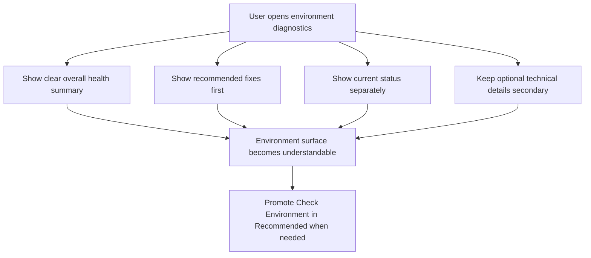

## req_123_make_check_environment_explainable_action_first_and_state_promoted_in_tools - Make Check Environment explainable, action first, and state promoted in Tools
> From version: 1.21.1
> Schema version: 1.0
> Status: Done
> Understanding: 100%
> Confidence: 98%
> Complexity: High
> Theme: UI
> Reminder: Update status/understanding/confidence and references when you edit this doc.

# Needs
- Make `Check Environment` understandable on first read, so operators can immediately tell what is healthy, what is degraded, what is blocking, and what they should do next.
- Stop mixing passive diagnostic lines and actionable remediation entries as if they were equivalent choices in the same interaction model.
- Promote `Check Environment` more clearly from the Tools menu when repository setup, runtime health, or migration state indicates that environment diagnostics are the most useful next action.
- Keep the plugin thin and truthful: the environment surface should explain shared runtime and repository state clearly without inventing a second health model or hiding technical reality.

# Context
The current `Check Environment` flow already surfaces useful repository and runtime state, but the operator experience is still too ambiguous for first-pass understanding:

- the quick pick currently mixes actionable items and passive status rows in one flat list;
- the same visual treatment is used for entries that should be clicked and entries that are only explanatory;
- the menu does not summarize the overall environment state before listing details;
- several diagnostic labels are technically accurate but not sufficiently explicit about impact or next action;
- the Tools menu already has a `Recommended` concept, but `Check Environment` is not always elevated strongly enough when it is the most appropriate recovery or orientation step.

This creates several practical UX problems:

1. Operators can open `Check Environment` and still not know whether they are expected to select something or simply read the list.
2. Important remediation opportunities can be buried among neutral status lines such as workspace root, runtime entrypoint, or version metadata.
3. The current wording often describes a technical fact without clearly answering the operator questions:
   - is this healthy;
   - does this block me;
   - what should I do now;
   - is this optional or required.
4. `Check Environment` is strategically important when:
   - bootstrap is incomplete;
   - Git or Python is missing;
   - the Logics kit is stale or malformed;
   - runtime providers or Claude bridge files are incomplete;
   - hybrid runtime health is degraded.

The request should therefore define a clearer operator contract for environment diagnostics across both the diagnostics surface and the Tools menu entry point:

- diagnostics should become action-first and explanation-first, rather than a flat mixed list;
- the UI should distinguish summary, actionable remediation, current status, and optional technical detail;
- the user should understand when a line is clickable and when a line is just information;
- the Tools menu should promote `Check Environment` into `Recommended` when the detected state makes it the best next step.

This request is related to, but distinct from, the already completed Tools-menu IA work:

- `req_112` covered global menu structure and the existence of a `Recommended` section;
- this request focuses specifically on the understanding, actionability, and state-driven promotion of `Check Environment`.

Out of scope for this request:

- redesigning the entire Tools menu again from scratch;
- moving actions out of the Tools menu into persistent toolbar buttons;
- replacing shared runtime diagnostics with a plugin-only health model;
- adding unrelated assist actions to the menu.

# Acceptance criteria
- AC1: The `Check Environment` surface starts with an explicit overall summary that answers at minimum:
  - whether the environment is healthy, degraded, or blocked;
  - how many issues require attention;
  - whether immediate operator action is recommended.
- AC2: The interaction model clearly distinguishes actionable remediation entries from passive informational entries, so operators can tell which rows are meant to be clicked and which rows are present only for explanation.
- AC3: The first implementation wave may remain in QuickPick form, but it must still deliver a clearer information hierarchy rather than deferring clarity to a future dedicated view.
- AC4: The first visible sections of `Check Environment` follow this order unless there is a stronger accessibility reason to do otherwise:
  - summary;
  - recommended actions;
  - current status;
  - technical details.
- AC5: Each actionable remediation row communicates three things clearly:
  - the problem;
  - the user impact;
  - the proposed next action.
- AC6: Passive diagnostic rows use wording that answers operator intent in plain language, with operator-readable labels first and technical detail second, including whether a state is healthy, degraded, optional, or blocking.
- AC7: The environment surface uses a stable severity model with at least these visible classes:
  - `Blocked`;
  - `Degraded`;
  - `Info`;
  - `Optional`.
- AC8: When the environment is healthy, the top-level summary uses explicit non-alarmist wording such as `Environment healthy - no action required`.
- AC9: The surface distinguishes at least four presentation levels, whether by one screen or multiple views:
  - summary;
  - recommended actions;
  - current status;
  - technical details or supporting notes.
- AC10: `Check Environment` is promoted into the Tools menu `Recommended` section whenever current repository or runtime state suggests it is the most useful next diagnostic or recovery action, including at minimum:
  - incomplete bootstrap or repairable bootstrap convergence;
  - missing Git or Python prerequisites;
  - degraded hybrid runtime or missing provider wiring;
  - missing or incomplete Claude bridge support;
  - repository state that blocks normal workflow actions.
- AC11: Promotion into `Recommended` follows a restrained policy: it happens when a flow is blocked, when runtime health is degraded, or when a clear repair path exists, but not as a permanent top recommendation for healthy repositories.
- AC12: When the environment is healthy, `Check Environment` remains discoverable in Tools but is not over-promoted as if urgent remediation were needed.
- AC13: The request defines expected wording and severity treatment for environment diagnostics, including a clear distinction between:
  - blocking states;
  - degraded but usable states;
  - informational notes;
  - optional improvements.
- AC14: The resulting UX remains compatible with narrow plugin widths and keyboard selection flows, whether the implementation stays in QuickPick form or evolves into a richer dedicated diagnostic view.
- AC15: The first implementation includes a secondary path such as `Open detailed diagnostic report`, or an equivalent explicit detail affordance, so advanced operators can reach deeper technical context without overloading the first screen.
- AC16: Regression coverage exists for the environment-diagnostics rendering or item-building contract, including tests that protect:
  - action-first ordering;
  - the presence of a summary state;
  - state-driven `Recommended` promotion behavior for `Check Environment`.

# Definition of Ready (DoR)
- [x] Problem statement is explicit and user impact is clear.
- [x] Scope boundaries (in/out) are explicit.
- [x] Acceptance criteria are testable.
- [x] Dependencies and known risks are listed.

# Scope
In scope:
- redesigning the understanding model of `Check Environment`
- separating actionable items from passive diagnostic information
- adding a top-level diagnostic summary
- refining environment wording to be more operator-readable and impact-oriented
- promoting `Check Environment` into `Recommended` when state warrants it
- preserving narrow-layout and keyboard usability
- adding regression coverage for the new diagnostic contract

Out of scope:
- rebuilding all Tools menu sections beyond the changes needed to surface `Check Environment` better
- replacing the shared runtime status source with plugin-only logic
- introducing unrelated maintenance or assist actions
- redesigning unrelated views in the plugin

# Design decisions
- The environment surface should be judged primarily by operator comprehension, not by raw density of technical facts.
- The first question the UI must answer is not "what data do we have" but "what state am I in and what should I do next".
- Actionable rows and passive rows should not look identical; ambiguity in clickability is itself a UX defect.
- The first delivery wave should stay in QuickPick form unless a richer view becomes strictly necessary for clarity, because a structured QuickPick is the lowest-risk path to validate the UX improvement.
- The preferred hierarchy is `Summary`, then `Recommended actions`, then `Current status`, then `Technical details`.
- The severity model should be explicit and stable: `Blocked`, `Degraded`, `Info`, `Optional`.
- `Recommended` promotion should be state-aware and restrained. It should elevate `Check Environment` when the repo needs orientation or recovery, not make it permanently top-priority in healthy states.
- Passive rows should use operator-readable labels first, with technical explanation relegated to secondary text.
- Healthy state messaging should be concise and calm, for example `Environment healthy - no action required`.
- The implementation may stay within a QuickPick if it can clearly separate summary, actions, status, and details. A dedicated richer view is acceptable if it proves materially clearer while preserving plugin simplicity.
- A secondary detail affordance such as `Open detailed diagnostic report` is preferable to flooding the first screen with technical evidence.

# Risks and dependencies
- Dependency: the plugin should keep consuming shared runtime and repository diagnostics rather than inventing its own parallel health interpretation.
- Dependency: any `Recommended` logic should remain consistent with the existing Tools-menu grouping contract introduced by `req_112`.
- Risk: overloading the top of the diagnostics surface with too much prose could make the first impression slower rather than clearer.
- Risk: if `Check Environment` is promoted too aggressively in `Recommended`, healthy repositories may feel noisy or falsely broken.
- Risk: if the UI hides technical detail too deeply, advanced operators may lose access to the evidence behind the recommendation.
- Risk: if action and status wording are generalized carelessly, users may not understand which fixes are safe, optional, or repository-mutating.

# AC Traceability
- AC1/AC2/AC3/AC4/AC5/AC6/AC7/AC8/AC9/AC10/AC11/AC12/AC13/AC15/AC16 -> `item_219_make_check_environment_explainable_action_first_and_state_promoted_in_tools`. Proof: the backlog item scopes the structured QuickPick hierarchy, action-vs-info distinction, severity model, restrained `Recommended` promotion, detailed-report affordance, and regression coverage for the shipped diagnostics contract.
- AC14 -> `item_219_make_check_environment_explainable_action_first_and_state_promoted_in_tools`. Proof: the implementation stays inside the existing QuickPick and Tools-menu interaction model, which preserves narrow plugin widths and keyboard-driven selection flows without requiring a wider dedicated diagnostics view.

# Companion docs
- Product brief(s): `prod_002_plugin_hybrid_assist_runtime_visibility_and_action_ux`, `prod_003_plugin_tools_menu_and_activity_scanability`
- Architecture decision(s): `adr_012_keep_the_vs_code_plugin_as_a_thin_client_over_shared_hybrid_runtime_commands`
# AI Context
- Summary: Redesign `Check Environment` so operators immediately understand overall health, recommended next actions, current status, and optional technical details, while also promoting the action more clearly in the Tools `Recommended` section when the current state warrants it.
- Keywords: check environment, environment diagnostics, quick pick, recommended actions, tools menu, summary state, remediation, plugin UX, diagnostics clarity, recommended section
- Use when: Use when planning or implementing the `Check Environment` UX, environment wording, diagnostics ordering, or state-aware promotion of the action in Tools.
- Skip when: Skip when the work is only about broad Tools-menu IA, unrelated assist actions, or backend runtime implementation changes.

# References
- `src/logicsViewProvider.ts`
- `src/logicsEnvironment.ts`
- `src/logicsHybridAssistController.ts`
- `src/logicsWebviewHtml.ts`
- `media/toolsPanelLayout.js`
- `media/mainInteractions.js`
- `tests/logicsViewProvider.test.ts`
- `tests/logicsHtml.test.ts`
- `logics/request/req_112_restructure_the_tools_menu_information_architecture_without_moving_actions_out_of_the_menu.md`
- `logics/backlog/item_155_extend_plugin_environment_diagnostics_with_hybrid_runtime_health_backend_selection_and_degraded_state_visibility.md`
- `logics/backlog/item_199_restructure_the_tools_menu_information_architecture_without_moving_actions_out_of_the_menu.md`

# Backlog
- `item_219_make_check_environment_explainable_action_first_and_state_promoted_in_tools`
- `task_111_orchestration_delivery_for_req_122_and_req_123_across_release_guardrails_assistant_wording_and_environment_diagnostics_clarity`
