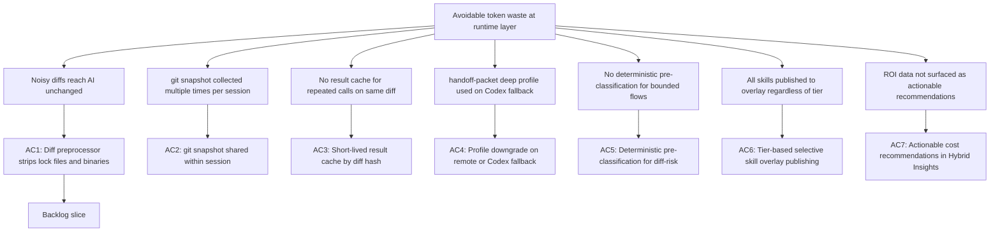

## req_124_harden_hybrid_assist_runtime_efficiency_with_diff_preprocessing_result_caching_and_profile_aware_fallback - Harden hybrid assist runtime efficiency with diff preprocessing, result caching, and profile-aware fallback

> From version: 1.21.1+traceability
> Schema version: 1.0
> Status: Draft
> Understanding: 100%
> Confidence: 96%
> Complexity: Medium
> Theme: Hybrid assist token efficiency and runtime hardening
> Reminder: Update status/understanding/confidence and references when you edit this doc.

# Needs

- Reduce Claude and Codex token consumption at the **hybrid assist runtime layer** by eliminating noise before prompts are built, avoiding redundant AI calls for identical inputs, and preventing expensive context profiles from reaching remote providers unnecessarily.
- These optimizations are distinct from and complementary to the context-pack budgeting work in `req_080` and the diff-first handoff work in `req_081`: they target the **runtime execution path** rather than the operator-facing handoff model.

# Context

- The hybrid assist runtime now supports four provider paths — `ollama`, `openai`, `gemini`, and `codex` — with per-flow backend policies and readiness gating since `req_120`. Operators may have any combination of these configured: a team with a local GPU runs Ollama as the primary backend; a team without local hardware may configure OpenAI or Gemini as their only active paid provider; some teams may rely on Codex alone.
- **The optimizations in this request are provider-agnostic**: they reduce token cost and latency regardless of which provider is active. A diff preprocessor saves tokens whether the prompt goes to Ollama, OpenAI, or Gemini. A result cache skips AI calls entirely regardless of which backend would have been selected. Deterministic pre-classification is most valuable precisely when the active provider is a paid API, because every skipped call has a real cost.
- Despite the multi-provider foundation, several categories of avoidable token waste remain at the **execution layer** that are invisible to the context-pack and handoff contracts:

  1. **Noisy diffs reach the AI unchanged.** Lock files (`package-lock.json`, `yarn.lock`, `Cargo.lock`, `Pipfile.lock`) and binary file stubs can represent thousands of diff lines with zero semantic value. They are currently passed raw when building prompts in `build_hybrid_messages_impl` in `logics/skills/logics-flow-manager/scripts/logics_flow_hybrid_transport.py`. This affects every provider equally.

  2. **`git_snapshot` is collected multiple times per session.** In `logics/skills/logics-flow-manager/scripts/logics_flow.py`, `collect_git_snapshot` is called independently at lines 724, 1069, 1154, and 1305. Each call spawns subprocess git commands and produces identical data when nothing has changed between calls in the same execution.

  3. **No result cache across repeated calls on the same diff.** When an operator retries or runs multiple flows back-to-back (for example, `diff-risk` followed by `commit-plan` on the same unchanged staging area), the runtime rebuilds context and dispatches a new AI call each time. This waste is especially significant when the active provider is a paid API (OpenAI or Gemini) since every call has a direct monetary cost.

  4. **`handoff-packet` uses `profile: deep` regardless of which provider handles the call.** The `deep` context profile is the most expensive to dispatch. Under `ollama-first` policy, Ollama absorbs this cost when available. But when the effective provider is OpenAI, Gemini, or Codex — whether as primary (Ollama not configured) or as fallback (Ollama unhealthy) — the same `deep` profile is used unchanged. The profile should be capped at `normal` whenever the effective provider is a paid remote backend, regardless of how that provider was selected.

  5. **Deterministic pre-classification is missing for bounded-risk flows.** Before dispatching `diff-risk` or `windows-compat-risk` to any AI backend, simple heuristics can resolve the obvious cases without a model call: a diff containing only lock file changes is always low risk; a diff touching a DB migration file is always high risk. These cases are cheap to detect deterministically and save cost on every provider including paid APIs.

  6. **Skill overlay publishes all skills globally without tier filtering.** The Codex workspace overlay (`logics/skills/logics-flow-manager/scripts/logics_flow_workspace_overlay.py` and `src/logicsCodexWorkspace.ts`) publishes all ~47 skills to the global Codex skills directory. If Codex or Claude auto-loads SKILL.md files from that directory into its context, the entire skill corpus inflates every session regardless of which skills are actually needed.

  7. **ROI Hybrid Insights does not surface actionable per-flow cost recommendations.** The `hybrid_assist_measurements.jsonl` and `hybrid_assist_audit.jsonl` already track every run with backend provenance. The Hybrid Insights panel does not yet translate this data into operator-readable, provider-aware recommendations: for a team using OpenAI as primary, the recommendation may be to enable result caching or deterministic pre-classification rather than to install Ollama.

# Acceptance criteria

- AC1: The hybrid assist runtime applies a diff preprocessor before building prompts that strips lock file diffs (`package-lock.json`, `yarn.lock`, `Cargo.lock`, `Pipfile.lock`, `poetry.lock`) and binary file stubs from the diff content passed to `build_hybrid_messages_impl`. The preprocessor is deterministic, does not modify the working tree, and is skipped gracefully when the diff is empty after stripping.
- AC2: Within a single CLI invocation, `collect_git_snapshot` results are computed once and reused by all flows that run in the same execution context, eliminating redundant subprocess git calls in chained workflows such as `commit-all`.
- AC3: The runtime can cache validated flow results in `logics/.cache/flow_results_cache.json` keyed on `sha256(flow_name + diff_fingerprint)` with a configurable TTL (default 5–10 minutes). Cache hits skip the AI call entirely and are logged as `cache-hit` in the measurement log so they are distinguishable from live runs in Hybrid Insights.
- AC4: When a flow with `profile: deep` (currently only `handoff-packet`) is dispatched to a paid remote provider (`openai`, `gemini`) or `codex` — whether as the primary configured backend, as an auto-selected fallback when Ollama is unavailable, or as an explicit `--backend` override — the runtime automatically caps the context profile at `normal`. The downgrade is logged in the audit record and visible in the degraded-reasons field. An explicit `--profile deep` operator override must be available to opt out when the operator accepts the cost.
- AC5: Before dispatching `diff-risk` or `windows-compat-risk` to any AI backend, the runtime applies a deterministic pre-classifier that resolves obvious cases without a model call:
  - diff contains only lock file or generated file changes → `low` risk, skip AI;
  - diff touches a DB migration or schema file → `high` risk, skip AI;
  - diff is empty → `low` risk, skip AI.
  Pre-classified results are logged as `deterministic-preclassified` in the measurement log.
- AC6: The skill overlay publication contract supports a single `tier` field (`core` or `optional`) in each skill's `agents/openai.yaml`. This field applies to both the Codex global kit and the Claude global kit (req_126) — a skill marked `optional` is optional for both runtimes. When publishing any global kit, only `core`-tier skills are included by default. An `--include-optional` flag or equivalent config opt-in restores full publication. Existing skills without a `tier` field default to `core` to avoid breaking existing setups. Per-runtime tier differentiation (`codex_tier`, `claude_tier`) is explicitly out of scope here and deferred to req_127 if the need arises.
- AC7: The Hybrid Insights panel surfaces actionable efficiency recommendations grounded in the observed audit and measurement data, scoped to the optimizations in this request:
  - highlight flows where result caching (AC3) is already serving repeats or where recent repeat calls indicate additional cache savings opportunities, showing cache-hit counts and recent cacheable repeat counts;
  - highlight flows where deterministic pre-classification (AC5) resolved cases, showing how many AI calls were skipped;
  - highlight flows where the `deep` profile was automatically downgraded (AC4), showing the provider and how many times the downgrade applied.
  Recommendations for expanding *which flows* go through hybrid (for example, enabling `next-step` on OpenAI or adding new authoring flows) are out of scope here and covered by `req_125`.

# Scope

- In:
  - diff preprocessor for lock files and binaries in hybrid assist prompt construction
  - git snapshot reuse within a single CLI execution
  - short-lived result cache keyed on diff fingerprint
  - profile downgrade for deep-profile flows on Codex or remote fallback
  - deterministic pre-classification for `diff-risk` and `windows-compat-risk`
  - tier-based selective skill overlay publishing
  - actionable per-flow cost recommendations in Hybrid Insights
- Out:
  - changing the flow contract validation model or fallback safety semantics
  - redesigning the context-pack or handoff contract from `req_080` / `req_081`
  - replacing Codex or remote providers as available backends
  - adding model-level prompt compression or summarization
  - changing how `next-step` is routed (covered by `req_125`)
  - adding new hybrid flows to replace interactive Claude or Codex tasks (covered by `req_125`)
  - expanding the Claude bridge to additional skills (covered by `req_125`)

# Dependencies and risks

- Dependency: `req_080` remains the base for context-pack profiles (`tiny`, `normal`, `deep`).
- Dependency: `req_093` remains the baseline for flow contracts, fallback policy, and audit governance.
- Dependency: `req_106` defines the current deterministic-versus-Ollama portfolio and the boundary for what stays Codex-first.
- Dependency: `req_120` established multi-provider dispatch, readiness gating, and provider health persistence in `logics/.cache/`.
- Dependency: `req_098` established the ROI measurement report; AC7 builds on that foundation.
- Dependency: `req_125` is the companion perimeter-expansion request; the two are independent delivery slices — this request makes existing hybrid calls cheaper, `req_125` makes more tasks go through hybrid in the first place.
- Risk: diff preprocessing could strip files that carry semantic value for specific flows (for example, a `package.json` change is meaningful for `diff-risk` even though it is not a lock file). The preprocessor must target only pure-noise files and remain conservative.
- Risk: a result cache that is too long-lived could return stale results if the staging area changes between calls. The TTL must be short and keyed on the actual diff fingerprint, not just the timestamp.
- Risk: profile downgrade changes the output quality for `handoff-packet` when the effective provider is a paid remote or Codex — including setups where OpenAI or Gemini is the configured primary, not just a fallback. The operator must be able to see the downgrade in the audit record and override it explicitly with `--profile deep` when the cost is acceptable.
- Risk: deterministic pre-classification for `diff-risk` could mis-classify a diff that mixes lock file changes with meaningful changes. The classifier must treat any diff containing at least one non-noise file as non-pre-classifiable.
- Risk: tier-based skill overlay filtering could break existing Codex sessions that depend on skills currently published globally. The default-to-`core` rule and the opt-in for optional skills must be clearly documented.
- Risk: actionable Hybrid Insights recommendations could create false urgency if the token saving estimate uses the generic `DEFAULT_ESTIMATED_REMOTE_TOKENS_PER_LOCAL_RUN` constant without accounting for flow-specific context size variation.

# Definition of Ready (DoR)

- [x] Problem statement is explicit and user impact is clear.
- [x] Scope boundaries (in/out) are explicit.
- [x] Acceptance criteria are testable.
- [x] Dependencies and known risks are listed.

# Companion docs

- Product brief(s): (none yet)
- Architecture decision(s): (none yet)

# AI Context

- Summary: Reduce hybrid assist token consumption at the runtime execution layer through diff preprocessing, git snapshot reuse, short-lived result caching, profile-aware cost reduction on paid providers, deterministic pre-classification for bounded flows, tier-based skill overlay filtering, and provider-aware actionable ROI recommendations in Hybrid Insights. Optimizations apply regardless of whether Ollama, OpenAI, Gemini, or Codex is the active backend.
- Keywords: hybrid assist, token reduction, diff preprocessor, lock file, result cache, git snapshot, profile downgrade, handoff-packet, diff-risk, deterministic pre-classification, skill overlay, tier, hybrid insights, ROI recommendations, codex, ollama, openai, gemini, provider-agnostic
- Use when: Use when planning runtime-layer token efficiency improvements that do not change flow contracts or handoff model but reduce cost through smarter prompt construction, caching, and profile selection.
- Skip when: Skip when the work is about context-pack structure (req_080), diff-first handoff posture (req_081), provider dispatch wiring (req_120), or flow contract redesign.

# AC Traceability

- AC1 -> `item_220`, `task_112`. Proof: diff preprocessor strips lock files and binary diff stubs before prompt construction.
- AC2 -> `item_220`, `task_112`. Proof: git snapshot reuse is cached within a single CLI invocation and refreshed only after explicit mutation points.
- AC3 -> `item_221`, `task_112`. Proof: repeated bounded runs on the same diff hit `logics/.cache/flow_results_cache.json` and log `cache-hit`.
- AC4 -> `item_222`, `task_112`. Proof: `handoff-packet` auto-caps the default deep profile on remote or Codex paths and records `profile-downgrade`.
- AC5 -> `item_222`, `task_112`. Proof: `diff-risk` and `windows-compat-risk` short-circuit obvious cases with `deterministic-preclassified`.
- AC6 -> `item_223`, `task_112`. Proof: skill manifests declare `tier`, and global Codex kit publication filters to `core` by default with an opt-in for optional skills.
- AC7 -> `item_224`, `task_112`. Proof: Hybrid Insights renders dedicated recommendation sections for cache, pre-classification, and profile downgrade signals.

# References

- `logics/request/req_080_reduce_codex_token_consumption_with_budgeted_context_packs_and_agent_aware_prompt_shaping.md`
- `logics/request/req_081_add_measurement_summary_first_and_diff_first_controls_to_reduce_codex_token_consumption.md`
- `logics/request/req_093_add_shared_hybrid_assist_contracts_fallback_policy_activation_rules_and_audit_governance_for_logics_delivery_automation.md`
- `logics/request/req_098_add_a_hybrid_assist_roi_dispatch_report_with_runtime_aggregation_and_plugin_insights.md`
- `logics/request/req_106_expand_deterministic_and_ollama_first_delivery_assist_to_reduce_codex_usage.md`
- `logics/request/req_120_add_openai_and_gemini_provider_dispatch_to_the_hybrid_assist_runtime.md`
- `logics/skills/logics-flow-manager/scripts/logics_flow.py`
- `logics/skills/logics-flow-manager/scripts/logics_flow_hybrid.py`
- `logics/skills/logics-flow-manager/scripts/logics_flow_hybrid_transport.py`
- `logics/skills/logics-flow-manager/scripts/logics_flow_hybrid_observability.py`
- `src/logicsCodexWorkspace.ts`
- `src/logicsHybridInsightsHtml.ts`
- `logics/request/req_125_expand_hybrid_provider_coverage_to_replace_more_claude_and_codex_interactive_flows.md`
- `logics/request/req_127_consolidate_deferred_hybrid_and_kit_publication_improvements_after_initial_rollout.md`

# Backlog

- `logics/backlog/item_220_diff_preprocessor_and_git_snapshot_reuse_in_hybrid_runtime.md`
- `logics/backlog/item_221_short_lived_result_cache_for_hybrid_assist_flows.md`
- `logics/backlog/item_222_profile_downgrade_and_deterministic_pre_classification_for_bounded_flows.md`
- `logics/backlog/item_223_tier_based_selective_skill_overlay_publishing_for_global_kit.md`
- `logics/backlog/item_224_actionable_efficiency_recommendations_in_hybrid_insights.md`
