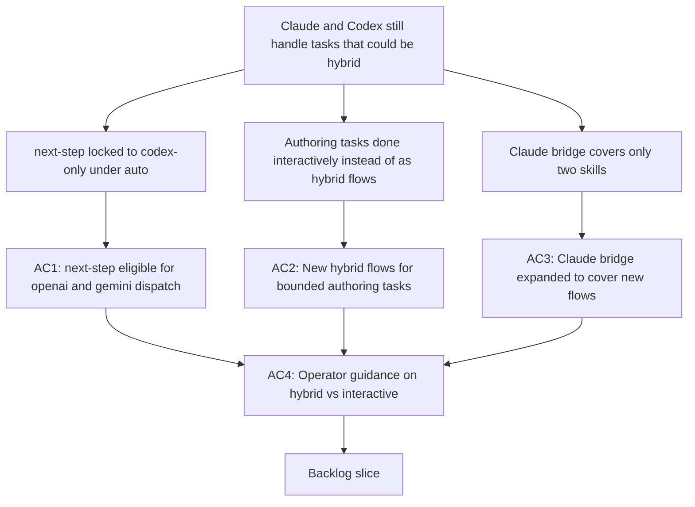

## req_125_expand_hybrid_provider_coverage_to_replace_more_claude_and_codex_interactive_flows - Expand hybrid provider coverage to replace more Claude and Codex interactive flows

> From version: 1.21.1
> Schema version: 1.0
> Status: Draft
> Understanding: 92%
> Confidence: 88%
> Complexity: High
> Theme: Hybrid assist provider coverage and Claude or Codex cost reduction
> Reminder: Update status/understanding/confidence and references when you edit this doc.

# Needs

- Reduce the number of tasks that require a Claude or Codex interactive session by routing more bounded operations through the hybrid provider pipeline (Ollama, OpenAI API, Gemini API).
- The current hybrid runtime covers repetitive delivery operations well, but several high-frequency tasks are still handled interactively by Claude or Codex when they could be served by a cheaper bounded hybrid call.

# Context

- Since `req_120`, the hybrid runtime supports four provider paths (`ollama`, `openai`, `gemini`, `codex`) with shared contract validation, per-flow backend policy, and readiness gating. OpenAI and Gemini are now full first-class providers, not just fallbacks.
- The current hybrid flow inventory covers a wide range of delivery operations: `commit-message`, `triage`, `diff-risk`, `validation-summary`, `pr-summary`, `doc-consistency`, and more. These flows already save Claude and Codex tokens for teams that use them.
- However, two categories of tasks remain outside the hybrid perimeter and still consume Claude or Codex interactive session budget:

  1. **`next-step` is the last `codex-only` flow under `auto`.** Every time the operator asks the assistant "what should I do next on this item?", the runtime dispatches to Codex regardless of whether OpenAI or Gemini is configured. The original rationale was that `next-step` feeds the deterministic dispatcher and should not broaden silently. Since `req_120`, OpenAI and Gemini are subject to the same strict contract validation and bounded output requirements as any other provider — the technical barrier to routing `next-step` to these providers is now gone.

  2. **Bounded authoring tasks are still handled interactively.** Creating a request doc, drafting a first-pass spec, grooming a backlog item from a request, or generating a structured handoff note all happen inside a full Claude or Codex interactive session today. Each of these tasks has a well-defined input (a set of logics docs, a git snapshot, a user intent) and a well-defined output (a structured markdown doc or bounded JSON proposal). They are strong candidates for bounded hybrid flows that could be served by OpenAI, Gemini, or Ollama at a fraction of the cost of an interactive session.

- The Claude bridge today only wires two skills — `logics-assist` and `logics-flow` — to `.claude/commands/` and `.claude/agents/`. When Claude is invoked for other bounded operations (such as risk review, spec drafting, or backlog grooming), it does the work inline rather than delegating to a cheaper hybrid flow. Adding bridges for more skills would let Claude automatically delegate bounded tasks to the hybrid runtime.

- **Coherence note with `req_124`:** that request handles runtime-layer efficiency for existing hybrid calls (diff preprocessing, caching, profile downgrade). This request handles the complementary problem: expanding *which tasks* go through hybrid at all. The two are independent delivery slices — req_124 makes existing hybrid calls cheaper, req_125 makes more tasks go through hybrid in the first place.

# Acceptance criteria

- AC1: `next-step` is made eligible for explicit `--backend openai` and `--backend gemini` dispatch under the same strict contract validation already applied to all hybrid flows. The `auto` default policy for `next-step` remains `codex-first` in this request — changing the `auto` default via `logics.yaml` opt-in is deferred to req_127 once explicit dispatch has been validated in production. Operators who want to use OpenAI or Gemini for `next-step` must pass `--backend openai` or `--backend gemini` explicitly for now.
- AC2: The hybrid runtime adds at least two of the following three bounded flows that replace common interactive Claude or Codex authoring tasks, in priority order:
  - `request-draft`: given a short user intent and relevant logics context, produce a structured draft `# Needs` and `# Context` block suitable for a new request doc;
  - `spec-first-pass`: given a backlog item and its acceptance criteria, produce a minimal structured spec outline (sections, open questions, constraints);
  - `backlog-groom`: given a request doc, propose a scoped backlog item title, complexity, and acceptance criteria candidates.
  All new flows are strictly `proposal-only` in this request: they return validated JSON output and do not write any file to disk. File creation from flow output (equivalent to `--execution-mode execute`) is deferred to req_127 once the flow contracts have been validated in production. Each flow must conform to the shared contract model: compact structured input, validated JSON output, bounded Codex fallback, audit and measurement logging.
- AC3: The Claude bridge (`repairClaudeBridgeFiles` in `src/claudeBridgeSupport.ts`) is extended to generate `.claude/commands/` and `.claude/agents/` entries for at least the skills whose hybrid flows land in AC2, so Claude automatically delegates those bounded tasks to the hybrid runtime instead of handling them inline in the interactive session.
- AC4: Operator documentation or inline `logics.yaml` guidance establishes a clear decision rule for when to use a hybrid flow versus an interactive Claude or Codex session:
  - Use a hybrid flow when: the task has a well-defined input, a bounded structured output, and does not require multi-turn reasoning or repo-wide code understanding.
  - Use an interactive session when: the task requires iterative judgment, open-ended code generation, or multi-file reasoning that cannot be reduced to a single bounded contract.

# Scope

- In:
  - making `next-step` eligible for `openai` and `gemini` via explicit `--backend` flag (auto routing opt-in deferred to req_127)
  - adding new bounded `proposal-only` hybrid flows for authoring tasks (request draft, spec first-pass, backlog groom — file writing deferred to req_127)
  - extending the Claude bridge to cover new flows from AC2
  - operator guidance distinguishing hybrid flows from interactive sessions
- Out:
  - removing Codex or Claude as available backends
  - forcing `next-step` `auto` policy away from `codex-first` without explicit operator opt-in
  - replacing interactive Claude or Codex sessions entirely
  - runtime efficiency optimizations for existing hybrid calls (covered by `req_124`)
  - global Claude kit publication to `~/.claude/` system-wide (covered by `req_126`)
  - UI redesign of Hybrid Insights beyond what is needed to surface new flow coverage

# Dependencies and risks

- Dependency: `req_093` remains the baseline for shared flow contracts, fallback policy, and audit governance; all new flows in AC2 must conform.
- Dependency: `req_120` established multi-provider dispatch and per-flow backend policy; AC1 builds directly on this foundation.
- Dependency: `req_106` defined the `next-step` `codex-only` boundary; AC1 revisits that boundary for explicit non-`auto` dispatch and optional `auto` override.
- Dependency: `src/claudeBridgeSupport.ts` is the current bridge mechanism; AC3 extends its `CLAUDE_BRIDGE_VARIANTS` array.
- Dependency: `req_124` is the companion efficiency request; the two should ship in parallel or sequentially without blocking each other.
- Risk: opening `next-step` to OpenAI or Gemini could produce lower-quality dispatcher decisions if the remote model does not follow the bounded action-space contract as reliably as Codex. Strict contract validation and bounded Codex fallback mitigate this but do not eliminate it; the opt-in model ensures only teams that accept this trade-off are affected.
- Risk: new authoring flows (AC2) risk being too narrow to be useful or too broad to stay bounded. Each flow contract must be validated with real operator inputs before being marked stable.
- Risk: expanding the Claude bridge (AC3) increases the surface of auto-delegation. If a skill's hybrid flow produces a weak result, Claude may accept it without adequate review. Each new bridge entry should include an explicit reviewer nudge in its prompt so the operator validates before committing the output.
- Risk: if the `auto` default for `next-step` is changed without careful testing, the deterministic dispatcher that consumes its output could receive lower-confidence decisions and route incorrectly. The `logics.yaml` opt-in design isolates this risk to teams that explicitly enable it.

# Definition of Ready (DoR)

- [x] Problem statement is explicit and user impact is clear.
- [x] Scope boundaries (in/out) are explicit.
- [x] Acceptance criteria are testable.
- [x] Dependencies and known risks are listed.

# Companion docs

- Product brief(s): (none yet)
- Architecture decision(s): (none yet)

# AI Context

- Summary: Expand hybrid provider coverage so more tasks that currently consume Claude or Codex interactive session budget are served by bounded hybrid flows on Ollama, OpenAI, or Gemini instead. Key items: make next-step eligible for OpenAI and Gemini dispatch, add new authoring hybrid flows (request draft, spec first-pass, backlog groom), extend the Claude bridge to cover them, and document the hybrid-vs-interactive decision rule.
- Keywords: hybrid assist, provider coverage, next-step, openai, gemini, ollama, codex reduction, claude bridge, request draft, spec first-pass, backlog groom, interactive session, bounded flow, cost reduction, authoring
- Use when: Use when planning work to route more Claude or Codex interactive tasks through the hybrid provider pipeline, expand the hybrid flow inventory with new authoring flows, or extend the Claude bridge to additional skills.
- Skip when: Skip when the work is about efficiency of existing hybrid calls (req_124), provider transport wiring (req_120), or interactive session management that is not reducible to a bounded hybrid contract.

# References

- `logics/request/req_093_add_shared_hybrid_assist_contracts_fallback_policy_activation_rules_and_audit_governance_for_logics_delivery_automation.md`
- `logics/request/req_106_expand_deterministic_and_ollama_first_delivery_assist_to_reduce_codex_usage.md`
- `logics/request/req_120_add_openai_and_gemini_provider_dispatch_to_the_hybrid_assist_runtime.md`
- `logics/request/req_124_harden_hybrid_assist_runtime_efficiency_with_diff_preprocessing_result_caching_and_profile_aware_fallback.md`
- `logics/request/req_126_achieve_claude_runtime_parity_with_the_codex_overlay_and_launcher_model.md`
- `logics/request/req_127_consolidate_deferred_hybrid_and_kit_publication_improvements_after_initial_rollout.md`
- `logics/skills/logics-flow-manager/scripts/logics_flow_hybrid.py`
- `logics/skills/logics-flow-manager/scripts/logics_flow.py`
- `src/claudeBridgeSupport.ts`

# Backlog

- `logics/backlog/item_225_enable_next_step_dispatch_to_openai_and_gemini_via_explicit_backend_flag.md`
- `logics/backlog/item_226_add_request_draft_and_spec_first_pass_bounded_authoring_hybrid_flows.md`
- `logics/backlog/item_227_add_backlog_groom_bounded_authoring_hybrid_flow.md`
- `logics/backlog/item_228_extend_claude_bridge_for_new_authoring_flows_and_add_operator_guidance.md`
