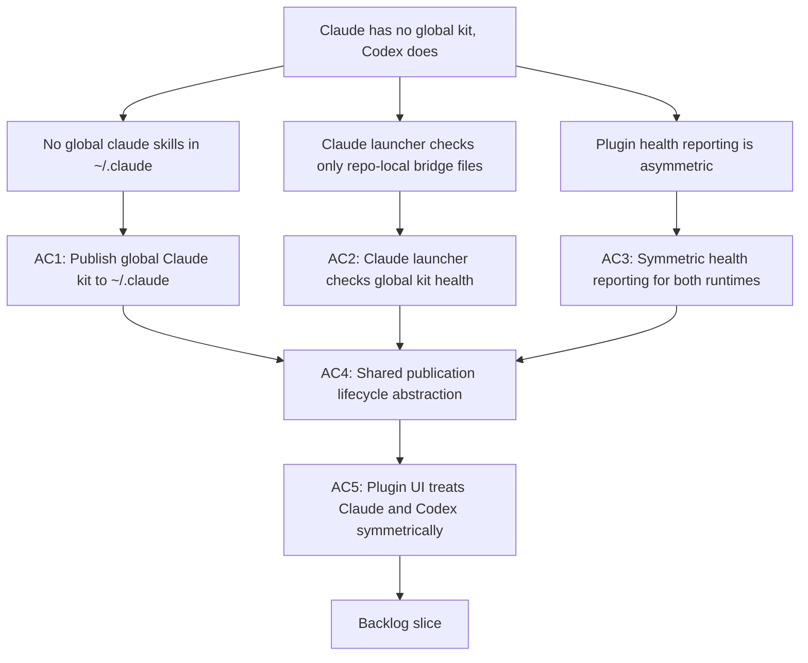

## req_126_achieve_claude_runtime_parity_with_the_codex_overlay_and_launcher_model - Achieve Claude runtime parity with the Codex overlay and launcher model

> From version: 1.21.1
> Schema version: 1.0
> Status: Draft
> Understanding: 90%
> Confidence: 85%
> Complexity: High
> Theme: Claude and Codex runtime parity, global kit publication, assistant-agnostic plugin surfaces
> Reminder: Update status/understanding/confidence and references when you edit this doc.

# Needs

- Give Claude the same system-wide Logics skill availability that Codex already gets through the global kit published to `~/.codex/skills/`.
- Make the plugin treat Claude and Codex symmetrically: same health reporting, same launch experience, same publication lifecycle — regardless of which assistant the operator uses.

# Context

- Since `req_099`, the Codex global kit model publishes all Logics skills to `~/.codex/skills/` so any Codex session picks them up automatically, regardless of which repository it was launched from. The plugin manages this lifecycle through `src/logicsCodexWorkspace.ts`: it inspects overlay health, publishes on bootstrap, and exposes a launcher once the kit is ready.
- Claude Code supports the same concept on its side: `~/.claude/agents/` for global agent definitions and `~/.claude/commands/` for global slash commands. When files exist there, any Claude Code session in any repository can use them — exactly the same model as the Codex global kit.
- Today, Claude support is **repo-local only**: the plugin generates `.claude/commands/logics-assist.md` and `.claude/agents/logics-flow-manager.md` inside the current repository through `src/claudeBridgeSupport.ts`. These bridge files only work when Claude is launched from that specific repository, and they are limited to two skills.
- The asymmetry creates two concrete problems:
  1. **No global Claude kit.** An operator who uses Claude as their primary assistant must be in the right repository and have the bridge files repaired before any Logics skill is available. A Codex operator just runs `codex` from anywhere.
  2. **Uneven plugin experience.** The `RuntimeLaunchersSnapshot` in `src/runtimeLaunchers.ts` has both `codex` and `claude` launchers, but the Codex launcher checks global kit health (`codexOverlay.status`) while the Claude launcher only checks whether two specific repo-local bridge files exist (`claudeBridge?.available`). The readiness signals are not equivalent.

- **Scope of the gap:** Three surfaces need to become symmetric:

  | Surface | Codex today | Claude today | Gap |
  |---|---|---|---|
  | Global kit publication | `~/.codex/skills/` via `logicsCodexWorkspace.ts` | None — repo-local `.claude/` only | Publish to `~/.claude/agents/` and `~/.claude/commands/` |
  | Plugin health reporting | `codexOverlay` status (healthy/stale/missing) | `claudeBridgeAvailable` boolean only | Full status model for Claude global kit |
  | Launcher readiness | Checks global kit health before enabling launch | Checks 2 repo-local files | Align launcher check with global kit status |

- **Format difference:** Codex global kit publishes full Python skill directories to `~/.codex/skills/`. Claude global kit publishes agent markdown files to `~/.claude/agents/` (one per skill) and optionally slash command files to `~/.claude/commands/`. The publication logic is different but the lifecycle (inspect → publish → report health → launch) is the same.

- **Coherence with req_125:** that request extends the Claude bridge to more skills at the repo-local level. This request establishes the global kit foundation so all bridged skills are also available system-wide, independent of which repository Claude is launched from. The two are complementary: req_125 adds more skills to bridge, req_126 makes the bridge global.

# Acceptance criteria

- AC1: The plugin can publish a global Claude kit to `~/.claude/agents/` and `~/.claude/commands/` using the Logics skills available in the current repository. Publication uses the same format already produced by `claudeBridgeSupport.ts` for repo-local bridge files — one agent markdown file per skill derived from the skill's `SKILL.md` and `agents/openai.yaml`, and one slash command file per skill — to maximise code reuse and format consistency. A manifest (`logics-global-kit-claude.json`) is written to `~/.claude/` to track version, source revision, and publication timestamp, mirroring the `logics-global-kit.json` contract used for Codex. A richer global agent format may be adopted in req_127 if diverging from the bridge file format proves necessary.
- AC2: The Claude launcher in `src/runtimeLaunchers.ts` checks the global Claude kit health status (analogous to `codexOverlay.status`) in addition to CLI availability, so it becomes ready only when the global kit is published and current — not just when two repo-local bridge files are present.
- AC3: The plugin exposes a health status for the global Claude kit equivalent to `CodexOverlaySnapshot` in `src/logicsCodexWorkspace.ts`: `healthy`, `stale`, `missing-overlay`, `missing-manager`, or `unavailable`. This status is reported in the environment check output and in the plugin tools panel alongside the existing Codex overlay status.
- AC4: AC1, AC2, and AC3 may be delivered with a temporary duplication of the publication logic from `logicsCodexWorkspace.ts` to keep the Codex path untouched during the first Claude kit delivery. The refactoring of both paths into a shared inspect → publish → manifest → report abstraction is tracked separately in req_127 and is explicitly non-blocking for this request. The shared abstraction must not force a common file format when it lands — Codex publishes skill directories, Claude publishes agent and command markdown files.
- AC5: The plugin UI (tools panel, environment check, launcher buttons) treats Claude and Codex symmetrically:
  - both launchers show the same readiness conditions (CLI on PATH + global kit healthy);
  - both show the same categories of repair action when the kit is stale or missing;
  - wording uses assistant-agnostic labels where the behavior is identical and assistant-specific labels only where the implementation genuinely differs (for example, `~/.codex` versus `~/.claude`).

# Scope

- In:
  - global Claude kit publication to `~/.claude/agents/` and `~/.claude/commands/`
  - Claude global kit health inspection and manifest tracking
  - aligning the Claude launcher readiness check with the global kit status
  - symmetric health reporting for both runtimes in the plugin
  - plugin UI symmetry for launchers, health indicators, and repair actions
  - temporary duplication of publication logic (shared abstraction refactoring deferred to req_127)
- Out:
  - changing the Codex global kit format or publication target (`~/.codex` stays as-is)
  - redesigning the repo-local bridge files (covered by `req_125`)
  - adding new skills to the bridge (covered by `req_125`)
  - hybrid assist flow routing or provider dispatch (covered by `req_124` and `req_125`)
  - forcing a single unified `~/.logics/` directory for both runtimes

# Dependencies and risks

- Dependency: `req_099` established the global Codex kit model and the `logics-global-kit.json` manifest contract; AC1 and AC4 extend this contract to Claude.
- Dependency: `src/logicsCodexWorkspace.ts` is the reference implementation for the publication lifecycle; AC4 refactors it into a shared abstraction.
- Dependency: `src/claudeBridgeSupport.ts` is the current repo-local Claude bridge; AC1 adds a global publication path alongside it without replacing it.
- Dependency: `req_125` extends the repo-local bridge to more skills; those same skills should be eligible for the global Claude kit via AC1.
- Dependency: `src/runtimeLaunchers.ts` is the launcher snapshot source; AC2 and AC5 update it.
- Risk: Claude Code's `~/.claude/agents/` and `~/.claude/commands/` directories are documented as user-level global skill locations, but their exact loading semantics may vary across Claude Code versions. The publication must be conservative: write files, do not assume they will be auto-loaded without operator confirmation.
- Risk: publishing to `~/.claude/` is a global side effect that persists across repositories and Claude Code sessions. The plugin must require explicit operator opt-in (equivalent to the Codex global kit bootstrap consent) before first publication.
- Risk: the shared publication lifecycle abstraction (AC4) touches both the Codex and Claude publication paths simultaneously. Regression risk for the existing Codex overlay must be contained through isolated unit tests before the refactor ships.
- Risk: if the global Claude kit becomes stale (repository updated, skills changed) but the operator does not re-publish, Claude will use outdated skill definitions. The stale detection logic from the Codex model must be ported to the Claude kit manifest inspection.

# Definition of Ready (DoR)

- [x] Problem statement is explicit and user impact is clear.
- [x] Scope boundaries (in/out) are explicit.
- [x] Acceptance criteria are testable.
- [x] Dependencies and known risks are listed.

# Companion docs

- Product brief(s): (none yet)
- Architecture decision(s): (none yet)

# AI Context

- Summary: Achieve Claude runtime parity with the Codex global kit model by publishing Logics skills to ~/.claude/agents/ and ~/.claude/commands/, aligning the Claude launcher readiness check with global kit health, adding symmetric health reporting, and refactoring the publication lifecycle into a shared abstraction that serves both runtimes.
- Keywords: claude parity, codex overlay, global kit, ~/.claude, ~/.codex, launcher, health status, publication lifecycle, agent markdown, slash command, symmetric plugin ui, runtime launchers, claude bridge, skill publication
- Use when: Use when planning work to give Claude the same system-wide Logics skill availability as Codex, make the plugin treat both runtimes symmetrically, or refactor the publication lifecycle shared between ~/.codex and ~/.claude.
- Skip when: Skip when the work is about hybrid assist routing (req_124, req_125), repo-local bridge files only (req_125), or Codex-specific overlay format changes.

# References

- `logics/request/req_099_replace_repo_local_codex_overlays_with_a_global_published_logics_kit_and_managed_migration.md`
- `logics/request/req_122_harden_release_publish_guards_and_generalize_codex_specific_plugin_surfaces_for_claude_parity.md`
- `logics/request/req_125_expand_hybrid_provider_coverage_to_replace_more_claude_and_codex_interactive_flows.md`
- `src/logicsCodexWorkspace.ts`
- `src/claudeBridgeSupport.ts`
- `src/runtimeLaunchers.ts`
- `src/logicsEnvironment.ts`
- `src/logicsOverlaySupport.ts`
- `src/logicsCodexWorkflowController.ts`
- `logics/request/req_127_consolidate_deferred_hybrid_and_kit_publication_improvements_after_initial_rollout.md`

# Backlog

- `logics/backlog/item_229_publish_global_claude_kit_to_claude_agents_and_commands_directories.md`
- `logics/backlog/item_230_claude_global_kit_health_status_model_and_aligned_launcher_readiness_check.md`
- `logics/backlog/item_231_symmetric_plugin_ui_for_claude_and_codex_launchers_and_health_reporting.md`
