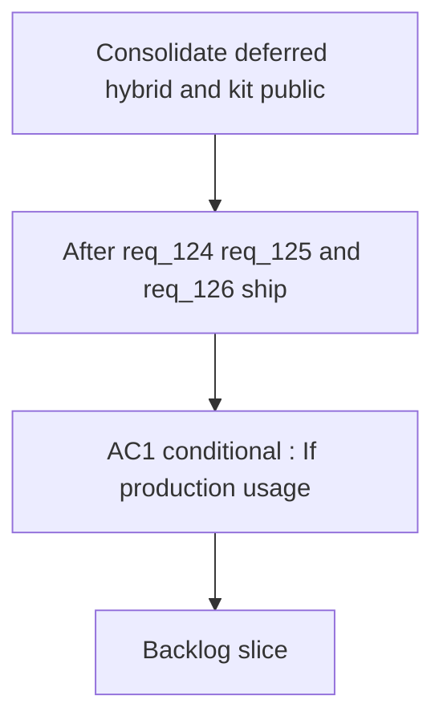

## req_127_consolidate_deferred_hybrid_and_kit_publication_improvements_after_initial_rollout - Consolidate deferred hybrid and kit publication improvements after initial rollout
> From version: 1.22.2 (refreshed)
> Understanding: ??% (refreshed)
> Confidence: ??% (refreshed)

> From version: 1.21.1+traceability
> Schema version: 1.0
> Status: Done
> Understanding: 100% (refreshed)
> Confidence: 96%
> Complexity: Medium
> Theme: Hybrid assist and kit publication consolidation post-rollout
> Reminder: Update status/understanding/confidence and references when you edit this doc.

# Needs

- After req_124, req_125, and req_126 ship their initial delivery, consolidate the improvements that were explicitly deferred to avoid blocking or complicating those requests.
- This request has no new feature goals of its own — it exists purely to close the technical debt and configuration gaps that were consciously left open during the initial rollout.

# Context

- Four items were explicitly deferred during the design of req_124–req_126 to keep each request focused and lower its delivery risk. They are collected here so nothing is lost and each can be scheduled once the upstream work is stable in production.

  **From req_124 (skill tier acceptance criterion):**
  A single `tier` field (`core` / `optional`) was chosen to keep the implementation simple for the initial rollout. If operators discover that a skill is useful for one runtime but noise for the other — for example, a Python-heavy skill useful in Codex sessions but irrelevant in Claude sessions — per-runtime tier differentiation (`codex_tier`, `claude_tier`) becomes necessary. This deferral is conditional: it only lands if real usage produces this need.

  **From req_125 (AC2 — authoring flow execution mode):**
  The three new authoring flows (`request-draft`, `spec-first-pass`, `backlog-groom`) ship as `proposal-only` — they return structured JSON but do not write files. Once these contracts have been validated through real operator use, a `--execution-mode execute` path that creates the actual logics doc from the proposal output becomes the natural next step. This mirrors the pattern already established by `commit-all` and `prepare-release`.

  **From req_125 (AC1 — `next-step` auto routing opt-in):**
  In req_125, `next-step` becomes eligible for explicit `--backend openai` or `--backend gemini` dispatch but the `auto` policy remains `codex-first`. Once explicit dispatch has been used in production and confidence in the contract quality across providers is established, a `logics.yaml` opt-in key (for example `next_step_auto_backend: openai`) should be added so teams that run OpenAI or Gemini as their primary provider can change the default without passing `--backend` on every call.

  **From req_126 (AC4 — shared publication lifecycle abstraction):**
  req_126 delivers the Claude global kit with a temporary duplication of the Codex publication logic to avoid touching the stable Codex path during the initial rollout. Once both paths are live and validated, this duplication becomes technical debt. The refactoring consolidates both publication paths (inspect → publish → manifest → report) into a shared internal abstraction that serves `~/.codex` and `~/.claude` without duplicating the lifecycle logic. The abstraction must not force a common file format — Codex publishes skill directories, Claude publishes agent and command markdown files.

# Acceptance criteria

- AC1 (conditional): If production usage of req_124's skill-tier acceptance criterion reveals that operators need different tier assignments per runtime, the `agents/openai.yaml` skill contract is extended with `codex_tier` and `claude_tier` fields that override the shared `tier` field for each runtime independently. The shared `tier` field remains the default when neither per-runtime field is set. This AC is skipped entirely if no real usage demand materialises after the initial rollout.
- AC2: The hybrid authoring flows introduced in req_125 AC2 (`request-draft`, `spec-first-pass`, `backlog-groom`) gain a `--execution-mode execute` path that creates the actual logics doc on disk from the validated proposal output, equivalent to the execution mode already available for `commit-all` and `prepare-release`. The proposal-only mode remains the default; execute mode requires an explicit flag.
- AC3: The `logics.yaml` configuration supports a `next_step_auto_backend` key (for example `next_step_auto_backend: openai`) that changes the `auto` policy for `next-step` from `codex-first` to the specified provider for teams that have validated explicit `--backend` dispatch in production. The key is ignored if the specified provider is not configured or not healthy, falling back to `codex` with a logged warning.
- AC4: The publication lifecycle for the Codex global kit (`~/.codex`) and the Claude global kit (`~/.claude`) is refactored into a shared internal abstraction (inspect → publish → manifest → report) that eliminates the temporary duplication introduced in req_126. The abstraction accepts a runtime-specific adapter for the file format (skill directories for Codex, agent and command markdown files for Claude) so neither path is forced into the other's format. Existing behaviour for both runtimes must be covered by regression tests before the refactor ships.

# Scope

- In:
  - per-runtime skill tier fields (conditional on usage demand from req_124)
  - execute mode for authoring flows from req_125
  - `next-step` auto routing opt-in via `logics.yaml` from req_125
  - shared kit publication lifecycle abstraction from req_126
- Out:
  - new features not already designed in req_124–req_126
  - changes to flow contracts or provider dispatch beyond `next-step` auto routing
  - redesigning the global kit file formats beyond the adapter abstraction in AC4

# Dependencies and risks

- Dependency: req_124 skill-tier acceptance criterion must ship and reach production before AC1 can be evaluated.
- Dependency: req_125 AC2 flows must reach production and be validated with real operator input before AC2 (execute mode) ships.
- Dependency: req_125 AC1 explicit dispatch must be validated in production before AC3 (auto routing opt-in) ships.
- Dependency: req_126 AC1–AC3 must ship and be stable before AC4 (shared abstraction) begins, to avoid refactoring code that is still changing.
- Risk: AC1 may never be needed — the conditional nature means it should only be implemented when operators explicitly report the need, not speculatively.
- Risk: AC2 (execute mode) introduces file mutation from an AI proposal. The operator must explicitly confirm the output before the file is written; silent execution is not acceptable.
- Risk: AC3 (auto routing opt-in) changes `next-step` behaviour silently for any team that sets the key without understanding the contract quality implications. The documentation must clearly explain what changes and what the fallback is.
- Risk: AC4 (shared abstraction) touches both the stable Codex path and the newly shipped Claude path simultaneously. Regression test coverage must be complete before the refactor begins.

# Definition of Ready (DoR)

- [x] Problem statement is explicit and user impact is clear.
- [x] Scope boundaries (in/out) are explicit.
- [x] Acceptance criteria are testable.
- [x] Dependencies and known risks are listed.

# Companion docs

- Product brief(s): (none yet)
- Architecture decision(s): (none yet)

# AI Context

- Summary: Consolidate the four items explicitly deferred during req_124–req_126: per-runtime skill tier fields (conditional), execute mode for authoring flows, next-step auto routing opt-in in logics.yaml, and shared kit publication lifecycle abstraction. All ACs depend on upstream requests shipping and stabilising first.
- Keywords: deferred, consolidation, skill tier, codex tier, claude tier, authoring flow, execute mode, next-step auto backend, logics.yaml, publication lifecycle, shared abstraction, kit publication, codex overlay, claude kit
- Use when: Use when scheduling follow-up work after req_124, req_125, and req_126 have shipped and stabilised, specifically to close the four deferred items listed in those requests.
- Skip when: Skip when upstream requests have not yet shipped, when the work targets new features not already designed in req_124–req_126, or when AC1 is being considered speculatively without real usage evidence.

# AC Traceability

- AC1 -> `item_232`, `task_112`. Proof: per-runtime tier fields remain explicitly conditional on production demand and are gated in Wave 5.
- AC2 -> `item_233`, `task_112`. Proof: execute mode for bounded authoring flows is deferred until the proposal-only contracts are validated in production.
- AC3 -> `item_234`, `task_112`. Proof: `next_step_auto_backend` is deferred behind production validation of explicit backend dispatch.
- AC4 -> `item_235`, `task_112`. Proof: the shared Codex and Claude publication lifecycle abstraction is deferred until both initial publication paths are live and stable.

# References

- `logics/request/req_124_harden_hybrid_assist_runtime_efficiency_with_diff_preprocessing_result_caching_and_profile_aware_fallback.md`
- `logics/request/req_125_expand_hybrid_provider_coverage_to_replace_more_claude_and_codex_interactive_flows.md`
- `logics/request/req_126_achieve_claude_runtime_parity_with_the_codex_overlay_and_launcher_model.md`
- `logics/skills/logics-flow-manager/scripts/logics_flow_hybrid.py`
- `logics/skills/logics-flow-manager/scripts/logics_flow_config.py`
- `src/logicsCodexWorkspace.ts`
- `src/claudeBridgeSupport.ts`

# Backlog

- `logics/backlog/item_232_per_runtime_skill_tier_fields_codex_tier_and_claude_tier_if_usage_demands_it.md`
- `logics/backlog/item_233_execute_mode_for_hybrid_authoring_flows_request_draft_spec_first_pass_backlog_groom.md`
- `logics/backlog/item_234_next_step_auto_backend_opt_in_via_logics_yaml_next_step_auto_backend_key.md`
- `logics/backlog/item_235_shared_publication_lifecycle_abstraction_for_codex_and_claude_global_kit.md`
