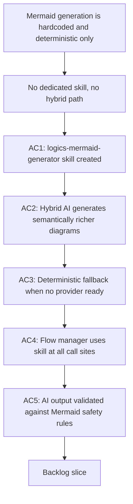

## req_128_add_a_logics_mermaid_generator_skill_with_hybrid_ai_and_deterministic_fallback - Add a logics-mermaid-generator skill with hybrid AI and deterministic fallback

> From version: 1.21.1+traceability
> Schema version: 1.0
> Status: Draft
> Understanding: 94%
> Confidence: 89%
> Complexity: Medium
> Theme: Logics kit skills, Mermaid quality, and hybrid AI integration
> Reminder: Update status/understanding/confidence and references when you edit this doc.

# Needs

- Create a dedicated `logics-mermaid-generator` skill that centralises all Mermaid diagram generation for Logics workflow docs.
- Make the skill use hybrid AI providers (Ollama, OpenAI, Gemini) when available to produce semantically meaningful diagrams, and fall back gracefully to the existing deterministic template logic when no provider is ready.
- Wire the skill into the flow manager everywhere Mermaid is currently generated inline, so the kit has one canonical generation path instead of scattered template functions.

# Context

- Mermaid diagrams are mandatory in every request, backlog, and task doc in the Logics workflow. The flow manager already generates them at creation and promotion time, but the generation logic is entirely **deterministic and hardcoded** inside `logics/skills/logics-flow-manager/scripts/logics_flow_support.py`:
  - `_render_request_mermaid` (line 546)
  - `_render_backlog_mermaid` (line 567)
  - `_render_task_mermaid` (line 591)
  - `_render_workflow_mermaid` (line 620)

- These functions pick text snippets from the document title, `# Needs`, `# Context`, and `# Acceptance criteria` sections and slot them into a fixed flowchart template. The result is syntactically valid and signature-compliant, but **semantically thin** — the diagram does not understand the content of the document, it only re-labels a fixed shape.

- There is **no dedicated skill** for Mermaid generation. The logic is buried inside the flow manager, making it impossible to invoke independently, test in isolation, call from other skills, or route through the hybrid runtime.

- Since `req_120`, the hybrid assist runtime supports Ollama, OpenAI, and Gemini with full contract validation and bounded fallback. Mermaid generation is a strong candidate for a hybrid flow:
  - the input is compact and well-defined (doc title, kind, key sections);
  - the output is bounded (a single Mermaid block, max ~20 lines);
  - the safety rules are strict and machine-verifiable (ASCII labels, no markdown formatting, flowchart syntax only);
  - the deterministic template provides a ready fallback if the AI output fails validation.

- The hybrid path for Mermaid generation should be `ollama-first` with remote provider fallback, consistent with the policy established for bounded proposal-only flows. When no provider is available, the skill falls back silently to the current deterministic template — no operator action required.

- **Call sites in the flow manager** that this skill would replace:
  - `new request` generation (`logics_flow.py` line ~1588)
  - `new backlog` and `new task` generation
  - `sync refresh-mermaid-signatures` (`logics_flow.py` line 1732) — currently re-derives the signature deterministically; could optionally regenerate the full block via hybrid when the content has changed substantially

# Acceptance criteria

- AC1: A `logics-mermaid-generator` skill package is created under `logics/skills/logics-mermaid-generator/` with a `SKILL.md`, an `agents/openai.yaml`, and a generation script callable from the flow manager. The skill is self-contained and can be invoked independently of the flow manager for testing or standalone use.
- AC2: The skill supports a hybrid AI generation mode that dispatches to the configured provider (Ollama, OpenAI, or Gemini, in policy order) with a compact prompt built from the document kind (`request`, `backlog`, `task`), the document title, and the key content sections (`# Needs` or `# Problem`, `# Acceptance criteria`, `# Plan`). The hybrid flow is `proposal-only` — the skill returns a validated Mermaid block string, it does not write to disk. The flow follows the shared hybrid contract: structured input, validated output, bounded Codex fallback, audit and measurement logging.
- AC3: When no hybrid provider is available or the AI output fails Mermaid safety validation, the skill falls back automatically to the current deterministic template logic extracted from `logics_flow_support.py`. The fallback is silent — no error or warning is surfaced to the operator, and the generated diagram is indistinguishable from the current output in terms of format and signature compliance.
- AC4: The flow manager (`logics_flow_support.py` and `logics_flow.py`) is updated to call the `logics-mermaid-generator` skill at all existing Mermaid generation call sites: `new request`, `new backlog`, `new task`, and `sync refresh-mermaid-signatures`. The deterministic functions `_render_request_mermaid`, `_render_backlog_mermaid`, `_render_task_mermaid` remain in place as the fallback implementation but are no longer the primary path.
- AC5: The skill enforces the full Mermaid safety rule set before accepting any AI-generated output:
  - ASCII labels only — no Unicode, emoji, or special characters;
  - no Markdown formatting inside node labels (no backticks, bold, italic, or inline code);
  - no raw route syntax or braces in labels;
  - flowchart direction is `TD` for requests, `LR` for backlogs and tasks;
  - node count is bounded (max 8 nodes) to keep diagrams compact and render-safe;
  - the `%% logics-kind` and `%% logics-signature` metadata comments are present and correctly formed.
  Any AI output that fails these checks is rejected and the deterministic fallback is used instead.
- AC6: The `agents/openai.yaml` for the skill declares a `default_prompt` that enables Claude and Codex to invoke the skill via the bridge, consistent with the pattern established by other skills. The skill is listed as `tier: core` in its `agents/openai.yaml` so it is included by default in global kit publications (req_124 AC6, req_126 AC1).

# Scope

- In:
  - creating the `logics-mermaid-generator` skill package
  - hybrid AI generation mode with Ollama, OpenAI, Gemini support
  - deterministic fallback using extracted current template logic
  - Mermaid safety rule validation of AI output
  - wiring the skill into the flow manager at all Mermaid generation call sites
  - `agents/openai.yaml` with `tier: core` and `default_prompt`
- Out:
  - redesigning the Mermaid signature contract or the `%% logics-signature` format
  - changing the Mermaid safety rules themselves
  - generating Mermaid for docs outside the managed workflow families (request, backlog, task)
  - providing a standalone CLI to regenerate Mermaid in existing docs on demand (possible follow-up)
  - streaming or interactive Mermaid refinement

# Dependencies and risks

- Dependency: `logics/skills/logics-flow-manager/scripts/logics_flow_support.py` contains the deterministic template functions that become the fallback; they must be extractable without breaking existing generation.
- Dependency: the shared hybrid assist runtime (req_093, req_120) provides the provider dispatch, contract validation, and fallback semantics that the skill relies on.
- Dependency: req_124 AC6 defines the `tier` field used in AC6 of this request.
- Risk: AI-generated Mermaid may pass the safety rule checks but still be semantically weak (generic labels, wrong flow direction, irrelevant nodes). The safety validation catches syntactic violations but not semantic quality. A quality threshold (for example, minimum meaningful node count or rejection of diagrams that reproduce only the title) may be needed as a second validation pass.
- Risk: extracting the deterministic template functions from `logics_flow_support.py` into the skill could introduce import or dependency issues if other parts of the flow manager still reference them directly. The refactoring must be backward-compatible.
- Risk: the hybrid flow adds latency to `new request`, `new backlog`, and `new task` operations. The timeout must be short enough not to noticeably slow down doc creation. If the hybrid call exceeds a bounded timeout (for example, 8 seconds), the skill must fall back to deterministic immediately without blocking the operator.
- Risk: the AI prompt for Mermaid generation is short and context-light. Providers that perform poorly on constrained structured output (short ASCII-only diagram syntax) may produce invalid output frequently, making the fallback rate high enough to question the value of the hybrid path for some providers.

# Definition of Ready (DoR)

- [x] Problem statement is explicit and user impact is clear.
- [x] Scope boundaries (in/out) are explicit.
- [x] Acceptance criteria are testable.
- [x] Dependencies and known risks are listed.

# Companion docs

- Product brief(s): (none yet)
- Architecture decision(s): (none yet)

# AI Context

- Summary: Create a logics-mermaid-generator skill that centralises Mermaid diagram generation for Logics workflow docs, uses hybrid AI providers (Ollama, OpenAI, Gemini) to produce semantically richer diagrams when available, falls back to the existing deterministic template logic when not, and replaces all inline Mermaid generation call sites in the flow manager.
- Keywords: mermaid generator, skill, hybrid ai, deterministic fallback, logics-mermaid-generator, flowchart, mermaid safety rules, flow manager, request mermaid, backlog mermaid, task mermaid, ollama, openai, gemini, bounded flow, tier core
- Use when: Use when planning the creation of the logics-mermaid-generator skill, wiring hybrid AI into Mermaid generation, or replacing the hardcoded template functions in logics_flow_support.py.
- Skip when: Skip when the work is about Mermaid signature refresh only (req_068), Mermaid diagram relevance guidance only (req_061), or hybrid assist flows that do not involve Mermaid generation.

# AC Traceability

- AC1 -> `item_236`, `task_112`. Proof: the `logics-mermaid-generator` skill package is created as a standalone callable skill.
- AC2 -> `item_237`, `task_112`. Proof: hybrid AI generation mode is added with bounded dispatch and validated Mermaid output.
- AC3 -> `item_236`, `task_112`. Proof: deterministic Mermaid generation remains available as the silent fallback path.
- AC4 -> `item_238`, `task_112`. Proof: every flow-manager Mermaid call site routes through the skill entry point.
- AC5 -> `item_237`, `task_112`. Proof: AI output is rejected when it violates Mermaid safety rules and falls back automatically.
- AC6 -> `item_236`, `task_112`. Proof: the skill manifest declares the bridge-friendly prompt and `tier: core` for default kit publication.

# References

- `logics/request/req_061_generate_context_aware_mermaid_diagrams_and_keep_them_updated_in_logics_docs.md`
- `logics/request/req_068_auto_refresh_stale_mermaid_signatures_in_logics_workflow_docs.md`
- `logics/request/req_093_add_shared_hybrid_assist_contracts_fallback_policy_activation_rules_and_audit_governance_for_logics_delivery_automation.md`
- `logics/request/req_120_add_openai_and_gemini_provider_dispatch_to_the_hybrid_assist_runtime.md`
- `logics/request/req_124_harden_hybrid_assist_runtime_efficiency_with_diff_preprocessing_result_caching_and_profile_aware_fallback.md`
- `logics/skills/logics-flow-manager/scripts/logics_flow_support.py`
- `logics/skills/logics-flow-manager/scripts/logics_flow.py`
- `logics/skills/logics-flow-manager/SKILL.md`

# Backlog

- `logics/backlog/item_236_logics_mermaid_generator_skill_package_with_deterministic_fallback.md`
- `logics/backlog/item_237_hybrid_ai_generation_mode_and_mermaid_safety_validation_in_mermaid_generator_skill.md`
- `logics/backlog/item_238_wire_logics_mermaid_generator_into_flow_manager_at_all_mermaid_call_sites.md`
