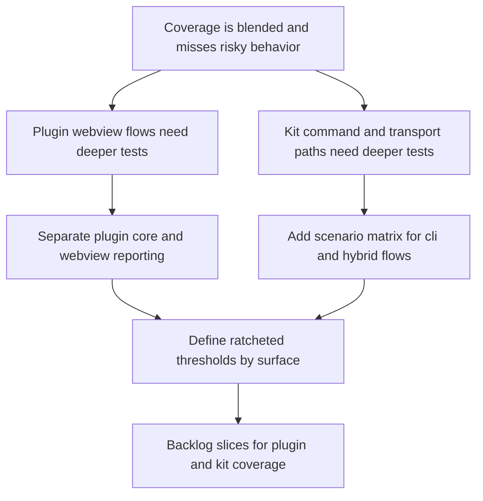

## req_129_greatly_improve_plugin_and_kit_coverage_with_behavior_focused_tests - Greatly improve plugin and kit coverage with behavior-focused tests
> From version: 1.22.0
> Schema version: 1.0
> Status: Draft
> Understanding: 96%
> Confidence: 91%
> Complexity: High
> Theme: Testing, coverage, plugin webview, and Logics kit reliability
> Reminder: Update status/understanding/confidence and references when you edit this doc.

# Needs

- Raise plugin coverage in a way that validates real user-facing behavior, not only static HTML output and packaging presence.
- Raise Logics kit coverage around the highest-risk delivery paths so workflow mutations, hybrid dispatch, and CLI actions are less likely to regress silently.
- Separate useful coverage from misleading coverage so CI can ratchet quality by surface instead of hiding major gaps behind one blended percentage.
- Create a request broad enough to drive several bounded backlog slices without collapsing plugin and kit coverage work into one oversized implementation item.

# Context

- The plugin coverage report currently includes both `src/**/*.ts` and `media/**/*.js` in `vitest.config.mts`, but most of the `media` webview runtime remains effectively untested by coverage:
  - `media/main.js`
  - `media/renderBoard.js`
  - `media/renderDetails.js`
  - `media/webviewChrome.js`
  - `media/webviewPersistence.js`
  - `media/webviewSelectors.js`
  - `media/layoutController.js`

- The repository already verifies VSIX packaging contents in `tests/run_extension_smoke_checks.mjs` and provides a local install helper through `scripts/build/install-vsix.mjs`, but it does not yet lock down the higher-value lifecycle path where the packaged extension is installed into a sandbox workspace, activated in a demo project, and then updated to a newer build. That leaves a gap between "the VSIX contains the right files" and "the packaged extension actually installs, activates, and upgrades cleanly in a realistic local environment."

- The kit already has CLI smoke coverage through `logics/skills/tests/run_cli_smoke_checks.py`, but that smoke path is not yet a full lifecycle test for kit installation and upgrade in a sandbox repository. In particular, it does not yet lock down the higher-risk convergence scenarios:
  - fresh bootstrap in an empty repo
  - re-running bootstrap idempotently
  - repairing a partially bootstrapped or drifted repo
  - migrating older workflow docs and metadata forward
  - updating a canonical `logics/skills` submodule-backed repo and confirming post-update convergence

- The repository already has useful webview test scaffolding in `tests/webviewHarnessTestUtils.ts`, `tests/webview.harness-details-and-filters.test.ts`, and `tests/webview.layout-collapse.test.ts`. The problem is not a total lack of harness capability; the problem is that the highest-volume browser-side behavior is still not covered deeply enough to move the coverage needle or lock down the riskiest UI flows.

- The current plugin metric is therefore directionally correct but operationally misleading. It mixes highly tested TypeScript orchestration code with almost unmeasured browser runtime files. This creates pressure to optimize for the headline percentage instead of the actual regression surface.

- The Logics kit already runs Python coverage through `logics/skills/tests/run_test_coverage.py`, but a few large modules dominate the uncovered surface:
  - `logics/skills/logics-flow-manager/scripts/logics_flow.py`
  - `logics/skills/logics-flow-manager/scripts/logics_flow_dispatcher.py`
  - `logics/skills/logics-flow-manager/scripts/logics_flow_hybrid_transport.py`
  - `logics/skills/logics-flow-manager/scripts/logics_flow_config.py`
  - `logics/skills/logics-flow-manager/scripts/logics_flow_models.py`

- The hybrid runtime already supports environment-driven provider configuration through `.env` and `.env.local`, including `OPENAI_API_KEY`, `GEMINI_API_KEY`, and local Ollama host configuration. That makes it feasible to add a small set of real integration tests for live provider calls when local credentials are configured and explicitly enabled by the operator.

- Those files carry high change risk because they drive the request -> backlog -> task lifecycle, mutation paths, hybrid provider dispatch, and release automation. When coverage remains low there, regressions can survive linting and isolated happy-path tests.

- The highest return-on-effort strategy is not to spray unit tests everywhere. It is to add scenario-driven tests around the main webview flows for the plugin and around the main CLI and transport flows for the kit, then extract testable pure logic where the current file structure makes that hard.

- Coverage should also become more governable:
  - plugin core and plugin webview coverage should be inspectable separately;
  - kit coverage should support ratcheting against the highest-risk modules or command families;
  - CI should fail for meaningful regressions, not because one monolithic global percentage happened to drift.

# Acceptance criteria

- AC1: The request clearly separates plugin coverage and Logics kit coverage as two related but distinct workstreams, with explicit scope for each so backlog grooming can split them into bounded delivery slices.
- AC2: Plugin coverage work is framed around behavior-focused validation of the webview runtime, not just HTML snapshots or package smoke checks. The request explicitly targets critical browser-side flows such as initial render and hydration, board and detail rendering, filtering and selection behavior, layout state, and persistence and restore behavior across the `media/*.js` runtime.
- AC3: Plugin coverage governance is part of scope. The request requires coverage reporting and CI strategy that make plugin core coverage and plugin webview coverage separately visible and ratchetable, so improvement is measurable without masking major gaps in either surface.
- AC4: Logics kit coverage work is framed around scenario-driven tests for the highest-risk workflow paths, especially the flow manager CLI, workflow mutations, hybrid provider transport, dispatcher validation, and release-oriented guarded actions. The request explicitly avoids treating low-risk utility files as the main coverage target.
- AC5: The request requires a strategy to make the lowest-covered kit modules more testable, including extraction or isolation of pure decision logic where current command handlers are too monolithic to validate efficiently. The goal is not refactoring for its own sake; the goal is to unlock durable coverage on business-critical paths.
- AC6: The request defines coverage quality as both metric improvement and regression resistance. Success is not only a higher percentage, but also new tests that would fail on realistic regressions in plugin webview behavior or kit workflow logic.
- AC7: The request includes CI and validation expectations for both ecosystems:
  - plugin validation should continue to use the Node and VS Code extension checks already present in the repository;
  - kit validation should continue to use the Python coverage and CLI smoke flows already present in the repository;
  - any new thresholds or ratchets must be introduced in a way that is incremental and maintainable rather than brittle.
- AC8: The request includes an opt-in strategy for live API integration tests against configured hybrid providers. These tests must run only when provider configuration is present locally and an explicit enable flag is set, must skip cleanly otherwise, and must validate stable contract behavior such as reachability, authentication, model availability, structured response shape, and degraded fallback handling rather than brittle exact model text.
- AC9: The request includes plugin lifecycle integration tests for packaged VSIX installs in a demo or sandbox workspace. These tests must cover at least fresh install and upgrade behavior for the plugin in a realistic local VS Code environment, must verify stable outcomes such as successful installation, activation, basic command or webview availability, and safe update behavior, and must remain opt-in or separately gated until their runtime cost and platform stability are well understood.
- AC10: The request includes Logics kit lifecycle integration tests in sandbox repositories. These tests must cover at least fresh install, idempotent re-run, repair or doctor-assisted convergence, schema or metadata migration where applicable, and update behavior for the canonical kit integration path. They must verify repository convergence and stable operator-facing outcomes rather than only command exit codes.

# Scope

- In:
  - behavior-focused plugin webview coverage expansion
  - explicit coverage strategy for `media/*.js` versus `src/*.ts`
  - sandbox or demo-project integration tests for packaged plugin install and update flows
  - scenario-driven kit coverage expansion for flow manager, dispatcher, hybrid transport, and guarded release flows
  - sandbox repository lifecycle tests for kit install, repair, migrate, and update flows
  - optional local integration tests for real provider API calls when credentials and explicit opt-in are present
  - testability improvements that unlock meaningful coverage in oversized kit modules
  - coverage reporting and CI ratchets by surface or module family
  - documenting what counts as meaningful coverage improvement for this repository
- Out:
  - chasing blanket 100 percent coverage
  - inflating metrics only by excluding hard files from reports without replacing that loss with better signal
  - redesigning the product or UI architecture solely for aesthetics
  - rewriting the entire flow manager before adding tests
  - replacing existing smoke checks with slower end-to-end suites where targeted integration tests are sufficient
  - making live provider tests mandatory in the default CI path before their stability and operator ergonomics are proven
  - making VS Code installation or upgrade lifecycle tests mandatory in the default CI path before they are proven stable across operator machines and automation environments
  - requiring every kit lifecycle scenario to use a real remote repository or a networked update path when a deterministic local sandbox fixture can validate the same convergence contract

# Dependencies and risks

- Dependency: `vitest.config.mts` currently blends plugin core and webview browser runtime coverage; any reporting improvement must stay compatible with the existing Node-based test setup.
- Dependency: the plugin webview tests already rely on local harness utilities in `tests/webviewHarnessTestUtils.ts`; expanding coverage efficiently should build on those utilities instead of creating a second test stack.
- Dependency: plugin install and upgrade lifecycle tests should build on the existing VSIX packaging and install entrypoints instead of inventing a parallel distribution flow.
- Dependency: `logics/skills/tests/run_test_coverage.py` is the current kit coverage entrypoint and should remain the basis for Python coverage reporting unless there is a strong reason to replace it.
- Dependency: kit lifecycle integration tests should build on the existing CLI smoke and flow-manager command surfaces so the repository validates the supported operator path instead of a one-off hidden harness.
- Dependency: `logics_flow.py` and adjacent hybrid and dispatcher modules currently centralize a large amount of logic. Coverage improvement may require careful extraction of pure functions without breaking the operator-facing CLI contract.
- Dependency: live provider tests must align with the existing hybrid provider environment loading and health checks so they only run when local configuration is intentionally available.
- Risk: it is easy to improve the percentage while missing the risky behavior. For example, adding low-value tests around formatting helpers would move the score but would not materially protect workflow mutations or webview state handling.
- Risk: plugin webview tests can become slow or fragile if they overfit DOM details instead of testing stable behavior contracts.
- Risk: install and update lifecycle tests can become flaky if they depend on a globally running VS Code instance, mutable user extensions state, or machine-specific CLI setup. They should prefer isolated user-data and extensions directories, disposable sandbox workspaces, and explicit opt-in execution.
- Risk: kit scenario tests can become hard to maintain if they depend on too much real filesystem or git state. Temporary repo fixtures and deterministic helpers should be preferred over ad hoc integration setups.
- Risk: kit install and update lifecycle tests can become noisy if they mix too many repair and migration concerns into one oversized fixture. Small, deterministic sandbox repos for each lifecycle mode are safer than one giant end-to-end setup.
- Risk: introducing strict fail-under thresholds too early can create noisy CI and pressure the team into gaming the metric. Ratchets should follow proven, stable test additions.
- Risk: live provider tests can become flaky, slow, or unexpectedly costly if they are allowed into the default CI path too early, if they assert exact model wording, or if they run without a deliberate opt-in gate.

# Clarifications

- Primary objective: reduce regression risk on the most fragile plugin and kit surfaces first; treat the global percentage as a lagging indicator rather than the primary success target.
- Backlog shape: split the request into at least two bounded workstreams at backlog time, one for plugin coverage and one for kit coverage.
- Backlog decomposition: prefer five bounded backlog slices rather than one broad plugin item and one broad kit item:
  - plugin webview behavior coverage
  - plugin packaged install and update sandbox coverage
  - kit workflow and flow-manager behavior coverage
  - kit sandbox install, repair, migrate, and update lifecycle coverage
  - live provider integration coverage for configured and healthy local backends
- Plugin first surface: prioritize `media/*.js` before additional `src/*.ts` coverage work because the webview runtime is the largest misleading gap in the current plugin metric.
- Plugin sandbox lifecycle depth: cover packaged VSIX install, activation in a sandbox workspace, basic command or webview availability, upgrade to a newer build, and post-upgrade revalidation before considering deeper end-to-end UI flows.
- Kit first lifecycle modes: prioritize fresh bootstrap, idempotent re-run, repair or doctor convergence, schema or metadata migration, and canonical update-path validation.
- Live provider API tests: keep them opt-in and local-first behind an explicit environment gate such as `LIVE_PROVIDER_TESTS=1`; do not include them in default CI until cost and flakiness are understood.
- Live provider backend set: only exercise providers that are configured locally, non-empty, and healthy at runtime; do not force all possible providers on every machine.
- Plugin install or update sandbox tests: keep them opt-in or separately gated until isolated VS Code CLI execution is stable across operator machines and automation environments.
- Recommended execution order: plugin webview coverage first, then kit workflow coverage, then plugin sandbox lifecycle coverage, then kit sandbox lifecycle coverage, then live provider integration coverage.
- Coverage targets: prefer a ratchet strategy over fixed hard thresholds in this request; set numeric thresholds only after baseline measurement by surface.
- Refactors for testability: allow narrow extractions or helper isolation when they directly unlock durable coverage in oversized modules, but avoid broad structural rewrites as part of the first increment.
- Minimum success bar: deliver new behavior-focused suites on critical plugin and kit surfaces, improve coverage reporting readability by surface, and introduce at least one stable non-fragile ratchet.

# Definition of Ready (DoR)

- [x] Problem statement is explicit and user impact is clear.
- [x] Scope boundaries (in/out) are explicit.
- [x] Acceptance criteria are testable.
- [x] Dependencies and known risks are listed.

# Companion docs

- Product brief(s): (none yet)
- Architecture decision(s): (none yet)

# AI Context

- Summary: Greatly improve repository coverage by targeting the plugin webview runtime, packaged plugin install and update flows, Logics kit sandbox install and update flows, and the highest-risk workflow paths with behavior-focused tests, clearer coverage reporting, pragmatic CI ratchets, and optional live provider integration tests when local API configuration is explicitly enabled.
- Keywords: plugin coverage, webview coverage, media js, vitest, jsdom, behavior focused tests, plugin install test, plugin update test, vsix integration, sandbox workspace, logics kit coverage, kit install test, kit update test, bootstrap convergence, migrate schema, repair flow, flow manager, dispatcher, hybrid transport, cli scenario tests, live api integration tests, openai, gemini, ollama, coverage ratchet, fail under, reporting split
- Use when: Use when planning or splitting work to improve plugin and kit coverage in a way that materially reduces regression risk instead of only increasing a global percentage, including optional local tests against real configured providers, packaged plugin install or update flows, and sandbox kit lifecycle flows.
- Skip when: Skip when the work is only about one isolated failing test, snapshot updates, or a narrow refactor with no coverage strategy impact.

# References

- `vitest.config.mts`
- `tests/webviewHarnessTestUtils.ts`
- `tests/webview.harness-details-and-filters.test.ts`
- `tests/webview.layout-collapse.test.ts`
- `tests/run_extension_smoke_checks.mjs`
- `media/main.js`
- `media/renderBoard.js`
- `media/renderDetails.js`
- `media/webviewChrome.js`
- `media/webviewPersistence.js`
- `media/webviewSelectors.js`
- `media/layoutController.js`
- `scripts/build/install-vsix.mjs`
- `logics/skills/tests/run_test_coverage.py`
- `logics/skills/tests/run_cli_smoke_checks.py`
- `logics/skills/logics-flow-manager/scripts/logics_flow.py`
- `logics/skills/logics-flow-manager/scripts/logics_flow_dispatcher.py`
- `logics/skills/logics-flow-manager/scripts/logics_flow_hybrid_transport.py`
- `logics/skills/logics-flow-manager/scripts/logics_flow_config.py`
- `logics/skills/logics-flow-manager/scripts/logics_flow_models.py`
- `.env`
- `.env.local`
- `logics.yaml`

# Backlog

- `item_239_increase_plugin_webview_behavior_coverage_for_media_runtime_surfaces`
- `item_240_add_sandbox_install_and_update_lifecycle_coverage_for_the_packaged_plugin`
- `item_241_increase_logics_kit_workflow_and_flow_manager_behavior_coverage`
- `item_242_add_sandbox_install_repair_migrate_and_update_lifecycle_coverage_for_the_logics_kit`
- `item_243_add_opt_in_live_provider_integration_coverage_for_configured_healthy_backends`
