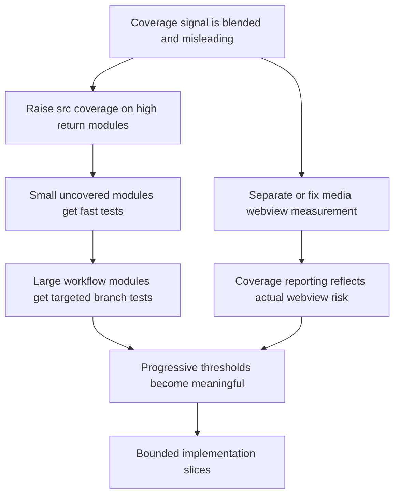

## req_130_make_plugin_coverage_actionable_with_targeted_src_gains_and_honest_webview_measurement - Make plugin coverage actionable with targeted src gains and honest webview measurement

> From version: 1.22.0
> Schema version: 1.0
> Status: Draft
> Understanding: 95%
> Confidence: 89%
> Complexity: Medium
> Theme: Testing, coverage governance, plugin runtime, and webview reliability
> Reminder: Update status/understanding/confidence and references when you edit this doc.

# Needs

- Improve plugin coverage in a way that produces a truthful engineering signal instead of a misleading blended percentage.
- Raise `src/` coverage first on the highest-return files so CI can ratchet meaningful regression protection quickly.
- Treat `media/` webview coverage as a separate instrumentation problem instead of pretending its current `0%` report reflects actual test absence.
- Turn the previously discussed improvement plan into a bounded request that can be split into small backlog slices.

# Context

- The current plugin coverage report is numerically low but diagnostically mixed:
  - global lines coverage is around `30.85%`
  - `src/` lines coverage is around `55.74%`
  - most `media/*.js` files are reported at `0%`

- The repository already has substantial test scaffolding for the plugin:
  - `tests/logicsViewProvider.test.ts`
  - `tests/webview.harness-core.test.ts`
  - `tests/webview.harness-details-and-filters.test.ts`
  - `tests/webview.layout-collapse.test.ts`
  - `tests/webview.persistence.test.ts`

- The problem is therefore not "there are no tests". The problem is that the report currently blends together:
  - extension-side TypeScript modules under `src/`
  - browser-side webview runtime modules under `media/`

- The `media/` runtime is exercised through the JSDOM harness in `tests/webviewHarnessTestUtils.ts`, but those scripts are loaded through `eval`. That makes the current V8 coverage report a poor proxy for real webview behavior coverage. As a result, the global percentage is dominated by an instrumentation limitation as much as by true test gaps.

- Several TypeScript modules remain high-value, high-return candidates for immediate improvement because they are either uncovered or clearly under-covered while still being relatively testable:
  - `src/extension.ts`
  - `src/logicsViewMessages.ts`
  - `src/pythonRuntime.ts`
  - `src/logicsOverlaySupport.ts`
  - `src/logicsProviderUtils.ts`
  - `src/logicsCodexWorkflowController.ts`

- These modules matter because they sit on important user-facing or workflow-critical paths:
  - activation and watcher registration
  - webview message parsing and command routing
  - Python runtime detection and fallback behavior
  - Codex overlay launch and handoff
  - bootstrap and workspace utility decisions
  - Codex workflow remediation and startup behavior

- The highest-return improvement path discussed for this repository is staged:
  - first, add fast behavior-focused unit tests on the small `src/` modules with low current coverage;
  - second, add targeted tests for the larger workflow modules where branch coverage matters most;
  - third, separate or fix `media/` coverage reporting so governance reflects reality instead of one distorted headline number.

- The intent is not to chase a vanity percentage. The intent is to make coverage useful enough that a failing threshold tells the team something operationally meaningful.

# Acceptance criteria

- AC1: Plugin coverage reporting separates `src/` and `media/` concerns clearly enough that engineers can see whether a change improved extension-side regression protection, webview runtime coverage, or both. This can be done by separate reports, separate thresholds, or another explicit governance mechanism, but the result must avoid one misleading blended headline.
- AC2: The next coverage improvement slice targets the low-covered but high-return TypeScript modules first: `src/extension.ts`, `src/logicsViewMessages.ts`, `src/pythonRuntime.ts`, and `src/logicsOverlaySupport.ts`. The request makes these quick wins explicit so the first delivery slice can raise confidence quickly without waiting on a larger refactor.
- AC3: A follow-up slice is explicitly reserved for larger workflow and utility modules where branch coverage matters more than raw line count, especially `src/logicsProviderUtils.ts` and `src/logicsCodexWorkflowController.ts`. The request makes clear that these files need scenario-driven tests around decisions and fallback paths, not only shallow happy-path assertions.
- AC4: The request explicitly treats `media/*.js` coverage as an instrumentation and reporting problem in addition to a test-depth problem. The implementation must either:
  - make the webview runtime measurable by coverage tooling in a trustworthy way, or
  - report it separately so its current measurement limits do not distort plugin-wide governance.
- AC5: Coverage thresholds are introduced or updated progressively rather than as one aggressive gate. The first thresholds must be realistic for the current baseline and should ratchet `src/` coverage before attempting to enforce a single global plugin threshold that is still dominated by inaccurate `media/` reporting.
- AC6: The request keeps the team focused on behavior-focused tests. It explicitly rejects superficial progress based only on snapshots, package contents, or static file inclusion checks when those tests do not exercise runtime decisions, fallback behavior, or user-observable outcomes.

# Clarifications

- Default decision: the first delivery wave optimizes for making `src/` coverage operationally actionable, not for maximizing the blended plugin percentage immediately.
- Default decision: `media/` is treated as a distinct follow-up workstream for trustworthy measurement and governance, rather than being solved inside the first quick-win slice.
- Default decision: the initial ratchet should target `src/` coverage first, with a realistic first threshold around `60%` line coverage and `50%` branch coverage, then tighten later once the baseline improves.
- Default decision: the first slice should stay focused on the low-covered, high-return small modules:
  - `src/extension.ts`
  - `src/logicsViewMessages.ts`
  - `src/pythonRuntime.ts`
  - `src/logicsOverlaySupport.ts`
- Default decision: a second slice should explicitly cover the larger workflow and utility modules where decision-path tests matter most:
  - `src/logicsProviderUtils.ts`
  - `src/logicsCodexWorkflowController.ts`
- Default decision: for `media/`, reporting honesty comes before percentage chasing. If instrumentation remains misleading, `media` should be reported separately from the primary `src/` gate rather than hidden behind one blended threshold.
- Default decision: excluding `media/` from the first enforced gate is acceptable only if the repository still exposes separate `media` coverage visibility so the webview runtime does not disappear from engineering attention.
- Default decision: the expected reporting shape should be explicit:
  - `src` coverage reported and gated first
  - `media` coverage reported separately while instrumentation is being improved
  - global plugin coverage kept as an informative metric until both surfaces are trustworthy
- Default decision: small refactors or seam extraction are allowed when they directly unlock durable tests on large workflow modules; refactoring is not the goal, but it is acceptable when it materially improves testability.
- Default decision: proof should come from behavior-focused assertions around activation, parsing, fallback behavior, remediation decisions, and user-observable outcomes rather than from snapshots alone.
- Default decision: this request remains plugin-scoped even though the earlier parent request also discussed Python kit coverage. The more detailed delivery slicing for this request should stay focused on the VS Code plugin surface.

# Scope

- In:
  - separating actionable plugin coverage reporting for `src/` and `media/`
  - adding fast unit tests for the lowest-covered high-return `src/` modules
  - adding scenario-driven tests for larger workflow and utility modules
  - defining progressive and honest coverage thresholds
  - improving the trustworthiness of webview runtime coverage measurement
- Out:
  - broad repo-wide coverage targets that include unrelated Python kit work
  - refactoring every large source file purely for style reasons
  - rewriting the full webview stack into a framework only to satisfy coverage tools
  - chasing a single vanity percentage without improving regression detection

# Dependencies and risks

- Dependency: `vitest.config.mts` currently reports on both `src/**/*.ts` and `media/**/*.js`, so governance changes must remain understandable in local runs and CI.
- Dependency: `tests/webviewHarnessTestUtils.ts` already provides a real base for webview behavior tests and may also be the anchor point for any improved `media/` measurement strategy.
- Risk: if the request is implemented as "exclude `media/` and move on", the repository may improve the metric while still under-testing important webview behavior. Reporting separation is useful only if it leads to continued webview validation work.
- Risk: if thresholds are introduced too early or too aggressively, they may create churn around low-signal tests and discourage useful refactors in the large workflow files.
- Risk: large modules such as `src/logicsCodexWorkflowController.ts` may require targeted seams or selective extraction before durable branch coverage becomes easy to add. The request should allow that when it unlocks better tests.

# Definition of Ready (DoR)

- [x] Problem statement is explicit and measurable.
- [x] Scope boundaries are explicit.
- [x] Acceptance criteria are testable.
- [x] Dependencies and known risks are listed.

# Companion docs

- Product brief(s): (none yet)
- Architecture decision(s): (none yet)

# AI Context

- Summary: Make plugin coverage more actionable by separating `src/` and `media/` reporting, landing quick-win tests on the lowest-covered high-return TypeScript modules, then extending coverage into larger workflow files and fixing or isolating misleading webview measurement.
- Keywords: plugin coverage, src coverage, media coverage, webview instrumentation, vitest coverage, v8 coverage, extension tests, workflow controller tests, progressive thresholds, honest measurement
- Use when: Use when planning or implementing the next coverage-improvement wave for the VS Code plugin, especially when deciding where to add tests first and how to govern thresholds.
- Skip when: Skip when the work is about Python kit coverage, release automation, or visual-only UI changes without testing or coverage implications.

# AC Traceability

- AC1 -> `item_246`. Proof: plugin coverage reporting separates `src/` and `media/` concerns in CI or local reporting.
- AC2 -> `item_244`. Proof: tests are added for `src/extension.ts`, `src/logicsViewMessages.ts`, `src/pythonRuntime.ts`, and `src/logicsOverlaySupport.ts`.
- AC3 -> `item_245`. Proof: scenario-driven tests raise branch confidence on `src/logicsProviderUtils.ts` and `src/logicsCodexWorkflowController.ts`.
- AC4 -> `item_246`. Proof: `media/*.js` coverage is either measured credibly or governed separately from `src/`.
- AC5 -> `item_246`. Proof: thresholds are staged and aligned with the current baseline.
- AC6 -> `item_244`, `item_245`. Proof: new tests assert runtime behavior and fallback logic rather than only static snapshots or packaging presence.

# References

- `logics/request/req_129_greatly_improve_plugin_and_kit_coverage_with_behavior_focused_tests.md`
- `vitest.config.mts`
- `tests/logicsViewProvider.test.ts`
- `tests/webviewHarnessTestUtils.ts`
- `tests/webview.harness-core.test.ts`
- `tests/webview.harness-details-and-filters.test.ts`
- `tests/webview.layout-collapse.test.ts`
- `tests/webview.persistence.test.ts`
- `src/extension.ts`
- `src/logicsViewMessages.ts`
- `src/pythonRuntime.ts`
- `src/logicsOverlaySupport.ts`
- `src/logicsProviderUtils.ts`
- `src/logicsCodexWorkflowController.ts`

# Backlog

- `logics/backlog/item_244_raise_plugin_src_coverage_on_high_return_entry_and_utility_modules.md`
- `logics/backlog/item_245_add_scenario_driven_coverage_for_plugin_workflow_and_utility_decision_paths.md`
- `logics/backlog/item_246_separate_src_and_media_plugin_coverage_reporting_thresholds_and_webview_measurement.md`
