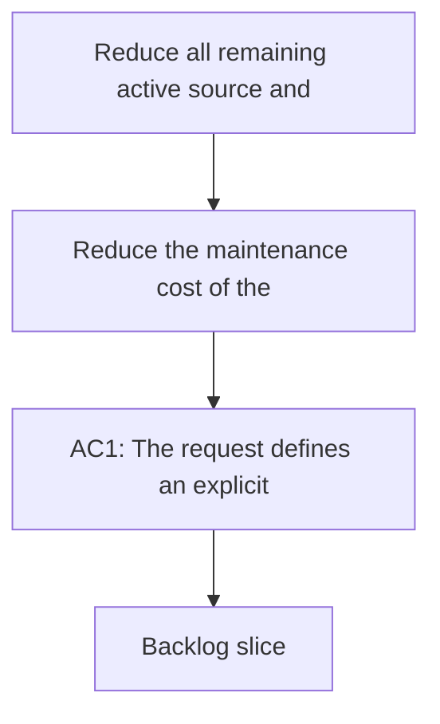

## req_131_reduce_all_remaining_active_source_and_test_files_below_1000_lines_with_seam_driven_refactors - Reduce all remaining active source and test files below 1000 lines with seam-driven refactors
> From version: 1.22.2 (refreshed)
> Understanding: ??% (refreshed)
> Confidence: ??% (refreshed)

> From version: 1.22.0
> Schema version: 1.0
> Status: Done
> Understanding: 97%
> Confidence: 92%
> Complexity: High
> Theme: Architecture, modularity, maintainability, and testability
> Reminder: Update status/understanding/confidence and references when you edit this doc.

# Needs

- Reduce the maintenance cost of the remaining active source and test files that still exceed `1000` lines.
- Make large edit surfaces safer to review, test, and evolve by splitting them along real ownership seams rather than by raw line count alone.
- Establish a repository expectation that active non-generated source and test files should stay below `1000` lines unless an explicit exception is documented.
- Turn the current oversized-file inventory into a bounded structural refactoring request that can be split into coherent backlog slices.

# Context

- Earlier modularization requests already improved several large surfaces:
  - `req_050_split_oversized_source_files_into_coherent_modules`
  - `req_117_resume_modularization_of_oversized_core_extension_and_workflow_modules`

- Those earlier passes were useful, but the repository still contains several active files above the intended upper bound of `1000` lines. At the time of this request, the notable remaining files are:
  - `src/logicsViewProvider.ts` - split below the threshold
  - `media/main.js` - split below the threshold
  - `src/logicsHybridInsightsHtml.ts` - split below the threshold
  - `src/logicsCodexWorkflowController.ts` - split below the threshold
  - `tests/logicsViewProvider.test.ts` - split below the threshold
  - `tests/webview.harness-details-and-filters.test.ts` - split below the threshold
  - `tests/webview.harness-core.test.ts` - split below the threshold
  - `logics/skills/logics-flow-manager/scripts/logics_flow.py` - split below the threshold
  - `logics/skills/tests/test_logics_flow.py` - split below the threshold
  - `logics/skills/logics-flow-manager/scripts/logics_flow_hybrid.py` - split below the threshold
  - `logics/skills/logics-flow-manager/scripts/logics_flow_support.py` - split below the threshold
  - `logics/skills/logics-flow-manager/scripts/logics_flow_hybrid_transport.py` - split below the threshold
  - `logics/skills/logics-flow-manager/scripts/workflow_audit.py` - split below the threshold

- Generated artifacts under `out/` also exceed `1000` lines, but they are intentionally out of scope for refactoring because they are build outputs, not maintained source.

- The problem is not simply aesthetics. These oversized files tend to accumulate several risks at once:
  - too many unrelated responsibilities in one edit surface
  - larger and noisier code reviews
  - weaker change isolation
  - slower onboarding and navigation
  - harder targeted coverage and branch testing
  - higher merge-conflict pressure on central files

- The repository now has enough evidence that large files and weakly isolated behavior are linked. Recent coverage analysis and previous modularization work both point in the same direction:
  - large plugin files slow down behavior-focused tests and coverage gains
  - large workflow-manager scripts slow down safe change delivery and increase regression risk
  - large monolithic test files become hard to extend without making failures noisy and brittle

- This request is intentionally stricter than the earlier modularization requests. The goal is no longer only "continue modularization where useful". The goal is to bring the remaining active files under an explicit maintenance ceiling of `1000` lines whenever possible, with documented exceptions only when a split would clearly harm discoverability more than it helps.

- The refactor still needs to stay intelligent:
  - split by responsibility seams
  - preserve obvious entry points
  - avoid replacing one understandable large file with many tiny opaque fragments
  - improve testability and ownership rather than merely moving code around

# Acceptance criteria

- AC1: The request defines an explicit repository target that active non-generated source and test files should be kept below `1000` lines by default. Any file that remains above that threshold after the work must have a documented justification rather than drifting there implicitly.
- AC2: Each targeted oversized file is refactored along coherent domain seams rather than split mechanically by line count. The resulting module boundaries should reflect responsibilities such as orchestration, rendering, state, command routing, transport, validation, reporting, fixtures, or behavior-domain test grouping.
- AC3: The known oversized plugin source files are covered by the plan, including at least:
  - `src/logicsViewProvider.ts`
  - `media/main.js`
  - `src/logicsHybridInsightsHtml.ts`
  - `src/logicsCodexWorkflowController.ts`
- AC4: The known oversized plugin test files are covered by the plan, including at least:
  - `tests/logicsViewProvider.test.ts`
  - `tests/webview.harness-details-and-filters.test.ts`
  - `tests/webview.harness-core.test.ts`
  The splits must preserve behavioral intent and improve test maintainability rather than only moving assertions into more files.
- AC5: The known oversized Logics flow-manager and audit surfaces are covered by the plan, including at least:
  - `logics/skills/logics-flow-manager/scripts/logics_flow.py`
  - `logics/skills/tests/test_logics_flow.py`
  - `logics/skills/logics-flow-manager/scripts/logics_flow_hybrid.py`
  - `logics/skills/logics-flow-manager/scripts/logics_flow_support.py`
  - `logics/skills/logics-flow-manager/scripts/logics_flow_hybrid_transport.py`
  - `logics/skills/logics-flow-manager/scripts/workflow_audit.py`
- AC6: The refactoring plan is incremental and backlogable. It must be possible to deliver the work in bounded slices by surface or seam, instead of one risky all-at-once rewrite across plugin, tests, and Python workflow scripts.
- AC7: Behavior is preserved across all split surfaces with validation appropriate to each area, including plugin tests, webview harness tests, and Python workflow-manager tests. Structural cleanup must not silently trade away regression confidence.
- AC8: The resulting structure improves navigability and ownership. Entry points must remain obvious:
  - `src/logicsViewProvider.ts` still reads as the provider entry surface
  - `media/main.js` still reads as the webview entry surface
  - `logics_flow.py` and adjacent workflow-manager entrypoints remain discoverable CLI anchors
- AC9: The refactor is allowed to create shared helpers or extracted modules only when they reduce duplication, clarify ownership, or unlock testing. It must avoid fragmentation into trivial wrappers or circular dependencies.

# Clarifications

- Default decision: generated outputs such as `out/*.js`, `dist/**`, and coverage artifacts are excluded from the target because they are not maintained source.
- Default decision: Markdown files such as long requests, specs, or READMEs are also excluded from this structural target unless a separate documentation hygiene request covers them. This request focuses on active code and active tests.
- Default decision: the threshold applies to maintained source and tests in TypeScript, JavaScript, Python, and related runtime files. It is a maintainability guardrail, not an arbitrary formatting rule.
- Default decision: if a file is only slightly above `1000` lines and the current shape is still healthy, a documented exception is acceptable, but the burden of proof is on keeping it large.
- Default decision: plugin source, plugin tests, and Python workflow-manager code should become distinct backlog slices so changes stay reviewable and regression attribution remains clear.
- Default decision: large test files should be split by behavior domain or command family, not by raw file chunking. The goal is clearer failure signals and easier local extension of the suite.
- Default decision: when a large module is hard to split safely, small preparatory seam extraction is acceptable before the main split lands.
- Default decision: the `< 1000` target is a strong default expectation, not a blind mechanical rule. Exceptions are allowed only when they are documented and justified by entrypoint clarity or discoverability.
- Default decision: workstream priority should start with active plugin source, then active plugin tests, then the Python workflow-manager surfaces. This ordering gives the best day-to-day maintainability return while keeping regression validation manageable.
- Default decision: file priority should follow operational centrality, not only raw size. The first high-priority sources are:
  - `src/logicsViewProvider.ts`
  - `src/logicsCodexWorkflowController.ts`
  - `media/main.js`
  - `logics/skills/logics-flow-manager/scripts/logics_flow.py`
- Default decision: oversized test files may remain temporarily above `1000` lines during an intermediate step if the final split is already clear and behavior-domain extraction is underway. Mechanical chunking just to satisfy the threshold is not acceptable.
- Default decision: test-suite splits should follow behavior families such as provider lifecycle, message handling, workspace and watcher behavior, webview details and filters, persistence, hybrid runtime flows, or command-family groupings.
- Default decision: extracted shared helpers are encouraged when they reduce duplication, clarify ownership, or unlock targeted testing. Shared helpers are not encouraged when they merely introduce indirection.
- Default decision: visible entry files should remain visible and readable after the split:
  - `src/logicsViewProvider.ts` remains the provider entry surface
  - `media/main.js` remains the webview entry surface
  - `logics_flow.py` remains a discoverable CLI anchor
- Default decision: newly created extracted modules should usually stay comfortably below the threshold as well. As a working heuristic, avoid creating new modules above roughly `700` to `800` lines unless a clear boundary justifies it.
- Default decision: each bounded refactor slice should preserve or improve regression confidence. Structural changes that reduce test clarity or coverage signal are not considered successful even if file sizes go down.
- Default decision: validation expectations should remain surface-aware:
  - plugin source refactors should normally keep `npm run lint` and `npm run test` green
  - plugin packaging or activation-sensitive refactors should also run `npm run test:smoke` when relevant
  - Python workflow-manager refactors should run the targeted Python suite and, when the touched area is broad enough, the repository's Python coverage path
- Default decision: acceptable exception criteria are narrow. A file may remain above `1000` lines only when:
  - it is a clear and valuable entrypoint
  - further splitting would materially reduce readability or discoverability
  - the justification is written in the corresponding backlog item or task

# Scope

- In:
  - inventorying and targeting the active non-generated source and test files still above `1000` lines
  - splitting those files into coherent modules or suites
  - documenting any justified exceptions that remain above the threshold
  - preserving behavior and validation through the refactors
  - keeping obvious entrypoints readable while moving subordinate responsibilities out
- Out:
  - refactoring generated outputs under `out/`, `dist/`, or coverage reports
  - reworking documentation files solely because they are long
  - changing user-visible product behavior under the cover of file splitting
  - replacing the current webview architecture with a frontend framework solely to satisfy the line-limit goal
  - splitting files into tiny fragments that reduce discoverability

# Dependencies and risks

- Dependency: the existing plugin tests, webview harness, smoke checks, and Python tests must remain reliable enough to protect the refactors as seams move.
- Dependency: previous modularization work and current architecture decisions should be reused where they already define sensible ownership boundaries.
- Risk: treating `1000` lines as a purely mechanical rule could create shallow wrappers and weaker navigation instead of better structure.
- Risk: attempting to refactor all oversized surfaces in one pass would create high merge pressure and weak regression attribution.
- Risk: large test files may hide shared fixtures and assumptions that need to be extracted deliberately before the suites can be split safely.
- Risk: large Python workflow-manager files may have implicit coupling through globals, CLI parsing, or shared mutation/reporting helpers that must be made explicit during extraction.

# Definition of Ready (DoR)

- [x] Problem statement is explicit and user impact is clear.
- [x] Scope boundaries are explicit.
- [x] Acceptance criteria are testable.
- [x] Dependencies and known risks are listed.

# Companion docs

- Product brief(s): (none yet)
- Architecture decision(s): (none yet)

# AI Context

- Summary: Reduce all remaining active non-generated source and test files above 1000 lines through seam-driven modularization across plugin source, plugin tests, and Logics flow-manager Python code, while preserving behavior and documenting any justified exceptions.
- Keywords: modularization, oversized files, 1000 line limit, seam driven refactor, plugin source, webview, workflow manager, test suite split, maintainability, ownership
- Use when: Use when planning or executing the next structural refactor wave aimed at bringing oversized maintained files below the repository's intended size ceiling.
- Skip when: Skip when the work is about generated outputs, long documentation files, or feature delivery with no structural ownership change.

# AC Traceability

- AC1 -> `item_247`, `item_248`, `item_249`, `item_250`. Proof: the repository adopts an explicit below-1000-lines target for active maintained source and tests, with documented exceptions only.
- AC2 -> `item_247`, `item_248`, `item_249`, `item_250`. Proof: each split is justified by responsibility seams rather than by arbitrary chunking.
- AC3 -> `item_247`. Proof: the oversized plugin source files are split into clearer modules and reduced below the target unless an exception is documented.
- AC4 -> `item_248`. Proof: the oversized plugin test suites are reorganized into behavior-domain suites with preserved coverage intent.
- AC5 -> `item_249`, `item_250`. Proof: the oversized workflow-manager and audit Python surfaces are decomposed into clearer modules while preserving CLI behavior.
- AC6 -> `item_247`, `item_248`, `item_249`, `item_250`. Proof: the work is delivered through bounded backlog slices rather than a big-bang rewrite.
- AC7 -> `item_247`, `item_248`, `item_249`, `item_250`. Proof: validation remains green and behavior confidence is preserved through the splits.
- AC8 -> `item_247`, `item_249`. Proof: entrypoint readability remains intact after subordinate responsibilities move into extracted modules.
- AC9 -> `item_247`, `item_248`, `item_249`, `item_250`. Proof: shared helpers improve ownership or testability without degenerating into fragmented indirection or circular imports.

# References

- `logics/request/req_050_split_oversized_source_files_into_coherent_modules.md`
- `logics/request/req_117_resume_modularization_of_oversized_core_extension_and_workflow_modules.md`
- `src/logicsViewProvider.ts`
- `media/main.js`
- `src/logicsHybridInsightsHtml.ts`
- `src/logicsCodexWorkflowController.ts`
- `tests/logicsViewProvider.test.ts`
- `tests/webview.harness-details-and-filters.test.ts`
- `tests/webview.harness-core.test.ts`
- `logics/skills/logics-flow-manager/scripts/logics_flow.py`
- `logics/skills/tests/test_logics_flow.py`
- `logics/skills/logics-flow-manager/scripts/logics_flow_hybrid.py`
- `logics/skills/logics-flow-manager/scripts/logics_flow_support.py`
- `logics/skills/logics-flow-manager/scripts/logics_flow_hybrid_transport.py`
- `logics/skills/logics-flow-manager/scripts/workflow_audit.py`

# Backlog

- `logics/backlog/item_247_split_oversized_plugin_source_entry_and_orchestration_surfaces_below_1000_lines.md`
- `logics/backlog/item_248_split_oversized_plugin_test_suites_by_behavior_domain_below_1000_lines.md`
- `logics/backlog/item_249_split_oversized_flow_manager_cli_and_support_scripts_below_1000_lines.md`
- `logics/backlog/item_250_split_oversized_flow_manager_hybrid_audit_and_test_surfaces_below_1000_lines.md`
