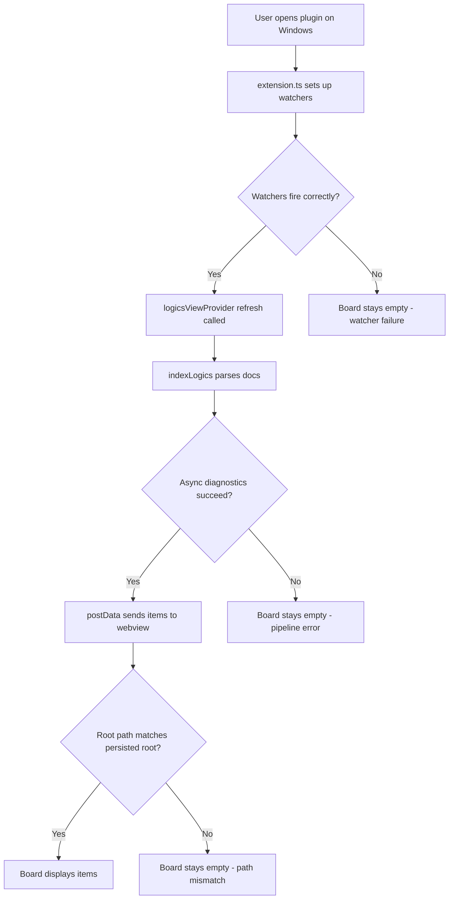

## req_132_fix_empty_board_on_windows_due_to_indexing_and_path_issues - Fix empty board on Windows due to indexing and path issues
> From version: 1.22.0
> Schema version: 1.0
> Status: Draft
> Understanding: 90%
> Confidence: 75%
> Complexity: High
> Theme: Runtime
> Reminder: Update status/understanding/confidence and references when you edit this doc.

# Needs
- On Windows the plugin board stays completely empty even when Logics docs exist in the repo and all filters are disabled.
- The root cause is not filter-related: filters only hide already-loaded items in the webview.
- The docs never reach the webview, pointing to an indexing, transmission, or initialization failure specific to Windows.

# Context
- Reported in GitHub issue: https://github.com/AlexAgo83/cdx-logics-vscode/issues/1
- The `logics/` folder contains valid docs, so the board should display items.
- Disabling all webview filters does not fix the problem, which confirms the issue happens before items are sent to the webview.

Three probable root cause areas have been identified, ordered by likelihood of causing the initial empty board:

1. **[Critical] Async refresh pipeline** (`src/logicsViewProvider.ts`): `refresh()` calls `indexLogics(root)` at line 301, then runs a `Promise.all` at line 303 grouping `getGitChangedPaths`, `inspectRuntimeLaunchers`, `inspectLogicsEnvironment`, and `inspectGitHubReleaseCapability`. This `Promise.all` has no try/catch: if any of these rejects on Windows, `postData({ items })` at line 314 is never reached. This is the most likely cause of a completely empty board on first load.

2. **[Secondary] FileSystemWatcher setup** (`src/extension.ts`): `createFileSystemWatcher(new RelativePattern(root, ...))` uses glob patterns (`logics/**/*.{md,markdown,yaml,yml}`, `.claude/**/*.{md,markdown,yml,yaml}`, `logics.yaml`, `.git/HEAD`). If watchers behave differently on Windows or silently fail, subsequent refresh cycles would not fire. Note: this does not affect the initial `refresh()` which is called directly from `resolveWebviewView`, so this piste impacts reactivity after init, not the first render.

3. **[Low] Workspace root comparison** (`media/main.js`, `src/logicsProviderUtils.ts`): The webview uses a simple string equality (`persistedWorkspaceRoot !== payload.root`) to validate incoming data. On Windows this is fragile due to case differences (`C:\` vs `c:\`), slash direction (backslash vs forward slash), and path resolution variants. A Windows-aware helper `areSamePath` already exists in the codebase but is not used in the webview path. This would cause a UI state reset rather than an empty board on first load, but could compound with piste 1 on subsequent refreshes.

# Scope
- **In scope**: fixing the three root cause areas so the board renders on Windows; adding unit tests with mocked Windows paths.
- **Out of scope**: permanent Windows logging/output channel for ongoing diagnostics. Logging may be added during investigation but is not a deliverable.

# Acceptance criteria
- AC1: `indexLogics(root)` returns items on Windows when Logics docs exist in the workspace.
- AC2: `postData({ items })` is reliably called after `indexLogics` completes, even if non-critical async diagnostics fail. Specifically, the `Promise.all` in `refresh()` must be resilient to partial rejection (e.g. via `Promise.allSettled` or try/catch) so that items are always sent to the webview.
- AC3: FileSystemWatcher patterns fire correctly on Windows for all monitored glob patterns.
- AC4: Workspace root comparison in the webview uses a Windows-aware path comparison equivalent to `areSamePath`.
- AC5: The board displays Logics docs on Windows when docs exist and no filters are active.
- AC6: Unit tests cover path normalization with Windows-style paths (`C:\Users\...`, mixed slashes, case variations).

# AC Traceability
- AC1 -> task_115 wave 1 step 1.2: `indexLogics(root)` resilience. Proof: unit test + compile gate.
- AC2 -> task_115 wave 1 steps 1.1-1.5: `Promise.allSettled` with safe defaults. Proof: unit test showing postData called when diagnostics reject.
- AC3 -> task_115 wave 2 step 2.3: watcher pattern verification. Proof: documented VS Code API behavior or manual test.
- AC4 -> task_115 wave 2 steps 2.1-2.2: Windows-aware path comparison. Proof: unit test with Windows-style paths.
- AC5 -> task_115 wave 3 step 3.4: end-to-end validation. Proof: reporter confirms board displays items on Windows via pre-release VSIX.
- AC6 -> task_115 wave 3 steps 3.1-3.3: unit tests with Windows paths. Proof: test suite passes.

# Definition of Ready (DoR)
- [x] Problem statement is explicit and user impact is clear.
- [x] Scope boundaries (in/out) are explicit.
- [x] Acceptance criteria are testable.
- [x] Dependencies and known risks are listed.

# Known risks
- Without a Windows test environment, some fixes may need to be validated by the reporter.
- Watcher behavior differences may be VS Code version-dependent.

# Validation strategy
- Unit tests with mocked Windows paths (`C:\Users\project`, `c:\users\project`, mixed slashes) to cover `areSamePath` and root comparison logic.
- Build a pre-release VSIX and ask the issue reporter to validate on Windows before closing.

# Companion docs
- Product brief(s): (none yet)
- Architecture decision(s): (none yet)

# AI Context
- Summary: Fix Windows-specific bug where the plugin board stays empty because docs never reach the webview
- Keywords: windows, board, empty, watcher, path, indexing, refresh, postData, areSamePath, RelativePattern
- Use when: Use when investigating or fixing Windows-specific rendering, indexing, or path normalization issues in the VS Code extension.
- Skip when: Skip when the work targets macOS/Linux-only behavior or unrelated plugin features.

# References
- `src/logicsViewProvider.ts`
- `src/extension.ts`
- `media/main.js`
- `src/logicsProviderUtils.ts`

# Backlog
- `item_251_harden_async_refresh_pipeline_against_partial_promise_rejection`
- `item_252_normalize_workspace_root_comparison_with_windows_aware_path_logic`
- `item_253_add_windows_path_normalization_unit_tests_and_pre_release_validation`
