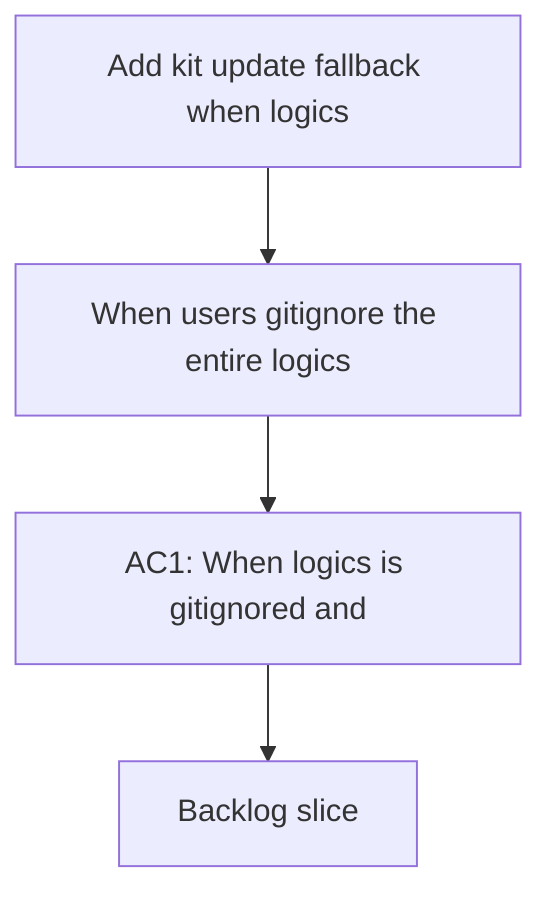

## req_133_add_kit_update_fallback_when_logics_is_gitignored - Add kit update fallback when logics is gitignored
> From version: 1.22.1
> Schema version: 1.0
> Status: Done
> Understanding: 95%
> Confidence: 90%
> Complexity: Medium
> Theme: General
> Reminder: Update status/understanding/confidence and references when you edit this doc.

# Needs
- When users gitignore the entire `logics/` directory (a legitimate choice for teams that do not want to version workflow docs), the plugin loses the ability to update the Logics kit because the current update path relies exclusively on `git submodule update --init --remote --merge -- logics/skills`.
- The plugin should remain able to update or reinstall the kit even when the submodule is not tracked by git, so that local-only Logics usage stays viable without a manual recovery path.

# Context
- The current kit update flow in `src/logicsCodexWorkflowController.ts` calls `git submodule update` on `logics/skills`. This requires git to track the submodule pointer.
- If `logics/` or `logics/*` appears in `.gitignore`, git stops tracking the submodule. After a fresh clone or `git clean`, `logics/skills` disappears entirely.
- `inspectLogicsKitSubmodule` then returns `exists: false`, `inspectLogicsBootstrapState` reports `missing-skills`, and the bootstrap script (`logics/skills/logics.py`) is absent. This creates a deadlock: no kit means no bootstrap script means no kit.
- The `REQUIRED_GITIGNORE_ENTRIES` in `src/logicsProviderUtils.ts` only lists cache and runtime artifacts. There is no detection of overly broad patterns that would break the submodule.
- Ignoring `logics/` is a valid user choice (local-only workflow docs, no versioning desired). The plugin should support this rather than fight it.

# Design decisions

## D1: Fallback source cascade
The fallback tries two sources in order: (1) copy from the global published kit (`~/.codex/skills/` or `~/.claude/` whichever is present and most recent, using the same inspection logic as `inspectClaudeGlobalKit` / `inspectCodexWorkspaceOverlay`), then (2) direct `git clone` from the canonical URL (`https://github.com/AlexAgo83/cdx-logics-kit.git`). Copy-first is preferred because it is instantaneous and works offline.

## D2: Subsequent updates after fallback
After a fallback clone, `logics/skills` contains a standalone `.git` directory. Future updates use `git -C logics/skills pull origin main` instead of `git submodule update`. After a fallback copy (no `.git`), future updates re-copy from the global kit or fall back to a fresh clone. The plugin detects the nature of the directory (presence of `.git` in `logics/skills`) to choose the right update strategy.

## D3: Detection strategy (proactive + reactive)
Two complementary layers: (1) proactive scanning of `.gitignore` for broad patterns covering `logics/skills` to show a warning (AC5), and (2) reactive fallback when submodule update actually fails. Proactive detection alone is insufficient because the user could have a global `.gitignore`, a `.git/info/exclude`, or other mechanisms the plugin cannot easily enumerate.

## D4: User confirmation before fallback
The fallback clone/copy writes into the repo outside git submodule control. The plugin asks for explicit confirmation before proceeding, consistent with the existing bootstrap confirmation pattern. Message example: "The logics/skills submodule is not functional (logics/ appears to be gitignored). Install the kit via direct clone/copy?"

## D5: Global kit source selection
Both the Claude global kit (`~/.claude/`) and the Codex global kit (`~/.codex/`) are candidates. The plugin uses the existing `inspectClaudeGlobalKit` and `inspectCodexWorkspaceOverlay` inspection to find the most recent viable source, regardless of the runtime that published it.

# Acceptance criteria
- AC1: When `logics/` is gitignored and `logics/skills` is missing, the plugin detects the situation and offers a fallback update path (with user confirmation) instead of only reporting a missing submodule.
- AC2: The fallback tries copying from the global kit first (offline-safe), then falls back to a direct `git clone` from the canonical URL.
- AC3: After a successful fallback update, bootstrap convergence runs normally and the plugin reaches a functional state.
- AC4: The existing submodule-based update path is unchanged when `logics/` is not gitignored.
- AC5: The plugin proactively warns users when it detects a broad gitignore pattern (e.g. `logics/`, `logics/*`) that covers `logics/skills`, explaining the trade-off and the fallback available.
- AC6: Subsequent updates after a fallback detect whether `logics/skills` is a standalone clone (git pull) or a copy (re-copy from global kit or fresh clone) and use the appropriate strategy.

# AC Traceability
- AC1 -> task_116 wave 2 steps 5-7: fallback offered when submodule fails. Proof: test with gitignored logics/ confirms fallback prompt.
- AC2 -> task_116 wave 2 steps 5-6: global kit copy first, clone second. Proof: test with global kit present confirms copy-first, test without confirms clone.
- AC3 -> task_116 wave 2 step 7: bootstrap convergence post-fallback. Proof: functional state inspection after fallback install.
- AC4 -> task_116 wave 2 step 8: existing submodule path unchanged. Proof: existing submodule update tests still pass.
- AC5 -> task_116 wave 1 steps 1-3: proactive gitignore pattern detection and warning. Proof: unit test for pattern detection and Check Environment warning.
- AC6 -> task_116 wave 3 steps 10-13: adaptive update routing by install type. Proof: tests for each routing path (submodule, standalone, copy).

# Definition of Ready (DoR)
- [x] Problem statement is explicit and user impact is clear.
- [x] Scope boundaries (in/out) are explicit.
- [x] Acceptance criteria are testable.
- [x] Dependencies and known risks are listed.

# Risks and dependencies
- The global kit directories (`~/.codex/`, `~/.claude/`) may not exist on a fresh machine with no prior bootstrap. In that case both fallback sources are unavailable and the plugin must explain how to bootstrap from scratch (network required).
- A standalone clone in `logics/skills` diverges from the submodule model. If the user later removes `logics/` from `.gitignore`, the plugin should not attempt submodule operations on a standalone clone directory.
- The `.gitignore` detection for broad patterns is best-effort: global gitignore, `.git/info/exclude`, and nested `.gitignore` files may also contribute. The reactive fallback (D3) is the safety net.

# Companion docs
- Product brief(s): (none yet)
- Architecture decision(s): (none yet)

# References
- `src/logicsCodexWorkflowController.ts` (updateLogicsKit, inspectLogicsKitSubmodule usage)
- `src/logicsProviderUtils.ts` (inspectLogicsKitSubmodule, getMissingBootstrapGitignoreEntries, REQUIRED_GITIGNORE_ENTRIES)
- `src/logicsEnvironment.ts` (inspectLogicsEnvironment, bootstrapRepair capability)

# AI Context
- Summary: Add a fallback kit update mechanism when logics/ is gitignored so the plugin can still update the kit via direct clone or global kit copy instead of relying on git submodule
- Keywords: kit, update, fallback, gitignore, submodule, bootstrap, deadlock, clone, global-kit, standalone, cascade
- Use when: Use when the user has gitignored logics/ and the plugin needs to update or install the kit without a functional git submodule.
- Skip when: Skip when the submodule is tracked normally and git submodule update works.

# Backlog
- `item_254_detect_dangerous_gitignore_patterns_covering_logics_skills_and_warn_the_user`
- `item_255_fallback_kit_install_via_global_kit_copy_or_direct_clone_when_submodule_is_unavailable`
- `item_256_adaptive_kit_update_strategy_for_standalone_clone_vs_submodule_installs`
