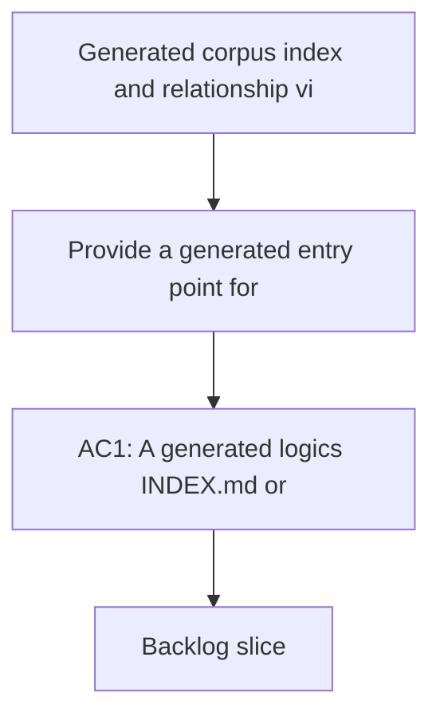

## req_134_generated_corpus_index_and_relationship_views - Generated corpus index and relationship views
> From version: 1.22.2
> Schema version: 1.0
> Status: Done
> Understanding: 100%
> Confidence: 97%
> Complexity: Medium
> Theme: Navigation and discoverability
> Reminder: Update status/understanding/confidence and references when you edit this doc.

# Needs
- Provide a generated entry point for navigating a large `logics/` corpus without manual directory scanning.
- Surface the important workflow families as a generated index or a better equivalent view that keeps navigation cheap as the corpus grows.
- Make relationship visibility first-class so requests, backlog items, tasks, product briefs, and architecture notes can be reached from one maintained surface.
- Keep the generated views reproducible from repository data and easy to refresh as docs change.

# Context
- The repository now contains a large Logics corpus with requests, backlog items, tasks, product briefs, architecture notes, and support docs.
- The current review showed that navigation is still mostly manual even though the individual files are in good shape.
- Related work already exists around managed-doc indexing and relationship surfacing in the plugin and kit:
  - `logics/request/req_056_add_codex_context_pack_attention_explain_and_dependency_map.md`
  - `logics/backlog/item_067_add_dependency_map_for_logics_workflow_relationships.md`
  - `logics/request/req_083_add_internal_logics_kit_governance_migration_and_machine_readable_tooling_primitives.md`
  - `logics/instructions.md`
- This request should focus on repository-level navigation views first. If a better shape than plain `INDEX.md` and `RELATIONSHIPS.md` emerges, the delivery should still preserve the same discoverability outcome.

# Acceptance criteria
- AC1: A generated `logics/INDEX.md` or equivalent exists and lists the core workflow document families with titles, status or progress, and direct repo-relative paths.
- AC2: A generated `logics/RELATIONSHIPS.md` or equivalent exists and shows the important links between requests, backlog items, tasks, product briefs, architecture notes, and support docs.
- AC3: The generated views can be refreshed deterministically from repository data, with a documented command or script entry point.
- AC4: The navigation surface makes it faster to find related docs than browsing the raw directory tree, especially for large request/backlog/task clusters.
- AC5: The generated output includes validation or guardrails for stale links, missing refs, or docs that are not yet represented in the views.

# Definition of Ready (DoR)
- [x] The problem statement explicitly describes the navigation pain and why manual discovery no longer scales.
- [x] Scope boundaries are clear: generated navigation views are in scope, a full UI redesign is not.
- [x] Acceptance criteria are testable and map to concrete generated artifacts.
- [x] Dependencies on existing index/relationship data are listed.
- [x] Known risks and fallback behavior are documented.

# Companion docs
- Product brief(s): `prod_005_logics_corpus_navigation_views`
- Architecture decision(s): `adr_016_use_generated_corpus_index_and_relationship_views_for_logics_navigation`

# AI Context
- Summary: Generated corpus index and relationship views for the Logics repository
- Keywords: index, relationships, navigation, discoverability, corpus, logics
- Use when: Use when grooming a repository-level navigation layer for a large Logics corpus.
- Skip when: Skip when the work targets a different workflow surface or a broader product redesign.
# Backlog
- `item_257_generated_corpus_index_and_relationship_views`
- `logics/backlog/item_257_generated_corpus_index_and_relationship_views.md`
