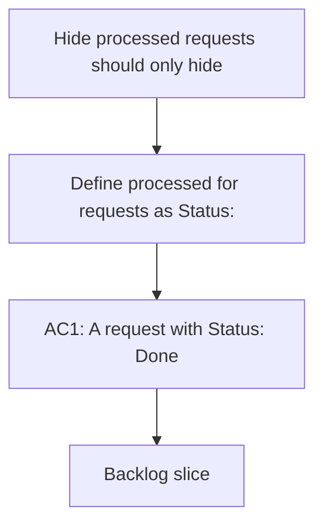

## req_135_hide_processed_requests_should_only_hide_done_requests - Hide processed requests should only hide done requests
> From version: 1.22.2
> Schema version: 1.0
> Status: Done
> Understanding: 96%
> Confidence: 94%
> Complexity: Medium
> Theme: General
> Reminder: Update status/understanding/confidence and references when you edit this doc.

# Needs
- Define `processed` for requests as `Status: Done`, not as "linked to a backlog item or task".
- Keep requests that are still not done visible when `Hide processed requests` is enabled.
- Apply the rule consistently in the plugin views that list requests.
- Preserve request-to-item and request-to-task relationships for traceability, but do not use them as visibility logic.
- Add regression coverage so a request that has linked work but is not done still appears when the filter is active.

# Context
- The current behavior treats a request as processed when it is covered by a downstream Logics item or task.
- That makes active requests disappear too early even when they are not finished.
- Operators expect `Hide processed requests` to mean "hide requests that are actually Done".
- `Done` is the canonical completion signal in the workflow docs, so the filter should key off request status instead of downstream implementation tracking.
- Related workflow alignment already exists in `req_023_replace_hide_used_requests_with_hide_processed_requests_semantics` and `item_028_replace_hide_used_requests_with_hide_processed_requests_semantics`.

# Acceptance criteria
- AC1: A request with `Status: Done` is hidden when `Hide processed requests` is enabled.
- AC2: A request that is not `Done` stays visible even if it already has linked backlog items or tasks.
- AC3: The plugin uses request status, not downstream item/task linkage, to decide whether a request is processed.
- AC4: The behavior is covered by regression tests or equivalent validation.

# Definition of Ready (DoR)
- [x] Problem statement is explicit and user impact is clear.
- [x] Scope boundaries (in/out) are explicit.
- [x] Acceptance criteria are testable.
- [x] Dependencies and known risks are listed.

# Companion docs
- Product brief(s): (none yet)
- Architecture decision(s): (none yet)

# AI Context
- Summary: Hide processed requests should only hide done requests
- Keywords: hide, processed, requests, done, status, visibility
- Use when: Use when the plugin should hide only requests that are actually done, regardless of downstream item or task coverage.
- Skip when: Skip when the work is about a different filter, view mode, or workflow stage.
# Backlog
- `item_259_hide_processed_requests_should_only_hide_done_requests`
