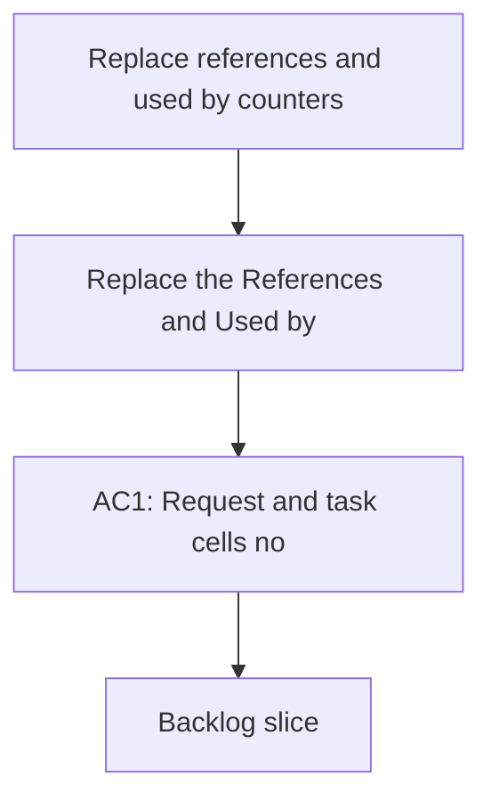

## req_136_replace_references_and_used_by_counters_with_a_discreet_progress_complexity_badge - Replace references and used by counters with a discreet progress complexity badge
> From version: 1.22.2
> Schema version: 1.0
> Status: Draft
> Understanding: 96%
> Confidence: 93%
> Complexity: Medium
> Theme: General
> Reminder: Update status/understanding/confidence and references when you edit this doc.

# Needs
- Replace the `References` and `Used by` counters in request and task cells with a compact badge.
- Show `progress` and `complexity` in that badge so cells still communicate delivery state at a glance.
- Keep the badge visually discreet enough for dense board and list views.
- Allow short labels if needed, but keep the meaning obvious to the user.
- Preserve the underlying relation data for details and traceability; this is only a presentation change.

# Context
- Request and task cells currently surface relation counters that are useful for traceability but heavy for dense scanning.
- The badge should make the cell feel lighter while still showing the most useful status signals.
- `Progress` and `Complexity` are already workflow-relevant indicators, so they are a better fit for the cell chrome than relation counters.
- Existing relation editing and traceability flows remain important in the details panel and doc metadata.
- Related work already exists for relation handling in `req_023_replace_hide_used_requests_with_hide_processed_requests_semantics` and `task_008_add_references_and_used_by_links`.

# Acceptance criteria
- AC1: Request and task cells no longer show `References` and `Used by` counters.
- AC2: Request and task cells show a discreet badge with progress and complexity instead.
- AC3: Badge labels may be abbreviated, but the meaning remains readable at a glance.
- AC4: Relation data remains available elsewhere in the UI and is not removed from the underlying document model.
- AC5: The change does not make request/task cells harder to scan in dense board or list views.

# Definition of Ready (DoR)
- [ ] Problem statement is explicit and user impact is clear.
- [ ] Scope boundaries (in/out) are explicit.
- [ ] Acceptance criteria are testable.
- [ ] Dependencies and known risks are listed.

# Companion docs
- Product brief(s): (none yet)
- Architecture decision(s): (none yet)

# AI Context
- Summary: Replace references and used by counters with a discreet progress complexity badge
- Keywords: references, used by, badge, progress, complexity, cells, requests, tasks
- Use when: Use when changing request/task cell chrome to emphasize progress and complexity instead of relation counters.
- Skip when: Skip when the work is about the details panel, link editing, or relation persistence itself.
# Backlog
- `item_258_replace_references_and_used_by_counters_with_a_discreet_progress_complexity_badge`
