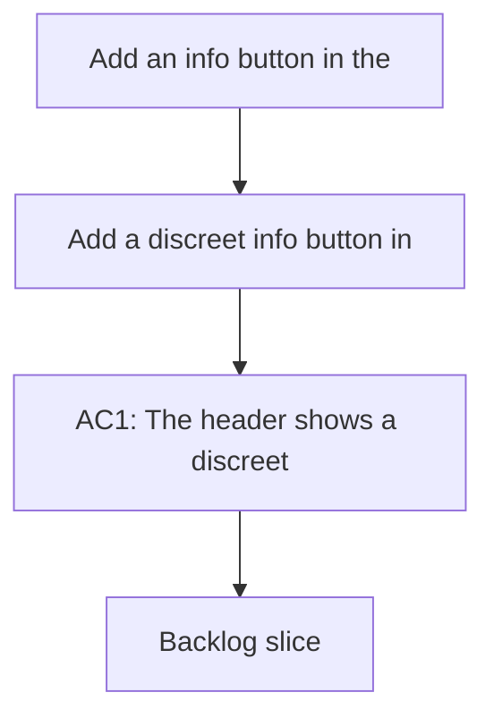

## req_137_add_an_info_button_in_the_header_to_open_logics_insights - Add an info button in the header to open Logics insights
> From version: 1.22.2
> Schema version: 1.0
> Status: Done
> Understanding: 95%
> Confidence: 90%
> Complexity: Medium
> Theme: General
> Reminder: Update status/understanding/confidence and references when you edit this doc.

# Needs
- Add a discreet info button in the plugin header, placed before the Show recent activity control, that opens Logics insights.
- Make the affordance discoverable without changing the rest of the header behavior.

# Context
- The plugin already exposes Logics insights as a separate view.
- Users want a faster path to that view directly from the header where activity and navigation controls live.
- The new button should remain compact and not compete with the existing primary controls.

# Acceptance criteria
- AC1: The header shows a discreet info button before Show recent activity.
- AC2: Clicking the info button opens Logics insights.
- AC3: The button remains compact and does not alter the behavior of adjacent header controls.
- AC4: The interaction is accessible from keyboard and has a clear label or tooltip.

# Definition of Ready (DoR)
- [ ] Problem statement is explicit and user impact is clear.
- [ ] Scope boundaries (in/out) are explicit.
- [ ] Acceptance criteria are testable.
- [ ] Dependencies and known risks are listed.

# Companion docs
- Product brief(s): (none yet)
- Architecture decision(s): (none yet)

# AI Context
- Summary: Add a discreet header info button that opens Logics insights
- Keywords: info button, header, show recent activity, logics insights, open insights
- Use when: Use when framing the header affordance that shortcuts to Logics insights.
- Skip when: Skip when the work targets a different toolbar control or a different panel entry point.
# Backlog
- `item_260_add_an_info_button_in_the_header_to_open_logics_insights`
