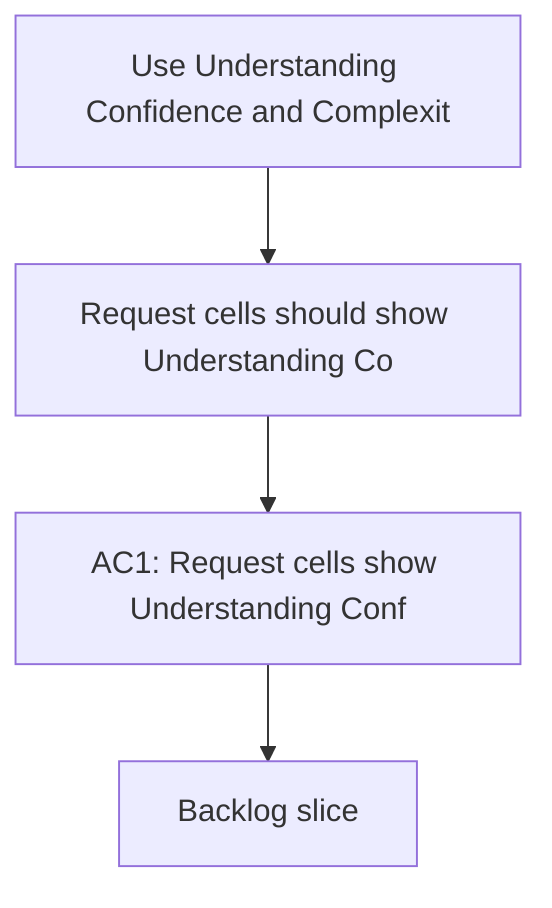

## req_138_use_understanding_confidence_and_complexity_for_request_badges - Use Understanding Confidence and Complexity for request badges
> From version: 1.22.2
> Schema version: 1.0
> Status: Done
> Understanding: 95%
> Confidence: 90%
> Complexity: Medium
> Theme: General
> Reminder: Update status/understanding/confidence and references when you edit this doc.

# Needs
- Request cells should show `Understanding`, `Confidence`, and `Complexity` instead of `Progress` and `Complexity`.
- The request header preview should render these indicators in a cleaner, more readable way.

# Context
- Requests describe definition and certainty more than delivery progress.
- `Progress` is more appropriate for backlog items and tasks, where execution actually advances.
- The current request badge mix makes the preview harder to read and mixes two different concepts.

# Acceptance criteria
- AC1: Request cells show `Understanding`, `Confidence`, and `Complexity`.
- AC2: Request cells no longer show `Progress`.
- AC3: The request preview renders the indicator block in a readable compact form.
- AC4: Backlog items and tasks keep their `Progress` badge behavior unchanged.

# Definition of Ready (DoR)
- [ ] Problem statement is explicit and user impact is clear.
- [ ] Scope boundaries (in/out) are explicit.
- [ ] Acceptance criteria are testable.
- [ ] Dependencies and known risks are listed.

# Companion docs
- Product brief(s): (none yet)
- Architecture decision(s): (none yet)

# AI Context
- Summary: Use Understanding, Confidence, and Complexity for request badges
- Keywords: request badges, understanding, confidence, complexity, progress, preview
- Use when: Use when changing how request cells communicate certainty and readability.
- Skip when: Skip when the work targets backlog or task progress badges.
# Backlog
- `item_261_use_understanding_confidence_and_complexity_for_request_badges`
