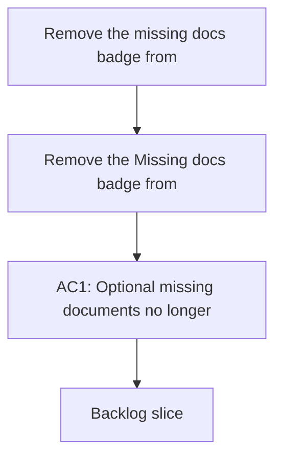

## req_139_remove_the_missing_docs_badge_from_the_plugin_preview - Remove the missing docs badge from the plugin preview
> From version: 1.22.2
> Schema version: 1.0
> Status: Done
> Understanding: 95%
> Confidence: 91%
> Complexity: Medium
> Theme: General
> Reminder: Update status/understanding/confidence and references when you edit this doc.

# Needs
- Remove the `Missing docs` badge from the plugin preview when the missing document is not required.
- Keep the preview focused on actionable signals instead of surfacing optional-document absence as a warning.

# Context
- Some documents are optional companions, not required dependencies.
- Showing a `Missing docs` badge for optional material makes the preview look more alarming than the actual situation.
- The preview should still make required-document gaps visible when they are truly blocking.

# Acceptance criteria
- AC1: Optional missing documents no longer show a `Missing docs` badge in the preview.
- AC2: Required missing documents still surface a blocking or attention signal.
- AC3: The preview language distinguishes optional gaps from true blockers.
- AC4: Removing the badge does not hide other health or dependency indicators.

# Definition of Ready (DoR)
- [x] Problem statement is explicit and user impact is clear.
- [x] Scope boundaries (in/out) are explicit.
- [x] Acceptance criteria are testable.
- [x] Dependencies and known risks are listed.

# Companion docs
- Product brief(s): (none yet)
- Architecture decision(s): (none yet)

# AI Context
- Summary: Remove the Missing docs badge for optional companion gaps
- Keywords: missing docs, optional docs, required docs, preview, warnings
- Use when: Use when changing how the plugin previews document gaps.
- Skip when: Skip when the work is about required blocking dependencies or other health badges.
# Backlog
- `item_262_remove_the_missing_docs_badge_from_the_plugin_preview`
