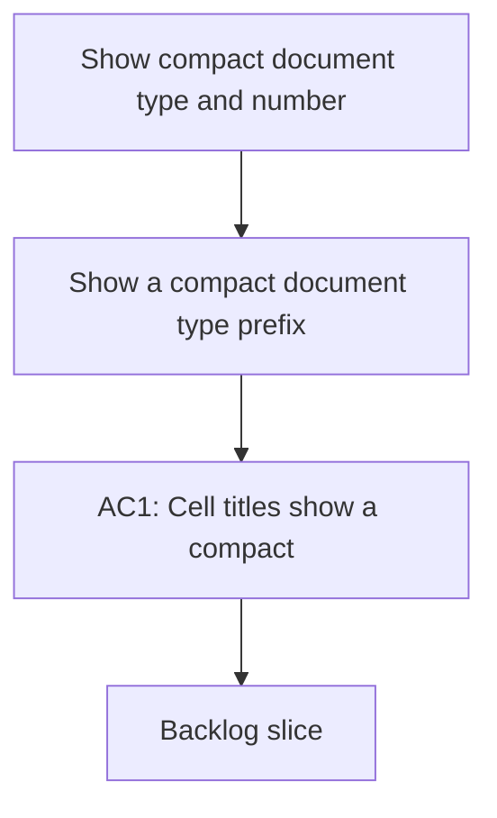

## req_140_show_compact_document_type_and_number_before_cell_names - Show compact document type and number before cell names
> From version: 1.22.2
> Schema version: 1.0
> Status: Done
> Understanding: 95%
> Confidence: 91%
> Complexity: Medium
> Theme: General
> Reminder: Update status/understanding/confidence and references when you edit this doc.

# Needs
- Show a compact document type prefix and document number before the name in each cell.
- Keep the prefix visually subtle so the title remains the primary reading target.

# Context
- Cells already encode the document kind through color and badges, but the kind is not immediately visible in the title line.
- A compact inline prefix such as `R002`, `I201`, `T032`, `P111`, or `A324` helps users scan mixed boards faster.
- The prefix should work for requests, backlog items, tasks, product docs, architecture docs, and similar managed docs.
- The prefix should stay small enough to fit on the same line as the title on dense boards.

# Acceptance criteria
- AC1: Cell titles show a compact inline prefix before the document name.
- AC2: The prefix uses the document kind and document number.
- AC3: The prefix remains visually subtle and does not overpower the title.
- AC4: The presentation works across request, backlog, task, product, architecture, and spec cells.
- AC5: The existing name text remains readable and unchanged apart from the new prefix.

# Definition of Ready (DoR)
- [x] Problem statement is explicit and user impact is clear.
- [x] Scope boundaries (in/out) are explicit.
- [x] Acceptance criteria are testable.
- [x] Dependencies and known risks are listed.

# Companion docs
- Product brief(s): (none yet)
- Architecture decision(s): (none yet)

# AI Context
- Summary: Show a compact document type and number prefix before cell names
- Keywords: prefix, document type, number, cell title, scanability, board
- Use when: Use when improving cell title readability in mixed workflow boards.
- Skip when: Skip when the work targets detail panels, badge logic, or document content.
# Backlog
- `item_263_show_compact_document_type_and_number_before_cell_names`
