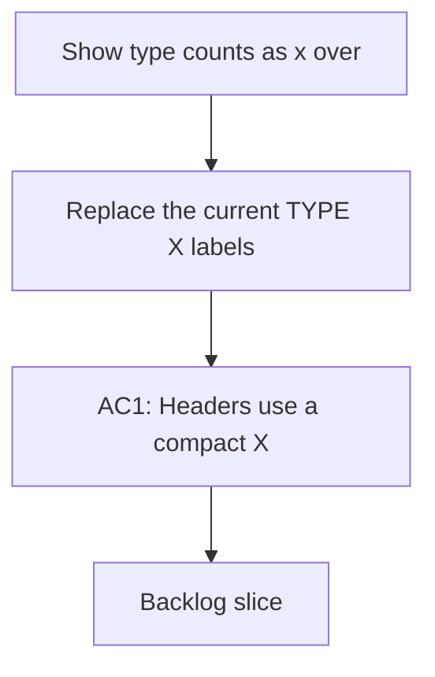

## req_141_show_type_counts_as_x_over_total_in_column_headers - Show type counts as x over total in column headers
> From version: 1.22.2
> Schema version: 1.0
> Status: Draft
> Understanding: 95%
> Confidence: 90%
> Complexity: Medium
> Theme: General
> Reminder: Update status/understanding/confidence and references when you edit this doc.

# Needs
- Replace the current `TYPE (X)` labels in column and list headers with a compact `X/TOTAL` counter for that type.
- Keep the type label readable while making the count format more informative at a glance.

# Context
- The plugin already shows type counts in headers, but the current format is less expressive than `X/TOTAL`.
- Users want to see how many items are currently visible for a type compared with the total available for that type.
- The new format should work for requests, backlog items, tasks, products, architecture docs, and other supported types.
- The header should stay compact so it still fits in dense list and column layouts.

# Acceptance criteria
- AC1: Headers use a compact `X/TOTAL` count format for each type.
- AC2: The count is shown alongside the existing type label, not instead of it.
- AC3: The new format works across request, backlog, task, product, architecture, and spec views.
- AC4: The header remains compact enough for dense board layouts.
- AC5: The change preserves the underlying count data and only updates presentation.

# Definition of Ready (DoR)
- [ ] Problem statement is explicit and user impact is clear.
- [ ] Scope boundaries (in/out) are explicit.
- [ ] Acceptance criteria are testable.
- [ ] Dependencies and known risks are listed.

# Companion docs
- Product brief(s): (none yet)
- Architecture decision(s): (none yet)

# AI Context
- Summary: Show type counts as X over total in column and list headers
- Keywords: type counts, x over total, headers, column labels, list labels
- Use when: Use when changing how the plugin summarizes per-type counts in headers.
- Skip when: Skip when the work targets card content, badge logic, or document metadata.
# Backlog
- `item_264_show_type_counts_as_x_over_total_in_column_headers`
