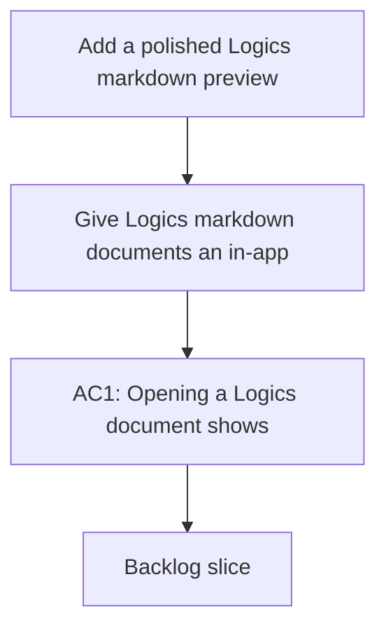

## req_142_add_a_polished_logics_markdown_preview_screen - Add a polished Logics markdown preview screen
> From version: 1.22.2
> Schema version: 1.0
> Status: Done
> Understanding: 94%
> Confidence: 88%
> Complexity: High
> Theme: UI
> Reminder: Update status/understanding/confidence and references when you edit this doc.

# Needs
- Give Logics markdown documents an in-app preview that feels native to the plugin rather than relying on the raw VS Code markdown renderer.
- Render linked references, companion docs, and related workflow items as clickable navigation targets inside the preview.
- Format document names in a consistent "number - name" style so the preview is easier to scan.
- Route open and read actions to the custom preview surface so double click and read follow the same experience.
- Keep the preview aligned with the existing Logics visual theme used by insights and onboarding.

# Context
- Users currently jump to the generic VS Code markdown preview when they want to read a Logics document.
- The current flow does not highlight relationships well enough for workflow navigation.
- The plugin already has custom surfaces such as insights and onboarding, so a dedicated preview fits the existing product direction.
- Relevant implementation surfaces include `src/logicsViewProvider.ts`, `media/main.js`, `media/mainInteractions.js`, `media/renderBoard.js`, and the preview-related HTML entrypoints in `src/logicsWebviewHtml.ts`.
- The preview should remain useful for requests, backlog items, tasks, product briefs, architecture decisions, and specs.

# Acceptance criteria
- AC1: Opening a Logics document shows a custom preview screen inside the plugin.
- AC2: References and related workflow items are clickable and navigate to the linked document.
- AC3: Document titles in the preview use a compact "number - name" presentation.
- AC4: Double click and read actions both open the custom preview instead of the default markdown preview.
- AC5: The preview visually matches the existing Logics app theme and remains readable in the current dark UI.

# Definition of Ready (DoR)
- [ ] The preview surface scope is explicit, including what should and should not be rendered.
- [ ] Navigation behavior for references, open, and read is explicit.
- [ ] The title formatting rule is explicit.
- [ ] The implementation surface and likely integration points are identified.
- [ ] The main risks are listed, including the migration away from VS Code markdown preview.

# Companion docs
- Product brief(s): `prod_006_custom_logics_markdown_preview_experience`
- Architecture decision(s): `adr_017_route_logics_document_reads_to_a_native_preview`

# AI Context
- Summary: Add a polished Logics markdown preview screen
- Keywords: preview, markdown, navigation, references, clickable, theme, read, double click
- Use when: Use when designing the custom document preview experience for Logics markdown files.
- Skip when: Skip when the request is about board badges, counts, or other unrelated UI elements.
# Backlog
- `item_265_add_a_polished_logics_markdown_preview_screen`
