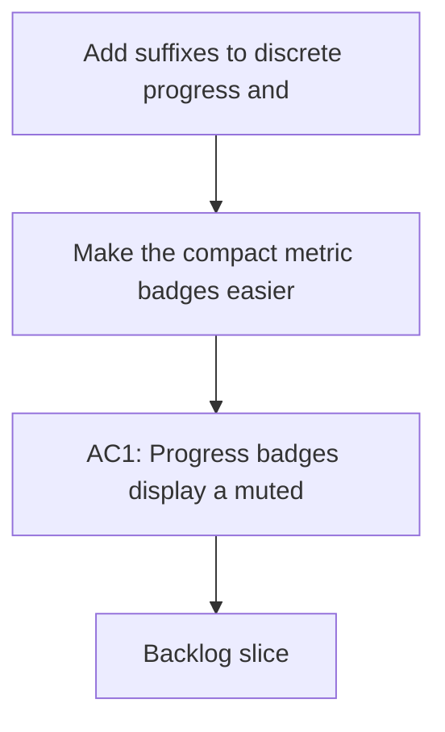

## req_143_add_suffixes_to_discrete_progress_and_understanding_badges - Add suffixes to discrete progress and understanding badges
> From version: 1.22.2
> Schema version: 1.0
> Status: Done
> Understanding: 93%
> Confidence: 90%
> Complexity: Medium
> Theme: UI
> Reminder: Update status/understanding/confidence and references when you edit this doc.

# Needs
- Make the compact metric badges easier to read at a glance by prefixing the metric letter directly before the value.
- Use `P` for Progress, `U` for Understanding, and `C` for Confidence, while keeping Complexity label-free.
- Keep the prefix visually de-emphasized so the number or value remains the main focal point.
- Apply the same visual treatment consistently across request and non-request cells.

# Context
- The current compact badges already condense workflow state into a small footprint.
- Prefix letters would make the meaning of the value more obvious without increasing badge length much.
- The request badge uses Understanding and Confidence, while backlog and task badges use Progress.
- Complexity should remain visually concise, so it should not get a prefix letter.
- Relevant implementation surfaces include `media/renderBoard.js`, `media/css/board.css`, and the related webview tests.

# Acceptance criteria
- AC1: Progress badges display a muted `P` prefix before the value.
- AC2: Understanding badges display a muted `U` prefix before the value.
- AC3: Confidence badges display a muted `C` prefix before the value.
- AC4: Complexity remains unprefixed.
- AC5: The prefix styling keeps the numeric value visually dominant.

# Definition of Ready (DoR)
- [ ] The exact badge formats are explicit for requests and for backlog/tasks.
- [ ] The desired visual emphasis between prefix and value is explicit.
- [ ] The scope of unchanged badges is explicit, especially Complexity.
- [ ] Relevant code and CSS touchpoints are identified.
- [ ] The acceptance criteria are testable through DOM assertions or snapshot checks.

# Companion docs
- Product brief(s): (none yet)
- Architecture decision(s): (none yet)

# AI Context
- Summary: Add suffixes to discrete progress and understanding badges
- Keywords: badges, progress, understanding, confidence, prefix, compact, muted
- Use when: Use when refining the compact badge wording and visual treatment in the plugin UI.
- Skip when: Skip when the work is about the preview screen or unrelated navigation changes.
# Backlog
- `item_266_add_suffixes_to_discrete_progress_and_understanding_badges`
