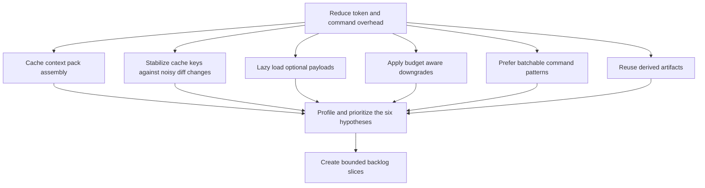

## req_144_improve_rtk_and_logics_kit_token_performance - Improve RTK and Logics kit token performance
> From version: 1.23.0
> Schema version: 1.0
> Status: Done
> Understanding: 90%
> Confidence: 85%
> Complexity: High
> Theme: Token performance and repeated assistant workflows
> Reminder: Update status/understanding/confidence and references when you edit this doc.

# Needs
- Reduce token and command overhead in repetitive Logics delivery flows so operator sessions stay fast even when the same context is rebuilt many times.
- Treat `rtk` as an optional accelerator, not a hard dependency, so the underlying Logics kit improvements still pay off when the proxy is absent.
- Turn the six performance hypotheses into bounded backlog slices with measurable effects on context size, cache hit rate, command count, and repeated-run latency.
- Preserve current behavior for normal workflows unless a change demonstrably reduces cost, context size, or repeated work.

# Context
- The repository already advertises compact assistant handoffs, token estimates, budget labels, and `summary-only` / `diff-first` context modes in the plugin and the flow manager.
- The current hybrid context path still rebuilds the workflow neighborhood and serializes a fresh context pack on each run in [`logics/skills/logics-flow-manager/scripts/logics_flow_core.py`](logics/skills/logics-flow-manager/scripts/logics_flow_core.py).
- The result cache fingerprint still includes raw diff state, which means some repeated runs can miss the cache even when the useful workflow context did not materially change.
- The transport layer already filters noisy diff paths for the prompt, but that same filtering is not clearly reused before cache-key calculation.
- The runtime profiles already distinguish light and heavy flows, but several flows still include optional graph, registry, or doctor payloads that may be unnecessary for the default case.
- The terminal wrapper `rtk` may reduce shell overhead, but the larger wins should come from the kit itself: smaller context packs, fewer reruns, and less repeated serialization.
- The six hypotheses to validate are:
  - cache context pack assembly for repeated runs;
  - make cache keys less sensitive to noisy or irrelevant diff changes;
  - lazy-load graph, registry, and doctor payloads only when a flow truly needs them;
  - enforce budget-aware context downgrades when a handoff grows too large;
  - document and prefer batchable command patterns that avoid repeated shell round-trips;
  - prewarm or incrementally reuse derived artifacts such as indexes and runtime caches.

# Acceptance criteria
- AC1: The request documents all six hypotheses with clear expected impact and enough detail to split them into backlog items without reopening the scope.
- AC2: Each hypothesis is framed so it can be implemented and validated in the Logics kit even when `rtk` is not installed, with `rtk` treated as an optional terminal accelerator.
- AC3: The request makes the current performance bottlenecks explicit, including repeated context-pack assembly, noisy cache invalidation, optional payload loading, and repeated command round-trips.
- AC4: The request defines measurable success signals for the follow-up work, such as higher cache hit rate, smaller context packs, fewer shell invocations, or lower repeated-run latency.
- AC5: The scope explicitly excludes unrelated product expansion, new AI backends, or broad workflow redesign so the follow-up work stays performance-focused.
- AC6: The request is ready to promote into one or more backlog items without needing another clarification pass.

# Scope
- In:
  - context-pack caching for repeated assistant runs
  - cache-key normalization for noisy or irrelevant diff changes
  - lazy loading of optional graph, registry, and doctor payloads
  - budget-aware context downgrades and smaller handoff defaults
  - command-pattern guidance that reduces repeated shell round-trips
  - prewarming or incremental reuse of derived indexes and cache artifacts
- Out:
  - redefining the hybrid backend policy itself
  - introducing a new AI provider or new assistant capability surface
  - changing workflow semantics unrelated to token or command efficiency
  - making `rtk` mandatory for the kit to deliver the improvements

# Dependencies and risks
- Dependency: the existing hybrid runtime and context-pack code in `logics/skills/logics-flow-manager/scripts/` remains the primary place where repeated token waste can be reduced.
- Dependency: the current cache and observability surfaces must stay compatible with existing plugin and CLI behavior.
- Risk: if cache keys stay too sensitive to noisy diff signals, repeated runs will keep missing the cache even after the implementation lands.
- Risk: if optional payloads are not gated carefully, the context packs may still grow too large and erase most of the savings.
- Risk: if the request is split too broadly, the performance work could drift into unrelated refactors and become hard to measure.
- Risk: if the work is framed as an `rtk` project only, the kit-side optimizations may be ignored even though they provide the largest payoff.

# AC Traceability
- AC1 -> the six named hypotheses in `# Context` plus the future backlog split. Proof: the request explicitly lists all six performance hypotheses to be turned into bounded work.
- AC2 -> the scope and dependency notes. Proof: each hypothesis is stated as a kit-side improvement that should still hold when `rtk` is absent.
- AC3 -> the context bullets about context-pack assembly, cache keys, optional payloads, and shell round-trips. Proof: the request names the concrete bottlenecks visible in the current code path.
- AC4 -> the measurable success signals in AC4. Proof: follow-up work can be judged by cache hit rate, pack size, command count, and latency.
- AC5 -> the Out section. Proof: the request excludes backend redesign and unrelated product expansion.
- AC6 -> the overall structure of the request. Proof: the request is already split-ready and does not require another clarification pass before promotion.

# Definition of Ready (DoR)
- [x] Problem statement is explicit and user impact is clear.
- [x] Scope boundaries (in/out) are explicit.
- [x] Acceptance criteria are testable.
- [x] Dependencies and known risks are listed.

# Companion docs
- Product brief(s): (none yet)
- Architecture decision(s): (none yet)

# AI Context
- Summary: Reduce repeated token and command overhead in Logics workflows by validating six performance hypotheses that improve the kit itself and optionally amplify gains through `rtk`.
- Keywords: rtk, token performance, cache, context pack, lazy loading, budget, command round trips, derived artifacts
- Use when: Use when planning or implementing performance improvements that should reduce repeated context rebuilds, cache misses, and shell overhead.
- Skip when: Skip when the work is unrelated to repeated assistant workflows, cache behavior, or context assembly.

# References
- `README.md`
- `logics/skills/RTK.md`
- `logics/skills/logics-flow-manager/scripts/logics_flow_core.py`
- `logics/skills/logics-flow-manager/scripts/logics_flow_runtime_support.py`
- `logics/skills/logics-flow-manager/scripts/logics_flow_hybrid_transport_core.py`
- `logics/skills/logics-flow-manager/scripts/logics_flow_hybrid_runtime_core.py`
- `logics/skills/logics-flow-manager/scripts/logics_flow_hybrid_observability.py`

# Backlog
- `item_267_cache_context_packs_and_normalize_cache_keys`
- `item_271_reduce_optional_payload_and_command_overhead`

# Task
- `task_123_orchestration_delivery_for_req_144_to_req_147_board_preview_and_doc_quality_improvements`
