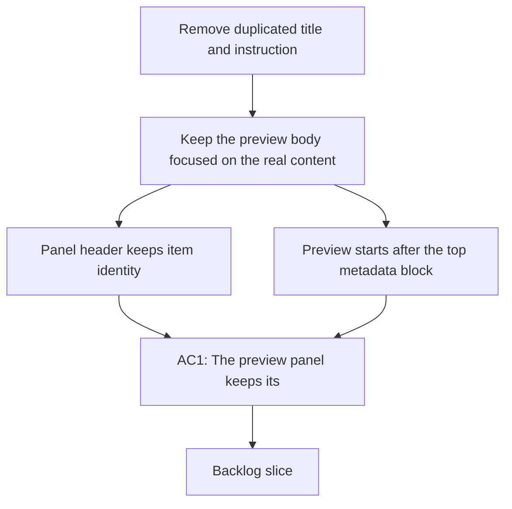

## req_145_remove_duplicated_title_and_instruction_from_board_preview_panel - Remove duplicated title and instruction from board preview panel
> From version: 1.23.0
> Schema version: 1.0
> Status: Done
> Understanding: 91%
> Confidence: 88%
> Complexity: Medium
> Theme: Board preview and markdown rendering
> Reminder: Update status/understanding/confidence and references when you edit this doc.

# Needs
- Remove the duplicated document title and top instruction block from the board item preview panel so the preview starts with the actual body content.
- Keep the panel header as the identity surface for the selected item, instead of repeating the same title inside the preview body.
- Preserve the underlying Markdown source and the rendered document content outside this preview surface.
- Avoid changing the meaning of the document or the workflow data model; this is a presentation-only cleanup.

# Context
- The board and detail surfaces already show the selected item identity in the surrounding header chrome.
- The preview currently repeats the document title and the leading instruction or reminder block, for example:
  - `req_007_harden_generated_mermaid_validation_and_error_handling - Harden generated Mermaid validation and error handling`
  - `> From version: 0.1.0`
  - `> Schema version: 1.0`
  - `> Status: Draft`
  - `> Understanding: 98%`
  - `> Confidence: 97%`
  - `> Complexity: Medium`
  - `> Theme: UI`
  - `> Reminder: Update status/understanding/confidence and references when you edit this doc.`
- That duplication makes the preview feel heavier than necessary and pushes the actual body content farther down.
- The rendering surface that assembles the preview lives in the board and detail UI code, with the markdown body coming from the workflow model and preview renderer.
- This request should remove only the duplicated top-of-document chrome from the preview body, not the document header when the file is opened normally elsewhere.

# Acceptance criteria
- AC1: The preview panel keeps its header identity, but the rendered preview body no longer repeats the document title that already appears in the panel chrome.
- AC2: The preview body no longer shows the leading instruction or reminder block at the top when that information is already redundant in the surrounding preview surface.
- AC3: The underlying Markdown document remains unchanged on disk; only the preview rendering changes.
- AC4: The same document still renders correctly in other document-reading surfaces, including normal Markdown preview flows, unless those surfaces explicitly choose the same trimming rule.
- AC5: The preview still begins at a sensible content boundary, so the first visible lines are the actual body of the request, backlog item, or task rather than the duplicated metadata block.
- AC6: The change is covered by UI or rendering tests that verify the trimmed preview no longer includes the duplicated title and instruction block.

# Scope
- In:
  - trimming the top of the board item preview body so the preview starts after the redundant title and instruction block
  - keeping the surrounding panel header as the identity surface
  - updating the preview renderer or preview data assembly to support the trimmed output
  - adding or updating tests for the preview shape
- Out:
  - changing the persisted Markdown source document
  - altering the request/backlog/task file format
  - redesigning the board layout or detail panel hierarchy
  - removing the document title from non-preview document views

# Dependencies and risks
- Dependency: the board and detail preview surface already has a distinct header that can carry identity information.
- Dependency: the markdown rendering pipeline can distinguish between document chrome and body content.
- Risk: trimming too aggressively could hide content that belongs in the actual body for some document types.
- Risk: changing the preview shape without test coverage could create inconsistencies between board preview and document read flows.
- Risk: if the trimming rule is applied too broadly, other surfaces may lose useful metadata that they still need.

# AC Traceability
- AC1 -> the preview header/body split described in `# Context`. Proof: the request explicitly keeps the surrounding header and removes the duplicated title from the preview body.
- AC2 -> the duplicated top instruction block removal. Proof: the request calls out the reminder/instruction text as redundant in the preview surface.
- AC3 -> the scope and dependency notes. Proof: the request limits the change to presentation only and leaves the stored Markdown untouched.
- AC4 -> the out-of-scope notes. Proof: other document-reading surfaces remain unchanged unless they opt into the same trimming rule.
- AC5 -> the preview boundary requirement. Proof: the request requires the first visible lines to be actual body content, not repeated metadata.
- AC6 -> the testing scope. Proof: the request explicitly asks for rendering or UI tests that lock in the trimmed preview shape.

# Definition of Ready (DoR)
- [x] Problem statement is explicit and user impact is clear.
- [x] Scope boundaries (in/out) are explicit.
- [x] Acceptance criteria are testable.
- [x] Dependencies and known risks are listed.

# Companion docs
- Product brief(s): (none yet)
- Architecture decision(s): (none yet)

# AI Context
- Summary: Remove the duplicated title and top instruction block from the board item preview panel so the preview body starts at the actual content while preserving the panel header and the underlying Markdown source.
- Keywords: board preview, markdown preview, title trim, instruction block, header, body, UI cleanup
- Use when: Use when the preview surface repeats the document title or top metadata block and the panel chrome already provides that identity.
- Skip when: Skip when the change is about the stored Markdown document itself, not the preview rendering.

# References
- `media/renderDetails.js`
- `media/logicsModel.js`
- `media/renderMarkdown.js`
- `src/logicsReadPreviewHtml.ts`
- `src/logicsViewDocumentController.ts`

# Backlog
- `item_268_trim_duplicated_title_and_instruction_from_board_preview`

# Task
- `task_123_orchestration_delivery_for_req_144_to_req_147_board_preview_and_doc_quality_improvements`
